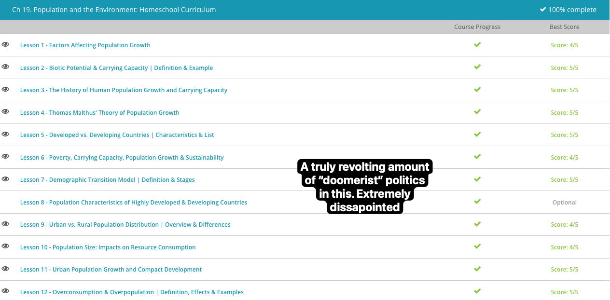

### Andrew Garber
### AP Environmental Science
### Chapter 19: Population 

```
Note: Due to the rapidly approaching end of the school year, and the fact that I have done all of the work for this class in small chunks in previous years, I will be doing slightly slimmer notes.
```

#### 1. Factors affecting growth
 - Food supply, living space, resources, disease, predators, competition, and climate all affect population growth.
 - Natality, the number of individuals added to a population through reproduction, and mortality are two big factors in population growth/decline.
 - Emigration/Immigration can also affect population growth, both as it affects other factors in secondary-sense and due to the fact that it can directly change the population size.

#### 2. Carrying Capacity
 - Did this in a previous chapter, passed the quiz. Moving on.

#### 3. The history of human population growth 
 - The pre-agricultural period is the first period of human population growth. This period is considered anything before 10,000 years ago. During the pre-agricultural period, human population growth was very slow, and it took tens of thousands of years for the human population to double.
 - The agricultural period is the second period of human population growth. This period ranges from 10,000 years ago to about 1,000 years ago. During this time period, the human population started to grow more rapidly due to advances in agriculture. It was during this time that plants and animals were domesticated for farming. There were also advances in irrigation and plowing techniques that increased overall crop yield. As a result of increased food availability and more nutritious food, the human population grew faster than ever.
 - Unlike during the pre-agricultural period, when it took tens of thousands of years for the human population to double, during the agricultural period, it only took around 1,000 years for it to double in size. At the end of the agricultural period, the human population had increased a great deal to around 500 million people.
 - The industrial period was the third period of human population growth. This period is from 1,000 years ago to current day and is characterized by advances in technology. Although there were advances in technology during the early part of this period, it wasn't until the Industrial Revolution in the 1800s that the advances in technology started to have a profound influence on the human population.
 - During this time period, there were technological advances in agricultural techniques that made it possible to grow crops on land that had previously been unusable. This resulted in another increase in the amount of food available, and therefore increased the number of humans that could survive. Technology was also used to improve medicine and sanitation, which helped save lives and increase the lifespan of the average person.
 - We are now at 8.something billion people, and the population is still growing(though some nations are starting to slow down, problematically)
 - Now that we have examined the history of the human population, what do you think the future holds? Will the human population continue to grow at the same rate, slower or stay stable? For most species, their population growth is controlled by their carrying capacity, which is the maximum population size of a species that an ecosystem can support indefinitely. For example, if a forest only has enough food to support 50 individuals of a species and the population grows larger, not all the individuals will survive. The population will decrease until it is at or under the carrying capacity, which is where there would be enough food for all individuals. Some have tried to calculate the carrying capacity of the human population on Earth, but this fails to account for the fact that we have tapped a very small amount of Earth's resources, and are not limited by Earth nor its resources. Asteroid mining, space colonization, and other technologies could allow us to support a much larger population than we currently have. Population growth is a good thing. More humans are a good thing.

#### 4. Thomas Malthus 
 - Thomas Malthus was a British economist who lived in the 18th century. He is best known for his theory on population growth. Malthus believed that the human population would grow exponentially, while food production would grow linearly. This would result in a population that would eventually outgrow its food supply. Malthus believed that this would lead to a population crash, where the human population would decrease due to a lack of food. Malthus' theory was based on the idea that the human population would always grow faster than the food supply. However, Malthus' theory has been proven wrong. The human population has continued to grow, while food production has also increased. This is due to advances in technology, which have allowed us to produce more food than ever before. Malthus' is still quoted by people who want to spread fear of doom, but his theory has been proven wrong by the simple expedient of out-innovating the problem.

#### 5. Developed vs Developing 
 - The first economic category is developed nations, which can generally be categorized as countries that are more industrialized and have higher per capita income levels. To be considered a developed nation, a county generally has a per capita income around $15,000. Also, most developed nations have an average per capita income of approximately $50,000.
 - As of 2022, the list of developed nations included the United States, Canada, Japan, South Korea, Australia, New Zealand, Scandinavia, Singapore, Taiwan, Israel, countries of Western Europe, and some Arab states. In 2022, the combined populations of these countries accounted for a little over 1.3 billion people. The populations of developed countries are generally more stable and will show a decline in growth rate from accounting for 17% of the world population to 14% by 2050. Whereas, the developing countries' growth rate will increase from accounting for 83% of the world population to 86% by 2050.
 - The second economic category is developing nations, which is a broad term that includes countries that are less industrialized and have lower per capita income levels. Developing nations are defined by their GDP (Gross Domestic Product) per capita, which is calculated by dividing the country's GDP by its population, which reveals how a citizen experiences their country's economic output. For example, the GDP per capita in the United States in 2022 was $63,206 as opposed to Nigeria, a developing country, whose 2022 GDP per capita was $2,097. Developing countries also are measured by a lower standard of living, which frequently means less jobs, food, clean drinking water, housing, education, and healthcare.
 - According to the UN, in 2022, the list of developing countries included 126 countries and all were located in either Africa, Asia, or Latin America and the Caribbean. Developing countries account for 6.6 billion of the world population in 2022.
 - The UN divides developing countries into transitioning and less-developed countries. Transitioning countries include Mexico, China, Indonesia, Jordan, Thailand, Fiji, and Ecuador. In general, less developed countries have a lower per capita income and a lower standard of living These countries are found in eastern, western, and central Africa, India, and other countries in southern Asia.
 - The greatest factor in ensuring the development of a country is the strength of its institutions - without strong institutions to clamp down on corruption and petty dictatorships within the bureaucracy there is little hope for any kind of rapid development.

#### 6. Poverty, Carrying Capacity 
 - Poverty is the term used to describe when a person is unable to meet their basic needs due mainly to economic constraints. The basic needs of a person are clean water, adequate food, shelter, health, and education. When a person does not have these basic needs due to economic constraints, they are considered to be living in poverty. Internationally, the poverty line is considered living on around $2.15 a day. Although this definition might seem shocking due to the low amount of money, it gets worse. There are people who are considered to live in extreme poverty and who survive on less than $2.15 a day. As of 2022, there were over 700 million people worldwide who were classified as living in extreme poverty. That means that 9% of people on earth are living in extreme poverty and not having their basic needs met.
 - Although the amount of money a person lives on each day is a major indicator of poverty, there are also many other characteristics of a nation in poverty, including birth rates, death rates, and age structure. Birth rate, which is the number of individuals born per 1,000 individuals per year, is high in poverty-stricken nations. When looking strictly at the number of babies born per female, the statistics are very different based on the economy of the country. On average, females in wealthier countries only produce two babies during their lifetime, while females in poorer countries produce around six babies during their life. In general, low-income regions have less access to contraception and also may produce more offspring to help increase income for the family.
 - Having a high death rate, which is the number of individuals that die per 1,000 individuals per year, is another characteristic of a nation living in poverty. One important death rate statistic that is an indicator of poverty is the infant mortality rate, which is the percentage of infants that die before the age of one year. The wealthiest nations often have an infant mortality rate of less than 1%, while the lowest-income countries have an average infant mortality rate of over 11%. Low-income regions often have high death rates due to limited access to medical care, poor sanitation, and increased prevalence of diseases.
 - The third characteristic of a poverty-stricken nation is the population's age structure, which is the distribution of the population based on age categories. Wealthy countries often have their population distributed relatively evenly over all age categories. Due to high birth rates and low survivorship, poor countries often have a skewed distribution, with a higher percentage of their overall population being in the lower age categories.

##### 7. Demographic Transition Model:
 - This discovery resulted in the creation of the concept of demographic transition, which is a series of stages that a country goes through when transitioning from non-industrial to industrial. The demographic transition concept involves four stages that are based on changes to population size and social behaviors.
 - The first stage of the demographic transition is the pre-industrial stage. During this stage, the population is stable, with both high birth rates and high death rates. The death rates are high because there is increased disease, minimal medical care, poor sanitation, and limited food supplies. As a result of the high death rate, people tend to produce more offspring to try to compensate for the mortality. Although the birth rate and death rate can fluctuate slightly, overall they remain equal, which results in zero population growth.
 - Following the pre-industrial stage is the transitional stage. During this stage, the human population begins to increase due to high birth rates and declining death rates. The death rates are decreasing because, as the country transitions into an industrial country, there are improvements in the economy and social conditions. These changes lead to the control of diseases, the production of more food, better jobs, and improved medical care and sanitation. As the death rate decreases, the birth rates remain high because of the inertia of the population. This results in a population increase.
 - The third stage of the demographic transition is the industrial stage, which is characterized by an increasing population with declining birth rates and low death rates. The death rates remain stable and low during this stage due to the continuation of the economic and social changes that improved the standard of living during the previous stage. During this stage, the birth rates begin to decline for many reasons. For the most part, people realize that they no longer have to produce large numbers of offspring because the offspring they do produce have a higher chance of surviving to adulthood. Many people also start to prefer smaller families, where they can concentrate more resources on less people and increase overall livelihood.
 - The decline in birth rates also correlates with an increase in employment opportunities for women and the increased access to contraception. Although the birth rates are declining, the population continues to increase due to the low death rates and the momentum of the population from the previous stage. The high birth rates in the previous stage produced more overall people that will reach reproductive age, and even if they produce fewer offspring than previous generations, they are still adding to the population.
 - Following the industrial stage is the final stage of the demographic transition. This stage is referred to as the post-industrial stage and is characterized by a stable human population, with both low birth rates and low death rates. The birth rates and death rates remain low due the economic and social changes of the previous stages. As the gap is closed between death rates and birth rates, the human population will stop increasing and remain at a stable level.


#### 9. Urban vs Rural 
 - According to the United States Census Bureau, an urban area is a city with a population size of more than 2,500 people, and a rural area has a population of less than 2,500 people. This definition can be tricky because it does not include information about the size of the area or the density of the population.
 - Due to the vague nature of this definition, function is also considered when differentiating these terms. In general, an area is considered rural if most of the residents survive on agriculture or rely on natural resource-based occupations, such as logging or fishing. On the other hand, an area is considered urban when it has residents that do not directly depend on natural resource-based occupations.

#### 10. Population and Resources 
 - Due to this increase in the human population, there has been increased pressure on the natural resources that we rely on for survival. Natural resources include a variety of substances and energy sources that we take from the environment and use. They can be divided into renewable and nonrenewable resources.
 - Renewable natural resources are substances that can be replenished over a period of time, such as sunlight, wind, soil, and timber. On the other hand, nonrenewable natural resources are substances that are in a finite supply and will run out. Nonrenewable resources include minerals, metals, crude oils, natural gas, and coal.
 - Some nonrenewable metals that are commonly mined and used are iron, aluminum, manganese, copper, chromium, and nickel. Some nonrenewable metals that are commonly mined and used are iron, aluminum, manganese, copper, chromium, and nickel. Iron is used in the largest quantity of around 2.3 billion metric tons each year and nickel in the lowest quantity of around 2.8 million metric tons. Although the amount of nonrenewable metals varies by type, the majority of all metals are used by the United States, Japan, and Europe.
 - Important to note that we have no cap on the number of resources we can use, and that we can always find more resources(up to the mass of the universe), we just have to find ways to do it economically. This is why we have to keep innovating and keep growing our population, keep expanding. Human conciousness is the most valuable resource we have, and we have to keep growing it.

#### 11. Urban Population Growth 
 - Did this, passed the quiz. Moving on.

#### 12. Overpopulation and Overconsumption
 - As per the lesson:
 ```
 	- As the human population continues to increase, there is a great deal of concern about whether or not the Earth can sustain the large and increasing population. One of the major concerns related to population growth is overpopulation, which is when the number of individuals of a species exceeds a certain threshold. In most cases, the threshold that is exceeded is the carrying capacity, which is the maximum population size of a species that an ecosystem can support indefinitely.
	- Although overpopulation is a major concern, there is another problem associated with population growth that puts humans in danger. The second major concern related to population growth is overconsumption, which is when resources are used in excess and at a rate that is higher than the production rate. We live in a world of material objects, and our culture has been referred to as a 'throwaway' society, meaning that we are accustomed to utilizing products that are short-lived or disposable. This is especially true in wealthy countries where individuals consume the most natural resources. Americans make up 5% of the world's population yet our consumption rate is at 24%. Compared to Ethiopia, an average American consumes the same in energy resources as 307 Ethiopians.
 ```
 - This isn't science, this is politics. As per the lesson, "Americans make up 5% of the world's population yet our consumption rate is at 24%. Compared to Ethiopia, an average American consumes the same in energy resources as 307 Ethiopians." this is a bad thing. Why is this a bad thing? More energy is highly correlated with higher standards of living, and higher standards of living are highly correlated with longer lifespans, better health, and more happiness. Quit the doomerism, we can always find more resources, and we can always find more efficient ways to use them. The only thing that can stop us is our own fear and ignorance. Frustrating.
 - 
