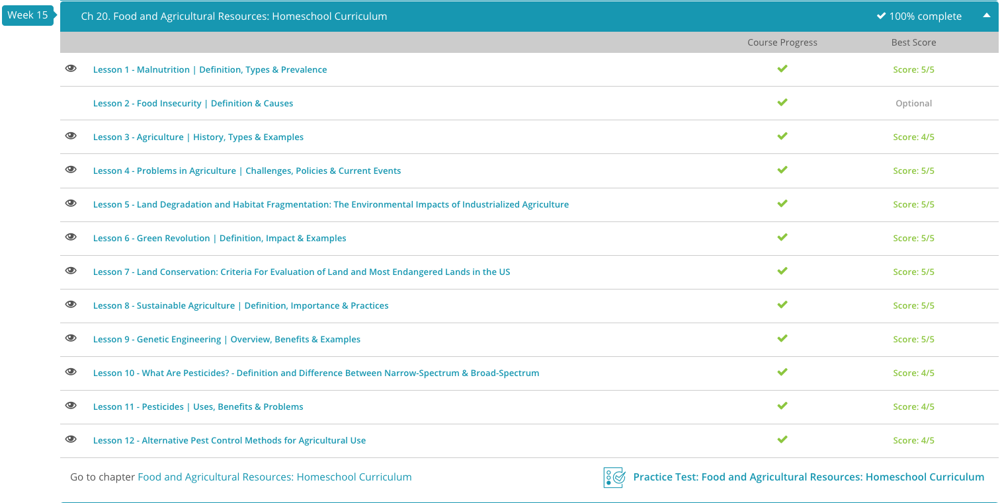

### Andrew Garber

### AP Environmental Science

### Chapter 20: Food and Agricultural Resources

#### 20.1: Malnutrition

- Think back on everything you have eaten over the last 24 hours. Do you think that your diet is well balanced and that you are getting the appropriate nutrients you need? Proper nutrition is very important to maintaining a healthy body and mind. The body requires over 40 essential nutrients to function properly, including vitamins, minerals, amino acids, protein and carbohydrates.
- In addition to the quality of nutrients consumed, the body must also maintain a certain quantity of food to remain healthy. Humans must consume a certain amount of calories each day in order to maintain a productive and energetic lifestyle.
- A large problem facing the human population today is malnutrition. Malnutrition is when a person's diet has an imbalance of the essential nutrients that the body needs to remain healthy. This imbalance in nutrients can weaken the person's immune system and body and make them more susceptible to illnesses. Malnutrition can also cause delays in a child's physical and mental development.
- In recent decades we have gotten better at per-acre-calories-per-year, but in general the nutrient density has suffered(notably an increase in carbohydrates and a decrease in protein). This helps fight hunger, but in general obesity is a bigger problem and many micronutrients are lacking in the diet.
- When most people think of malnutrition, they often think of someone who is suffering from under-nutrition. Under-nutrition occurs when a person consumes a diet that does not meet the necessary requirements for the amount of essential nutrients or calories a person needs to remain healthy.
- This type of malnutrition can occur when people are not eating enough food, or when the food they are eating does not contain well-balanced nutrients. The World Health Organization estimates that one out of every three people is suffering from a deficiency in one or more essential nutrients.
- The symptoms associated with under-nutrition vary by deficiency, but all deficiencies will eventually cause permanent harm to the body. Throughout the world, there are three common deficiencies that people suffer from. Lack of vitamin A in the diet is a very large problem worldwide and results in many cases of blindness in children each year. A deficiency in iron can cause a person to become anemic, which can result in fatigue, increased risk of infection and increased risk of hemorrhaging during childbirth.
- Iodine deficiency is also very common, with one-third of the human population suffering from a lack of iodine. Iodine is important for proper functioning of the thyroid gland, which is responsible for producing hormones that manage the body's metabolic rate. A lack of iodine can cause stunted growth, mental delays and the creation of goiters, which are when the thyroid glands at the base of the neck become swollen.
- Under-nutrition is most common in low-income, developing countries and is prevalent in sub-Saharan Africa and Southern Asia, where access to a well-balanced diet is very limited. More specifically, almost two-thirds of the people that suffer from under-nutrition live in only seven countries, which include India, Bangladesh, Ethiopia, Indonesia, China, Pakistan and the Democratic Republic of Congo. Most people in these countries survive on diets that include low amounts of protein, high amounts of carbohydrates and are mainly vegetarian, with wheat, rice and corn as large staples in the diet.
- Although over ten percent of the world is suffering from a lack of proper nutrition, there are some areas on Earth where food is plentiful, but people still exhibit a type of malnutrition. Over-nutrition occurs when a person consumes a diet that exceeds the necessary requirements for the amount of essential nutrients, or the amount of calories a person needs to remain healthy. In most cases, people who suffer from over-nutrition gain excess weight, and this can cause many serious problems to the human body. Over-nutrition can lead to increased risk of developing heart disease, stroke, type 2 diabetes and even some cancers.
- The World Health Organization recently reported that over 65% of the world's population lives in countries where over-nutrition results in more death than under-nutrition. Currently, there are over 1.5 billion people worldwide that are suffering from over-nutrition and are considered overweight. Over-nutrition is most prevalent in high-income, developed countries, such as the United States and regions of Europe.
- Within the United States, over 20% of children and 70% of adults are overweight due to over-nutrition. Also, in the United States, over 30% of adults that are overweight are classified as clinically obese, which is when a person is more than 30 pounds over the ideal weight for a person's height and sex. Over-nutrition is thought to occur in higher-income, developed countries because people have more access to unhealthy fast food, high-sugar drinks and processed foods and have limited access to fresh, healthy food options.

#### 20.3: Agriculture

- Although for most of human history our species has survived by hunting and gathering food, around 10,000 years ago, our ancestors started producing their own food. Agriculture is the term used to describe the act of growing crops and raising livestock for human consumption and use.
- Industrialized agriculture is the type of agriculture where large quantities of crops and livestock are produced through industrialized techniques for the purpose of sale. The goal of industrialized agriculture is to increase crop yield, which is the amount of food that is produced for each unit of land. Crops and livestock made through this type of agriculture are produced to feed the masses and the products are sold worldwide.
- Industrialized agriculture is able to produce large quantities of food due to the farming methods used. Instead of using animal and manpower to work the fields, industrialized agriculture utilizes large machines, which are more powerful and can work faster and harder. The shift towards machines has increased the use of fossil fuels on industrial farms, and, therefore, the price of food can fluctuate as the price of oil changes. Industrialized agriculture also increases crop yield by investing in large irrigation systems and by using chemical fertilizers and pesticides.
- The chemical fertilizers that are used in industrialized agriculture often add inorganic nutrients to the soil to increase yield and plant size. The use of pesticides is also common in industrialized agriculture, and most pesticides help increase yield by killing pests that are harming or consuming the crops. Another farming technique that is used in industrialized agriculture is the method of growing monocultures, which is when a single crop is planted on a large scale. Although planting monocultures can increase overall yield, this method of farming is also more susceptible to disease and causes a reduction in the dietary variation of consumers.
- Once again important to note that there is _nothing_ wrong with industrialized agriculture as a practice, it makes more food with less human labor, just that it has some negative externalities that need to be out-innovated.

#### 20.4: Problems in Agriculture

- One of the major problems facing agriculture is the loss of agricultural land, because as more land is lost, it will become more difficult to produce the amount of food needed to feed the growing human population. When discussing the area of land, the term hectare is often used, and this term is a unit of area that is equivalent to 10,000 square meters, or around 2.5 acres.

- Worldwide, around three million hectares of agricultural land are lost each year because the soil degrades and becomes unusable due to erosion, which is when soil components move from one location to another by wind or water. An additional four million hectares are lost each year when agricultural land is converted and used for highways, housing, factories, and other urban needs. In the United States, around 140 million hectares of agricultural land has been lost in the last 30 years as a result of soil degradation and conversion for urban use.
- Another major problem in agriculture is the overall decrease in the varieties of crops and livestock produced. In the early years of agriculture, farmers grew a wide variety of crops and raised many different types of livestock. Since the development of industrialized agriculture the number of different types of crops and livestock has decreased. This decline in variety is due to the fact that it is cheaper to produce large quantities of the same type of crop or livestock than to produce smaller batches of multiple types. For livestock production, it is cheaper and easier to buy or produce only one type of feed for animals and invest in only one type of slaughter and processing. For crops, if farmers plant monocultures, which are when a single crop is planted on a large scale, the production is cheaper because the entire process of planting, growing, and harvesting is more streamlined.
- It is estimated that there are over 50,000 plant species that can be safely consumed by humans. Interestingly, around 90% of the average human diet is comprised of only 15 different plant species. In the United States and worldwide, the three most produced crops are corn, soy, and wheat. Although you may not eat these crops directly, they are used in the production of other foods and used to feed livestock, so you are consuming many of these crops without even realizing it.

#### 20.5: land degradation

- One of the major problems associated with industrialized agriculture is the degradation of land. Land degradation is when land changes due to human use and results in a reduction in the overall quality of the environment. Industrialized agriculture can lead to land degradation in multiple ways, including changing soil quality and physical changes to the land.
- Industrialized agriculture can lead to a reduction in soil quality, because the amount of nutrients available to plants decreases over time. Normally, when a plant dies in a forest, it decomposes and returns nutrients to the ground for future plants to use.
- In industrialized agriculture, crops are harvested, and remaining plant parts are also removed from the land. As a result, a large amount of nutrients are removed from the land during harvest, and nutrients are not replenished, because the decomposable plant materials are also removed and not allowed to break down. A reduction in soil quality can severely degrade the land because it becomes less fertile and can therefore produce fewer or less healthy crops.
- Land degradation due to industrialized agriculture can also occur in the form of physical changes to the land. Industrial farms that have large amounts of livestock can drastically change the physical layout of the land. If livestock frequently travel over the same area, they can compact the soil, which makes it harder for plants to grow and water to penetrate the ground.
- Livestock can also leave land void of vegetation if too many animals are grazing in one location. This can lead to erosion, which is when soil components move from one location to another by wind or water. Erosion can also occur as a result of industrialized agriculture when plants are harvested and fields are left uncovered.
- If erosion occurs in a field, it can cause serious problems, because the design of the land and amount of soil will change, and the land will most likely become very dry. These changes in the land due to erosion can make it more difficult to establish healthy crops and vegetation for livestock.

#### 20.6: Green Revolution

- The Green Revolution was a period when the productivity of global agriculture increased drastically as a result of new advances. During this time period, new chemical fertilizers and synthetic herbicides and pesticides were created. The chemical fertilizers made it possible to supply crops with extra nutrients and, therefore, increase yield. The newly developed synthetic herbicides and pesticides controlled weeds, deterred or kill insects, and prevented diseases, which also resulted in higher productivity.
- In addition to the chemical advances utilized during this time period, high-yield crops were also developed and introduced. High-yield crops are crops that are specifically designed to produce more overall yield. A method known as multiple cropping was also implemented during the Green Revolution and lead to higher productivity. Multiple cropping is when a field is used to grow two or more crops throughout the year, so that the field constantly has something growing on it. These new farming techniques and advances in agricultural technology were utilized by farmers all over the world, and when combined, intensified the results of the Green Revolution.
- Norman Borlaug should absolutely go down as one of the greatest human being to ever live. In the 1940s, Norman Borlaug developed a strain of wheat that could resist diseases, was short, which reduced damage by wind, and could produce large seed heads and high yields. He introduced this variety of wheat in Mexico and within twenty years the production of wheat had tripled. This allowed for the production of more food for people in Mexico and also made it possible for Mexico to export their wheat and sell it in other countries. Norman Borlaug helped introduce this high-yield variety of wheat to other countries in need of increased food production, and he eventually won a Nobel Peace Prize for his work with developing high-yield crops and for helping prevent starvation in many developing countries.
- In addition to producing larger quantities of food, the Green Revolution was also beneficial because it made it possible to grow more crops on roughly the same amount of land with a similar amount of effort. This reduced production costs and also resulted in cheaper prices for food in the market.

#### 20.7: Land Conservation

- Although producing food is an important act, it is also very important to conserve the natural, undisturbed land that surrounds agricultural fields. To conserve land means to protect the land from harm or destruction, and in this case, it is the harm caused by humans as they convert land for agriculture.
- The size and location of the ecosystem is evaluated because this makes it possible for evaluators to determine how much land is being considered for conservation and also what is around the ecosystem and might influence it. Connectivity, which, in ecological terms, is the degree to which different habitats connect to each other, is also examined when evaluating an ecosystem.
- Connectivity can be thought of as paths that connect two habitats, similar to sidewalks that connect houses. The level of connectivity is an important criterion because it demonstrates how the ecosystem interacts with other nearby habitats.
- The previous criteria were related to the physical design of the ecosystem, but there are also several criteria that examine what is within the ecosystem. The habitat quality, which is often thought of as the soil quality, and the availability of food and shelter is another criterion for evaluating an ecosystem. It is important to examine habitat quality in order to determine if the ecosystem is healthy and is worth conserving. The wildlife composition, which is the types of species that live in the ecosystem and their ecological structure, is also an important criterion.
- There are many endangered ecosystems throughout the world, and in the United States, there are three ecosystems characterized as the most endangered. Prairies are the ecosystem in the United States that are the most endangered. This type of ecosystem is dominated by grasses, but has a wide variety of plant and animal species.
- The prairie ecosystem is also known for having very rich soil. Prairies are also known for the animals that inhabit them, including prairie dogs, prairie chickens and very large bison. Over the past 150 years, the acreage of prairies has reduced significantly because it has been converted for farming due to the rich soil.
- Behind prairies, the other most endangered ecosystems in the United States are wetlands and sagebrush. Wetlands are characterized by saturated land, are home to many endangered species and are commonly used by many species as a safe habitat to raise offspring. Wetlands are also a great place for humans to go canoeing, fishing and bird watching.
- Sagebrush ecosystems are very unique and are often referred to as 'cold deserts.' This type of ecosystem is semi-arid, has cold winters and hot summers and limited precipitation. Despite the major differences in these two types of ecosystems, they are both highly endangered because they are being converted at high rates for human uses, such as housing, roads and agriculture.

#### 20.8: Sustainable Agriculture

- I fundamentally disagree with the idea that anything about "processed" food is inherently bad, and that anything from nature is good for you. Sugar is natural and it is terrible for you, and many processed foods are fortified with vitamins and minerals that are good for you. In addition, the higher cost of organic food is not a good thing, it is a bad thing, because it means that less people can afford to eat food from that same plot of land.
- Industrial farming and industrial agriculture(notice how the terms are different, that is another example of trying to viliainize something that is not inherently bad) are not counter to each other, they work together. Innovations in sustainability(notice how the term is not "organic") are what will allow us to continue to feed the world while keeping farmland healthy.

#### 20.9: Genetic Engineering

- I will read and do the quiz for this and answer the false questions correctly, however I will not be writing a summary for this section. I refuse to write down and propogate this anti-science, doomerist nonsense.

#### 20.10: Pesticides

- Have you ever been annoyed by a sibling or friend? Often, people refer to someone that bothers them as a pest. In the agricultural world, there are pests of another kind, and they are any unwanted organisms that feed on or harm agricultural crops, ornamental plants or livestock. Pests can often cause harm to livestock or crops by consuming them or using up vital nutrients. To prevent damage, farmers utilize specific methods to remove or eliminate pest problems. Pesticides, chemicals that kill or manage the population of pests, are the main combat method used.
- Due to the fact that there are many different types of agricultural pests, there are also many different types of pesticides. Pesticides are often divided into several different categories, including insecticides, fungicides, rodenticides and herbicides. Insecticides are used to kill unwanted insects, and rodenticides are designed to kill rodents, such as rats and mice. Fungicides are used to kill fungal pests, and herbicides are used to kill unwanted plants, commonly referred to as weeds.
- Pesticides that have a small coverage range are referred to as narrow-spectrum pesticides, because they are designed to kill or manage a select group of organisms. Narrow-spectrum pesticides make it possible to target a specific species or group of organisms that are known to cause damage. Many narrow-spectrum pesticides are designed to interact with a characteristic of the pest that is specific to that organism, such as a pheromone, hormone or physical feature.
- Although sometimes it is desirable to target a specific species or group of organisms, in some situations, it is necessary to eliminate a wider range of pests that are causing harm. Broad-spectrum pesticides are pesticides that are designed to kill or manage a wide variety of organisms. Broad-spectrum pesticides are used when many different species of organisms are causing harm or when the specific organism causing harm is unknown. In order to kill or manage such a large variety of organisms, most broad-spectrum pesticides are designed to target a system that is common in many organisms, such as the nervous system or muscular system.

#### 20.11: Pesticides 2

- The benefits of pesticides include increased food production, increased profits for farmers and the prevention of diseases. Although pests consume or harm a large portion of agricultural crops, without the use of pesticides, it is likely that they would consume a higher percentage.
- Due to the use of pesticides, it is possible to combat pests and produce larger quantities of food. By producing more crops, farmers are also able to increase profits by having more produce to sell. Pesticides also increase farm profits by helping the farmer save money on labor costs. Using pesticides reduces the amount of time required to manually remove weeds and pests from fields.
- In addition to saving crops and livestock, pesticides have also had direct benefits to human health. It is estimated that since 1945, the use of pesticides has prevented the deaths of around seven million people by killing pests that carry or transmit diseases. Malaria, which is transmitted by infected mosquitoes, is one of the most commonly known and deadly diseases that has decreased in prevalence due to the use of pesticides. Other diseases that were minimized due to the use of pesticides include the bubonic plague, which is carried by rat fleas, and typhus, which is transmitted by both fleas and body lice.
- Although there are benefits to the use of pesticides, there have also been many problems associated with their use. When pesticides are used, they do not always stay in the location where they are applied. They are mobile in the environment and often move through water, air and soil. The problem with pesticide mobility is that when they travel, the pesticides come in contact with other organisms and can cause harm.
- Pesticides have also been shown to disrupt the balance of an ecosystem. In many situations, when a pesticide is used, it also kills non-pest organisms. This can drastically alter the natural balance of the ecosystem. By removing non-pest organisms, the environment can be changed to favor the pest. In addition to causing harm to wildlife, pesticides that travel from their original location are known to cause harm to humans. Human exposure to pesticides has caused poisonings, the development of cancer and the deaths of between 20,000 and 40,000 people worldwide each year.
- Another major problem associated with pesticide use is bioaccumulation and biological magnification. Bioaccumulation is when a substance builds up in the body because the body does not have the proper mechanisms to remove it. Many synthetic pesticides are not able to be broken down. Once they enter the body of an organism, they are permanently stored in the body tissue.

#### 20.12: Non-Pesticide Pest Control

- Natural chemical control is another alternative method of pest management that utilizes chemical compounds found in the environment to manage pests. The most commonly used natural chemicals are pheromones and hormones, which are specific to the pest species being targeted and have limited influence on other species.
- Pheromones are chemicals that an individual releases to communicate with another individual of the same species. Scientists have identified and artificially created many pest pheromones that can be used to manage pests. Pheromones related to mating can be used to lure pests into traps, where they can be removed or exterminated.
- The other most common natural chemical control used is hormones. Hormones are chemicals produced by an organism that control the growth and functioning of the organism. Hormones of pests have been extracted and synthesized and can be released into the environment. The hormones released interfere with the normal development or functioning of the organism and cause it to die or stop progressing in its life cycle.
- As agricultural technology has advanced, scientists have developed alternative methods of pest management that focus on the genetics of the organism. Genetic control is the method of pest management where the crops are genetically altered so that they are resistant to pests and diseases caused by pests. Crops can be genetically altered in ways that produce chemical or physical barriers to prevent harm from pests.
- An example of genetic control is the development of potatoes that are resistant to potato blight, which is a disease caused by a fungal parasite. This is the disease that caused the potato famine in Ireland in the mid-1800s and resulted in the starvation of almost a million people and the migration of another million. By creating crops that are genetically resistant to the parasite and disease, it is possible to prevent such an event from happening again.

