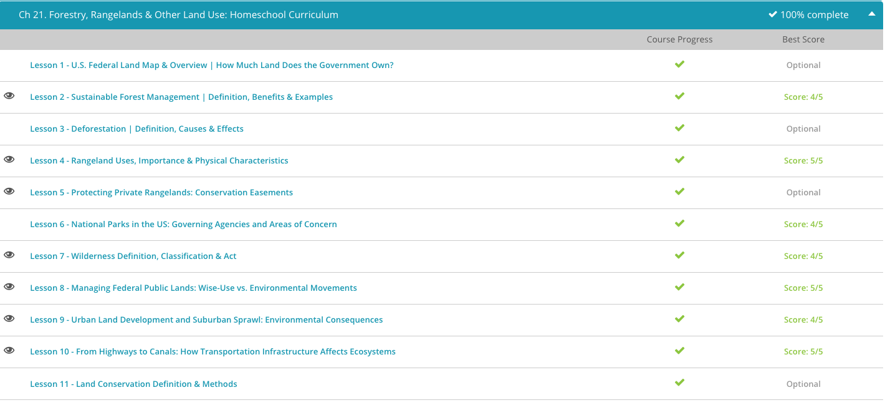

### Andrew Garber

### AP Environmental Science

### 12th Grade

### Chapter 21: Land Usage

#### 21.2: Sustainable Forest Management

- Sustainable forest management, also known as sustainable forestry, is the practice of regulating forest resources to meet the needs of society and industry while preserving the forest's health. Therefore, sustainable forest management is always looking to strike a balance between the demand for the forest's natural resources and the vitality of the forest.
- Now, in the most basic terms, a forest can be sustained by planting a new sapling for every tree that is removed. However, that is an oversimplified solution.
- Proper management of a forest must take into account an assortment of factors, which are assessed by a forest manager, or forester, who is the individual responsible for managing the balance of a forest's environmental, commercial, and recreational viability. Let's look at some ways a forest manager might practice sustainable forestry.
- One of the examples of sustainable forest management that a forest manager might employ to avoid the complete removal of a forest is to use selective logging. Selective logging is the practice of removing certain trees while preserving the balance of the woodland. Selective logging is more time consuming and more expensive then clearing the trees, but it preserves the forest's assets.
- Sustainable forest management was not a concern for many nations until the Forest Principles were adopted in 1992 at The United Nations Conference on Environment and Development in Rio de Janeiro. The Forest Principles is a non-legally binding document that outlines suggestions for sustainable forestry. The document provides a framework for sustainable forest management, and it is up to individual nations to implement the principles.
- We see that there are many benefits of sustainable forest management, such as recreational opportunities. Managed forests provide suitable environments for nature lovers to enjoy hiking, hunting, and wildlife observation. Speaking of wildlife, sustained forests provide a natural habitat for many plant and animal species, which allows for sustained biodiversity. A biologically diverse ecosystem is a stable ecological community and can provide valuable resources, such as the numerous medicinal plants found in tropical forests.
- Another benefit of sustainable forestry is economic stability. Sustainable forests help the economy of an area by providing jobs. The timber industry may provide employment in rural areas, and manufacturing businesses based on lumber and wood products provide additional economic stability for surrounding areas.
- A properly managed forest leads to improved air quality by removing carbon dioxide from the atmosphere and improved water quality by slowing stormwater runoff into waterways. Stormwater is rainfall that travels over paved surfaces or other man-made surfaces and does not absorb into the ground. As it flows, it picks up contaminants and pollutants that make their way into bodies of water.

#### 21.4: Rangeland Usage

- Rangeland is the term used to describe arid or semi-arid land that is well suited for grazing. Vegetation found on rangeland can be varied, but because the area does not receive much rainfall, the vegetation often consists of native grasses, grass-like plants, shrubs and broad-leaved herbs, such as forbs. These forms of vegetation are eaten by grazing livestock.
- The arid conditions along with poor soil quality make rangelands unfit for growing crops, which require nutrient-rich soil and proper irrigation. Rangeland makes up approximately 50% of the land area around the world, making it the largest ecosystem.
- While these lands may appear barren and useless at first glance, there are a number of valuable uses of rangeland. Rangeland is largely used for grazing livestock. The grasses and forage plants that grow in these climates are well-suited for grazing, and the majority of cattle ranching that occurs in the United States and world-wide takes place on rangeland. Therefore, these lands are economically important to many regions of the world. Because vegetation can be sparse and an area can be overgrazed if it is too small, cattle ranches are often very large and may consist of hundreds, if not thousands of acres.
- Rangelands also provide habitats for wildlife. Well-established habitats boost the biodiversity of a region and bring stability to the ecosystem; and the wildlife supported by the rangeland ecosystem can be hunted for food.
- Rangelands also provide watersheds for use by surrounding communities. A watershed is an area of land that delivers rainwater or snowmelt into waterways. Watersheds are important because the water bodies they drain into provide drinking water and other benefits to humans. Properly managed rangelands protect watersheds from erosion and pollutant runoff that can contaminate waterways.
- The many important uses and resources provided by rangelands make their protection and proper management vitally important. One of the factors that leads to rangeland degradation is overgrazing. If a ranch is overgrazed, it can result in a loss of shrubs, trees, and grasses. This exposes the soil and accelerates soil erosion, making it hard to grow future vegetation and resulting in the loss of many plant species.
- When rangelands are degraded due to overgrazing, it must be rehabilitated, which can require years before the land is returned to a useful state. Another significant factor that can degrade rangeland is the introduction and spread of invasive species. Invasive species are non-native species whose arrival into an ecosystem is likely to cause harm. For example, invasive weeds or shrubs of low grazing value may grow and thrive on rangelands, robbing valuable resources needed by native grasses and vegetation. These invasive species degrade the quality of the grazing land.

#### 21.5: Protecting Private Rangelands

- Now, with urban sprawl pushing farther and farther into less developed land areas, there is a need to have some controls in place to avoid the destruction of privately-owned rangelands. This is where a conservation easement comes into play. A conservation easement is a voluntary, but legally-binding agreement between a landowner and a land trust or official agency that limits certain uses or prevents development of the property to protect the land and its resources. Conservation easements are great tools that help preserve the natural and environmental benefits of the rangeland ecosystems for future generations.
- By entering into this type of agreement, a landowner retains many private property rights and can continue to live on and use the land as they see fit, as long as it does not infringe on the terms of the agreement. For example, with a conservation easement the private rangeland owner may give up the right to subdivide or develop the land, but retain the right to use the land for ranching. Because conservation easements are set up in perpetuity, meaning for an indefinite duration, conservation easements are applicable to both current and future owners of the land.
- Private rangeland owners may acquire a conservation easement for different reasons, and there are a number of benefits of conservation easements. One of the most powerful benefits is that they protect wildlife habitats. Rangelands are home to various plant and animal species, and conservation easements have proven to be one of the most effective tools for the permanent protection of millions of acres of natural habitats and undeveloped spaces.
- Conservation easements also protect resources. By preserving land in its natural state, pollutants and contaminates that can make their way into water, soil, or air from industrial practices or urban development are limited. These agreements also preserve the natural scenery of the area that is enjoyed by the direct community and surrounding areas.

#### 21.6: Wilderness Definition, Classification, and Act

-Wilderness is an undisturbed tract of land that man does not control and has not developed. The wilderness makes up some of the most untamed natural environments on earth. These areas can truly be thought of as the last remaining wild places that humans have not invaded with signs of modern civilization, such as roads, power lines, and pipelines.

- In 1964, The Wilderness Act was signed into law by President Lyndon B. Johnson. The Wilderness Act formally designated areas in the U.S. as wilderness and sought to ensure that the growing population and increasing number of settlements did not dominate all areas within the United States. Therefore, guaranteeing that some areas would be left alone for preservation and protection in their undisturbed and natural state.
- The Wilderness Act also created The National Wilderness Preservation System that protects U.S. wilderness areas for the long-term preservation of their natural condition. In the United States, 757 areas are designated as wilderness and encompass over 109 million acres in 44 states and Puerto Rico.
- Any activities on federally designated wilderness areas are coordinated by the National Wilderness Preservation System, and these areas are managed by four national federal land management agencies, which include the Bureau of Land Management, the National Park Service, the U.S. Fish and Wildlife Service, and the U.S. Forest Service.
- While man does not directly use wilderness areas for activities, such as logging or industrial processes, there are valuable uses of wilderness. Having designated wilderness areas protects wildlife habitats and ensures that the biodiversity of many species of plants and animals is retained. Because these areas are devoid of human development, they serve as irreplaceable environments for the survival of certain species of flora and fauna, some of which are endangered.
- Wilderness also ensures a source of clean water. Water is easily contaminated when it washes over paved surfaces or through fields or yards that have been treated with pesticides or fertilizers. The undisturbed soil and vegetation within many wilderness areas provide a natural filtration system that removes contaminants from water.
- Wilderness areas also serve as a type of natural laboratory for science and educational studies. The wilderness is a pristine classroom that can be used as a place for environmental and conservation studies and other forms of scientific research.

#### 21.7: Managing Federal Public Lands

- Federal Public Lands are lands that are owned or administered by the federal government. The administration of these lands is handled by different government agencies, including the Bureau of Land Management, National Park Service, U.S. Fish and Wildlife Service, and the U.S. Forest Service.
- Even though these lands are owned by the federal government, they are public lands. Therefore, the resources they contain and the recreational opportunities they provide are meant for the well-being and economic benefit of society. For example, some federal public lands permit the extraction of natural resources, such as oil, coal, natural gas, minerals, and timbers. Additional public lands serve as potentially strong sites for renewable energy generation, such as solar and wind power.
- Federal public lands may also be set aside to serve the public as national parks or to protect wildlife as wildlife refuges. Public lands are economic and environmental treasures, but there are opposing viewpoints on how the lands should be managed to meet the best interests of the people. These differing viewpoints became the start of the Environmental and Wise Use Movements.
- The Environmental Movement is the term used to describe a social and political movement concerned with the protection of the environment from destruction and pollution. Those who support the Environmental Movement are strong advocates for the natural environment and see human beings as participants in the environment who must be good stewards of its natural resources. They see that nature has vast natural resources, but these resources are finite and there is a delicate balance between the use of natural resources and environmental protection that must be observed by man. If not, the result could be the loss of forests, freshwater, and fertile soil, and eventually the downfall of society.
- Proponents of the Environmental Movement are a diverse group of private citizens, religious supporters, environmental scientists, and nonprofit organizations. Two of the early pioneers of the Environmental Movement were John Muir, who was the founder of the Sierra Club, which is a large conservation organization, and Gifford Pinchot, who was the first Chief of the U.S. Forest Service. The Muir Woods in California, just north of SF, is named after John Muir and is one of the greatest places I have ever been.
- The Environmental Movement grew after World War II. This was a time of industrial and economic growth in the United States and a time when environmentally-conscious individuals grew concerned that the environment was being neglected as the nation progressed. Proponents see advancements in industry and technology as potentially damaging to the environment. They favor the close regulation and restraint of technology to preserve nature. They strive to keep environmental protection a priority and favor increased public policy.
- We see the Environmental Movement has some strong viewpoints about how federal public lands should be managed, and as with any issue, there is always an opposing view. The Wise Use Movement grew out of opposition to the Environmental Movement. The Wise Use Movement is described as a social and political movement that promotes the expansion of private property rights and responsible management of the environment for the benefit of man.
- Those who support the Wise Use Movement are strong advocates of economic growth and feel that there can be a balance between environmental protection and economic prosperity. If this balance is not achieved, it could destroy the nation's economy. Therefore, proponents of the Wise Use Movement tend to be property owners and those in industries, such as logging, mill work, ranching, farming, and mining.
- A pioneer of the Wise Use movement is Ron Arnold, who is the Executive Vice-President of the Center for the Defense of Free Enterprise, which is a think tank for the Wise Use Movement. Those in the Wise Use Movement see advancements in technology as a potential win-win for the economy and the environment. They see technology as a way to solve environmental challenges, and feel it should not be limited or restrained. Therefore, they favor decreased public policy and government interference. I am a big fan of this, I think it has notable parallels with the Effective Accelerationism movement, which is a movement that seeks to accelerate technological progress as an instrument to solve societal problems.

#### 21.8: Urban Land Development

- Urban areas are defined as cities with a population size of more than 2,500 people. Suburban areas are residential areas that are on the outskirts of a city. Suburbs are often within commuting distance of a city, and sometimes the population of a suburban area is included in the urban calculation.
- For the majority of human history, most people have lived in rural areas and have survived by hunting, gathering, fishing, farming, and other occupations based on natural resources. It wasn't until around 300 years ago, during the Industrial Revolution, that the population began to shift. People began to move to urban areas in search of jobs, food, housing, education, healthcare, and more social activities. Urbanization is the term used to describe the shift from rural to urban living and the increased concentration of the human population in densely populated cities.
- Similarly to the global human population, the percentage of people living in urban areas has also increased in the United States. In the early 1900s, around 21% of the United States population lived in urban areas. This number has increased steadily, and in 2011, around 82% of the United States population lived in urban areas.
- Due to this population explosion, a new term has been created for very large cities. Megacities is the term used to describe urban areas with human populations over 10 million people. As of 2013, there were 25 megacities across the world, including New York, Los Angeles, London, Buenos Aires, Rio de Janeiro, Tokyo, Beijing, Cairo, and Mumbai. In the last 10 years this number has increased.
- In addition to increased urban land development, in recent years there has also been an increase in suburban sprawl, which is unplanned and widespread growth in the amount of land included in a metropolitan area. This occurs when cities grow and extend outward into the surrounding countryside. Suburban sprawl is referred to as unplanned because in most cases housing developments are built one after another, without a future plan of where the expansion of the city will stop.
- Chicago, Illinois, is an example of a city with extensive suburban sprawl. The entire metropolitan area, which includes the city and suburbs, is over 40 times the size of the city alone. Las Vegas, Nevada, has also experienced suburban expansion. It is one of the fastest growing cities in the United States, with its population and developed land tripling between 1984 and 2009.
- In recent years, there has been an effort to combat suburban sprawl. City planning is a profession that focuses on designing cities in a way that maximizes their efficiency, functionality, and beauty. City planners work with policymakers to create development options that address transportation needs, include quality of life features like public parks, and address other matters that will improve the quality of newly developed areas. If permitting the building of _anything_ wasn't so difficult, we could have more efficient and beautiful cities _sigh_.
- The increase in the number of people that live in urban and suburban areas has had a dramatic impact on the environment. There has been an increase in air and water pollution in urban areas. And as cities spread out, people rely on cars more often for transportation. This can result in more chemical emissions being released into the air and more automobile waste, such as oil and coolant, being released into waterways. The increased dependence on cars can also negatively impact the environment because it puts increased demand on natural energy sources. Once again this decelerationist mindset is visible in Study.com content, which really indicates just the level of public-school indoctrination spreading into homeschooling

#### 21.9: Transportaion Infrastructure

- We all rely on some form of transportation to travel. Some people might rely on more basic methods of transportation, such as biking. Others may rely on mass transit, such as buses, transit rails, and planes. These forms of transportation carry many people to and from locations. Although not as common as it once was, people still depend on boats to travel. Although there are many forms of transportation, most people rely on cars to get around.
- All of these forms of transportation rely on different types of infrastructure to support them. Cars rely on roads, highways, bridges, tunnels, and parking lots. Bikes also rely on some of the same infrastructure used by cars. Boats rely on controlled waterways, such as canals, and natural waterways in order to transport people and goods. Natural waterways normally do not have any infrastructure, but controlled waterways may have locks that control the water. Mass transit forms of transportation rely on a variety of structures, including stations or terminal facilities, rail tracks, airports, runways, and roads.
- We constantly rely on transportation to move us and our resources around, but we do not often think of how the infrastructure that is used to transport items can influence ecosystems. The infrastructure we have created for transportation can have many negative impacts on the environment.
- In general, in order to build transportation infrastructure, natural land must be converted for development. This results in a loss of natural land, which animals and plants rely on for survival. Animals are often forced to move to a different location. In addition to removing natural habitats, while building transportation infrastructure, there is also an increased risk of pollution due to the increased abundance of work vehicles and machines.
- Although a great deal of damage is done while transportation infrastructure is being built, there are also harmful effects that occur once the infrastructure is in place. Pollution continues once the infrastructure is in use. Whether it be cars, planes, or boats, all vehicles release chemical emissions into the air or chemicals into the water. These vehicles add to the water and air pollution in the area around the infrastructure.
- Infrastructure, such as roads, highways, canals, and railways, can cause habitat fragmentation, which is the process of altering a habitat and creating small, spatially separated land areas from a previously large and continuous habitat. Habitat fragmentation creates smaller patches of habitat that are not connected to each other. As a result of habitat fragmentation, many animals are forced to travel over unsafe areas, such as roads and railways. These animals can be harmed while crossing the transportation infrastructure to find food or mates. Habitat fragmentation also influences plants because the separation reduces the ability of plants to reproduce.

