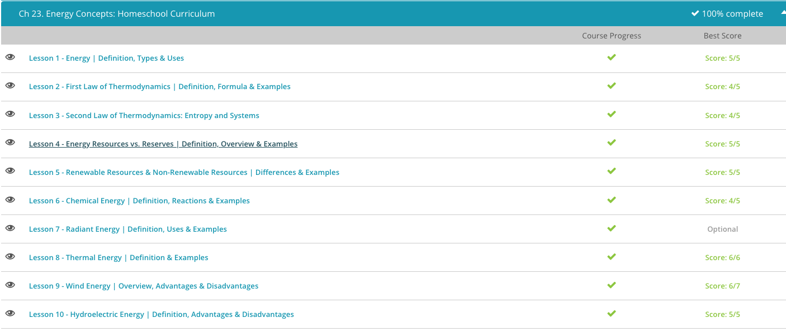

### Andrew Garber

### AP Environmental Science

### Chapter 23: Energy

#### 23.4 Energy Resources vs Reserves

    - Think about getting a slice of pie when you were a kid. You only got one piece on your plate, which was a small amount compared with what you knew was in the overall pie. Yet you only had access to this one piece because your parents put the rest of it away for later. The entire pie represents a resource, the total amount of an object, substance, or energy supply present. The slice of pie on your plate - the portion of the resource that is accessible - is the reserve of that resource. Many types of resources exist on Earth, like coal, oil, natural gas, sunlight, and wind. Each resource - the overall quantity of something - has reserves - the part we can access with mining, drilling or other methods.
    - Once again, the size of this pie(and the slice as a result) *can* be increased - they are not fixed, nor should they be treated as such.
    - Sometimes we can measure a resource to the point where we can quantify that amount as well as estimate how much more is available. This is the portion of the resource that is called the identified resource, which is the portion of a resource that has been either measured or estimated. Basically, what this means is that we have measured it well enough that we feel confident saying a certain amount of that resource exists. Let's use the pie example to illustrate this. If you take a survey of your neighbors to see how many of them have pies, that's a known quantity. If you expand your survey to other neighborhoods - and maybe even other neighboring towns - you can probably start making some estimates about the amount of pies in the state (or maybe even the country). This would be your identified resource for pies.
    - The other portion of a resource is the undiscovered resource. This is the amount of the resource that is unknown and cannot be estimated. This includes portions of the resource that are assumed to be present but aren't measured because they haven't been explored or are in places that are not possible to get measurements from. Say, for example, that you're aware that deep in the jungle people are making pies, but you are not able to measure or even estimate how many pies there are. Perhaps you have no way to travel there because the area is so remote, so you have no way to measure the amount of pies! But you know they are there, so this is the undiscovered portion of your pie resource.
    - When a reserve can be recovered in such a way that it is reasonably expected to be used, this is the proven reserve. In contrast, the portion of a reserve that is less likely to be used is the probable reserve. Just like the second piece of pie, it's available, but it's not necessarily a good idea to spend the time, effort or money obtaining it.

#### 23.5. Renewable Resources & Non-Renewable Resources

    - Renewable resources are resources that are replenished by the environment over relatively short periods of time. This type of resource is much more desirable to use because often a resource renews so fast that it will have regenerated by the time you've used it up. The problem is that these are frequently intermittent, or have a low energy density.
    - Non-renewable resources are resources that are present in limited supplies and are depleted as they are used. These resources are not replenished by the environment over short periods of time. These resources are often more energy dense, but are not as sustainable as renewable resources.

#### 23.6. Chemical Energy

    - Energy is the ability to do work, where work is movement of an object by some force. We use energy every day, and energy comes in different forms. Chemical energy is energy that is stored in chemicals, such as sugar and gasoline. As chemical energy is stored energy, it is a type of potential energy, which is energy stored in objects due to their location. An easy example of potential energy would be that of a bike on top of a hill where the bike's position is elevated and has the ability to roll down the hill. In the case of chemicals, the position refers to the various atoms that exist together within the chemical.
    - We just talked about the fact that plants use solar energy to make sugar from carbon dioxide and water. Sugar, carbon dioxide and water are all chemicals that are held together by what we call chemical bonds or forces that hold the chemicals together. For example, all sugars are composed of carbon, oxygen and hydrogen atoms that are held together by chemical bonds. These atoms don't just stick together automatically. Rather, energy is needed to hold them together. Plants utilize solar energy to put the carbon, the hydrogen and the oxygen atoms together in the form of sugar. This is a really good example of energy transformation where energy is changed from one form to another. In this case, solar energy is converted into chemical energy that holds the sugar together and prevents it from falling apart.
    - We previously established that chemical energy is a type of potential energy where the energy is stored in the chemical bonds that hold the chemical together. Likewise, the potential energy can be released when the chemical bonds are broken. This is what happens when we digest the sugar that we eat. The chemical bonds in sugar are broken as the sugar is digested to carbon dioxide and water. When the chemical bonds are broken, the potential energy is released in the form of kinetic energy or energy of motion and heat or non useable energy. The kinetic energy is used to do work, such as contract our muscles and produce heat that helps to keep our bodies warm.
    - We just finished talking about sugar as an example of chemical energy. Well obviously, sugar is not the only chemical that contains chemical energy. In fact, all chemicals contain energy. When chemicals are broken down, we refer to it as an exothermic reaction as energy is released from the reaction and can be used to do work. When a larger chemical is made from smaller building blocks, we call this an endothermic reaction as energy is required to build the bigger molecule from the smaller components. Gasoline is a large chemical we use to make our cars move. The engine breaks down the gasoline. As the chemical bonds holding the gasoline together are broken, the energy is released and used to move the car and generate heat.

#### 23.8. Thermal Energy

    - Thermal energy is energy possessed by an object or system due to the movement of particles within the object or the system. Thermal energy is one of various types of energy, where 'energy' can be defined as 'the ability to do work.' Work is the movement of an object due to an applied force. A system is simply a collection of objects within some boundary. Therefore, thermal energy can be described as the ability of something to do work due to the movement of its particles.
    - Because thermal energy is due to the movement of particles, it is a type of kinetic energy, which is the energy due to motion. Thermal energy results in something having an internal temperature, and that temperature can be measured - for example, in degrees Celsius or Fahrenheit on a thermometer. The faster the particles move within an object or system, the higher the temperature that is recorded.
    - Geothermal energy is another example of thermal energy. The word 'geothermal' comes from the Greek words 'geo,' which means 'Earth,' and 'therm,' which means 'heat.' Therefore, geothermal energy is the thermal energy contained within our Earth. Most of this geothermal energy comes from the rapidly moving particles within the Earth's core, where temperatures can reach 5,000 degrees Celsius (9,000 degrees Fahrenheit). The thermal energy in the center of the Earth is transferred to the surface of the Earth. This heat transfer causes the surface of the Earth to have a relatively constant temperature whether it's winter or summer.
    - Quaise Energy is doing good work here, using Nuclear Fusion technologies to access geothermal energy.

#### 23.9. Wind Energy

    - Wind energy is a renewable form of energy, though there are significant problems with it. Notably, it is an intermittent form of energy that requires significant storage capacity to be really useful.
    - Another notable example of the problems with NIMBYism, where people don't want them near them even though they support them in abstract.

#### 23.10 Hydroelectric Energy

    - Water is pretty powerful stuff! You know this if you have stood in a flowing stream and felt the water rushing past you. Or, if you've gone whitewater rafting down a raging river. Even mere images of a place like Niagara Falls help you appreciate just how strong moving water is. This is not a new observation, and water has been used to produce different forms of energy for a very long time. When electricity is generated from flowing water, this is called hydroelectric energy, and the prefix 'hydro' refers to water.
    - Hydroelectric energy is considered a renewable energy resource because it's an energy resource that regenerates in a short time period. Hydroelectric energy is a very important energy source, both nationally and worldwide. About 19% of the world's total electricity production comes from hydroelectric energy and about 7% of the power in the U.S. When we look at hydroelectric energy for the U.S. in terms of renewable energy sources (so comparing this to things like solar power, wind power, geothermal energy and biofuels), it makes up 96% of renewable energy electricity production. That means that almost all of our energy production that comes from renewable energy sources comes from water!
    - While hydroelectric energy can be a very beneficial renewable resource, there are also drawbacks to using water to generate electricity. While the maintenance costs are low after the dam is built, they're very expensive to construct and require large up-front investments.
    - And you know those reservoirs behind the dam? For the most part, these are a steady, reliable source of water. But they are dependent on water coming from their own sources, such as rain. If it doesn't rain, the reservoir may dry up. It's like having a slow leak in your bathtub. If you sit in there long enough and you don't turn the water back on to refill the tub, eventually you'll be sitting in a dry tub, which doesn't work very well!
    - Dams can have serious impacts on the surrounding environment as well. Think of it this way: There is a busy street that runs through the center of town that seems to move along pretty well. All of a sudden, a large wall gets constructed across the road that reduces it from four lanes to one. Traffic will likely get backed up, and some people will simply not be able to make it to work any longer. And, any homes, plants and animals will be forced to move where the wall was constructed.
    - A dam has the same effect on a river environment. The water is not allowed to flow downstream as it would without the dam, so it backs up, creating the reservoir behind it. The reservoir can only be made by flooding the land behind the dam, so people, plants and animals are displaced. Since the flow is altered at the dam, the downstream areas get less water than they would normally.

