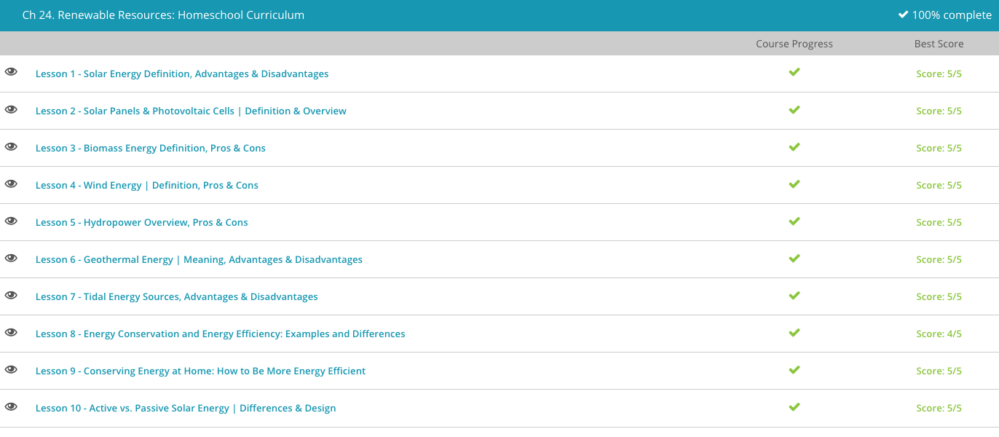

### Andrew Garber

### AP Environmental Science

### Chapter 24 Renewable Resources

#### 24.1 Solar

    - If we could capture all of the sunlight that shines on the Earth in just one hour, we could supply the world with energy for an entire year. On a smaller scale, a simple three-foot by three-foot patch of earth located in a sunny area gets about 2,000 kilowatt hours of solar energy over a year's time.
    - It makes sense, then, that we try to use this widely available, renewable energy source. Another perk that makes solar energy a desirable energy source, is the fact that it does not produce greenhouse gases, such as carbon dioxide, which is a gas in the atmosphere that traps heat and contributes to global climate change. However, solar energy is not a slam-dunk when it comes to supplying the world with energy. We lose a lot of energy through the process of collecting solar rays, and the technology is still quite expensive.
    - Currently, we can only gather about 15 to 20 percent of the energy available from the sun. While scientists are working on perfecting solar cells that can collect the sun's energy and convert it to electricity, solar cells are still quite expensive, from materials, to installation, to maintenance. To add to the challenges of solar power, it's important to note that there are many places on Earth that are not consistently sunny. There is also the pesky problem of the sun only shining during the day and not at night, and because solar energy is hard to store, there is often a need to back up solar power with other energy sources.
    - There are some interesting prospects for solar energy on our horizon. For instance, we have had solar-powered cars for several years, but they're still too expensive to make available to a large number of drivers. And, like electric cars, solar-powered cars are limited by short battery life and access to consistent sunshine. Still, scientists continue to seek ways to make solar energy a more viable and efficient option.

#### 24.2. Solar Panels

    - This lesson is super out of date, so I am going to go with my own knowledge here.
    - Solar panels are made up of photovoltaic cells, which are made up of silicon. When sunlight hits the silicon, it knocks electrons loose, which creates an electric current. This current is then captured and converted into electricity. Solar panels are usually installed on roofs, where they can get the most sunlight or out in large solar farms. Solar panels are dropping in price dramatically, but efficiency is not increasing nearly as quickly - in addition, battery storage is still a major issue.
    - We also use solar thermal energy to collect solar energy. Solar thermal technology creates electricity indirectly, as opposed to photovoltaic technology that directly creates electricity from light. Solar thermal energy collects the sun's light, which heats a fluid, such as water; the resulting steam is used to run a generator that makes electricity.
    - You can recall this term by remembering that the word 'thermal' refers to heat. Essentially, solar thermal energy works as a giant water heater, and this form of solar technology is primarily found in very warm places where the sun is reliable.
    - Solar thermal plants are capable of creating massive amounts of energy. These power plants often use parabolic troughs, which are the solar thermal collectors used to collect the sun's radiation. These parabolic troughs are shaped somewhat like a half-pipe that you see skateboarders use and are lined with mirrors. These mirrors focus sunlight onto a focal point where the fluid can be heated until it becomes steam. This steam then spins a turbine for electricity generation.

#### 24.3. Biomass Energy

    - In this lesson, you will learn how biomass can be converted into a clean and renewable energy source. Biomass is organic materials, including plants and animal wastes. This term is easy to recall if you remember that the prefix bio refers to living things, like plants and animals. Biomass energy, therefore, is energy derived from organic materials.
    - Now, we know that plants and trees use sunlight to make carbohydrates from carbon dioxide and water using the process of photosynthesis. This energy from the sun gets stored in the plants and transferred to any animal that eats the plants, which is why we can use plants and even animal wastes, like manure, to make biomass energy. When these sources are burned or decompose, they release carbon dioxide and water along with their stored energy.
    - There are many types of plants and organic wastes that can be used to produce energy. Energy crops, which are sometimes referred to as 'power crops,' are crops grown to be used as fuel, not food. These are generally high-yielding crops, trees, and grasses that require very little care and can be grown at a low cost.
    - Organic waste from industries such as forestry, agriculture, and manufacturing can be used as a source of biomass energy. Biomass is so versatile that waste generated in cities and urban life, such as old shipping pallets, construction site wastes, and yard wastes, can be used.
    - Using biomass for energy is nothing new. From the earliest days, man has been burning wood, a form of biomass energy, to cook food and stay warm. Today, biomass is still used for these purposes, but it can also be converted into a gas or oil to generate heat or electricity and even fuel for transportation needs.
    - I am not going to go on an ethanol rant here, but suffice it to say that ethanol is a type of biomass energy that has been *generously* subsidized by the US government, distorting price signals and leading to a lot of corn being grown for fuel instead of food. This leads to the burning of tons of fossil fuels to grow the corn, and the ethanol itself is not nearly as efficient as gasoline. It's a mess. Fuck ethanol.

#### 24.4 Wind Energy

    - Did this in the previous chapter - got 5/5 on this quiz.

#### 24.5. Hydropower

    - Did this in the previous chapter - got 5/5 on this quiz.

#### 24.6. Geothermal Energy

    - Did this in the previous chapter - got 5/5 on this quiz. Come on study.com.

#### 24.7. Tidal Energy

    - Tides produce huge amounts of energy through waves, the problem is that building plants to harness this energy is both tremendously expensive and takes up space on coastlines. In addition, the coastlines actually suitable for this are only a small % of total coastlines. One way tidal energy is captured is with the use of tidal turbines. Tidal turbines look like and work like underwater windmills. They utilize turbines with short but strong blades that spin as the tides move and then transmit their energy to an electricity generator.
    - Another way tidal energy is captured is with the use of tidal barrages. Tidal barrages are special dams that take advantage of the difference in height between low and high tides. Tidal barrages are built across an estuary or bay. When the tide comes in and the sea level rises, water passes through the dam and becomes trapped in a basin. When the tide goes out, gates within the dam release the water, allowing it to flow through turbines that spin and transfer energy to electric generators.

#### 24.8. Conservation and energy efficiency

    - Energy conservation is the act of saving energy by reducing a service. In other words, to conserve energy, you need to cut back on your usage. Examples include driving your car fewer miles per week, turning your thermostat down a degree or two in the wintertime and unplugging your computer or home appliances when they are not in use.
    - Energy conservation is an effective way to lower overall energy consumption, and the same can be said for improved energy efficiency. However, the terms do not mean the same thing. Energy efficiency is defined as saving energy, but keeping the same level of service. For example, if you turn off the lights when you leave a room, you are practicing energy conservation. If you replace an inefficient incandescent light bulb with a more efficient compact fluorescent bulb, you are practicing energy efficiency.
    - You can keep these terms straight by thinking of energy conservation as 'cutting back' and energy efficiency as using energy more 'effectively.' Energy efficiency uses advances in science and technology to provide services and products that require the use of less energy. Examples include replacing older model appliances, such as a refrigerator or washing machine, with newer, energy-efficient models. Modern appliances use significantly less energy than older models, yet provide the same or better service.
    - To some degree, just making more energy(cleanly) is a more effective way to combat climate change than trying to conserve energy.
    - An energy audit is an assessment of energy use in a home or business to evaluate energy consumption. An energy audit identifies places within the structure where energy is being lost and provides suggestions to improve energy efficiency. An energy auditor will examine the building for leaks, evaluate insulation and inspect heating and cooling systems.

#### 24.9. Conserving Energy at Home

    - Living in an energy-efficient home and taking conscious steps to save electricity will reduce the size of your utility bills and keep your family comfortable. You can conserve energy and save money when you turn off and unplug unused devices. This includes turning off lights, TVs, and entertainment systems when you leave a room. If you have multiple electronic devices grouped together, such as a TV, DVD player, and game console, plug them into a power strip, and turn the entire power strip off with one click when these items are not in use.
    - Also, unplug your seldom used appliances, including an extra refrigerator that you might be keeping in your garage, especially if it's storing only a few items. Unplugging also includes battery chargers and power adapters that are not in use. If you do not want to unplug your computers and go through the hassle of restarting them, set computers to hibernate mode. In hibernate mode, your computer will turn off after a set period of inactivity but will not require a complete restart.
    - To save electricity, look for ENERGY STAR certified products. ENERGY STAR is a U.S. Environmental Protection Agency program that promotes superior energy efficiency. ENERGY STAR products save businesses and individuals money and protect the environment by promoting appliances and products that use less energy than conventional models. Look for the ENERGY STAR logo when shopping for new home appliances and electronics, and replace inefficient incandescent light bulbs with ENERGY STAR approved compact fluorescent light bulbs or CFL bulbs.
    - Heating and cooling a home accounts for the biggest portion of most homes' energy consumption. To save on heating and cooling, install a programmable thermostat. A programmable thermostat allows you to adjust your heating and air-conditioning needs automatically. Save energy in the winter by programming your thermostat setting to 68 degrees Fahrenheit for the hours you are home and active. Then at night and when you are at work, drop the setting ten or more degrees. For the summer months, select 78 degrees for the hours you are at home and raise the temperature setting for those hours you will be away from home or asleep.
    - The costs of heating water in a typical home can add up quickly. To save on hot water costs, take shorter showers and install low-flow showerheads. Showers account for the majority of hot water costs and reducing showering time by only a few minutes can save hundreds of gallons of water each month.
    - You can also check the thermostat setting on your hot water heater and set your hot water heater to 120 degrees. Installers often set the hot water heater thermostat to 140 degrees Fahrenheit. By turning it down to 120 degrees, you will reduce your water heating costs and still have plenty of hot water for showers and other daily needs.

#### 24.10 Active vs Passive Solar

    - Passive solar heating, as you may have guessed, is passive. In other words, it takes advantage of the existing heat generated by the sun to heat living spaces. We have all witnessed passive solar heating when we climbed into a car on a sunny day. Rays from the sun entered the car windows and were absorbed by the car's seats, panels and floor, and this heat got trapped in the car and warmed the interior.
    - Passive solar heating is also what makes greenhouses effective at growing plants all year round. When the sun's rays penetrate the windows of the greenhouse, the items inside the greenhouse absorb and then release the heat, providing a nice environment for the plants to grow.
    - Passive solar heating can be used in your home to cut your wintertime heating bill and improve comfort. But to fully take advantage of solar energy in this way, some planning is required. Because passive solar heating does not involve any mechanical devices, a home designed for passive solar heating will need to be positioned in a way that allows heat from the sun to enter in the winter and be rejected in the summer months. This positioning will vary by local climate conditions, but in the Northern Hemisphere, a good passive solar design uses south-facing windows to capture the sun's rays.
    - Beyond being positioned correctly, a passive solar heating design will also depend on thermal mass of the walls, flooring and other objects within the home. Thermal mass can be defined as a material's ability to absorb, store and release heat.
    - When the sun's rays enter the home in the winter months, the heat energy is absorbed by the materials inside the building that have a high thermal mass. This would include materials that are dense, such as stone, brick, concrete or ceramic tile. These materials absorb and hold onto heat during the period of time that the sun shines on them and then slowly release that heat throughout the nighttime, keeping the home at a more stable and comfortable temperature.
    - Active solar heating is a more involved process than passive solar heating. While passive solar heating employs methods to capture heat from the sun, it does nothing to actively enhance the process. In contrast, active solar heating uses mechanical and electrical equipment to enhance the conversion of solar energy to heat and electric power. While more involved, active solar systems can generate much more heat than a passive system.
    - For active solar heating, you will need a solar collector, which is a device used to absorb solar energy. Solar collectors can be simple designs, but you likely think of solar collectors as the solar panels found on rooftops of homes or other buildings. Solar panels are typically composed of photovoltaic cells, or solar cells, which are devices that directly convert light from the sun into electricity.

