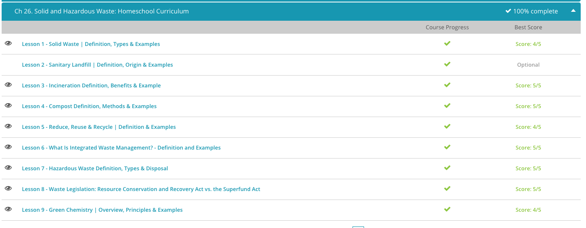

### Andrew Garber

### AP Environmental Science

### Chapter 26: Solid Waste

#### 26.1 Solid Waste

    - Solid waste is a general term used to describe objects or particles that accumulate at the location where they are produced. Now, think back on the amount of waste you produce each day and multiply that by 300 million, which is the approximate population of the United States. That would be one large pile of waste! In fact, each year in the United States, over 11 billion tons of solid waste is disposed of. Due to the large variety of items that are considered solid waste, the type of waste is often divided into two categories. The categories of solid waste are referred to as municipal solid waste and non-municipal solid waste, and these two types of waste vary by where the waste originates.
    - Municipal solid waste refers to any non-liquid waste that is created by an individual person, household, small business, or institution, such as a school or hospital. This type of waste is commonly called trash or garbage and includes everyday items, things that are broken, food that has spoiled, or simply any item a person no longer needs or wants. The most common items disposed of as municipal solid waste are paper, yard trimmings, food, plastics, metals, rubbers, and textiles. In recent years, the amount of electronic waste, also known as e-waste, has increased drastically as people become more reliant on electronics, such as computers and cell phones that are replaced and disposed of frequently.
    - There is major innovation coming here with robotics and AI recognition of waste. This will help sort waste and recycle more efficiently.
    - Although municipal solid waste is what we as individuals are used to, there is another type of waste that produces much larger quantities of material. Non-municipal solid waste is any non-liquid waste that is created due to the production of a product. Although products can sometimes turn into municipal solid waste themselves when they break or are done being used, non-municipal solid waste refers to any waste that is created while the product is being manufactured and before it reaches the consumer. The amount of non-municipal solid waste fluctuates more than municipal solid waste because it is influenced by changes in consumer demand and consumption.
    - Non-municipal solid waste is a large category of waste that is often divided into three types: mining waste, agricultural waste, and industrial waste. Mining waste accounts for the majority of non-municipal solid waste in the United States, but the exact amount is difficult to determine because of the nature of mining. The main source of mining waste is the rocks and soil removed from the ground. Mining waste also includes the equipment used and any waste produced at the mining site. The exact amount of mining waste is hard to determine because the waste is not always accounted for or disposed of properly, such as rocks being dumped illegally. These are called tailings, and if contaminated, they can cause serious environmental problems.
    - The second most common type of non-municipal solid waste is agricultural waste. Agricultural waste includes any waste produced from raising livestock and growing, harvesting, and processing crops. Agricultural waste is unique because the majority of it is organic and can be recycled and reused for other purposes. For example, manure from livestock can be used to fertilize crops. Unused plant parts, such as stems and seeds, can be used to add nutrients to the soil or burned for energy.

#### 26.3. Incineration

    - One waste management strategy is to use mass burn incinerators, which are large facilities where waste is burned at very high temperatures. When these facilities were first created, they were very basic, with the waste being burned and the ash being transported to landfills for disposal. Over the years, mass burn incinerators have become much more complex facilities. Most mass burn incinerators that are still in use are now referred to as waste-to-energy facilities because they harness the heat produced from burning the waste to create energy.
    - Waste is first transported to the mass burn incinerator and inspected. Recyclables and items larger than couches are removed. The waste then passes through strong magnets that remove metals that can be sold. The remaining waste is then shredded to create pieces less than six inches. Once all sorting and shredding is complete, the waste is moved into a furnace with temperatures over 1,500 degrees Fahrenheit! The smaller pieces of waste burn in the air, while larger pieces burn as they move along a belt. While the incinerator is on, water is being circulated throughout the walls of the boiler. This process creates stream that is then used to drive turbines that produce energy.
    - When the waste has been completely burned, the ash, known as bottom ash, is processed to remove any remaining metals. The combustion gas that is produced during the burning of the waste is moved through a structure called a scrubber, where the gas is chemically treated to remove hazardous components and neutralize noxious gases, such as sulfur dioxide. During this process, many gases are turned into water and salts. These particulates that form are referred to as fly ash. The remaining gas and the fly ash are then passed through a structure known as the baghouse, which filters out the particulates. This last step lowers the amount of pollutants entering the air. The remaining gas is released through smokestacks and the fly ash collected is combined with the bottom ash from the waste and transported to a landfill.
    - These can also produce energy, which can make them more efficient or even profitable. However, they can also produce a lot of pollution, so it is important to have good filters and scrubbers to remove pollutants from the air.
    - Although mass burn incinerators have been an effective method for reducing the volume of waste that enters landfills, there are several issues associated with these facilities.
    - First, finding a suitable location for mass burn incinerators is difficult because people do not want to live near them. They are often placed in industrial areas, where people do not have to see them or do not notice the odor or smokestacks.
    - These facilities are also very expensive to build, with construction for a single facility ranging from $100-$300 million. Due to the expense of construction, cities often buy into long-term agreements with the facility to ensure that enough waste is produced to keep the incinerator running. This can cause problems for the city because if they do not produce enough waste, they may have to purchase waste from other cities to provide a continuous supply to the facility. Often, this can cause competition with recycling because cities may knowingly send recyclable materials to mass burn incinerators just to meet their volume requirement.
    - In addition to these issues, mass burn incinerators are also a concern due to the products they release. The ash produced can contain metals and hazardous substances and therefore must be disposed of in special secure landfills.

#### 26.4. Compost Definition

    - Imagine you see an old tree that has fallen in the forest. Most likely, the tree would be breaking apart and have other organisms growing on it or in it. What you would be observing is the process of decomposition, which is the breakdown of materials. Decomposition is also often referred to as decay or rot.
    - The process of natural decomposition is very important to one type of waste disposal. Composting is a form of waste disposal where organic waste decomposes naturally under oxygen-rich conditions. Although all waste will eventually decompose, only certain waste items are considered compostable and should be added to compost containers. Food waste, such as banana peels, coffee grinds and eggshells, are great items to compost. Adding meat products to compost should be avoided because as it decomposes, it will attract large animals and will smell very badly!
    - In addition to food waste, yard waste, such as grass clippings and leaves, can also be added to compost containers. These items will help increase decomposition and help reduce odor as materials break down. As with household food waste, there are also some types of yard waste that should be avoided. Perennial weeds, which are plants that come back year after year, should not be added to compost because they will grow back and spread.
    - Once these waste items are placed in a pile, the composting process can start. The organic materials are broken down naturally by earthworms, bacteria and other organisms that live in soil. Although the composting process can occur without any further human involvement, most composting involves the addition of water and oxygen - which occurs by turning the compost - to speed up the overall process. After several months, when all the organic material is broken down, the final product is created and is often referred to as humus.
    - As of 2013, over 27% of all municipal solid waste in the United States was comprised of yard and food waste. By composting these items, it makes it possible to reduce the overall amount of waste being sent to landfills and mass-burn incinerators. Compost can actually be valauble for use as a soil additive for growing crops, which sounds great except it is totally uneconomical to transport compost from cities where it can be produced in high quantities to rural areas where it is needed. This is a major issue with composting on a super large scale.

#### 26.5. Reduce, Reuse, Recycle

    - There is a common mantra that many of us were taught as children but do not always think of on a daily basis. The mantra is reduce, reuse, recycle, otherwise known as the three Rs. Over the last half century, the amount of waste created per person in the United States has almost doubled. The concept and promotion of the three Rs was created to help combat the drastic increase in solid waste production.
    - Let's start with the first R, which is reduce. The three Rs are really a waste management hierarchy with reduce being the most important strategy. In order to reduce the amount of waste produced, it is essential to focus on the source of the waste, or where the waste is originally coming from. Source reduction is when products are designed, manufactured, packaged, and used in a way that limits the amount or toxicity of waste created.
    - The first goal of source reduction is simply to reduce the overall amount of waste that is produced. The second goal is to conserve resources by not using raw, virgin materials. In other words, by following source reduction, fewer raw materials will have to be used to produce products.
    - The second most important strategy of the three Rs is to reuse, which is when an item is cleaned and the materials are used again. This concept can be difficult because we currently live in a world with many disposable items, and it takes some imagination and creativity to see how items can be reused.
    - There are two main ways that the concept of reusing can be applied to reduce waste. First, when purchasing a new item, you can look for a product that can be used repeatedly instead of a version that is only used once and thrown away. The second way to reuse is to buy an item secondhand, borrow, or rent an item, instead of buying the product new.
    - The third R in the hierarchy is for recycle, which in terms of waste is the reprocessing of disposed materials into new and useful products. Items that are commonly recycled include glass, plastic, paper, and metal. When recycled, some of these materials are used to create more of the same original product, while other materials are used to create entirely different products after recycling. In the 1960s, the United States only recycled around 6% of waste! As of 2010, the United States recycled approximately 25% of the municipal solid waste produced. Although this percentage may seem small in comparison to other countries, such as Switzerland and Japan that recycle around 50% of waste, the current amount recycled in the United States is a drastic improvement.

#### 26.6 Integrated Waste Management

    - For many years, there has been a divide in how to deal with solid municipal waste. Some believe the answer is waste management, which is the process of managing waste that is created and implementing disposal methods that reduce harm to the environment. The second strategy is waste reduction, which is the process of reducing the total amount of waste produced and also using waste for alternative purposes. Which do you think is more important, managing waste or reducing waste?
    - Although many people have strong opinions about which strategy is preferred, there is a new plan for dealing with waste that combines the two opposing strategies. The system is called integrated waste management, which combines a variety of strategies for both waste management and waste reduction. Some common examples of waste management that are involved in integrated waste management are burying waste in sanitary landfills and burning waste in mass burn incinerators.
    - The first priority involves the primary prevention of pollution and waste by requiring industries to eliminate or reduce the amount of harmful chemicals used in production, reduce packing materials for products and make products that last longer and are easier to recycle, reuse and repair. This first priority targets large industry and attempts to reduce the overall waste produced at the source.
    - The second priority targets small businesses and individuals and focuses on secondary prevention of pollution and waste. This step involves educating and encouraging people to buy reusable products, repair broken items, recycle, reuse products and compost.
    - The third priority is very different from the first two and focuses solely on waste management, including treating waste to reduce toxicity, burying or incinerating waste and releasing some waste into the environment for dispersal or dilution.
    - Although integrated waste management is designed as a large-scale system, there are things you as an individual can do to support the system. You can set up your kitchen in a way that makes it possible to separate your waste into appropriate categories. To support waste reduction, you can designate a container for recyclables. In some cities, all recyclable materials can go in one container but in other cities, they must be divided into glass, metals, paper and plastic. For waste reduction, you can also set up a compost container where you collect food waste for composting.

#### 26.7 Hazardous Waste

    - These two symbols, along with several others, represent a form of hazardous waste, which is any solid or liquid waste that is considered toxic, chemically reactive, flammable or corrosive. In terms of hazardous waste, something is considered toxic if it is harmful to human health when a person is exposed to the substance through inhalation, ingestion or touch.
    - A substance is chemically reactive when it is unstable or could react when exposed to another compound. Hazardous waste that is considered chemically reactive is likely to explode or produce harmful fumes when exposed to other compounds. A flammable substance is anything that is likely to catch on fire, and a corrosive substance is something that can corrode, or break down, metals.
    - The largest amount of hazardous waste is created in industry, in particular the petroleum and chemical industries, which produce around 70% of all hazardous waste in the United States. The most common examples of hazardous waste from industries in general include solvents used in cleaning, wastewater from petroleum refiners and ash produced from incinerators or coal-burning power plants.
    - According to study.com, "The most dangerous hazardous waste is the waste created by nuclear power plants and nuclear weapons facilities... this waste is highly regulated and controlled.". This is patent nonsense. It is due to government inaction that we haven't dug a big hole in Nevada, filled it with nuclear waste, and covered it up. Instead, we have nuclear waste stored in temporary facilities all over the country, which is a much more dangerous situation. This is not the fault of nuclear technology, which provides a lot of energy with very little waste, but rather the fault of government inaction.
    - Being that hazardous waste can be harmful in a variety of ways, it needs to be disposed of differently than non-hazardous waste. There are three main methods for disposing of hazardous waste.
    - The first method is to put solid hazardous waste in sanitary landfills, which are a method of waste disposal where the waste is buried either underground or in large piles. Although non-hazardous waste is often disposed of in landfills, the landfills for hazardous waste are constructed and monitored differently. Landfills for hazardous waste are made with thicker, impervious liners and with more heavy-duty removal systems for leaching materials. They are also constructed far from aquifers to reduce the risk of water contamination.
    - Hazardous waste that is liquid or has been dissolved is often placed in surface impoundments, which are shallow depressions in the earth that are lined with plastic and impervious materials. The liquid hazardous waste is dumped in the impoundment and left to evaporate. Once the liquid has evaporated, the solid hazardous waste residue remains at the bottom of the impoundment and can be removed and transported to a landfill. Surface impoundments pose many risks, including contamination, and are only used for temporary processing and storage.
    - The third method of hazardous waste disposal is deep-well injection, which is when liquid waste is injected into a well that has been created in the porous rock deep below the water table. Around nine billion gallons of hazardous waste are injected into deep-wells each year in the United States. Although this method of hazardous waste disposal is designed to be long-term and keep the waste away from humans and ground water, sometimes the wells leak or are damaged and waste contaminates the water supply.

#### 26.8. Waste Legislation

    - The first of these two important federal laws was the Resource Conservation and Recovery Act, also known as 'RCRA,' which was established in 1976. This law created the first program for testing and managing hazardous substances. The program required that facilities and organizations involved with hazardous substances keep detailed information on the handling and processing of the materials.
    - The law covered the facility that created the hazardous substance, the consumer who used the product, the company that transported it and the waste facility that treated it and disposed of it. The detailed information was then delivered to a state agency for review and monitoring.
    - In an attempt to expand hazardous waste management, in 1980 the federal government created the Comprehensive Environmental Response, Compensation and Liability Act, also known as 'CERCLA,' or the 'Superfund Act.' This law covered many aspects of hazardous waste, such as containment, cleanup and remediation of used toxic waste sites. The main goal of this law was to identify locations of hazardous waste contamination and provide regulations for cleaning up the locations.
    - When the law was first established, it required that the people responsible for the contamination pay for the cleaning of the location. This part of the law resulted in a reduction of the number of illegal waste dump sites, and also a reduction in the amount of hazardous waste created because companies began to fear having to pay for cleaning contaminated areas.
    - The law also created a tax on the chemicals used to create hazardous substances. This tax was paid by the companies and was put into a fund, known as the Superfund, that would be used to help identify contaminated areas, protect groundwater and aid in cleanup costs.
    - Unfortunately, over time companies couldn't afford the cleaning, responsible parties could not be determined and the tax was not renewed, which meant that the bill for cleaning contaminated sites eventually fell on the taxpayers. Although the Comprehensive Environmental Response, Compensation and Liability Act did have issues, overall it was successful in cleaning many contaminated locations. From 1980-2012, over 350 sites had been identified and cleaned. Unfortunately, there are still over 1,300 other sites that are still on the list and awaiting action.

#### 26.9. Green Chemistry

    - Think about the phrases, green roofs, green housing, and green business. What do you think they all have in common? For all of these phrases, the term green is used to indicate that the item being described is more environmentally friendly or incorporates preservation of the environment and sustainable methods.
    - Many industries are trying to make their products and operations greener and more environmentally friendly. One technique being used is called green chemistry, which is when chemical products and processes are designed in a way that reduces the use or creation of hazardous substances. Green chemistry covers the entire life cycle of a chemical product and aims to reduce hazardous substances from the design process, manufacturing, use, and final disposal.
    - Green chemistry is an important concept to the waste management industry because it focuses on reducing the amount of waste created instead of simply focusing on how to handle waste that has already been created. Due to this focus, green chemistry helps with source reduction, which is when products are designed, manufactured, packaged, and used in a way that limits the amount or toxicity of waste created.
    - The first goal of source reduction is to reduce the overall amount of waste that is produced. The second goal is to conserve resources by not using raw, virgin materials. In other words, by following source reduction, fewer raw materials will have to be used to produce products. Green chemistry supports source reduction because it reduces the overall amount of hazardous substances used, which leads to a decrease in the hazardous waste produced and the need for raw materials to make hazardous substances.
    - Within green chemistry, there are twelve principles that are applied to help reduce the use or creation of hazardous substances. The principles range from basic guidelines to more complex chemical processes. The more basic principles include preventing the creation of waste, designing safer chemicals and products, designing synthetic methods that are less hazardous, using safer solvents and reactions, and minimizing the potential for accidents.
    - Some additional principles include increasing energy efficiency by running reactions at room temperature, designing chemicals and products that break down after use, analyzing chemical processing in real-time to prevent pollution, and using renewable feedstocks to reduce the risk of depleting the supply of raw materials. The more complex chemical principles include using catalysts instead of stoichiometric reagents, avoiding chemical derivatives, and maximizing atom economy. Let's investigate these three principles in a little bit more depth.
    - For the principle of using catalysts instead of stoichiometric reagents, catalysts are preferred because they are used in small amounts and can be used more than once, while stoichiometric reagents are used in large amounts and can only be used once. This principle reduces the overall amount of waste produced. For the principle of avoiding chemical derivatives, this also reduces overall waste because derivatives require additional reagents to work, and therefore, create more waste. For the final principle of maximizing atom economy, processes are designed in a way that uses the maximum amount of the raw materials to create the final product, thus resulting in less wasted atoms.
    - Green chemistry has benefited the environment in many ways, including reducing the amount and toxicity of chemicals released, making it possible for chemicals to degrade faster, lowering the potential for ozone depletion, keeping plants and animals safer, and requiring the creation of fewer landfills.
    - Although green chemistry was established to help keep the environment clean of hazardous substances, it has also had many benefits to human health and businesses. Green chemistry has benefited human health by providing cleaner air and water due to less pollution, making many consumer and food products safer, and increasing the safety of workers in the chemical industry.

