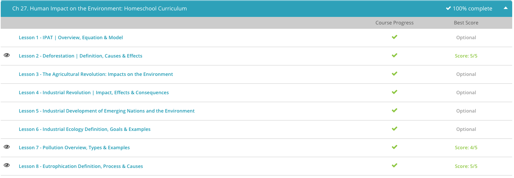

### Andrew Garber

### AP Environmental Science

### Chapter 27: Human Impact on the Environment

#### 27.2: Deforestation

    - Deforestation is the term that describes the cutting down or clearing of trees from a wooded area. There are a number of reasons woodlands or forests are cut down. In some cases, the trees themselves are the desired resource. Trees have been a source of fuel for many generations and continue to be used in this way today. They are also turned into timber for use in building and carpentry, as well as used in the production of paper products.
    - In other cases, trees are cleared because they are in the way of progress. Forests may be cleared to make room for farmland or for grazing land for cattle, or they may be removed to make room for new houses, neighborhoods or expanding cities. Some deforestation is not intentional and can result due to natural causes, such as wildfires.
    - Regardless of the cause, deforestation can be detrimental to the environment. A forest acts as a carbon sink because it absorbs carbon dioxide from the atmosphere during the process of photosynthesis. When trees are destroyed, they release their stored carbon dioxide back into the atmosphere, which contributes to the greenhouse effect. The greenhouse effect is the phenomenon whereby atmospheric gases, like carbon dioxide, trap the sun's heat, causing the earth's surface to warm.
    - Tree roots absorb water from the ground and return water vapor back to the atmosphere. If trees are removed and can no longer contribute to the water cycle, the previously forested land can transform into a much drier climate. This dry environment can spread due to a decrease in atmospheric water vapor and results in a decline in precipitation levels in the area.
    - These factors all combine to create a warmer and drier climate and may result in desertification, which is the transformation of once fertile land into desert. Deforestation is not the only cause of desertification. Land can turn dry and barren due to drought, shifts in the climate or aggressive agricultural or grazing practices.
    - It's easy to see that deforestation and desertification have many detrimental effects on the environment, but one of the most devastating impacts is on the loss of biodiversity. Biodiversity, or biological diversity, is the variability of life forms within a given ecosystem. This is an easy term to recall if you remember that the word 'bio' refers to 'life' and the word 'diversity' refers to 'variety.' So, the term 'biodiversity' literally means a variety of life forms.
    - Forests support biodiversity by providing natural habitats for various plants and animals. Forests, and especially tropical rainforests, provide some of the greatest areas of biodiversity on the planet, and a decline in these environments means a decline in biodiversity.
    - Biodiversity is important for the proper functioning of all types of ecosystems and plays a role in recycling nutrients and providing healthy soil. A biologically diverse ecosystem is a stable ecological community, but if this diversity is compromised, by such things as deforestation, the natural balance of the ecosystem is disrupted. This leads to the loss of habitats for many lesser species.

#### 27.7: Pollution

    - A pollutant is a substance that pollutes the air, water or land. This term is used to describe things in the environment that do not belong. In a broader sense, the term 'pollutant' has even been used to describe undesirable levels of sound or light. For example, the lights and never-ending traffic noise on the Las Vegas Strip are examples of light and noise pollutants. Pollution is the presence of a pollutant in the environment and is often the result of human actions. Pollution has a detrimental effect on the environment. Animals, fish and other aquatic life, plants and humans all suffer when pollution is not controlled.
    - Of the different types of pollution, physical pollution may be the most recognizable. Simply stated, physical pollution is the introduction of discarded materials into the environment. Physical pollution is what you might refer to as trash and is the direct result of human actions. In other words, nature does not produce physical pollution because in natural systems, all byproducts or wastes are eventually recycled back into the environment. For example, in nature, a fallen tree will degrade and eventually return nutrients to the soil.
    - However, physical pollutants, such as discarded water bottles and plastic bags along with waste materials from industrial or manufacturing processes, do not naturally degrade and can accumulate or leach chemicals into the ground or water supplies as they breakdown. Physical pollutants are often sent to landfills, which are designated areas for trash disposal in which the waste is dumped and then covered by soil.
    - Chemical pollution is another type of pollution. It is defined as the introduction of chemicals into the environment. Chemicals may not be seen by the naked eye, but they can cause problems in all areas of the environment, from the air we breathe to the freshwater we drink to the soil we use for growing crops.
    - Agricultural practices are one example of a chemical pollution source. Pesticides used to control insects and fertilizers used to make soil more fertile contain nitrogen, phosphorus and other chemicals. These chemicals can run off of a farmer's field and enter waterways. Nitrogen and phosphorus fertilize tiny plant life in the body of water, causing rapid growth and eventually depleting oxygen levels in the water to the point where fish and other species of life cannot survive. Chemical pollution from pesticides and fertilizers can also contaminate soil if used in excess. Other sources of soil contamination include the leaking of chemicals from mines and landfills. Chemical pollution is also seen in the air. The burning of fossil fuels, such as coal, oil and natural gas, release chemical pollutants into the atmosphere. These fossil fuels may be used in our vehicles or by utilities or industries. These chemical pollutants are referred to as greenhouse gases, which are gases in the atmosphere that absorb infrared radiation and trap heat.
    - Up to this point, we have looked at pollution caused by non-living materials or chemicals. However, biological pollution is the introduction of living organisms, which grow and become invasive, into the environment. Like physical and chemical pollution, biological pollution is mainly due to human interference. Not all foreign organisms will thrive in a new environment; however, biological pollutants not only thrive but they adapt to their new surroundings, multiply and spread at a rapid rate.
    - This can choke out native species. For this reason, biological pollutants are sometimes referred to as invasive alien species or invasive exotic pests. Some microorganisms, such as bacteria, viruses or fungi that contaminate water or lead to human disease, are examples of biological pollution.

#### 27.8: Eutrophication

    - Eutrophication is the process by which a body of water becomes overly enriched by nutrients. You can recall this term by remembering that the word 'eutrophic' comes from the Greek language and means well-nourished. Therefore, a body of water that has undergone eutrophication is a 'well-nourished' lake.
    - While it might sound like a good thing to have extra nutrients added to water, eutrophication typically has a detrimental effect. An overabundance of nutrients stimulates the rapid growth of algae and aquatic plant life. This excessive growth depletes dissolved oxygen levels within the water to a point where other organisms, such as fish, cannot survive.
    - The problem is intensified when these large collections of algae die and begin to decay. The bacteria that decompose the dead algae require oxygen, which consumes even more dissolved oxygen in the water, essentially suffocating other organisms. Dissolved oxygen is the amount of oxygen contained in a body of water. It is an important indicator of the health of a water body and its ability to support a diverse balance of aquatic organisms.
    - When eutrophication occurs, a body of water can undergo explosive growth of algae at or near the surface of the water, referred to as algal blooms. When algal blooms are dense, they form visible green or yellowish-brown coverings that appear to float on the water surface. This blocks sunlight that is needed by organisms in the water and further depletes oxygen.
    - Agricultural fertilizers are one of the main human causes of eutrophication. Fertilizers, used in farming to make soil more fertile, contain nitrogen and phosphorus. The use, or overuse, of fertilizers can cause these nutrients to runoff of the farmer's field and enter waterways. The same fertilizers that were intended to enhance crop growth now enhance the growth of algae and aquatic plants. Fertilizer runoff can occur from other sources, including lawns and golf courses, but agricultural practices are a main source of nutrient pollution.
    - Sewage contains both organic and inorganic nutrients that can find their way into bodies of water. Biochemical oxygen demand or B.O.D. is a concept that is important to sewage treatment. It is defined as a measure of the amount of oxygen required by aerobic microorganisms to decompose organic matter in water. Bacteria and other aerobic microorganisms use oxygen to metabolize organic matter, such as sewage. If sewage enters a body of water, microorganisms in the water begin to consume the organic matter and deplete dissolved oxygen.

