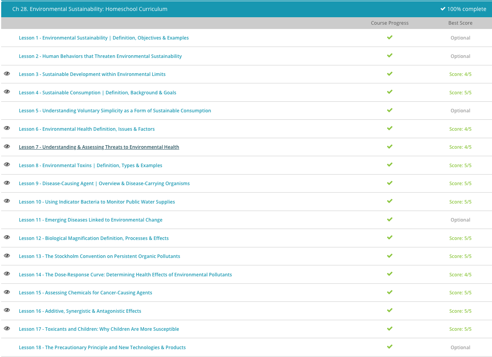

### Andrew Garber

### AP Environmental Science

### Chapter 28: Environmental Sustainability

#### 28.3: Sustainable Development

    - The World Commission on Environment and Development came out with a report in 1987 called 'Our Common Future.' This report is often referred to as the 'Brundtland Report' and is credited with coining the term 'sustainable development,' which is defined as development that meets the needs of the present without compromising the ability of future generations to meet their own needs.
    - This sounds like a very responsible concept. Most people want to preserve all that is good in the natural environment, so their children and grandchildren can benefit from its rich resources. This also sounds like a very simple concept. If each human being only uses what he or she needs for survival, then the natural environment can keep giving back, and essentially humans and the environment can live in harmony for many generations to come.
    - However, the concept gets muddied when we consider the fact that life is not only about survival. There are economic and social needs that must be met and these needs impact the environment's ability to sustain itself. For example, if we look at the economy, we see that it is dependent on society for things such as labor and a market to exchange goods and services.
    - However, due to increasing social and economic demands, there are ever increasing demands placed on the environment that are stretching the environmental limits of our planet. Environmental limits can be defined as the point beyond which the environment exceeds its ability to provide essential resources.
    - An increasing demand that pushes the environment to its limit is the growing world population. The steadily increasing number of people that inhabit planet Earth presents a growing demand for goods and services from industry and business. This, in turn, leads to the depletion of natural resources and an increase in pollution, making it more difficult for the natural environment to sustain itself.
    - The growing population also demands more land be cleared to make room for living area and farmland. This results in an altering of previously undisturbed land, such as forests and wetlands. Forests are important ecosystems that provide habitats for biologically diverse plants and animals. Forests also play a role in the water cycle and climate stability. Wetlands are natural water filtration systems that remove pollutants flowing through them and provide humans with freshwater. When we go beyond these limits, we are not only harming the environment, but we are also harming ourselves.
    - It is also important to note that these limits aren't fixed, they can grow based on technology and human ingenuity. For example, the development of new technologies that allow us to use resources more efficiently can help us to stretch the limits of the environment.

#### 28.4: Sustainable Consumption

    - Sustainable consumption is the use of products and services in a way that minimizes the impact on the environment, so that human needs can be met not only in the present but also for future generations. When sustainable consumption is practiced, resources are used wisely and waste products and pollution are minimized. The main way this is achieved is by doing more and better with less. In other words, we can find ways to meet our needs and desires without depleting our planet's finite natural resources.
    - This might include carpooling, using renewable energy sources, such as solar or wind power, developing alternative fuel sources, such as biofuels, for our transportation needs and using environmentally friendly cleaning products. Practicing sustainable consumption can ensure that the environment has resources available long into the future. However, in most industrialized and developed nations, consumption patterns are not sustainable.
    - Their products and services rely on too many natural resources and create too many harmful emissions when consumed. For example, most developed countries rely on non-renewable fossil fuels for their transportation needs. As more drivers hit the roads and more fuel is consumed, fossil fuel reserves are depleted, and because fossil fuels emit greenhouse gases into the atmosphere when they are burned, more consumption means more pollution. This level of consumption cannot be sustained due to the depletion of the non-renewable resource and the adverse effects to the environment. Of course, unsustainable consumption patterns are not just a problem for developed countries, but also for many developing countries.
    - In developing nations, consumption patterns can be unsustainable because citizens of these countries may need to exploit their natural resources to meet their basic living needs. For example, subsistence farming, which is farming that provides only for the farmer's needs without surplus for the market, requires the clearing of woodlands to make room for farms and is one of the leading causes of deforestation. This can lead to environmental damage, such as soil erosion, drier climates and higher levels of carbon dioxide in the atmosphere.
    - "We see that there are many complexities of sustainable consumption that need to be considered. For example, the consumption of goods drives a strong economy. However, unsustainable consumption patterns degrade the environment, deplete natural resources and hamper the ability of future generations to provide for their basic needs. Therefore, the goals of economic growth may conflict with the goals of sustainable consumption.'" - Study.com. This is only half true, economic growth is intrinsically linked to human well-being - Sustainability is a function of technology being applied to the environment, not a function of limiting economic growth.

#### 28.6: Environmental Health Definition

    - Environmental health involves understanding the impacts of environmental and human-made hazards and protecting human health and ecological systems against these hazards. This includes studying the impacts of human-made chemicals on wildlife or human health, as well as how the environment influences the spread of diseases.
    - Physical hazards are physical processes that occur naturally in the environment. These include natural disaster events such as earthquakes, tornadoes, volcanoes, blizzards, landslides, and droughts. Not all physical hazards are discrete events - some are ongoing, like ultraviolet radiation. UV radiation is considered a hazard because it damages DNA and can cause human health issues like skin cancer and cataracts.
    - Chemical hazards can be both natural and human-made chemicals in the environment. Human-made chemical hazards include many of the synthetic chemicals we produce, like disinfectants, pesticides and plastics. Some chemical hazards occur naturally in the environment, like the heavy metals lead and mercury. Some organisms even produce natural chemicals that are an environmental hazard, such as the compounds in peanuts and dairy that cause allergic reactions in humans.
    - Biological hazards come from ecological interactions between organisms. Viruses, bacterial infections, malaria, and tuberculosis are all examples of biological hazards. When these pathogens and diseases are transferred between organisms, it's called an infectious disease. We suffer from these diseases and pathogens because we're being parasitized by another organism, which, while hazardous, is also a natural process.
    - Cultural hazards, also known as social hazards, result from your location, socioeconomic status, occupation, and behavioral choices. For example, smoking cigarettes is hazardous to your health, and this is a behavioral choice. If you live in a neighborhood with lots of crime, this is a hazard based on your location. Similarly, your diet, exercise habits, and primary mode of transportation all influence your health and the health of the environment around you.
    - As you can see, environmental hazards can come from a variety of sources. While many hazards come from outdoor sources, indoor sources are especially important to understand because we spend so much of our time inside. Your home, office, and car are all part of your environment, and can all be sources of environmental hazards.
    - For example, radon gas is a very toxic indoor hazard. Radon is a colorless and odorless radioactive gas that seeps into homes from rocks, soil and water underneath. It is the second leading cause of lung cancer in the U.S., coming in just behind tobacco smoke.
    - Lead is another indoor environmental hazard. Lead is a toxic heavy metal that can cause damage to major organs like your brain, liver, kidneys and stomach. Lead is found in homes in old pipes and paint. When water passes through lead pipes, it contaminates the water and causes lead poising. Lead in paint is especially dangerous to children because babies and young children like to peel paint from walls and then eat or inhale the lead from the paint.

#### 28.7. Understanding and Assessing Threats to Environmental Health

    - When understanding environmental health, it's important to determine which substances and activities are most dangerous and which are safe. This is done through risk assessment, which is the measurement and comparison of the risk involved in an activity or substance. What this means is that problems are identified and then compared with the risk of other similar activities or substances. Risk assessment involves a number of different processes that all work together to determine the overall risk. Let's look at assessing risk for a chemical substance as an example.
    - In another lesson, we learned about the dose-response curve, which involves controlled laboratory experiments to understand the toxicity and effects of a substance. The tests involved in a dose-response study tell scientists how toxic a substance is, what effects it has on the organism and how much of the substance causes these effects.
    - Dose-response experiments are done on lab animals, so the information that scientists get from them have to be extrapolated to human-sized levels, which allows for safety standards to be set. The risk assessment from dose-response studies also takes into account how likely exposure is for a certain population, how often the exposure would be, the concentration of the exposure and the length of exposure time. So, in other words, for any given population the when, where, how much, how often and how long all goes into determining how risky an activity or substance is.
    - Epidemiology is a large-scale comparison among groups of people to determine causes, effects, and patterns in human disease. Epidemiological studies compare groups of people who have been exposed to a certain hazard to a group of people that has had no exposure. These studies often span long periods of time (some studies are decades long), and over that time, they measure any deaths or other health problems that occur. If there are higher rates of death or illness in the group exposed to the hazard, this tells scientists that the hazard is most likely the cause of the problem.
    - This is much like any other scientific experiment: one group is the control (the non-exposure group) and one is the experimental group (the hazard group). The difference is that epidemiologists do not purposefully expose people to hazards - they simply take advantage of the chance to learn from these exposures and hopefully prevent people from becoming sick in the future.
    - Once risk is assessed, that information has to go somewhere, right? Risk management is the next step, which is the decisions and strategies used to minimize the assessed risk. Risk management is often dealt with by government agencies. For example, in the U.S., we have the Environmental Protection Agency, Centers for Disease Control and Food and Drug Administration to manage risk for environmental threats and human health issues. Risk management is tricky because risk assessment is not the only factor that is considered. Economic, social and political issues also play into management decisions. Costs and benefits on all sides must be weighed, and quite often the benefits are easy to identify but costs may not be so easy to see. Additionally, economic benefits tend to outweigh health costs because they are immediate and easy to quantify.

#### 28.8 Environmental Toxins

    - There's a wide variety of toxicants in the environment. To better understand them, we can put them into specific categories that are based on the types of problems they cause. Carcinogens are probably the best-known toxicant because these are cancer-causing chemicals. Cigarette smoke falls into this category as it contains over 4,000 chemicals, many of which cause cancer.
    - Mutagens are mutation-causing chemicals. When organisms are exposed to a mutagen, it literally mutates their DNA, leading to cancer and other disorders. X-rays are well known mutagens. Teratogens are chemicals that cause harm to unborn babies. The name of this toxicant comes from the Greek word teras, which means monster.
    - These chemicals cause birth defects during development in the womb. Thalidomide was used in the 1950s as a sleeping pill and to prevent nausea during pregnancy, but turned out to be a very harmful teratogen. Even a single dose is powerful enough to cause severe birth defects in children.
    - Allergens are chemicals that stimulate overactivity in the immune system. When you are exposed to allergens, your body goes into overdrive, triggering an immune response to try and get rid of the allergen. This is why pollen and dust cause symptoms that are similar to being sick.
    - Neurotoxins are chemicals that attack the nervous system. These include heavy metals, like lead and mercury, as well as pesticides and chemical weapons. Neurotoxins can lead to symptoms like slurred speech, loss of muscle control and even death.
    - Endocrine disrupters are chemicals that disrupt the endocrine system in organisms and most often come from prescription drugs and chemicals in plastics. The endocrine system is also known as the hormone system, and this part of your body is what regulates growth, development, sexual maturity, brain function and even appetite.
    - We are surrounded by synthetic chemicals and encounter them countless times on a daily basis. Plastics, household cleaners, solvents, detergents, cosmetics and perfumes are all toxicants. So are antibiotics, prescription drugs, steroids, food additives, preservatives and other things we ingest. Pesticides, herbicides and fertilizers are also toxicants.
    - Though toxicants come from many sources, they tend to move through the environment in certain ways. Toxicants may find their way into aquatic systems as they get carried away by runoff from large areas of land. Because the water systems are smaller than the land that supplied the contaminants, the toxicants tend to get concentrated in the water.
    - Once in surface water, toxicants can leach down into groundwater and contaminate sources of drinking water. Many chemicals are quite water-soluble, which means that they are easily dissolved by water. Because most organisms need water, this also means that we are most susceptible to these toxicants.

#### 28.9. Disease Causing Agents

    - Diseases, which are any illness-causing conditions that affect an organism's body, are transmitted by disease-causing agents, which are biological pathogens that cause or spread disease. Disease-causing agents are delivered to your body through various carriers, and they can get inside in all sorts of ways. The disease is worrisome, but the disease-causing agent is just as problematic because it is what actually transports the disease that makes you sick.
    - Viruses are the disease-causing agent that most people are familiar with. They cause colds, the flu, HIV, meningitis, polio, chicken pox, rabies, West Nile, and a number of other diseases. Viruses themselves aren't living things, but they do get transmitted between living organisms.
    - Viruses can often be controlled by vaccines, which are exposures to an inert version of the virus or a safe agent that resembles the virus. This allows your body to build up that immune response before you ever get the virus, so that instead of getting sick first, you already have your army ready to fight ahead of time.
    - Bacteria get a bad rap. Many people confuse bacteria for viruses, and in fact, most of the bacteria that you come in contact with are either not harmful or actually provide some health benefits to you. You are literally covered with good bacteria, both inside and outside your body. Your digestive system wouldn't be able to function properly without the numerous types of bacteria that help break down and absorb the nutrients in all the foods you eat.
    - There are, of course, some bad bacteria and these can be quite dangerous. In contrast to viruses, bacteria are living organisms, but they are usually made up of just one cell. Bacteria are especially hard to control because they are extremely prolific - they can multiply into colonies of millions and billions of organisms in a very short amount of time
    - antibiotics are used to kill bacteria, but bacteria can develop resistance to antibiotics, which is why it's important to take antibiotics only when you really need them. Overuse of antibiotics can lead to antibiotic-resistant bacteria, which are much harder to kill. This is why you should always take the full course of antibiotics prescribed to you, even if you start feeling better before you finish the prescription.
    - Protozoa are also small, unicellular organisms. They can live in all different types of environments and are able to move around really well. They are parasitic, which means that they live and feed off of a host organism.
    - Amoebas and sleeping sickness are examples of diseases caused by protozoa, as well as some common gastrointestinal ailments. Amoebas are actually a type of protozoa, but we use the term to describe disease caused by them as well. Protozoa are sneaky little guys because they can slip into your body through food, water, or skin contact.
    - Parasitic worms are definitely not the wonderful worms you have in your garden! Parasitic worms are dangerous parasites like hookworm, tapeworm, roundworm, and heartworm. Interestingly, ringworm isn't actually a worm - it's a fungal infection on your skin, and it gets its name from the round-shaped ring that appears on the skin (which looks like a worm).

#### 28.10 Indicator Bacteria

    - Bacteria sure do get a bad rap! Anti-bacterial hand cleaners, antibiotics, and other treatments are all designed to get rid of these microscopic organisms that come in all shapes and colors.
    - But actually, most bacteria are either harmless or beneficial to you! Just to name a few ways they help, beneficial bacteria keep harmful agents from getting through your skin to other organs, digest food in your stomach and intestines, help you absorb vitamins and minerals from your food, break down dangerous substances that get in your body, and fight disease. E. coli is one such beneficial bacterium. E. coli is found in your colon, and it helps you absorb nutrients from your digested food that you can't take up on your own.
    - E. coli is just one of many indicator bacteria, which tell us if fecal contamination has occurred in a water supply. Indicator bacteria are for the most part harmless, but we test for them because if contamination has occurred, there is a good chance that bacteria that are harmful are present in the water supply as well.
    - There are many different types of indicator bacteria. We've already talked about E. coli, which lives in your colon. Others include the total coliforms, fecal coliforms, fecal streptococci, and enterococci.
    - These occur naturally in many animals and humans, and as mentioned before, they serve beneficial roles for us. Because they live in your gut, they often come out with fecal matter, so you can tell if fecal matter has gotten into the water supply by testing for these indicator bacteria.
    - However, fecal matter may also contain other harmful bacteria and pathogens. Typhoid fever, giardia, salmonella, and hepatitis A are all waterborne diseases, which means they travel through water bodies. These are harmful to both humans and animals and thrive in the same environment as the harmless indicator bacteria - your gut! So, if indicator bacteria are present, there's a good chance that other, more harmful bacteria are as well.

#### 28.12 Biological Magnification

    - Toxicants break down at different rates, and the ones that are persistent in the environment are the most dangerous. Persistent toxicants are those that resist breaking down in the presence of environmental factors, like sunlight, temperature, and moisture.
    - Persistent toxicants can be natural or human-made and are found in all sorts of things, from cosmetics to plastics to household cleaners to pesticides and more.
    - Some persistent toxicants are especially dangerous because they not only persist in the environment, but also build up in animal tissue as they are inhaled or ingested. This process is called bioaccumulation. DDT is one such toxicant as it is absorbed and stored by fatty tissue. Other toxicants may build up in muscle or bone.
    - Toxicants that bioaccumulate are easily transferred to other organisms as they move up the food chain. When one organisms eats another, it eats all of the toxicants that are stored in the muscle, fat, and bone of its prey. The predator then takes these toxicants into its own tissues, as well as those of all the other prey items it eats. So, with each step up the food chain, we get biomagnification, the magnification of toxicant concentrations.
    - Let's look at how this works using the birds of prey in North America. DDT is sprayed liberally and gets into the water supply either through runoff or through seeping into groundwater. The DDT in the water is then taken up by algae, which are eaten by tiny organisms in the water called zooplankton. Small fish eat millions of these tiny zooplankton and are therefore eating a higher concentration of stored DDT. Larger fish eat many smaller fish, also increasing the amount of DDT that gets stored in their bodies. Finally, a large predatory bird (such as our bald eagle) comes along and eats the large fish, which ate the smaller fish, which ate the zooplankton, which ate the algae, which initially absorbed the DDT.
    - So, you can see that even though the birds of prey were not in direct contact with DDT, they ingested a large amount of it because they didn't eat just that large fish - they ate everything that came before that large fish through the food chain! The soft eggs of the falcons, eagles, osprey, and other birds of prey were therefore the result of biomagnification because the concentration of DDT increased as it moved up the food chain.

#### 28.13. Persistent Organic Pollutants

    - In 1985, Dr. Louis Guillette became concerned. He was studying alligators in Lake Apopka, which is just outside of Orlando, Florida. He noticed some startling issues with the alligators, such as females not producing viable eggs, depressed levels of testosterone in baby males, and extremely high levels of estrogen in baby females.
    - Dr. Guillette and his team soon determined that the hormonal changes in the baby alligators were due to a pesticide spill in Lake Apopka in 1980. These pesticides turned out to be persistent organic pollutants, also known as POPs, which are toxicants that remain in the environment for long periods of time. POPs include chemicals such as PCBs and DDT. POPs can be especially dangerous when they accumulate in animal tissue because they then move up the food chain, becoming more concentrated as they go.
    = POPs can have lingering effects for many years and can accumulate thousands of miles from where they originated. Polar bears in remote polar regions have shown some of the highest levels of POP contaminants, despite being in areas far from where the POPs were manufactured and applied. Even as long as ten years after the pesticide spill, the alligator hatchlings in Lake Apopka were still much smaller than those in surrounding lakes that were not polluted and were still showing abnormalities in their hormonal development.
    - Because POPs are so dangerous to such a wide range of organisms, international action was taken in 2001. The Stockholm Convention on Persistent Organic Pollutants was created in this year and was an international treaty designed to address transboundary pollution.
    - It's important to keep in mind that just because chemicals have been outlined in the Stockholm Convention, doesn't mean that their use has stopped. For example, the U.S. banned domestic DDT use in 1972, but continues to manufacture it and sell it to other countries that haven't banned its use. The Stockholm Convention doesn't end with the Dirty Dozen--the twelve first ones--either. These were the first major POPs identified, but there are provisions in the treaty that allow new POPs to be identified as they become known. This is called the adding mechanism because it allows new POPs to be added to the treaty as they're identified.

#### 28.14 Dose-Response

    - Toxicologists will administer a dose, or amount of toxicant the animal receives, and then measure the response, which is the type and magnitude of negative effects the animal shows from the dose.
    - This process is repeated over and over, and then the percentage of animals exhibiting negative effects from the dose is plotted on a graph. Since the dose is being specifically manipulated in the experiment, it is on the X-axis; therefore, response is on the Y-axis. The curve that results from these experiments is called a dose-response curve.
    - The dose-response curve is important because it provides scientists with a quick way to describe the toxicity of a substance. They do this by identifying the amount of toxicant it takes to kill half of the animals used in the study. Because this is a lethal dose for 50% of the population, it is called the LD50. Low toxicity means a high LD50 because it takes a large dose to kill 50% of the population. Likewise, high toxicity means a low LD50 because it takes a much smaller amount of toxicant to kill 50% of the study population.
    - In addition to the lethal effects of a toxicant, scientists may also want to identify other non-lethal effects of the substance. When something other than death is studied in a toxicant, it is the effective dose for 50% of the population, or the ED50. Effective dose responses may be things like: what dose of the toxicant causes 50% of the study animals to lose their hair, or what dose of the toxicant causes nervous system malfunction in 50% of the study population?
    - Though testing for different responses, the same is true for both lethal-dose tests and effective-dose tests: results from low doses (low LD50 s or ED50 s) indicate a high toxicity because a lower dose is needed to elicit a response. When higher doses are needed, this indicates a low toxicity of the substance because it takes more to get the desired result.
    - A threshold is like a dividing line. Think of the threshold of your house. When you are on one side of the threshold, you are outside. Once you step over the threshold into your house, you are now inside. It separates one situation from the other, and it's pretty black and white.
    - Toxicologists sometimes find that a toxicant has a threshold dose, the minimum amount needed for a response to occur. This happens in your body. Your organs can excrete some toxicants at low doses but after a certain level become overwhelmed and can no longer do it. Likewise, if your cells can only repair DNA to a certain point and a toxicant damages DNA beyond this point, this would be the threshold dose. With a threshold dose, there is no response until a certain threshold has been reached. At this point, there is a sharp change in the effect. You can see this on the graph below because the response is '0' and runs along the X-axis as such until it hits the threshold dose and then skyrockets.
    - 
    - Toxicologists give lab animals much higher doses (relative to their body size) than we would receive in nature. This allows for two important things: 1) the response is great enough to be measured; and 2) the differences between low and high doses can be clearly seen.
    - For any given toxicant, multiple dose-response experiments are performed in order to generate an accurate dose-response curve. Scientists then extrapolate the data to estimate what effects these toxicants have on humans. However, because these are not actual tested results, they are not entirely precise estimates. Therefore, maximum allowable levels of toxicants are set far below the minimum toxicity levels generated from these studies to account for any error.
    - Dose-response curves come in many shapes. It's critical to know the full effects of various doses of a toxicant because some responses decrease as dose increases. Some curves are U- or J-shaped, indicating that low doses can be very dangerous.

#### 28.15 Assessing Chemicals for Cancer-Causing Agents

    - Cancer comes in many different forms and does not discriminate between age, gender or race. Cancer-causing agents are called carcinogens and come from about as many different sources as there are types of cancer. In order to prevent and treat cancer, scientists need to first understand the sources of carcinogens, as well as what makes them cancer-causing agents.
    - The uncontrolled cell growth of cancer occurs because of some change in your DNA, which is like a set of instructions for your body. If your DNA can't tell your cells to stop growing, then they will just keep growing, and this is exactly what carcinogens do. They get in there, and they screw up your body's instructions by mutating your DNA. Carcinogens come from our environment, and we are surrounded by them all the time. Some carcinogens are from direct sources - like x-ray radiation and tobacco smoke. Tobacco smoke is especially dangerous because it contains over 4,000 chemicals, many of which cause cancer.
    - Other carcinogens may be difficult to identify because they are only carcinogenic once they have reacted with other chemicals. Dioxins fall into this category, and these chemicals are found in wood preservatives, insecticides and from paper bleaching and electrical fires. Some carcinogens come from natural sources, such as plants. Aflatoxins are carcinogens that are naturally produced by fungi growing on food. Fungi that produce aflatoxins are most often found growing on grains, peanuts, meat and dairy products. UV radiation from sunlight is another natural carcinogen. UV radiation mutates your DNA and causes skin cancer and cataracts.
    - The list of known carcinogens is a long one, but it wasn't developed by accident. Scientists determine whether a chemical or substance is carcinogenic in three main ways. The first is human studies. What better way to understand the effects of chemicals on our bodies than to study the effects of chemicals on our bodies?
    - Epidemiologists study large-scale comparisons of groups of people to determine causes, effects and patterns in human disease. Epidemiological studies are much like other scientific experiments. One group of people is the control (non-exposure group), and the other is the experimental group. The difference is that instead of purposefully exposing people to chemicals to see if they cause cancer, epidemiologists simply take advantage of the chance to learn from exposures that have already occurred. For example, epidemiologists study cigarette smokers and non-cigarette smokers to determine what kinds of cancer tobacco smoke causes and how much more likely smokers are than non-smokers to get cancer from cigarettes.

#### 28.16 Additive, Synergistic, Antagonistic Effects

    - Additive effects are just what they sound like - the sum of the effects of the chemicals involved in the reaction. This usually occurs with chemicals that are similar in structure, so they work well as a team - kind of like a superhero and a sidekick.
    - The sum of the additive effects is what you would expect if you were exposed to each chemical individually. An example of an additive interaction would be taking both aspirin and acetaminophen, which is the active ingredient in drugs like Tylenol. If you take both together, you get the total effect of both pain-killing drugs on your body. Synergistic effects are when the sum of the effects is more than each chemical individually. This can create dangerous situations because each chemical is designed to work well on its own.
    - This is like two strong people pulling together, they can pull a lot more than individually.
    - Antagonistic effects are when the net effect of the chemical reaction is zero. This is two strong people pulling against each other, so they don't get anywhere(they almost entirely cancel each other out).
    - There is one more less-common type of interaction called potentiating effects. This is when one chemical enhances the effect of another chemical. Some chemicals are not toxic on their own, but when they are in the presence of some other chemicals, they become toxic.

#### 28.17 Toxicants and Children

    - We think of children as small versions of adults, so it may also make sense to think of them as being at a lower risk to toxicants and other harmful substances. However, quite the opposite is true. Children are actually more susceptible to toxicants and their effects than adults, mostly because of their small size.
    - Children are so much smaller than adults but still breathe the same air, eat the same foods and drink the same water. This means that they're getting a higher concentration of toxicant for their body weight than adults. Say you ingested a tablespoon of poison and a child ingested the same amount of poison. The effect would be much greater for the child because compared to their body size the amount of poison is much larger. The same is true for pollutants in the air, additives in food and toxicants in drinking water.
    - Children are also much more susceptible to the effects of toxicants because they're still developing both inside and out. Have you ever cut or scraped a part of your body? As it's healing, that part of the skin is soft and sensitive - it's growing back to replace what you damaged. The same is true for children - their bodies are constantly growing and developing and are more like the sensitive healing skin of your injury than the hard, weathered skin around it.
    - Just like the rest of their body, children's immune systems are also not fully developed. As an adult, you have been exposed to numerous threats to your health, and like a well-developed military, your body has built up a defense system against them. Children, however, are like a new country that's still building its army. Their bodies are still learning how to fight disease and may not be able to fight the effects of toxicants as well as adults.
    - Think about where children spend most of their time - near the ground! Babies crawl on the ground (which is where they pick up most of the objects that eventually end up in their mouths), and children are shorter than adults. Toxicants in treated carpets, floors and furniture are therefore much closer to their faces, where they breathe and eat. Toxicants in the air also tend to be closer to the ground, so children are more likely to breathe in polluted air than adults because they're at the same level.
    - Of all children, fetuses in the womb and breastfeeding babies are some of the most susceptible to toxicants. This is not only because of the rapid development their bodies are going through but also because they are exposed to all of the chemicals that the mother has taken in and stored up through her lifetime. Many heavy metals, such as mercury and cobalt, accumulate in human tissue (so once it's in your body it stays there), and these can be passed through fluid in the womb and breast milk. This is why pregnant women are discouraged from eating fish - fish contain high levels of mercury, which can be very dangerous to an unborn baby.

