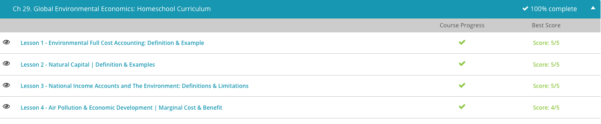

### Andrew Garber

### AP Environmental Science

### Chapter 29: Global Environmental Economics

<!-- My personal objections to some of these aside, I am just taking notes -->

#### 29.1: Environmental Full-Cost Pricing

    - Environmental full cost accounting can be defined as a method of accounting that recognizes the direct and indirect economic, environmental, health and social costs of a project or action.
    - Environmental full cost accounting considers more than just the basic direct costs associated with a project, such as the costs of building supplies, production and distribution. Environmental full cost accounting also factors in indirect costs, including externalities. Externalities are side-effects or costs of an activity that affect otherwise uninvolved parties. While externalities can be positive or negative, the other party does not intend to incur the effects.
    - Therefore, it might help you to remember this term by thinking of an externality as an extra cost that the third-party player did not incur on his own. For example, a coal-burning power plant will emit greenhouse gases that could impose health costs on society. And, the noise that comes from wind power generation could cause sleep disturbances, anxiety and stress in susceptible individuals. These indirect costs are important considerations for a community to examine during the decision-making process.
    - As we see from our example, there are benefits of environmental full cost accounting. For one thing, it aids in the decision-making process by helping interested parties see beyond the direct economic costs of a project and consider the environmental, health and social impact that could be incurred. Environmental full cost accounting also helps educate citizens who will be impacted by a project, and it reveals the best service for the least cost.
    - However, there are challenges of environmental full cost accounting. The biggest challenge is the difficulty estimating environmental and social costs. There is no easy method to accurately calculating the costs of things such as greenhouse gas emissions, noise pollution and deforestation. And, the value of these issues may be further muddied by personal and societal values.

#### 29.2: Natural Capital

    - Natural capital is defined as the land, air, water, living organisms and natural resources of the earth that produce value to people. As we see from this definition, natural capital includes both living resources, such as trees, plants, crops and wildlife, as well as non-living resources, such as coal, oil and natural gas.
    - It is easy to see that the elements of natural capital are essential for human survival. But they are also the foundation of most human economic activities. For example, a country may be rich in oil and have a strong economy because of this natural resource. Of course, if the country exploits its supply of oil and depletes the resource, the country will actually deplete its economic wealth. Therefore, it can be argued that it is in the best interest of countries to assess their natural capital to make better economic decisions.
    - unless it is a command economy, GOVERNMENT'S DO NOT MANAGE ECONOMIC RESOURCES.
    - In economics, the term 'capital' typically refers to wealth in the form of some type of asset. When we put the word 'natural' in front of this term, it simply means an asset obtained from nature. And when we start looking, we see that nature has many economically important assets both seen and unseen. Some components of natural capital that are easily seen include mineral deposits, energy resources, farm land, forest timbers, and fisheries.
    - Other components can be considered 'hidden natural capital.' These components are harder to see and therefore not as easy to assess in terms of economic value. They include air and water filtration, flood protection and maintenance of biodiversity. Let's take a look at an example to better understand how natural capital relates to economics by examining a forest ecosystem. Forests are an important contributor to the economy because they provide timber resources used for construction.
    - This contribution to the economy is easily seen and easy to value. However, a forest also acts as a carbon sink, which is a natural environment that absorbs carbon dioxide from the atmosphere. In addition, forests prevent soil erosion, capture rain water, prevent storm water runoff, provide habitats for many biologically diverse plants and animals, participate as a key element in the water cycle and provide a place for relaxation and recreation.

#### 29.3: Nautral Income Accounts

    - National income accounting was first conceptualized in the 1930s, and its development is credited to Simon Kuznets, who was the 1971 Nobel Prize winner for his work in national income accounting. The original purpose of national income accounting was to provide policymakers with useful information about the economic activity of a nation. It was not meant to be a statement of the nation's overall well-being, even though it is often evaluated in this way.
    - The most widely used measure of national income is Gross Domestic Product, or GDP, which is the market value of all final goods and services produced by a country in a year. GDP measures only the economic aspects of a country's welfare. It does not measure other factors that are important to overall well-being, such as social or environmental aspects. Despite this fact, the GDP is often given a high level of importance when developing public policy.
    - GDP divided by the number of people in the country is the per capita GDP. This is an easy term to recall if you remember that 'per' means 'for each' and 'capita' refers to 'head,' so 'per capita' literally means counting 'each head' or each 'person.'
    - By evaluating per capita GDP, we get more detailed insights into how a country is doing economically. We also get a clearer picture of some of the limitations of national income accounts when evaluating overall well-being. For example, if per capita GDP goes up, but its rise is due to the fact that people are forced to work longer hours, this does not indicate that the citizens of the country are better off. So we see that national income accounts fall short of providing a broad measurement of the society's well-being.
    - And if the GDP is the most important focus for a nation, policymakers may overlook the importance of environmental protection. The result could be that environmental destruction and the depletion of natural resources may be allowed to happen to boost GDP and create a better showing economically. For example, if a developing country rapidly cuts down forests to sell the timbers or expand agriculture, the national income accounts will record the value of the timbers and agricultural products in the plus column of that nation's GDP.

#### 29.4. Air Pollution and Economic Development

    - Air pollution is frequently cited as a negative externality in a free market economy that the market cannot adequately address. This is because the costs of air pollution are not included in the price of the goods and services that produce the pollution, so no economic incentive exists to reduce the pollution.
    - I am skeptical of this view, as voters in states(across the world, and within nations) do not vote--a direct method of enacting change--for candidates who promise to reduce pollution. West Virginia, for example, is a state that has been heavily polluted by coal mining, but the state has consistently voted for candidates who promise to protect the coal industry.

