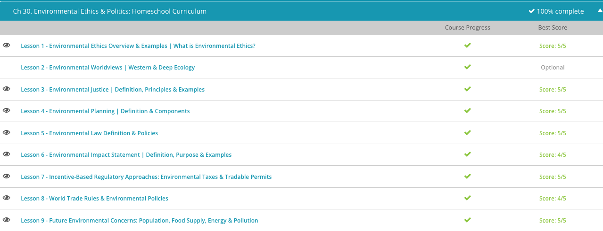

### Andrew Garber

### AP Environmental Science

### Chapter 30: Environmental Ethics

<!-- Putting aside my objections here and just taking notes as Study.com says - my objections to *some* of these points do not change the answers on the quizzes, unfortunately. -->

#### 30.1 Environmental Ethics

    - Environmental ethics is the philosophical discipline that considers the moral and ethical relationship of human beings to the environment. In other words: what, if any, moral obligation does man have to the preservation and care of the non-human world?
    - While ethical issues concerning the environment have been debated for centuries, environmental ethics did not emerge as a philosophical discipline until the 1970s. Its emergence was the result of increased awareness of how the rapidly growing world population was impacting the environment as well as the environmental consequences that came with the growing use of pesticides, technology, and industry.
    - Environmental ethics helps define man's moral and ethical obligations toward the environment. But human values become a factor when looking at environmental ethics. Human values are the things that are important to individuals that they then use to evaluate actions or events. In other words, humans assign value to certain things and then use this assigned value to make decisions about whether something is right or wrong. Human values are unique to each individual because not everyone places the same importance on each element of life. For example, a person living in poverty in an undeveloped country may find it morally acceptable to cut down the forest to make room for a farm where he can grow food for his family. However, a person in a developed country may find this action morally unacceptable because the destruction of forests increases carbon dioxide emissions into the atmosphere, which can negatively impact the environment.
    - Environmental ethics, along with human values, make for challenging philosophical debates about man's interaction with the environment. Water and air pollution, the depletion of natural resources, loss of biodiversity, destruction of ecosystems, and global climate change are all part of the environmental ethics debate. And we see that within the discipline of environmental ethics there are tough ethical decisions humans must consider.
    - Ethical debates impact our ability to solve environmental problems because individuals differ on man's obligation concerning the natural environment. Those that place significantly higher value on human interests at the expense of non-human things are said to have an anthropocentric ethical view. This term is easy to recall if you remember that the prefix 'anthropo' means 'human' and the suffix 'centric' means 'centered.' Therefore, the term 'anthropocentric' literally means 'human-centered.' A person with this viewpoint would be more likely to see nature and its resources as things available for man to use. Their exploitation would therefore be acceptable as long as it did not lead to negative consequences for human beings.
    - There is an opposing viewpoint. Those that see the intrinsic value of non-human things regardless of their usefulness to man are said to have an ecocentric ethical view. This term is also easy to recall if you remember that the prefix 'eco' refers to nature. Combined with 'centered,' which we get from the suffix of this word, we see that the term 'ecocentric' literally means 'nature-centered.' A person with an ecocentric viewpoint would be more likely to see elements of nature such as trees, animals, and plants as having value in-and-of themselves simply because they are part of an ecological community. Therefore, these resources should not be consumed or destroyed without regarding their value within nature. With viewpoints as widely separated as these, we see that debates over how the environment is to be cared for will continue, and even though the field of environmental ethics is young, it is here to stay.
    - I come down on the side of anthropocentrism. I believe that, as far as we can tell, humans are the greatest species to ever exist in the universe. Maximizing human happiness and well-being should be our primary goal.

#### 30.3 Environmental Justice

    - The United States Environmental Protection Agency defines environmental justice as the fair treatment and meaningful involvement of all people regardless of race, color, national origin, or income with respect to the development, implementation, and enforcement of environmental laws, regulations, and policies. In other words, your health should not suffer because of the environment where you live, work, play or learn.
    - The concept of environmental justice began as a movement in the 1980s due to the realization that a disproportionate number of polluting industries, power plants, and waste disposal areas were located near low-income communities or communities that have a primary minority population. The movement was set in place to ensure fair distribution of environmental burdens among all people regardless of their background.
    - Examples of environmental burdens that may be considered under the umbrella of environmental justice cover many aspects of community life. These burdens can include any environmental pollutant, hazard or disadvantage that compromises the health of a community or its residents. For instance, one of the environmental justice issues and examples is inadequate access to healthy food. Certain communities often lack supermarkets or other sources of healthy and affordable foods.
    - Another issue is inadequate transportation. While public transportation may be available in urban areas, policies must be monitored to avoid cuts in service and fare hikes that make it difficult for community residents to pursue employment or an adequate living standard.
    - Air and water pollution are major environmental justice issues. Because many lower-income communities or communities with a primary minority population are located near industrial plants or waste disposal sites, air and water quality can suffer if not properly monitored.
    - In 1991, principles of environmental justice were adopted at the First National People of Color Leadership Summit meeting in Washington D.C.
    - These principles are based on two major parts. The first is fair treatment, which states that no person or group should have to carry a majority of the environmental burdens and everyone should have equal protection from environmental hazards. Policies set by government and actions performed by corporate organizations can have a detrimental effect on a community. Fair treatment ensures that no group or community should suffer an unequal portion of negative environmental effects that result from these policies or actions.
    - The second important part of the environmental justice principles is meaningful involvement, which states that everyone has the right to participate as equal partners in decisions about policies and actions that could affect their environmental or personal health. Meaningful involvement is designed to give every individual a voice and encourage full and fair participation by all potentially-impacted members of the community. At the core of the principles of environmental justice is the desire for everyone to be given the same level of protection from environmental hazards and receive equal access to the decision-making process to ensure their concerns are heard.

#### 30.4. Environmental Planning

    - Environmental planning is the process of evaluating how social, political, economic and governing factors affect the natural environment when considering development. The goal of environmental planning is to come up with a win-win situation for society and the environment. With successful environmental planning, society wins by being able to use the area in productive ways, and the environment wins by being able to sustain itself for future generations.
    - There are three components of environmental planning that must be considered. First, is the current status of the natural environment. This component will take into consideration the existing state of the area to be developed. This may include evaluating the existing uses, features and natural resources of the land, as well as existing infrastructure and buildings.
    - The second component of environmental planning is vision. This involves setting goals and measurable objectives and takes into consideration the rules, regulations, laws and needs of society. The third component is implementation. This involves putting the vision into action and considers the materials, personnel and technology that may be needed to carry out the plan.
    - Environmental planning is a complex study because it not only has to consider the complexities of the natural environment but also the needs and desires of humans. Therefore, environmental planners need to understand the human decision-making process to best manage the relationship between humans and the environment. Environmental decision making can be defined as the process of evaluating the ways humans go about making choices that impact the natural environment. How individuals or groups decide to use energy, natural resources and even outdoor recreational areas are all part of the planning process. So, we see that environmental planning and decision making go hand-in-hand, and because human needs and desires change over time, the process must constantly evolve.
    - Hayek's socialist calculation problem is a good example of why environmental planning is so difficult. There are so many variables--many of which are entirely subjective--that it is impossible for a central planner to make the best decisions for society. The best way to manage the environment is to allow individuals to make decisions for themselves.
    - Let's look at a couple of examples of environmental planning and decision making that show how useful the process can be. Let's say that a developer wants to build three homes on a lot that borders a river. Through environmental planning, it is revealed that one of the homes is located within the floodplain. The plan for the home's location is altered to move it out of the floodplain and the original space is used for a community bike path and an area for natural growth. This plan benefits the community and the natural environment.
    - Another example of environmental planning is industrial symbiosis, which is the process by which industries share services, energy and by-products to decrease costs and improve the environment. An environmental planner may evaluate the current status of an industrial park and note that it has a power plant, an oil refinery and a fish farm. From this evaluation, a vision of how these plants could work together is formed.

#### 30.5 Environmental Law

    - Environmental legislation is the collection of laws and regulations pertaining to air quality, water quality, the wilderness, endangered wildlife and other environmental factors. The umbrella of environmental legislation covers many laws and regulations, yet they all work together toward a common goal, which is regulating the interaction between man and the natural world to reduce threats to the environment and increase public health.
    - As you might imagine, environmental legislation is a broad topic, mainly because the natural environment encompasses so many different aspects. So, environmental laws need to consider everything, from the air we breathe to the natural resources we rely on to the plants and animals that share this world with us.
    - To better understand environmental law, let's look at an example. Let's say that an energy company wants to build a coal-burning power plant to create electricity for the community. Where should this power plant be built? What type of pollutants might result from the coal burning, and what measures will need to be taken to control harmful emissions? If the power plant is built at the edge of town to lessen air pollution for the human population, how will this impact lesser species that inhabit the land downwind of the plant? These are all considerations to be evaluated within the scope of environmental law.
    - The official timeline of environmental law in the United States did not start until the 20th century. The United States is regarded as a world leader when it comes to development and application of environmental law, and the 1960s are when the process got started.
    - This time period in U.S. history was marked by a surge in economic and industrial growth. Along with an increase in factories and industrial activities, came a mounting concern about the impact these practices were having on the earth's natural environment. This was also a time when environmentalism, which is a movement toward protecting the natural environment against hazards and pollutants, matured into a public and political force. The new-found awareness and events of the 1960s coalesced to establish the start of environmental legislation.
    - The cornerstone of environmental law is the National Environmental Policy Act (or NEPA). This is the U.S. environmental law that established a nation-wide policy promoting the protection of the environment. This act of 1969 was formed to encourage a harmonious relationship between the nation's citizens and their natural surroundings with the goal of preventing destruction of the environment.
    - The National Environmental Policy Act ensures that matters important to the environment are thoroughly considered in any decisions made by federal agencies. With the act came new procedural requirements for all federal agencies, including an environmental impact statement (or EIS), which is a document required for any actions that may significantly impact the environment. An EIS provides an analysis of the environmental impact of a proposed action - such as a proposal to build a coal-burning electric power plant as we discussed earlier. An environmental impact statement may also propose alternative actions to aid in the decision process and ensures that the goals of the National Environmental Policy Act are being followed.

#### 30.6 Environmental Impact Statement

    - In the 1960s, there was a growing concern among U.S. citizens over damage to the environment caused by increases in industrial and manufacturing activities, as well as increased building of infrastructure, such as roads, bridges and power plants. These concerns culminated into an environmental law called the National Environmental Policy Act, or NEPA. The NEPA is the U.S. environmental law that established a nationwide policy promoting the protection of the environment. The National Environmental Policy Act ensures that concerns about environmental issues, such as water or air pollution, soil erosion and loss of natural habitats, are thoroughly considered in any decision-making processes.
    - To meet NEPA requirements, federal agencies prepare an Environmental Impact Statement, or EIS, which is a document required for any action that may significantly impact the environment. An EIS provides a detailed statement outlining any potential environmental impact, whether it be positive or negative, for a proposed action, such as the building of an airport, the expansion of a mining operation or drilling for natural gas.
    - In other words, before any federally controlled project is given the right to start construction or operation, a detailed EIS must be completed that not only takes into consideration the environmental impact of the proposed action but also presents any alternatives to those actions.
    - The EIS is submitted to the Environmental Protection Agency, or EPA, which is an independent federal agency that works to reduce pollution and protect the environment. The EPA reviews and comments on the EIS, ensuring that the goals of the National Environmental Policy Act (NEPA) are met. A database of all filed EISs is maintained by the EPA.
    - The National Environmental Policy Act requires an EIS for any project or action that is federally controlled and has the potential to significantly impact the environment. This would include projects that are federally funded or require a federal license.
    - The environmental impact statement must discuss all aspects that could potentially impact the environment. This would include indirect effects of a project. For example, if a forest is cut down to make room for a hydropower plant, how could the economy and health of the local population be indirectly affected? Other considerations that must go into the preparation of an EIS include how the proposed project might interfere with other activities, the energy and resource demands of the project and how to preserve historic and cultural qualities of the surrounding area.
    - These have become a standard part of the NIMBY playbook far more often than they are actually useful. They are often used to delay or stop projects that would be beneficial to society as a whole, but instead rent-seekers use them to extract rents from the rest of society.

#### 30.7: Incentive-Based Regulatory Approaches

    - When you get right down to it, there are two ways to motivate people to change their ways. You can set a rule or limitation and penalize anyone who breaks the rule or goes over the set limitation. Or, you can give people an enticement or incentive that provides them with a reward for taking action.
    - These same two approaches can also work when it comes to controlling pollution. One way pollution is controlled is through the command and control regulatory approach, which works toward preventing environmental problems by legislating what is permitted. In other words, a company would be held responsible for going over any limits set on the generation of pollution. The command and control approach provides polluting entities with detailed quality standards set by a government authority that must be met. Ongoing inspections are then used to ensure that the standards are being met. If the company is not compliant with the regulations, then a sanction would result, such as a fine or prosecution.
    - The command and control approach differs from the incentive-based regulatory approach, which works toward preventing environmental problems by providing inducements to encourage polluting entities to reduce pollution. Incentive-based regulatory approaches are sometimes referred to as market-based approaches because the market, including private-sector companies, is driving the change. Through this approach, companies are rewarded for incorporating pollution reduction into their business decisions. The rewards are typically some type of financial gain.
    - This approach solves the common complaint associated with the command and control approach. Under the command and control approach, a company is only motivated to reduce pollutants to a regulated level. With the incentive-based approach, companies are rewarded financially for reaching even lower pollution levels. Therefore, a benefit of the incentive-based approach is that it encourages the creation of innovative and cost-effective methods of pollution control. These new methods can be adopted throughout an industry for greater gains in environmental protection.
    - One example of an incentive-based regulatory approach is environmental taxes. Environmental taxes are defined as an approach to environmental protection that utilizes taxes connected to pollution emissions and waste production. The primary objective of environmental taxes is to encourage entities that create pollution to act in more environmentally-responsible ways and in essence, 'go green.' Therefore, environmental taxes are sometimes referred to as green taxes. Green tax revenues may be used to promote conservation efforts or to promote environmentally-friendly energy technologies, such as wind power. While taxes may not seem like an incentive, economic theory suggests that taxes on polluting emissions will reduce environmental harm in the least costly manner, by encouraging changes in behavior by those firms and households that can reduce their pollution at the lowest cost.

#### 30.8 World Trade Rules & Environmental Policies

    - Environmental policies are the guidelines put in place to manage human activities for the benefit of the environment. Manufacturing and production of products requires the use of raw materials and energy. The extraction of raw materials and the production of energy create harmful effects on the environment, such as the depletion of natural resources and greenhouse gas emissions. If these processes are not regulated in some way, such as through environmental policies, they could lead to irreparable degradation of the environment.
    - Therefore, countries create policies to protect the environment. However, developed countries may put different levels of importance on environmental protection than developing countries. This can lead to challenges when it comes to trade between countries. For example, the United States may have strict environmental policies that must be upheld by U.S.-based manufacturing companies. Abiding by these policies can lead to extra steps in the production process or additional equipment costs. These additional steps and costs are added to the price of the product made in the United States.
    - If that same product is made in a developing country that has lower environmental requirements to meet, then that country will be able to produce the product at a lower cost. Therefore, we see that a country with lower environmental protection policies could have an advantage when it comes to the trade of goods and services. In other words, environmental protection can clash with world trade rules.
    - The World Trade Organization, or WTO, is an international organization that deals with rules of trade between nations. The WTO works to ensure that trade between countries can flow freely. One of the ways to do this is through trade liberalization, which is the reduction of barriers on trade between nations. This can include the removal of a tax or duty on goods produced in a country or the removal of obstacles such as licensing rules or other requirements. This can help trade flow more freely. However, if one of the trading countries does not have environmental policies in place to prohibit pollution, then they might gain an unfair advantage. This is because the country without environmental policies is not burdened with the additional costs that come with using equipment to reduce pollution emissions or clean up environmental hazards. Here we see an example of how the goals of allowing for freer trade can conflict with the goals of environmental policies. For example, if a manufacturer of a product in one country creates water pollution, yet there are no policies that restrict this pollution, then all of society must suffer the cost.
    - Wow, mercantilism given credence for environmental reasons. Who could have expected that to be the study.com message? Me.

#### 30.9 Future Environmental Concerns

    - I can't even write this - this is alarmist nonsense. The first point is about the danger of a rising population - the worry is a *falling* one. The risks of population shrinkage are far greater than that of population gain - more people, more minds, more of humanity.
    - I read it, and I put in the right answers to get a 5 on the quiz but the *majority* of it is near total nonsense, and all of the legitimate problems laid out are ones that can be fixed through innovation--something that the article doesn't mention.

