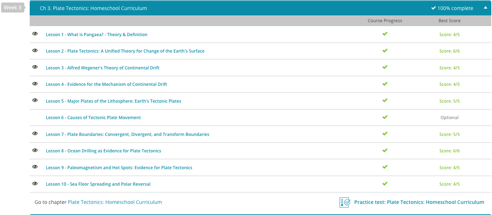

### Andrew Garber
### September 14 2023
### AP Environmental Science
### Chapter 3: Plate Tectonics

#### 3.1. Pangaea
 - In Wegener's model, he proposed that the continents were all joined at one time in Earth's history, making a supercontinent. A supercontinent is a giant landmass made up of many or all continents. He proposed this because if you assume the continents are moving, then continents would be colliding and pulling apart.
 - In 1927, his proposed supercontinent was named Pangaea, which means 'whole earth', and scientists still believe that Pangaea was the most recent supercontinent in the earth's history, existing about 225 million years ago.
 - As more information was discovered about the earth, they realized that the continents are part of large pieces of the earth's crust known as tectonic plates. These tectonic plates are the pieces of the crust that move around on the earth, pushing together, pulling apart and sliding past each other - and those movements are known as plate tectonics.

#### 3.2. Plate Tectonics: A Unified Theory
 - Plate tectonics is the theory that the surface of the earth is broken into larger pieces of crust called plates that ride along on a softer layer of the earth, known as the asthenosphere, which is the upper part of the mantle.
 - The main theory of plate movement states that heat from the core causes convection cells in the mantle that move the plates as they ride on the mantle. The main source of heat that drives this process is thought to be the radioactive decay of uranium and other elements that give up their energy as heat as they break down. All this heat softens the rock enough that it will begin to flow. The plates are moved by the convection cells in the mantle, which are like giant conveyor belts that move the plates around the earth.

#### 3.3. Continental Drift
 - Other clues came from more research. He discovered that in his Pangea model, large geologic features such as mountain ranges on separate continents often lined up closely. Rock strata from Africa and South America also matched when placed together with South America and Africa lining up.
 - Puzzling data of fossils of plants and animals found in climates where they could never have survived was also explained, similar to the glossopteris tropical ferns growing in Antarctica. Coal was found in Antarctica and Britain, areas that could never support coal formation today.
 - Putting all this data together, Wegener concluded that the continents were at one time all together in a giant supercontinent and that somehow they broke apart and migrated to their present location.
 - There was some trouble with this theory, though. He called this theory continental drift and talked to many other scientists and geologists about it. His theory overall was soundly rejected, and often in harsh and scathing language. The big problem was that Wegener had no convincing evidence for how the continents might actually move from place to place. The mechanism for the movement of the continents was missing, and would only later be discovered as plate tectonics.

#### 3.4. Evidence for Continental Drift
 - In 1948, a scientist was exploring some islands in the Atlantic Ocean, and he found that they actually were the highest points along a submerged mountain range made of surprisingly young volcanic rock. This was a key clue in solving the mystery. This became known as the Mid-Atlantic Ridge.
 - After World War II, there also was a heightened interest in the mapping of the ocean floor due to the increase in submarines and their use in battle. There was a keen interest in this new field of battle where soldiers now traversed. They sent ships across the ocean to create sonar maps of the ocean floor. Their findings contained more critical clues to help solve 'The Mystery of the Drifting Continents.'
 - As they mapped the ocean, they discovered that the Mid-Atlantic Ridge actually ran around the whole earth through the ocean floor like the seams of a baseball. What did this clue mean? They also found that there was a steep valley at the center of the mid-ocean ridge (more questions for investigators).
 - Deep ocean trenches were found in specific locations on the ocean floor. They wondered if they had anything to do with solving the mystery.
 - Cracks in the earth's crust, or lithosphere, as it is also known, were discovered. This was a whole new clue since it was thought that the continental crust (the crust that the continents are made up of) sat on top of the oceanic crust (that's crust under the ocean), and the surface was all one piece. This clue showed these investigators that both kinds of crust were often different parts of the same piece of crust that they named plates. Plates are giant pieces of lithosphere that all fit together like a big jigsaw puzzle.
 - The first was magnetic reversals. As magma cooled to form new lithosphere, the natural iron oxides in the rock act as tiny magnets and align themselves with the magnetic field of the earth. Other scientists knew that meant the magnetic poles of the earth shift, so the location of the pole can be discovered by examining the rock. In the 1950s, scientists started taking measurements of the ocean floor and discovered a pattern of stripes where magnetic orientation switched. 
 - They found this pattern on either side of the mid-ocean ridges. They concluded that the only way for these identical patterns to occur would be if they formed at the same time and moved in opposite directions. This led to the idea of seafloor spreading.
 - The center of the steep valley on the mid-ocean ridges was extremely hot. Magma was found to be leaking out of the cracks in the ocean floor, pushing aside existing ocean crust and making it wider. This became known as 'seafloor spreading,' and this was the first physical evidence that the lithosphere actually moved on the surface of the earth. This was a critical discovery into solving the mystery.
 - These discoveries also led to the realization that the continents didn't move through the ocean crust like other scientists thought, but that the continental crust was part of a larger piece of crust called a plate. These geologic investigators discovered that the plates were what was moving, and the continents rode along as part of the whole plate together. After the mystery was solved, this new data was combined together to form a new theory called plate tectonics.

#### 3.5. Earth's Tectonic Plates
 - It is as if the planet's surface is cracked, much like the cracks that would form on the outside of a hardboiled egg if you were to drop it. These large cracks in the earth's surface form plate-like sections of Earth's crust referred to as tectonic plates.
 - These plates are actually pieces of the planet's lithosphere, which is the outermost shell of the earth made up of the earth's crust and upper part of the mantle, and for this reason, tectonic plates are sometimes called 'lithospheric plates.' These plates float on top of the hotter and more fluid asthenosphere, which is the layer below the lithosphere. There are seven major tectonic plates that very slowly move around on the surface of our planet along with a number of minor plates. Let's take a look at the seven major plates of the lithosphere.
 - Take the North American plate for example. It is one of the major plates of the lithosphere and extends from the middle of the Atlantic Ocean to the West Coast of North America. The same can be said for the South American plate, which is another of the seven major plates and extends from the middle of the Atlantic Ocean to the west coast of South America.
 - So, you can see below that the North and South American plates contain oceanic crust, even though they are named for the main continent they encompass. In fact, six of the seven major tectonic plates are named after the continents they contain. The one exception is the Pacific plate, which lies beneath the Pacific Ocean. Not only is this the only major tectonic plate that is mainly underwater, it is also the largest, spanning over 100 million square kilometers.
 - Now, you might be noticing above that these major tectonic plates bump up against each other. When tectonic plates meet, they become a site for tectonic activity. Depending on whether the plates are moving toward each other, sliding past each other or pulling apart, tectonic activity might include mountain building, earthquakes, tremors or volcanoes.
 - In the southern Atlantic Ocean, we see below that the South American plate meets the African plate, which is the major plate that includes Africa and surrounding oceanic crust. They meet at the Mid-Atlantic Ridge, which is a large underwater mountain range on the floor of the Atlantic Ocean caused by diverging tectonic plates.
 - The African plate is the major plate that includes Africa. As the two major plates slowly move away from each other, they allow magma from the deeper layers of the earth to seep up onto the ocean floor, producing new layers of oceanic crust. This ridge runs up through the northern Atlantic Ocean where it also separates the North American plate from the Eurasian plate(most geographers don't define continents based on this, because it doesn't agreed with cultural or political reasonings for continents.).
 - 
 - Interestingly, the Indian subcontinent is not part of the Eurasian plate, even though it looks like it should be when you look at the map. Instead, India is considered to be part of the Indo-Australian plate, which is a major tectonic plate that includes the Indian subcontinent, Australia and surrounding oceanic crust. So again, we see a major plate whose name is a blending of the two main land forms it contains; in this case, India and Australia are blended into the name 'Indo-Australian.'
 - This leaves us with the final remaining major plate of the lithosphere, which is the Antarctic plate. By this point in the lesson, I am sure you are able to guess that this plate includes the continent of Antarctica and surrounding oceanic crust. Because it is at the bottom of the world, we see below that it shares boundaries with the southern plates we discussed in this lesson.

#### 3.7. Plate Boundaries
 - The first way two cars can move relative to each other is in divergent directions, like passing a car going the other way. Plates also can pull apart from each other. This is known as a divergent boundary. A divergent boundary is a fault where the two plates are moving away from each other.
 - If a continent happens to be a place where a divergent boundary occurs, then the continent will begin to be torn apart as the sides of the plates separate, creating a rift valley. The African Rift Valley in East Africa is an example of this occurrence. Eventually, the ocean will separate East Africa from the rest, making a large island.
 - Remember that at divergent boundaries, new crust is being made, but the earth is not getting larger. Why not? Well, at the opposite ends, crust is being pushed into the earth's interior by colliding plates and being re-melted at the same rate new crust is formed. This happens at a convergent boundary. A convergent boundary is a boundary where two separate plates are pushing into each other.
 - A third way that plates can interact is by sliding past each other. This would be like cars side-swiping each other. One car is moving one way and scrapes by one going the other way. Tectonic plates do this as well, grinding past each other as they move in opposite directions. This third type of plate boundary is called a transform boundary.
 
