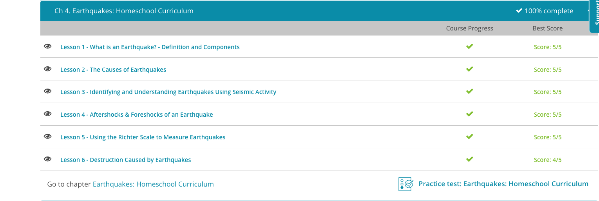

### Andrew Garber
### AP Environmental Science
### Chapter 4: Earthquakes
### September 21 2023

#### 4.1: What is an Earthquake?
 - Earthquakes are the result of stress along plate boundarie, and when they press into each other hard enough to break, the energy is released as an earthquake. Compressional stress occurs when rocks are pushed together - they're pressed into one another. Tensional stress occurs when rocks are pulled apart - they're being stretched farther than they would be otherwise. Shear stress is when rocks slide past each other in opposite directions. All of these stresses can cause earthquakes.

#### 4.2. Causes of Earthquakes
 - The place where the bumping and sliding occurs along the plate boundaries is called a fault. Plate boundaries can have many faults, and most of the world's earthquakes occur along plate boundaries for this reason. The 'Ring of Fire' is an area where most of the world's earthquakes occur because it lines up with many of the plate boundaries. The San Andreas Fault in California is one of the most famous because it runs much of the length of the state and is very active. California's many earthquakes are a result of this dynamic plate boundary.
 - There are two different types of seismic waves: body waves and surface waves. Body waves are seismic waves that travel through the ground under Earth's surface and surface waves are seismic waves that travel through Earth's surface.

#### 4.3. Identifying and Understanding Earthquakes Using Seismic Activity
 - Using a seismometer, also known as a seismograph, earthquakes can be measured and categorized. 
 - There are different kinds of seismic waves, compressioanl waves compress the medium they move through, and transverse waves move like a wave over water.
 - More than this, there are primary and secondary(P and S waves). Primary wav es are the fastest, secondary waves are slower. 
 - Surface waves cause the most damage, as they move through the surface of the earth. These are horizontal transverse waves effectively, and cause the most damage due to their impact on foundations and buildings.
 - Earthquakes are measured by magnitude, on the Richter scale, which is a logarithmic scale. This means that a 7.0 earthquake is 10 times more powerful than a 6.0 earthquake, and a 8.0 earthquake is 100 times more powerful than a 6.0 earthquake(10 * 10).

#### 4.4. Aftershocks and Foreshocks
 - Because faults are not straight, smooth boundaries, ground shaking often occurs both before and after the main quake. Foreshocks are the energy release and ground shaking before an earthquake and aftershocks are the energy release and ground shaking after an earthquake.
 - Foreshocks are less likely to do damage than aftershocks because they're smaller in magnitude. You might even think that they could be used to predict earthquakes, since we can measure seismic activity, the movement of ground, on a machine called a seismograph. Unfortunately, foreshocks are usually too small and too close to the time of the main quake to help us know that the main quake is coming.
 - Aftershocks are sometimes just as hazardous as the main quake itself. In fact, aftershocks may be so strong that they're stronger than the main quake. When this happens the aftershock will be renamed as the main quake, and the main quake will be considered a foreshock. While foreshocks occur around the same time of the main quake, aftershocks may not occur until days or weeks later, meaning that people may have been lulled into a false sense of security before the aftershock hits.

#### Completion Screenshot: 