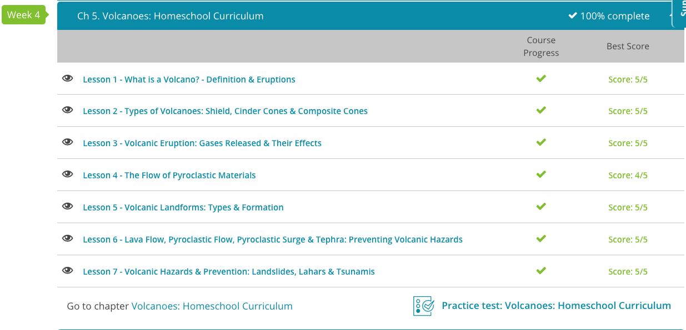

### Andrew Garber
### September 28 2023
### AP Environmental Science
### Chapter 5: Volcanoes

## 5.1: What is a Volcano
 - A volcano is a vent in the surface of the Earth through which magma and associated gases and ash erupt, and the mound of erupted material that builds up around the vent from the accumulation of erupted material. 
 - Volcanoes are generally classified as active, dormant, or extinct.

## 5.2: Types of Volcanoes
 - Composite cone volcanoes, which are also called 'stratovolcanoes' or simply 'composite volcanoes,' are cone-shaped volcanoes composed of layers of lava, ash and rock debris. Composite cone volcanoes are grand sites and can grow to heights of 8,000 feet or more. Mount St. Helens and Mount Rainier, which are both found in Washington State, are impressive examples of composite volcanoes. The explosiveness of their eruptions is due to the tick, highly viscous lava that they produce.
 - Shield volcanoes are broad, domed-shaped volcanoes with long, gently sloped sides. If you were to fly over top of a shield volcano, it would resemble a warrior's shield, hence the name. These volcanoes can cover large areas but never grow very tall. The reason these volcanoes tend to flatten out is due to the composition of the lava that flows from them, which is very fluid. This more fluid lava spreads out in all directions but cannot pile up in steep mounds.
 - Cinder cone volcanoes are steep, cone-shaped volcanoes built from lava fragments called 'cinders.' These volcanic cinders, also known as 'scoria,' are glassy volcanic fragments that explode from the volcano and cool quickly. Therefore, they do not fall far from the vent of the volcano, and this builds the steep sides of the cinder cone volcanoes fairly quickly.

## 5.3. Volcanic Gasses
 - The gases that are released during a volcanic eruption come from deep within the Earth. They are dissolved in magma, which are hot molten rock found in the deeper layers of Earth. Because this melted rock is less dense than the rocks surrounding it, it rises up toward the Earth's surface. As it does, the dissolved gases within the magma begin to form bubbles, which increase the volume of the mixture and make the magma even less dense. As the magma continues its journey toward the Earth's surface, the volume and pressure continue to build and can lead to a volcanic eruption, which sends volcanic gases miles high into the Earth's atmosphere.
 - Once free of the volcano, some of these gases get carried by the wind and can travel for thousands of miles, if conditions are right, while other gases get trapped in the higher layers of the atmosphere. The main volcanic gases are water vapor, carbon dioxide, and sulfur dioxide, and there are other gases released in lesser amounts. 
 - There are some benefits to the water vapor released by volcanoes, as it can add more water to the water cycle. However, water vapor is also a powerful greenhouse gas, and can meaningfully contribute to climate change.
 - The carbon dioxide emitted from volcanoes is also a greenhouse gas, but it is minimal in comparison to human emissions. 
 - Another common gas emitted during a volcanic eruption is sulfur dioxide, and emissions of this gas may have the most significant impact on the Earth's climate. When sulfur dioxide is ejected into the stratosphere it gets converted to sulfuric acid aerosols, which are tiny sulfuric acid droplets. These aerosols hang in the stratosphere and travel the Earth for long periods of time, even years after an eruption. While in the stratosphere, they reflect the sun's rays back into space, preventing them from reaching earth. Therefore, sulfur dioxide emissions can actually help cool the Earth's surface.
 - (Sulfur Dioxide is not one of the chemicals considered for potential cloud-seeding operations, but the effects are similar.)
 - This phenomenon occurred following the massive volcanic eruption of Mount Pinatubo in 1991. This eruption sent a huge sulfur dioxide cloud into the stratosphere. Data collected after the eruption showed that the Earth's surface was cooled for the next three years by as much as 1.3 degrees. 

## 5.4. The Flow of Pyroclastic Materials
 - The pyroclastic flow is very dangerous in part because of the toxic gases and fiery fragments it contains. But, it's also deadly because of the speed at which it travels, which can be more than 100 miles per hour. 
 - Some pyroclastic flows are very dense. Nuée ardentes are a type of pyroclastic flow that contains dense lava fragments. A French geologist first described nuée ardentes, which is why it has such an interesting name. However, if you translate this French term into English, it means 'burning cloud.' And, this is easy to recall because at night these pyroclastic flows glow as incandescent clouds of volcanic ash, gases and blocky fragments.
 - Ignimbrites are a type of pyroclastic flow that contains light materials. These pyroclastic flow deposits contain glass shards and pumice. Pumice is an extremely porous and lightweight rock that forms during a volcanic eruption. This volcanic rock contains pores because gas bubbles get trapped in the rock as the rock rapidly cools. 
 - A pyroclastic surge is similar to a pyroclastic flow, but it's a low-density flow of volcanic material with a higher proportion of gas to rock. Because these flows are mostly gas, their flow is more turbulent, and they have the ability to travel up and over hills and ridges, as opposed to the more dense pyroclastic flows that are pulled down a slope by gravity. The toxic gases in pyroclastic surges are dangerous and can kill.

## 5.5. Volcanic Landforms
 - On many volcanoes, there is a crater, which is a bowl-shaped depression at the top of a volcano caused by past volcanic eruptions. Craters can be thought of as the volcano 'blowing its lid' because it is where volcanic materials, such as ash, lava and rock fragments, are released. A volcanic crater is relatively small, usually spanning about a half a mile in diameter or less, and can fill with water to form a crater lake.
 - If a volcanic eruption causes the magma chamber to empty, the volcano can implode, forming a larger depression known as a caldera. So a caldera can be defined as a large volcanic crater formed by the collapse of the central part of the volcano. You may have heard that Yellowstone National Park in the northwestern area of the United States is a site of past volcanic activity. In fact, many square miles of the park are actually a caldera called the Yellowstone Caldera. This caldera is so large that it is hard to visualize the large depression, but it is a caldera that was formed by massive volcanic eruptions that occurred over the past 2.1 million years.
 - If lava that erupts through a vent is highly viscous or thick, it will not flow very easily. This may result in a lava dome, which is a large, mound-shaped protrusion formed by viscous lava. This can look kind of like a cinnamon roll, with the lava slowly oozing.
 - In contrast to the thick lava that creates a lava dome, we can see very runny lava come from a volcanic eruption. A lava plateau is a wide, flat surface formed when a large amount of highly fluid lava flows over an area. This thin and runny lava can disperse over large areas, and as the lava cools and solidifies, it forms the large, flat plateaus of rock.

## 5.6. Volcanic Flow
 - A volcanic hazard is any volcanic process that threatens life or destroys land or infrastructure. One type of volcanic hazard that most people think of first is lava flow, which is the flow of hot molten rock. Yet a lava flow is one of the least deadly of all of the volcanic processes. This is partly because lava flows do not, for the most part, move very fast. Even the more runny lava flows typically only travel a few miles per hour.
 - There is another type of flow that comes from a volcanic eruption that is much more dangerous than a lava flow, and that is a pyroclastic flow. A pyroclastic flow is a dense collection of fragments and gases from a volcanic eruption that flows down the slope of a volcano. You can recall this term by remembering that the prefix 'pyro' means 'fire,' and the suffix 'clastic' means 'fragments.' So a pyroclastic flow is literally the 'flow of fiery fragments.'
 - A pyroclastic surge is similar to a pyroclastic flow, but it is a low-density flow of volcanic material with a higher proportion of gas to rock. Because these surges of material contain a lot of toxic gases, they can asphyxiate anything in their path and their flow is more turbulent. Like the pyroclastic flow, a pyroclastic surge moves very fast.
 - So we see that lava, volcanic gases and fiery rock fragments get ejected from volcanoes. The term tephra is used to describe the rock fragments and other particles ejected from a volcano. Blocks and bombs, which are large pieces of tephra with a diameter of greater than 64 millimeters, burst out of the volcano. These larger fragments land relatively close to the volcano's vent because of their size.
 - In contrast, very small pieces of tephra and volcanic ash can be carried for miles. In fact, following the 1980 eruption of Mount St. Helens in Washington State, ash traveled approximately 80 miles to the east and blanketed the town of Yakima in 10 millimeters of ash.

