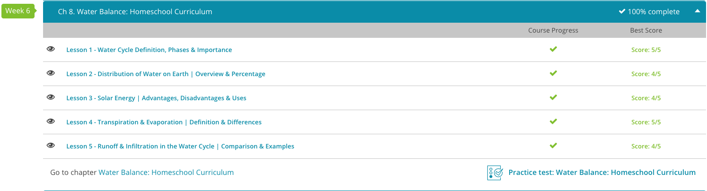

### Andrew Garber
### AP Environmental Science
### Chapter 8: Water Balance

#### 8.1. The Water Cycle
 - The water cycle, also known as the hydrologic cycle, is the process by which water moves from place to place above, on, and below the Earth's surface. This is the process by which water moves around the Earth to different places. The total amount of water on the Earth is relatively unchanging, and it has remained about the same since our planet's formation. As the planet cooled, water vapor present at its formation condensed to fill the oceans and other places, like inland lakes and rivers.
 - The Earth's surface is something like 3/4 water, and the oceans contain 97% of the Earth's water. The remaining 3% is freshwater, and most of that is locked up in glaciers and ice caps. The remaining freshwater is found in groundwater, lakes, rivers, and streams. The water cycle is the process by which water moves from place to place above, on, and below the Earth's surface. The water cycle is driven by solar energy, which causes water to evaporate from the Earth's surface. This water vapor then condenses into clouds, which precipitate water back to the Earth's surface. This water then flows back to the oceans, where the cycle begins again.

#### 8.2. Water Distribution on Earth
 - The 97/3 ratio of salt to fresh water means that the oceans are by far the largest reservoir of water on the planet. What fresh water there is on the planet is about 2/3 in frozen ice caps and glaciers, and what is left is in lakes, reservoirs, rivers, and groundwater. 
 - Groundwater is actually the vast majority of the fresh water on the planet, about 60% of all freshwater supply is from groundwater. Surface fresh water, lakes, streams, etc, is only about 1% of the total freshwater supply.
 - This is why desalination is so important, because per capita water consumption is only increasing as the population increases, and the amount of fresh water is not increasing. Desalination is the process of removing salt from salt water, and it is a very energy intensive process. Combining desalination with nuclear power is a good way to get a huge amount of fresh water, but it is a regulatory nightmare.

#### 8.4. Transpiration
 - Aside from the water cycle itself, the only other way that water gets into the atmosphere is through transpiration. Transpiration is a process by which plants release water vapor into the atmosphere. The rate at which transpiration happens is affected by a number of factors, most notably humidity and temperature - if it is hot, it will "boil" away more water from the stomata in the plants, and if it is humid then the water will not be able to escape as easily because there is already lots of water vapor in the air.

#### 8.5. Runoff
 - When precipitation hits the ground, it has two options depending on where it is in its story line. It may infiltrate the soil or continue across the land as runoff. Infiltration occurs when surface water enters the soil. This process is similar to pouring water onto a sponge. The sponge soaks up the water until it can hold no more. At this point, the soil becomes saturated, but the excess water has to go somewhere. When this happens, we get overflow in the form of runoff, which is when surface water flows over land.
 - Infiltration is simply if the water is absorbed into the soil - when the soil is saturated, and no more water can be absorbed, it will simply run over until either being absorbed or reaching a body of water.
 
 