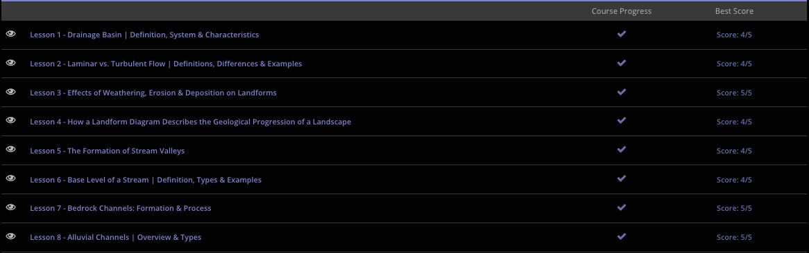

### Andrew Garber
### AP Environmental Science
### Chapter 9: Running Water
### November 30 2023

#### 9.1. Drainage Basins
 - When water falls on land, it flows downhill, and eventually into some form of water body - frequently a stream or river, which then flows into larger streams, rivers, lakes, or oceans. The area of land that drains into a particular stream or river is called a drainage basin, or watershed.
 - Drainage basins often have well-defined boundaries. The line that separates two adjacent drainage basins is called a drainage divide. Drainage divides are often steep mountain ranges or hills. When rain falls on one side of the divide, it will flow into a certain drainage basin, and if the water falls on the opposite side of the divide, it will flow into a different drainage basin. 
 - This process also creates lakes, ponds, and wetlands. If a drainage basin is large enough, it can actually encompass an entire body of water interior to it.
 - There is also a hierarchy of drainage basins, with smaller basins at high elevations are called first-order basins, larger basins that are formed by the confluence of two or more first-order basins are called second-order basins, and so on. The largest basins are called trunk streams, and they are formed by the confluence of many smaller basins.

#### 9.2. Laminar vs Turbulent Flow
 - Streamflow is often characterized by the water velocity, which is the speed at which something moves, and the direction of the flow. Based on these characteristics, water in steams can be classified as laminar or turbulent.
 - The more basic type of steamflow is referred to as laminar. Laminar streamflow is when water is organized in parallel layers and moves in an orderly manner. Water particles stay within their layer and move along the stream at that level. This structure is often possible because there are minimal rocks or other physical barriers in these types of streams.
 - The more complex type of steamflow is referred to as turbulent. Turbulent streamflow is when water does not remain within parallel layers and does not move in an orderly manner. Streams with turbulent streamflow have rocks and other physical barriers within the water. When water particles collide with these barriers, they are forced to mix between the parallel layers. Instead of water flowing in a direct line down the stream, the water moves in random and erratic directions.
 - Streams with turbulent streamflow often have high velocities, which creates more dramatic and uncontrolled water movement. These types of streams are also often quite loud because the water is colliding with barriers and being moved around more forcefully.
 - Think of white water rafting when thinking of turbulent streamflow.
 
#### 9.3. Effects of Weathering, Erosion, and Deposition
 - Mechanical weathering is the process of breaking down rocks into smaller pieces by physical agents - such as water, wind, ice, and technically gravity
 - Chemical weathering is the process of breaking down rocks into smaller pieces by chemical agents - such as acids, oxygen, and water.
 - Erosion is the process of moving weathered rock and soil from one place to another. Erosion is often caused by water, wind, gravity, and glaciers.
 - Deposition is the process of where eroded material is dropped off in a new location, often by water, wind, and glaciers.

#### 9.4. Landform Diagrams
 - Using the idea of uniformitarianism, that the same processes are fundamentally similar across time, we can use the landforms we see today to infer what the landforms looked like in the past. This is done in the form of a landform diagram, which is a cross-sectional view of a portion of the Earth's crust that shows the geologic structures beneath the surface.
 - 
 - Besides the overarching principle of uniformitarianism, there are other key ideas or laws that need to be assumed to be in effect in order to deduce geological history. One is the law of original horizontality. This means that sedimentary rocks are originally formed in horizontal layers. This can be seen in any river or lake where sediment will settle to the bottom in layers. This means that if the layers of rock are inclined or tilted at an angle, the event that caused them to shift happened after they were deposited. Gravity is the key here, because over incredibly long periods of time, gravity will cause the layers to settle into a horizontal position.
 - A second key idea is the law of superposition. The law of superposition states that in any undisturbed sequence of layers of rock, the oldest or first-deposited layer would be on the bottom and the youngest would be on the top. This isn't surprising, because you have to stack them in order, but is important to note because it is a key assumption in landform diagrams.
 - A third key idea is the principle of crosscutting relations. This idea states that any rock or fault that cuts across other rocks is younger than those it cuts across. So, if you had layers of rock that are cut by some other event, maybe a lava flow, the original rock layers are older and the intrusion is younger.
 - Finally, we come to unconformities - simply put, they are surfaces of erosion that cut younger rocks from older ones. 

#### 9.5. Stream Valleys
 - Despite the low velocity of water in streams, they still erode the land around them - over time, this erosion can create valleys. In fact, there are three stages to this: youth, when the stream is locatedo n an uplifed area and there is a steep gradient. This leads to really high velocity and thus erosion. The stream is probably v shaped, with steep (relative) embankments. The second stage is maturity when it erodes the land around it and gets rid of the boulders, rapids, waterfalls, etc. The valley becoems smoother and wider, and the stream is now quite a bit slower. The final stage is old age, when the stream valley has a super flat gradient and the stream is meandering. These can actually CREATE floodplains unto themselves, which is a pretty cool circle of life thing.

#### 9.6. Base Level of A Stream
 - The lowest level of a stream is called the base level. It is the lowest level to which running water can flow. At the base level, the water in the stream has less velocity, which means the water flow has less energy, so its ability to erode or chip away at the land surrounding it is decreased. This inability to erode is important because it allows for the formation of floodplains, which are flat areas of land that are adjacent to a stream and are formed by the deposition of sediment over time. Floodplains are often very fertile and are great for agriculture.
 - There can also be local base levels, which are temporary base levels that are caused by a physical barrier, such as a dam or a waterfall. These can be overcome by the stream, but it takes a lot of time and energy. Ultimate base levels are permanent base levels that are caused by the ocean or a large lake. These are impossible to overcome, and the stream will never be able to erode through this, it just merges with the body of water.

#### 9.7. Bedrock Channels
 - Simply put, Bedrock is the firm foundation of solid rock - it is hard and extremely compacted. The loose soil that covers them is called alluvium, and it is what gets easily erroded with running water. Alluvial channels are free to adjust their width and depth to accomodate the amount of water flowing through them. Bedrock channels, on the other hand, are confined by the bedrock and cannot adjust their width and depth. "Adjust" is a relative term here, because erosion still takes a really long time in alluvial channels, but it is much faster than in bedrock channels. 
 - Erosion is not the fastest way to cut through bedrock though, Abrasion is. Abrasion is the process of erosion by friction. This is when the bedrock is worn down by the friction of the water and the sediment it carries. 

#### 9.8. Alluvial Channels
 - There are a couple of different types of alluvial channels. One type is a meandering channel, or meandering stream. This is a channel that follows a winding course. If you look at a meandering stream from an airplane, it looks as if the stream cannot make up its mind which way it wants to go, so it keeps cutting back and forth through the valley, somewhat like a snake moving through the grass. It meanders because it is always trying to find the easiest path or low point to flow into. This frequently happens when there is little elevation change, so the stream just kind of flows back and forth to the tiny gradient it has.
 - As the channel curves, we see that the water on the outside of the bend moves faster than the water on the inner area. Therefore, erosion happens on the outer bend. This continual force chips away at the channel, forming a cut bank, which is defined as a small cliff on the outer bank of the channel caused by erosion. It is as if the stream is slowly sculpting its path through the landscape. In contrast, the inner curve experiences calmer conditions that allow for the formation of a point bar, which is a collection of sediment materials along the inner curve of the channel caused by deposition.
 - Another type of alluvial channel is a braided channel, or braided stream. This is a network of small, interwoven channels separated by bars of deposited sediment. These can be very pretty to look at from overhead as they resemble a long braid of hair, hence the name. Braided channels tend to be wide and shallow and contain a lot of sediment. These channels can be seen in areas that are subjected to big fluctuations in water flow from season to season and are common in the arctic and mountainous regions.

 