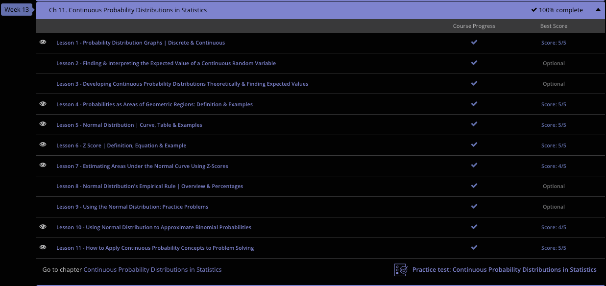

### Andrew Garber
### November 16 2023
### AP Statistics
### Chapter 11: Continuous Probability Distributions in Statistics

#### 11.1: Graphing Probability Distributions for Random Variables
 - A random variable is a quantity that designates the possible outcomes of a random process. It's used to map the potential outcomes of a random process to numeric values. Random variables can be associated with both discrete and continuous processes. 
 - Processes that can be described by a discrete random variable include flipping a coin, picking a number at random, and rolling a die.
 - Conversely, examples of events associated with a continuous random variable include the height and weight distribution of people within a population. A good way to determine if the random variable is discrete or continuous is as follows: if there is a countable number of values that the random variable can take on, then it is discrete; otherwise, it is continuous.
 - The probability distribution function is a function that describes the likelihood of all the possible values that the random variable can take on.
 - Simply put, if the random variable is discrete, then the probability distribution function is going to be random, and if the random variable is continuous, then the probability distribution function is going to be continuous. Simple enough.
 - To graph a discrete probability distribution, a bar graph is a great way to display it. In mathematic terms, the function of rolling a die can be express as 
 - 
 - which creats this bar graph:
 - 
 - For two dice, the probability distribution function is:
 - 
 - which creates this bar graph:
 - 
 - Now, a continuous probability distribution function can be graphed in a similar manner to a discrete one. The x-axis denotes the possible values that the random variable can have, while the y-axis denotes the corresponding probability for each value. The only big difference is that the graph would appear as a continuous curve.

#### 11.4: Probabilities as Geometric Regions
 - The probability density function, f(x), has to satisfy two conditions to be valid:
    - $f(x) >= 0 for all x$
    - $\int_{-\infty}^{\infty} f(x) dx = 1$
 - When we ask about the probability of a particular outcome, we are referring to an area under the curve of the probability density function. That is, if x is the random variable associated with the probability density function, f(x), and a < b, then we have this formula: $P(a <= x <= b) = \int_{a}^{b} f(x) dx$
 - This creates a graph that looks something like this:
 - 
- The probability of having exactly outcome x_1, denoted P(X = x_1), is zero. This is because we are dealing with a continuous probability distribution, in which x_1 has an infinite precision and no width along the x-axis, as shown by the brown arrows in the figure. In order to estimate the probability of x_1, it's necessary to define a small interval near x_1, namely x_1 + dx. Now we have an area under the curve, with both height and width components that can be calculated using integration.
 - 
 - Which explains why you have to to multiply f(x) by dx in the integral to get the probability of a particular outcome.
 - For an example, the function f(x) describes the yearly income distribution within a group, in thousands of dollars.
 - 
 - This translates to the probability that someone makes less than $18,000 is 0, while the probability that someone makes greater than or equal to that amount varies with x. 
 - To calculate if someone makes between $40,000 and $50,000 we can plug into the formula: 
 - $P(40 <= x <= 50) = \int_{40}^{50} 3x^-2 dx=(-3x)|_{40}^{50}$
 - $P(40 <= x <= 50) = -3(50) - (-3(40)) = -3/200 = 0.015$
 - So the probability that someone makes between $40,000 and $50,000 is 0.015, or 1.5%.

#### 11.5 Normal Distribution
 - The normal distribution is a continuous distribution of data that has the shape of a symmetrical bell curve. It's also known as the Bell Curve. It is also called the Gaussian Distribution, after Carl Gauss who created a mathematical formula for the curve.
 - A lot of data in nature have this shape when compiled and graphed. For example, heights and weights of men and women have this distribution. Standardized test scores are normally distributed. Sometimes lifespans of manufactured parts or equipment form a normal distribution.
 -
 - This is a property of the normal distribution. Another property is that 'mean = median = mode.' This is because the shape of the data is symmetrical with one peak.
 - The spots on the bell curve that have the steepest slope up and down (called inflection points) are very significant. The corresponding points on the horizontal axis are one standard deviation from the mean, and 68% of the data lie in here!
 - The standard deviation is a measure of spread or variability of the data. The larger it is, the more spread out the data is. The standard deviation is calculated slightly differently for a population as opposed to a sample. The formulas and symbols for both types are given below:
 -
 - For the population, the standard deviation symbol is called Sigma, and the only difference in the calculation is you subtract the population mean Mu from each value, and there is a division by the population size called big N.
 - Within a normal curve, 68% of the data is within one standard deviation of the mean, 95% is within two standard deviations. Even greater is that 99.7% is within 3 standard deviations. In a philosophical sense, you should try to maximize your standard deviation, because that means you are doing something different from the norm. Nietzsche's last mans is an absolute zero on the standard deviation scale, while the Ubermensch is a 3+ standard deviation.
 - For example, suppose the lifespans of lithium ion batteries are normally distributed with a mean lifespan of 20,000 hours and a standard deviation of 1000 hours. We can conclude that 95% of these batteries will last between 20,000 - (2 * 1000) = 18,000 hours and 20 + (2 * 1000) = 22,000 hours.
 - 

#### 11.6. Z Score
 - For sake of example, imagine a data set with a standard deviation of 2. The majority of the data(68%) will be the mean + or - 1 standard deviation(2). However, 2 is a super arbitrary(and easy to use) number. In engineering, polling, or other statistical applications where the numbers are often annoying or non-arbitrary, we use what is called a Z score. 
 - The z-score is a measure of distance from the mean in terms of how many standard deviations it is removed from the mean.
 - By far, the biggest advantage of a z-score is its brevity. When I say to include all values between z-scores of -2 and 2, you know that I want to include 95% of values. That's because within two standard deviations on either side of the mean are 95% of the data in a set.
 - Calculating a z-score is easy, subtract the mean from the value and divide that by the standard deviation. If you have a value of 55, a mean of 30, and a standard deviation of 20, then it is simply (55-30)/20 = 1.25. Z-scores DO NOT HAVE UNITS, they are simply a shorthand for standard deviations. The z-score of 1.25 means that the value of 55 is 1.25 standard deviations above the mean.

#### 11.7. Estimating Areas Under The Curve Using Z Scores
 - The most common use of the Z-Score(a measure of distance from the mean in terms of standard deviations) is as a shorthand for standard deviations. However they can also be used to find the area under the curve(the percentage of data) between the mean and a given z-score.
 - Every statistics book and test has a sheet with this data, ususally called something like [Z-Scores & Stanard Noraml Curve Areas](https://study.com/academy/lesson/z-scores-standard-normal-curve-areas-statistical-table.html) which can be used to find the area under the curve between the mean and a given z-score.
 - It is important to check if the chart is from zero or from the mean. If it is from zero, you have to subtract 0.5.
 - The y axis on this chart is the z-score in question, and the x axis is whatever small percentage to make it right(hundredths). For example, if you want to find the area under the curve between the mean and a z-score of 1.25, you would look at the 1.2 row and the 0.05 column. This gives you 0.89435, which you then subtract 0.5 from to get 0.39435. This means that 39.435% of the data is between the mean and a z-score of 1.25.

#### 11.10 Using Normal Distribution to Approximate Binomial Probabilities
 - Binomial probabilities are processes in which all outcomes are one of two possibilities, such as heads or tails, or pass or fail. The normal distribution can be used to approximate binomial probabilities when the sample size is large enough.
 - The formula for the binomial probability distribution is $P(r) = P(X = r) = (^n_r)*p^r*q^(n-r)$, where p is the probability of success of a single trial, q is the probability of failure of a single trial, r is the number of successes, and n is the number of trials.
 - P(X = r) specifies the probability of a single outcome $r$ out of the whole set of possible outcomes $X$. In the instance of a coin flip, the possible outcomes are heads and tails, in which case r could be defined as either heads or tails. Also note that q is simply the complement of p, such that q = 1 - p. The (n r) term in parentheses evaluates to the expresion: $(^n_r) = n!/(r!(n-r)!)$. While this looks super confusing, it's actually just a way to express the number of ways that r successes can occur in n trials. 
 - Suppose we want to find out what the probability of getting a heads on a coin flip is per two flips. There is a 1/4 probability of two heads (HH), a 1/2 probability of HT or TH, and a 1/4 probability of TT. After enough trials, graphing this data will result in something very similar to a normal distribution curve. Think of it like epochs in machine learning, the more epochs you have, the more accurate the model is(save for overtraining, but that is a pedantic point).

