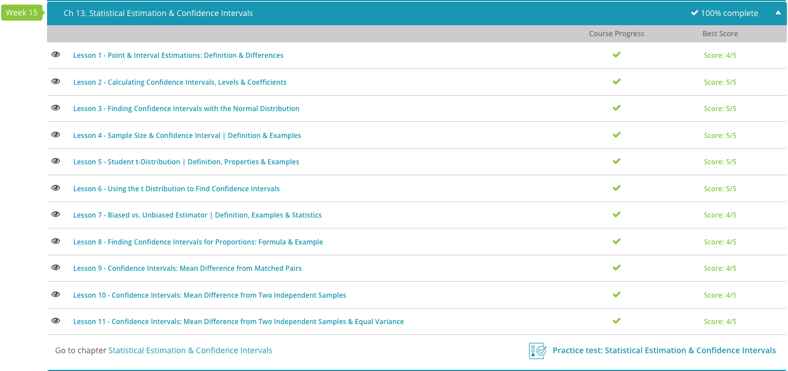

### Andrew Garber
### December 14 2023
### AP Statistics
### Chapter 13: Estimation and Confidence Intervals

#### 13.1 Point & Interval Estimates
 -  An estimation is the tool that is used in mathematics to make inferences about populations from data.
 - A point estimation is a type of estimation that uses a single value, a sample statistic, to infer information about the population. Point estimation can be a sample statistic. The sample mean of age for the sample, 32, can be used as a point estimation.
 - Point estimation is a single value that can be inferred as a popilation parameter. A parameter is the characteristics used to describe a population. 
 - Interval estimation is the range of numbers in which a population parameter lies considering margin of error. Because there is a certain level of uncertainty, an interval estimate gives a range, rather than a single value, of the population parameters.

#### 13.2 Calculating Confidence Intervals
 - When we use interval estimation, we don't assign just one value to the population mean. Instead, we form an interval around a point estimate. We follow this up with a statement that denotes that this interval, much broader in scope than just one point estimate, likely contains the population mean.
 - The confidence interval can be summed up as the point estimate +/- the margin of error. There are also associated terms, such as the confidence level, which is the probability that the interval estimate contains the population parameter. The confidence level is denoted by 1 - alpha, where alpha is the level of significance. The level of significance is the probability of rejecting the null hypothesis when it is true. The level of significance is denoted by alpha.
 - There is also confidence coefficient, which is the probability that the interval estimate contains the population parameter. The confidence coefficient is denoted by 1 - alpha, where alpha is the level of significance. The level of significance is the probability of rejecting the null hypothesis when it is true. The level of significance is denoted by alpha

 ### 13.3 Finding Confidence Intervals With the Noraml Distribution
 - standard deviation is the variability of individual data points from the mean. this is denoted by sigma($\sigma$). 
 - the population mean is the average of all the data points in the population. this is denoted by mu($\mu$).
 - the confidence interval is a range of values that express the uncertainty associated with a parameter, such as but not limited to the population mean.
 - there are three cases where this can be used:
    - when the population standard deviation is known, and the sample size is small($<30$, for example), and the population is normally distributed.
    - when the population standard deviation is known, the sample size is small($<30$, for example), and the population is not normally distributed or we don't know the distribution.
    - when nonparametric methods are used, such as mean, median, standard deviation, etc.
 - in the first two cases, we can calculate the confidence interval using the formula:
 - 
 - where $\bar{x}$ is the sample mean, n is the sample size, $\sigma$ is the population standard deviation, and z is found from the regular table of z-scores. the margin of error(E) is the $z{\sigma}_\bar{x}$. Simply put, the marign of error is the quantity we subtract or add to $\bar{x}$ to get the confidence interval for $\mu$.

#### 13.4. Sample Size and Confidence Interval
 - To determine the sample size we need, we can turn to the following equation: $n = (z^2 * sigma^2) / (E^2)$. n is the sample size, E is the margin of error, and the value for z is found from the standard normal distribution table.

#### 13.5. Student t-distribution
 - The t distribution also known as the Student's t distribution is a kind of symmetric, bell-shaped distribution that has a lower height but a wider spread than the standard normal distribution. The units of a t distribution are denoted with a lower case 't'.
 - The only parameter of the t distribution is the number of degrees of freedom. The degrees of freedom ($df$) are simply $n-1$. Meaning $df = n - 1$, where $n$ is our sample size.
 - The shape of each individual t distribution curve depends on the degrees of freedom, but all t-curves still resemble the standard normal curve nonetheless. Why does a t-curve have more spread than the standard normal curve?
 - It is because the stadnard deviation for a t-curve with v degrees of freedom, where v >2, is the square root of v divided by v-2. Because the value is always greater than 1, the spread is larger than the standard normal curve.
 - There are several important properties you should be aware of with respect to t-curves.
   - Property #1: The total area under a t distribution curve is 1.0: that is 100%.
   - Property #2: A t-curve is symmetric around 0.
   - Property #3: While a t-curve extends infinitely in either direction, it approaches, but never touches the horizontal axis.
   - Property #4: As the number of df increases, the t distribution curve will look more and more like the standard normal distribution curve.
 - There is a t distrubtion table, which is similar to the z-score table. Such that, if you go down 15 degrees of freedom, and then go to the column that says 0.05 to find where the two intersect, you will get 1.753.

#### 13.6. Using t distribution to find confidence intervals 
 - When we don't know the value of sigma, the population standard deviation, we use the sample standard deviation (s) instead. This means we use the $^sx-bar = ^s / √ n$ to find the standard deviation of x-bar(the sample mean).
 - We then get $S_x-bar +/- t * S_x-bar$. From here, we can use the value of t from the t distrubiton to find the margin of error $E = t * S_x-bar$.
 - For example, if the sample size n=25, sample mean $x-bar$ = 65, sample standard deviation s = 10, and the confidence level is 0.95(95%), then we can just plug and chug. We get $S_x-bar = 10 / √ 25 = 2$. The degrees of freedom is $df = n -1 = 25 -1 = 24$, subtract that confidence value from 1 and we get 0.05. Divide that by 2 and we get 0.025(we want the area under both tails of the curve), using the table we get t = 2.064. We can then plug them into the formula to get $165 +/- 2.064 * 2 = 165 +/- 4.13$. This means that the confidence interval is 160.87 to 169.13.

#### 13.7. Biased vs Unbiased Estimator
 - While we would prefer that numbers don't lie, the truth is that statistics can often be quite misleading. For that reason, it's very important to look at the bias of a statistic. Bias is the distance that a statistic describing a given sample has from reality of the population the sample was drawn from.
 - Bias is the tool of creating misleading statisitcs - without using it, we would have no idea how accurate our statistics actual are.
 - The best way to avoid bias in statistics is to use an unbiased sample - a sample that is representative of the population it was drawn of. To put it in scientific terms, if your measurement equipment is faulty then your measurements will be biased(even if you didn't intend to - if you report it as if your equipment was accurate, then you are being biased).

#### 13.8. Finding Confidence Intervals for Proportions
 - For example, to find out the proportion of people who enjoy a product you make, you're going to have to undertake the estimation of a population proportion and find confidence intervals. A confidence interval is the point estimate +/- the margin of error and the point estimate is the value of a sample statistic, which is used as an estimate of a population parameter.
 - The population proportion is denoted by the symbol p while the sample proportion is denoted by the symbol p-hat. In this lesson, we're going to learn how to estimate the population proportion thanks to the sample proportion. For lage samples, the sampling distribution is close to normal, the mean of the sampling distribution is p, and the standard deviation of the sampling distribution sigma_p-hat = $sqrt(p*q)/n$ where q = 1 - p.
 - To really implement this, if the sample size n=1000, p-hat is 0.60(60%), and q-hat = 1-p-hat = 0.4 we can just plug and chug.
 - s_p-hat = $sqrt(p-hat * q-hat)/n = sqrt(0.6 * 0.4)/1000 = 0.0155$. We can then use the z-score table to find the z-score for 0.95, which is 1.96. We can then plug and chug to get $0.60 +/- 1.96 * 0.0155 = 0.60 +/- 0.0304$. This means that the confidence interval is approximately 56% to 64%.

#### 13.9. mean difference from matched pairs
 - Examples of matched data pairs are:
  - Pre- and post-test results
  - Duplicating measurements on the same samples
  - Any statistical study where data in one sample can be uniquely paired with data in another sample
 - The following conditions have to be met in ordered to estimate a confidence interval between matched pairs: it has to be a simple random sample, the sample should include measurements on two paired variables such that $x$ and $y$ are $X_d = X - Y$, and the mean difference between data pairs should be normally distributed.
 - The steps at this point are then fairly simple, we identify the sample (n/2) where n is the sample size, select a confidence level that we accept as certain(90,95,99 generally), and then calculate the confidence interval based on the standard deviation of the paired difference.
 - Based on this graph of 5 students before and after intervention:
	| Student | Score 1 before | score 2 after |
	| ------- | -------------- | ------------- |
	| 1       | 54             | 60            |
	| 2       | 45             | 59            |
	| 3       | 40             | 35            |
	| 4       | 30             | 45            |
	| 5       | 60             | 55            |
 - To calculate the 95% confidence interval to estimate the mean differnece, we have to Calculate the difference between the scores. Calculate the mean difference. Calculate the difference minus the mean difference. Calculate the square of the difference minus the mean difference.
 - We then get the following table:
 - 
 - Which ends up as: 
 - To find the standard deviation, we just plug it in as so:
 - 
 - Finally, we just u the calculated values to compute a 95% confidence interval for the mean difference in the test scores in the sample data. Because the sample size is small (remember, n = 5), we use the t-score value from the table.
 - 
 - In this example, there are a total of eight values for scores. However, each of the scores are considered in pairs because they are the before and after scores of the same student. So the total number in the sample, or the sample size, n is 4.
 - The degree of freedom, df = n - 1 = 4. From the t-score table, for n = 4 and 95% confidence, the t-value is 2.776. So we can see that we have $-5 +/- 2.776(9.77/sqrt(15))$ which is $(2.0, -12.0)

#### 13.10 Mean differnece between two independent samples.
 - First, you must ensure that the samples are actually independent - if they aren't, you can't be sure that this method with produce accurate results.
 - Given two indepedent samples, you can't just subtract two data points from each other and call it a day.
 - First, calculate the margin of error and then add/subtract it from the point estimate to get the confidence interval.
 - For example, if you had a confidence interval of (36, 40) when measuring the heart rate of two groups of people, the width of the confidence interval is 4. The margin of error is half up or half down, so 2. The point estimate is the mean of the two groups, so 38."
 - However, if the data is more spread, you should calculate the standard deviation of the difference between the two groups. 
 - The final step in calculating the margin of error is to apply a multiplier called the critical value to the standard error. The critical value takes into account how confident we want to be that we have a good range of values, measured through a percentage called the confidence level.
 - The most commmon are 90, 95, and 99% - for the sake of this example, we will use 95%. The two sample sizes get combined into one metric called degrees of freedom. The degrees of freedom is the sum of the two sample sizes minus 2. 
 - Using a t-table, you can combine all of that together to get the margin of error.
 - You can then get confidence interval by subtracting the margin of error from the point estimate, and then adding the margin of error to the point estimate to get (bottom_bound, top_bound).
