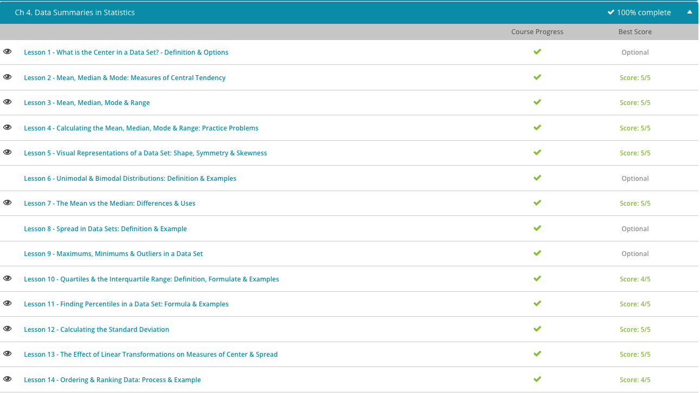

### Andrew Garber
### AP Statistics
### September 15 2023
### CH4 Data Summaries

#### 4.1. Measures of Center
 - The mean is the sum of the numbers in a data set divided by the total number of values in the data set. The mean is also commonly known as the average. 
 - The median is the midpoint value of a data set, where the values are arranged in ascending or descending order. The median can be used to get an idea of what values fall above the midpoint and what values fall below the midpoint. There is equal likelihood that the values in the data set will fall either above or below the median. Median is best used for a data set with numbers that have a few larger or smaller numbers and several numbers close together.

#### 4.2. Mean, Median, and Mode: Measures of Central Tendency
 - Mean: defined as the data's average score of the sample
 - Median: defined as the middle score after the scores have been arranged in numerical order 
 - Mode: defined as the most often occurring value

#### 4.10. Quartiles and The Interquartile Range
 - A quartile is a group of values and/or means that divide a data set into quarters, or groups of four. Do not be confused here; a quartile is a value, not a group of numbers. Think of a quartile as a cut off point for each group. A group has to start and stop somewhere, and that's exactly what a quartile does.
 - The interquartile range is a value that is the difference between the upper quartile value and the lower quartile value(the bottom 25% and the top 25% of the data set).
 - The easiest way to do this is to arrange the data in ascending order, and then find the median - and then the median of the upper and lower halves of the data set. The median of the upper half is the upper quartile, and the median of the lower half is the lower quartile. The interquartile range is the difference between the upper and lower quartiles.

#### 4.11. Finding Percentiles in a data set
 - A percentile is a value on a scale of one hundred that indicates the percent of a distribution that is either above, equal to, or above it.
 - For example, the 99th percentile means that the data point is *greater* than or *equal to* 99% of the values lower than it. 

#### 4.12. Standard Deviation  
 - Standard deviation is the measure of how closely all of the data in the data set surrounds the mean. The standard deviation helps to identify a normal distribution of data by comparing the distance of the average of each data point's variance to the mean. A normal distribution of data is represented when the majority of the data is found close to the average of the set.
 - For example, I am not a *normal* person.
 - To find standard deviation, the variance of the data set must be found first.
 - To find the variance is to find the mean, and then subtract the mean from each data point. Then, square that number. Then, add all of those together and divide that total by the number of data points.
 - Finally, to find the standard deviation, take the square root of the variance.

#### 4.13. Linear Transformations 
 - Professor Shannon decides to help the students out by grading this test on a curve. A curve is one example of a linear transformation, which is when a variable is multiplied by a constant and then added to a constant. When using linear transformations on a data set, all variables in the data set are transformed.
 - This could be used if all of the students of a class almost uniformly scored poorly on a test, and the only constant there was poor teaching.
 - We can transform the data in this data set by using the following formula for linear transformations: a + bx. In this case, x = the number in the data set, a = the constant being added to the variable and b = the constant being multiplied to the variable.
 - For example, if the mean of a test was 25, and it was decided that the test should be curved up to 75, it would be 25 + 2(25) = 75. However, if you scored a 35 on the test, you would get a much larger relative bump as you would be getting 25 + 2(35) which is 95. Maintaining the same distance from the mean, but getting a much larger bump in your score.
 
 ### Completion Screenshot: 