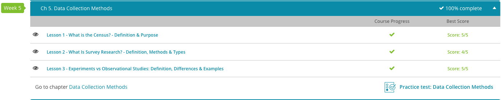

### Andrew Garber
### AP Statistics
### Chapter 5: Data Collection Methods
### September 21 2023

#### 5.1. What is the census?
 - A census is a government survey that collects data from every member of the population, in order to allocate resources and make decisions. 
 - With the amount of money distributed by the government to communities, places that are undercounted in one census can have their growth stunted for the next 10 years. 

#### 5.2. Types of surveys
 - Surveys are used to collect fixed answers from those surveyed.
 - Questionnaires are open-ended responses to questions, allowing for more detailed and nuanced responses. The downside of this is variance, and the difficulty of analyzing the data.
 - Interviews are a form of survey where the interviewer asks the questions and records the responses. This is more expensive, but allows for more detailed responses, and follow-up questions.

#### 5.3. Experiments vs Observational Studies
 - A response variable is the observed variable, or variable in question. 
 - An explanatory variable is a variable, or set of variables, that can influence the response variable. This can be through causation, or unobserved correlation.
 - An observational study is a study where researchers simply collect data based on what is seen and heard and infer based on the data collected. Researchers should not interfere with the subjects or variables in any way. 
 - An experiment is a method of applying treatments to a group and recording the effects. A good group experiment will have two basic elements: a control and a treatment. The control is the group that remains untreated throughout the duration of an experiment. In Emily's case, the group that takes no dance classes is the control group. An experiment will also have a treatment, which is the variable in an experiment that is used on an experimental group. 
 - Another element of an experiment is the factor, which is the degree the treatment is applied to the experimental group.

 