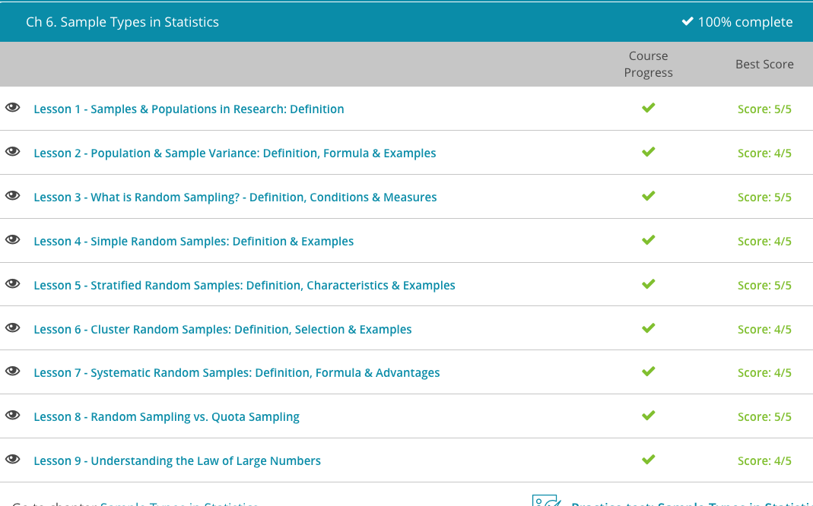

### Andrew Garber
### AP Statistics
### Chapter 6: Sample Types
### September 22 2023

#### 6.1. Samples and Populations
 - When you are attempting to study a population, you have to collect information from everyone in that group. This makes it extremely difficult to study populations. For example, imagine if you are going to study a whole state's worth of people, that could be tens of millions.
 - Most social researchers realize that obtaining information from every person in a population is next to impossible. So instead of trying to collect everyone's information, they collect a sample of the population. A sample is a subset that is representative of the population as a whole. There are many sampling methods though, and some are better than others.
    - Random sample: each individual in the population has an equal chance of being selected.
    - Stratified sample: a researcher divides the population into groups based on characteristics, and then the researcher randomly selects from each group based on its size.
    - Quota sample: a researcher deliberately sets a requirement to ensure a particular group is represented.
    - Purposive sample: a researcher purposefully focuses on a particular subset of a population.
    - Convenience sample: selection of the sample is based on ease of accessibility.

#### 6.2. Variance
 - Variance is the measure of how spread out a set of data is. It is calculated by taking the average of the squared differences from the mean.
 - The formula of population variance is sigma squared equals the sum of x minus the mean squared divided by n.
 - 
 - Or in text form, $$\sigma^2 = \frac{\sum_(x - \mu)^2}{n}$$
 - The steps are actually quite simple:
      - Find the mean of the set of data.
      - Subtract each number from the mean.
      - Square the result.
      - Add the results together.
      - Divide by the number of items in the set.
 - The formula for sample variance looks like this: 
 - 
 - step 5 for sample variance is slightly different. Divide the result by the total number of numbers in the data set minus one.
 - Remember that a sample is only part of the population and isn't actually the whole picture. Because of that, statisticians found a way to compensate, by subtracting one from the total number of numbers in the data set.

#### 6.3. Random Sampling
 - Random sampling is a method of selecting a sample from a population. It is a sequence of equally distributed random numbers. 
 - Some of the types of random sampling are:
     - Simple random samples
     - Stratified random samples
     - Cluster sampling
 - Random samples are best used to gather data about large populations.

#### 6.4. Simple Random Samples
 -  This takes us to simple random sampling or SRS, which is a type of random sampling where the variables have an equal and unsystematic chance of selection.
 - SRS would be like putting all of the names of the people in a population into a hat and then drawing out a certain number of names.

#### 6.5. Stratified Random Samples
 - Stratified random sampling is a random sampling method where you divide members of a population into 'strata,' or homogeneous subgroups.
 - There are two main rules, stratified random samples must be mutually exclusive and collectively exhaustive(including all of the population).

#### 6.6. Cluster Sampling
 - Cluster sampling is the sampling method where different groups within a population are used as a sample. This is different from stratified sampling in that you will use the entire group, or cluster, as a sample rather than a randomly selected member of all groups.
 - There are two main rules, cluster sampling must be mutually exclusive and collectively exhaustive(including all of the population).
 - You should use cluster sampling when:
     - The entire population is unclear or unknown
     - The sample clusters are geographically convenient
     - The clusters are 'natural' in a population
 - Sometimes you won't have an entire list of the members of a population or you won't have access to an entire population. In this case, you can use cluster sampling to collect information from the groups in the population.
 - If you wanted to get information about an entire state or county, but you don't have access to all the members all across the state, you can use the towns or counties that are geographically convenient to collect data. This is another example of cluster sampling; each town or county would be a naturally occurring cluster.

##### 6.7. Systemic Random Samples
 - Systematic random sampling is the random sampling method that requires selecting samples based on a system of intervals in a numbered population. For example, one in every 10 people who enter a store are asked to fill out a survey.
 - It is best to use systematic random sampling only if the population is homogeneous, or of the same subgroup. 
 - The main benefits are that it is simple to use, and is unbiased.

#### 6.8. Random vs Quota Sampling
 - The most accurate way to obtain information for a large group of subjects is by using probability sampling, where samples are selected in such a way as to be representative of a population. When we say representative, we mean all the types of people we could expect to see living in that population.
 - One of the most classic historical examples of a random sample bias was in the 1936 presidential election where Literary Digest predicted that Alfred Landon would beat future president Franklin Roosevelt. The survey sample suffered from undercoverage of low-income voters, who tended to be Democrats and were thus voting for Roosevelt. 
 - Sometimes, poll or survey results are obtained using non-probability sampling methods, where those selected are not truly representative of a given population. In general, non-probability samples are less desirable than probability samples. However, a researcher may not be able to obtain a random sample because it may be too expensive, or a researcher may not care about generalizing to a larger population.
 - In a quota sample, a researcher deliberately sets the proportions of levels of members chosen within the sample. This is generally done to ensure the inclusion of a particular segment of the population that may otherwise be overlooked. The researcher sets a quota, independent of population characteristics, so the proportions may differ from the actual proportion in the population.

#### 6.9. The Law of Large Numbers
 - The law of large numbers is a theorem that states that the larger your sample size, the closer the sample mean will be to the mean of the population. It is also called Bernoulli's Law after Jacob Bernoulli, a Swiss mathematician.
 - More or less summarized, the law of large numbers is the idea that the more times you repeat an experiment, or the more samples you take, the average per sample bias will decrease - thus, an infinite number of samples will have no bias at all.
 
 