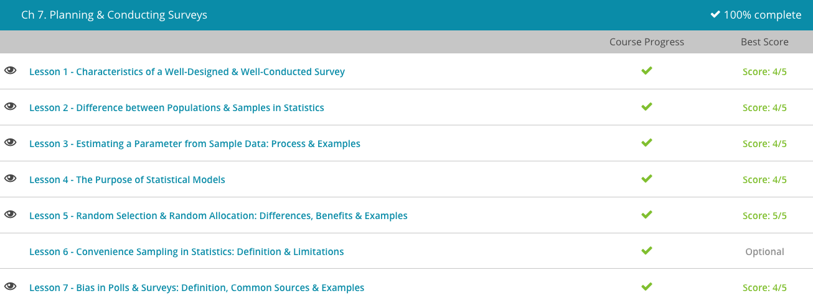

### Andrew Garber
### AP Statistics
### October 6 2023
### Chapter 7: Planning & Conducting Surveys
 

#### 7.1. Characteristics of a Well-Designed Survey
 - A survey is the study of a particular group of people of interested for the purpose of collecting data.
 - Yes or No questions are good when I just want to know if someone has a certain desired or undesired characteristic.
 - Open ended questions are good when you want the person to give you a detailed repsonse, but they are hard to analyze and generalize.
 - Rated questions are good when you want a scale of how much someone likes or dislikes something, but there is no way to know if one persons 5 is the same as another persons 5, or why they chose that number.
 - Types of survey are also important, and there are various cost-benefit tradeoffs for online, phone, and in-person surveys.
 - Last, but not least for your survey to be well-conducted, you'll need to choose an appropriate sample size for your market. Your sample size is a group of people that represents your target market. For example, instead of asking all girls if they like pink, maybe you'll ask 500 girls. You'll then use this information to generalize it to all girls. You need to select a number that is not too small, that is large enough for you to get a good idea of what you can expect others in the market to do.

#### 7.3. Estimating A Parameter from Sample Data
 - A parameter is a characteristic used to describe a population. For example, the average height of all people in the world is a parameter of the population of all people in the world.

#### 7.4. The Purpose of Statistical Models
 - If you are Nate Silver, it is poker or elections.
 - The purpose of statistics is to describe and predict information. This can be divided into descriptive statistics and inferential statistics. Sometimes we collect data in an attempt to describe the characteristics of a population.
 - An example of a descriptive statistic would be the percentage of Democratic voters in the United States. It is descriptive of the population of all voters in the United States.
 - An example of an inferential statistic would be the percentage of Democratic voters in the United States who approve of President Biden's job performance. It is inferential because we aren't asking every single Democratic voter in the United States, we are asking a sample of them and then making an inference.
 - A statistical model is a combination of inferences based on collected data and population understanding used to predict information in an idealized form. This means that a statistical model can be an equation or a visual representation of information based on research that's already been collected over time. Notice that the definition mentions the words 'idealized form'. This means that there are always exceptions to the rules.
 - Ask Nate Silver about 2016, and he'll tell you that there are always exceptions to the rules. *Sad Ba Dum Tss*
 - The reason statistical models exist is because we are looking for correlations between a number of variables(in a political model, there are tens of thousands of parameters).
 - A response variable is the observed variable in a statistical model, the variable in question. For example, if you are trying to predict voter turnout, the response variable is the number of people who voted.
 - An explanatory variable is a variable that is used to explain the response variable(weather at a polling place, for example).
 - *We need huge turnout in Boston - Josh Lyman*

#### 7.5. Random Selection and Random Allocation 
 - Random selection is the method of choosing a sample of members from the population to participate in a study. This links back to sampling methods, which we covered previously.
 - A control group is a group of people who are not exposed to the response variable, and you have to use random allocation to make sure there is no bias in control group vs experimental group.

#### 7.7. Bias in Polls and Surveys
 - No more Nate Silver jokes, I promise.
 - The main effect of bias is that it skews the results of a survey or poll away from reality, and if systemically sought out can be used to manipulate people(Hillary has it in the bag, don't bother voting). 
 - One of the main ways that bias is found in the wording of questions("Question 14 is Asymmetrical" - Toby Zeigler). For example, if you ask someone if they believe in the death penalty vs if they believe in capital punishment, you'll get different results - they mean the same thing, but by wording them differently(intentionally or not) you can get different results.
 - Funding bias is when someone pays for a study/poll for the specific purpose of getting a certain result.
 - The type of bias that involves the choice of answers is reporting bias, since only answers of a certain variety are likely to be reported.
 - Selection bias is when the sample is picked in a way that is not random, and not representative of the population.
 - Observer bias is when the person conducting the survey is a variable in how you answer - if they are super nice, you might be more likely to answer in a certain way.
 
