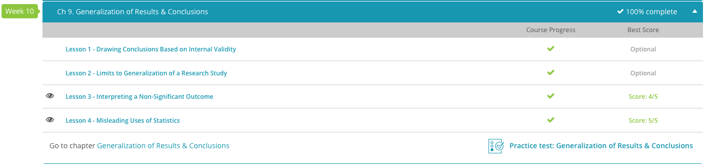

### Andrew Garber
### October 23
### AP STATISTICS
### Chapter 9: Generalization

## 9.3. Interpreting A Non-Significant Result
 - Non-significance in statistics means that the null hypothesis cannot be rejected. In laymen's terms, this usually means that we do not have statistical evidence that the difference in groups is not due to chance.
 - The double negative there is important - while it makes it hard to read - because if you can't rule out chance, the whole validity of the study is in question.
 - Many people believe that a non-significant result means that the independent variable did not affect the dependent variable. This might be true, but it might not be true. As we saw before, the results might be due to chance or they might be due to the independent variable. Who knows?
 - So if non-significance doesn't tell us what the results of the experiment were, what does it tell us? For one thing, it tells us that the results are not as definitive as we expect them to be. Drawing conclusions based on them would be *risky*.
 - Since the purpose of research is to make generalizations about the real world, some people see a non-significant result as a failure of the study. It's true that you can't make generalizations based on a non-significant result. But remember that it also means that you can't make generalizations about the opposite of the hypothesis, either.

## 9.4. Misleading Uses of Statistics
 - While statistics can be a powerful tool, they are often dismissed because of people who want to abuse and misuse the data. 
 - First of all, there is the practice of making claims based on non-representative samples. This is a problem because the results of the study will not be generalizable to the population, and therefore the results are not valid.
 - Another problem is the use of misleading graphs. This is a problem because it can make the data look more or less significant than it actually is.
 - Another problem is bad surveys - limiting questions, social desireability bias, and leading questions can all lead to bad data.

