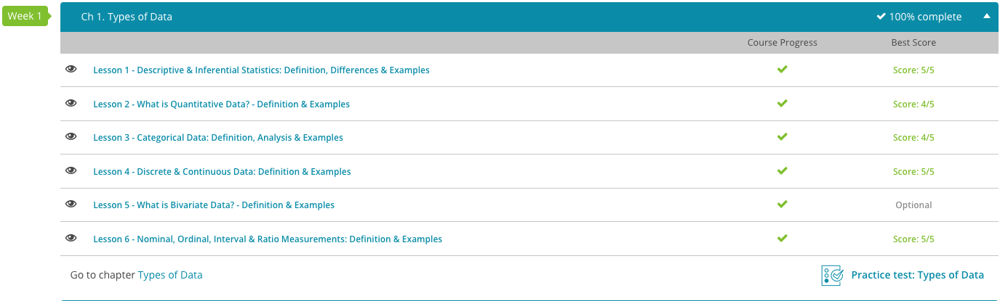

### Andrew Garber
### September 8 
### AP Statistics
### Chapter 1: Types of Data

#### 1.1. Descriptive & Inferential Statistics
 - A population is a group of people, objects, or anything else that has been selected to be studied.
 - Data is information that has been collected.
 - Descriptive Statistics give information that describes the data in some manner.
    - Examples: Dispersion, Number of Data Points, Mean, Median, Mode, Standard Deviation, etc.
    - Graphical Representations are also descriptive statistics.
 - Inferential Statistics makes inferences about populations using data drawn from the population using a sample of the population.
 - A sample is a portion of the population that is representative of the population, this is where things like sampling error (cc Democratic Pollsters in 2016) come into play.
    - Examlpes include probability, confidence intervals, and hypothesis testing.
    - Statistical Estimation is also a part of inferential statistics, this is in order to minimize sampling error.

#### 1.2. Quantitative Data.
 - Quantitative Data is any kind of data that can either be counted or measured with a numerical value.

#### 1.3. Categorical Data
 - Categorical Data is any kind of data that can be grouped logically into categories. For example, 3 Green Cars, 2 Blue Cars, and 1 Red Car. Instead of just 3, 2, 1.

#### 1.4. Discrete and Continuous Data
 - Discrete Data is a form of data that cannot be divided, it is distinct. For example, a computer.
 - Continuous Data is data that can take on any value, for example, time. 

#### 1.5. Bivariate Data
 - Bivariate Data is data that has two variables that can be paired together to form a relationship. For example, height and weight. Not that these are ALWAYS correlated, but for the purposes of a study they COULD be, thus producing bivariate data.
 - Unvariate Data is data that has only one variable, for example, height.

#### Nominal, Ordinal, Interval, and Ratio Measurements.
 - Nominal Data is data that is categorical data that assigns a numerical value to a category. For example, 1 for Green, 2 for Blue, and 3 for Red.
 - Ordinal Data is data that can be ordered and ranked, but not measured.
 - Interval measurement is a measurement that has a range of values that are equally valid, for example, "1-5in" where 3in would be a valid measurement.
 - A ratio is a mathematical comparison between two numbers, for example, 1:2. 2 is twice as large as 1, and thus if done in proportions, the "2" part would get twice as much as the "1" part.!
 
Screenshot: 