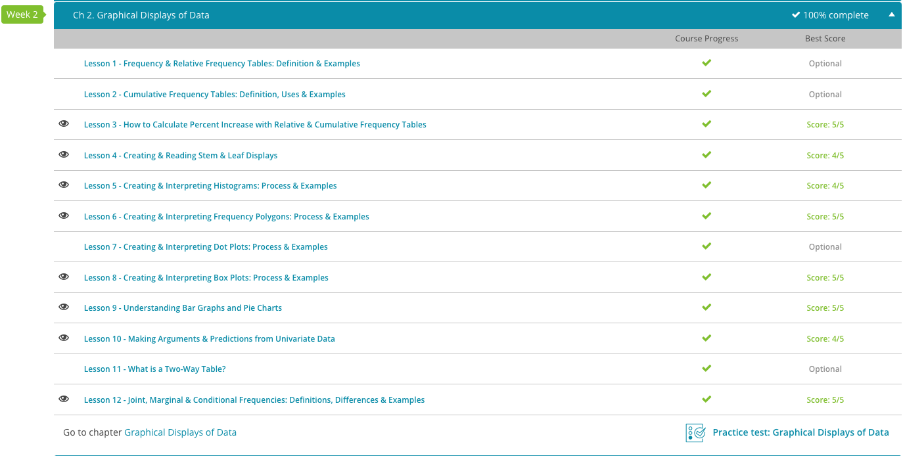

### Andrew Garber
### AP Statistics
### Chapter 2: Graphical Displays of Data
### September 11 2023

#### 2.3. How to calculate percent increase with relative and cumulative frequency tables
 - In mathematical terms, frequency is how often a particular value occurs in a data set. 
 - Cumulative frequency is the total number of times a specific value occurs in a data set.
 - Relative frequency is the number of times a specific value occurs divided by the total number of values.
 - Percent Increase = [(Frequency 2 - Frequency 1) / Frequency 1] ∗ 100.
 - For example: 
 - for the increase in robbery, it would be ((37-33)/33)*100 = 12% increase
 - for the increase in murder, it would be ((8-2)/2)*100 = 300%
 - for the increase in assault, it would be ((16-15)/15)*100 = 7%

#### 2.4. Stem and Leaf Displays
 - A stem-and-leaf display is a visual representation of data where the stem, the data on the left side of the chart, shows one part of the value while the leaves, the data on the right side of the chart, show the other.
 - These help to explain the frequency of data in a highly visual way.

#### 2.5. Histograms
 - A histogram is another graphical representation of the frequency and distribution of data in question.
 - The x axis in a histogram is the values in the data set, and the y axis is the number of times that it appears in the data set.
 - A skewed data set is when the shape of a graph peaks away from center. For analysis of many things, it is helpful to "normalize" a data set towards the center.

#### 2.6. Frequency Polygons
 - A frequency polygon is a line graph created by joining all of the top points of a histogram. They are called polygons because the line the graph creates resembles half of a polygon.
 - They are useful because they can be used to compare two data sets on the same graph.
 - In addition they can:
    - Show the shape of the distribution of data.
    - Can be seen without histogram axes.
    - Have end points that can be extended to make axis lines.
    - Can be used for area comparisons.

#### 2.8. Creating and Interpreting Box Plots
 - A box plot is a graphical representation of the distribution in a data set using quartiles, minimum and maximum values on a number line.
 - A quartile is exactly what it sounds like from its root word, quarter. A quartile is a quarter of a data set.
 - The interquartile range is the value that is the difference between the upper quartile value and the lower quartile value.
 - The median is the middle value of a data set.

#### 2.9. Bar Graphs and Pie Charts
 - When reading a bar graph, it's important to pay attention to the intervals used on the frequency data axis. An interval is the amount of data that occurs between each section or tick mark.
 - A pie chart displays its data in sectors, which are parts of the circle and are proportional to the other parts displayed in the graph. Pie chart values are represented by percentages, with each chart representing 100%. 

#### 2.10. Making Arguments and Predictions from Univariate Data
 - Univariate data is one variable in a data set that is analyzed to describe a scenario or experiment. Sales of a product, for example, would be univariate data.
 - The measures of central tendency are the mathematical concepts that measure the single value that attempts to describe the data set in its entirety. The most common types of measures of central tendency are the mean, median, and the mode. 

#### 2.12. Joint, Marginal, and Conditional Frequencies
 - When analyzing data in a two-way frequency table, you will be looking for joint relative frequency, which is the ratio of the frequency in a particular category and the total number of data values.
 - This is called joint frequency because you are joining one variable from the row and one variable from the column.
 - When analyzing data in a two-way frequency table, you will be looking for marginal relative frequency, which is the ratio of the sum of the joint relative frequency in a row or column and the total number of data values.
 - Conditional relative frequency numbers are the ratio of a joint relative frequency and related marginal relative frequency. 

 