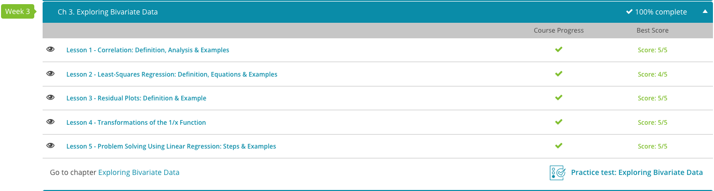

### Andrew Garber
### September 14
### AP Statistics
### Exploring Bivariate Data

#### 3.1. Correlation
 - Correlation is used to describe how data sets are related to one another. Correlation can be seen when two sets of data are graphed on a scatter plot, which is a graph with an X and Y axis and dots representing the data points.
 - 
 - A line of best fit can be drawn through average points of the data to show the correlation between the two sets of data. The line of best fit is a straight line that goes through the average points of the data. The line of best fit can be used to predict future data points(which is known as extrapolation, and is by nature not accurate).
 - Positive correlation means that as one data set increases, the other data set increases as well.
 - Negative correlation means that as one data set increases, the other data set decreases.
 - No correlation means that there is no relationship between the two data sets.
 - This would be an example of no correlation:
 - 
 - Correlation can be calculated as a number called the correlation coefficient (r). The correlation coefficient can help identify what type of relationship the data sets have and how strong or weak that relationship is. The correlation coefficient falls between -1.0 and 1.0.

#### 3.2. Least Squares Regression
 - A linear equation has the form: y = a + bx(as is known to any 7th grader.)
 - For example, if you have three points on a graph, you could find the vertical distance to the equation curve by finding the y-value of the data minus the value of y given by the equation. This is written: y1 - (a + b x1). Squaring this difference and adding it to the contributions from the other points:
 - 
 - This is our sum of squares error, E. A Σ summation notation condenses things.
 - 
 - The least-squares regression method finds the a and b making the sum of squares error, E, as small as possible. Regression is another word for error(think of AI regression modelling).

 - This becomes somewhat more complicated when you are doing a quadratic regression, but the same principle applies.
 - y = a + bx + cx2.
 - The sum of squares error (E) is:
 - 
 - Taking the partial derivatives with respect to A and then simplifying, we get:
 - 
 - And the partial derivative with respect to b and simplifying:
 - 
 - 
 - 
 - Calculating E, we find E ≅ 0.25; not as good as the linear equation nor the quadratic equation.

#### 3.3. Residual Plots:
 - The residual is defined as the difference between the observed height of the data point and the predicted value of the data point using a prediction equation. 
 - When you model data with an equation, the data does not always go, or sometimes never goes, through all of the data points. The residual plot is a representation of how close each data point is vertically from the graph of the prediction equation from the model. It even shows if the data point is above or below the graph of the prediction equation of the model that is supposed to be best fit for the data.
 - A residual plot is a type of scatter plot where the horizontal axis represents the independent variable, or input variable of the data, and the vertical axis represents the residual values. So each point on the scatter plot has the coordinates (input value of data point and residual value of data point).
 - This graph shows a good fit because the points are seemingly scattered randomly around the horizontal axis. 
 - 
 - If you square the residual value for each data point, and then add up all of those squared values you get what is called the sum of the squared residuals. This sum can be found for any prediction equation that you think might be a good fit for the data. However, the prediction equation that is the best fit for the data will have the smallest possible sum for the squared residual values. If the prediction equation is linear the line that fits the data the best is also called the least-squares regression line because the sum of the squared residuals for that line has the least value, or is smaller than the sum for any other line that is being used to fit the data.
 - 

#### Transformations of 1/x function
 - If you follow the function's behavior from left to right, you can see that it's a decreasing function, a function where f(x) decreases as x increases. That makes sense because x is the number on the bottom of a fraction. The bigger the denominator, the smaller the fraction. With negative numbers, it works the same way.
 - 
 - x can never equal zero because then you'd be dividing by zero, which doesn't work. 
 - y can never equal zero because you can't divide one by anything to get zero. The only way you can divide something by something else and get zero is if zero is on top. 
 - You can do a number of transformations to the 1/x function.
    - Adding some value to the function after the division is done moves the graph up and down the y-axis by that many units.
    - Adding some value to x before the division is done moves the graph along the x-axis by that many units.
    - Multiplying the top of the function by some value stretches it out and makes it flatter.
    - Multiplying the bottom of the function by some value compresses it and makes it steeper.
    - Multiplying the top or bottom by a negative value also flips the direction of the function

#### Problem Solving Using Linear Regression
 - This is how AI works.
 - Regression analysis is the study of two variables in an attempt to find a relationship, or correlation. 
 - Linear regression is a prediction when a variable (y) is dependent on a second variable (x) based on the regression equation of a given set of data.
 - Example Data: (1, 10) (2, 11) (3, 15) (4, 12) (5, 17) (6, 18) (7, 20)
 - Now, we use the least squares formula:
 - 
 - We can then add the x*y and x^2 columns to the table:
 - 
 - Now, we can add the columns together to get the sum of each column:
 - 
 - Now, we then plug the values into the formula:
 - 
 - $a = (7 * 458 - 28 * 103) / (7 * 140 - (28)^2)$
 - $a = 322 / 196$
 - $a = 1.64$
 - Now let's use our chart to find the value for b, our line's intercept.
 - 
 - $b = (1 / 7) * (103 - 1.64 * 28)$
 - $b = 8.15$
 - Now we have an equation, y=1.64x+8.15, that we can use to predict the value of y for any given value of x.

COMPLETED: 
- 