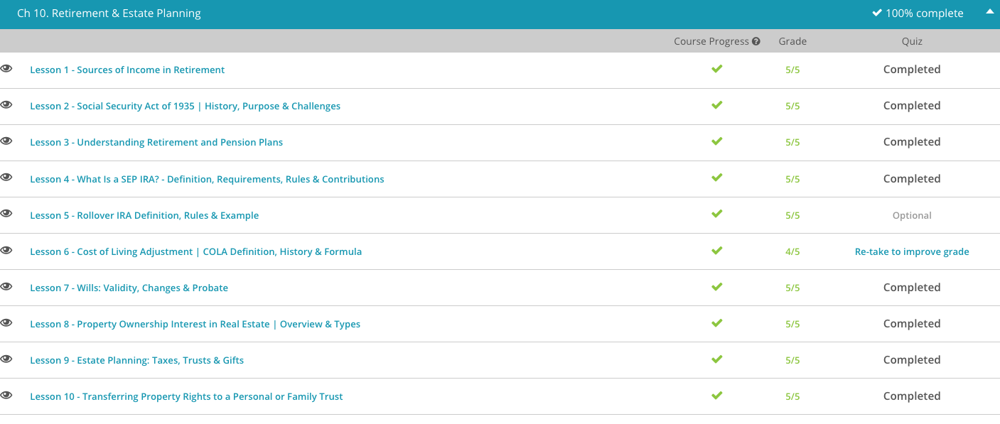

### Andrew Garber

### Personal Finance

### Chapter 10: Retirement and Estate Planning

#### 10.1 Sources of income in retirement

    - First among these is social security, which is a government program that provides income to people who are retired or disabled. The amount of money you receive from social security is based on your earnings history, and the age at which you begin to receive benefits. The longer you wait to begin receiving benefits, the more money you will receive each month. Whether you consider Social Security a bank you pay into or a government program that provides benefits, it is an important source of income for many retirees.
    - Another important source of income is a 401k or other retirement account like 403b. All of these are known as defined contribution plans, which means that the amount of money you receive in retirement is based on how much you contribute to the plan while you are working. The money you contribute to these plans is invested in the stock market or other securities, and the amount of money you have in retirement is based on how well your investments perform. The advantage of these plans is that they allow you to save money for retirement in a tax-advantaged way, and they often come with employer matching contributions. The disadvantage is that they require you to take on the risk of investing in the stock market, and the amount of money you have in retirement is not guaranteed. In addition, you are losing the opportunity to invest in other ways, such as real estate or starting a business, or managing your own investments.
    - There are also less common pension plans, which are known as defined benefit plans. These plans provide a guaranteed amount of money each month in retirement, based on your earnings history and the number of years you worked for the employer.

#### 10.2 Social Security Act of 1935

    - *THIS WILL NOT BE A DEBATE OF THE MERITS OF SOCIAL SECURITY, BUT A DISCUSSION OF THE HISTORY AND PURPOSE OF THE PROGRAM, AND ITS APPLICATION TO RETIREMENT PLANNING*
    - The Social Security Act was just one of many important pieces of legislation passed as a part of President Roosevelt's New Deal. These legislative pieces were all designed to ease troubles for the working class during the heart of the Great Depression. The Social Security Act was passed in 1935 and attempted to address the various social concerns of poverty, unemployment, dependent widows and fatherless children by providing benefits to retirees and unemployed workers and providing a lump-sum benefit to surviving family members upon the death of a worker.
    - it established benefits for: Old-age workers entering retirement, Victims of industrial accidents, Unemployed workers searching for new work, Dependent mothers and children, Blind people and, Physically handicapped people
    - The program has been modified and expanded many times. Today, nine out of ten people age 65 or older receive Social Security benefits, making it the major source of income for most of our country's elderly. In fact, $816 billion will be doled out to nearly 58 million Social Security recipients in 2013.
    - Social Security benefits are funded through the Federal Insurance Contributions Act, or FICA. This is the law governing paycheck deductions that fund the Social Security and Medicare programs. Under FICA, both employees and employers are required to contribute FICA payments. Under the Social Security Act of 1935, benefits were only available to those who worked in commerce and industry.
    - This meant that many vocations, such as government, medicine, law and agriculture, were all exempt from paying the deductions. But, because these people weren't required to contribute to the program, they couldn't collect Social Security benefits. The 1939 amendments changed this.
    - In the original 1935 Social Security Act, the paycheck deductions were classified as contributions and listed in the act itself. As a part of the 1939 amendments, the contributions were reclassified as taxes, largely because the deductions aren't optional for some workers. This part of the law was moved out of the act and into the Internal Revenue Code where other tax laws can be found.
    - It was then renamed the Federal Insurance Contributions Act, though the provision wasn't really new. Additionally, previous restrictions regarding who could participate were lifted at that time. Many categories of workers could still choose not to participate in FICA, but no one was excluded from participating if he or she wanted to contribute.
    - For those who participate in the Social Security program today, a reduced portion of Social Security benefits can be collected starting at age 62. Distribution of full benefits is determined by an individual's birth year. This gradual step eligibility was a part of the 1983 amendments to the act and was put in place, in part, to help ease any strain felt when baby boomers started collecting benefits. For example, people who were born before 1938 are able to collect full benefits at age 65, but people who were born in 1960 or after must wait until age 67 to collect full benefits.
    - Under FICA, employers must withhold a set percentage of each employee's salary during each pay period. The employer must then match that amount and contribute the money to the Social Security Trust Fund. This is a federal government account that provides retirement income, disability insurance, Medicare and benefits for survivors. The fund was established in 1939 as a part of the 1939 amendments to the Social Security Act. The fund is responsible for collecting FICA taxes, or contributions.

#### 10.3. Different Retirement Plans

    - Different businesses use different types of retirement plans. Though all business retirement plans are designed to help employees save money for retirement, the different plans serve slightly different purposes. If you've worked a few different jobs for a few different types of companies, then you've likely encountered more than one type of retirement plan. The plans can seem like an alphabet soup. They include: Individual Retirement Arrangement, or an IRA, Roth IRA, 401(k) Plan, 403(b) Plan, SIMPLE IRA Plan (Savings Incentive Match Plan for Employees), SEP Plan (Simplified Employee Pension), SARSEP Plan (Salary Reduction Simplified Employee Pension), Profit-Sharing Plan, Defined Benefit Pension Plan, Defined Contribution Pension Plan, Employee Stock Ownership Plan (ESOP), 457 Plan, 409A Nonqualified Deferred Compensation Plan
    - Historically speaking, from the 1940s until the mid-1980s the most common type of retirement plan was the pension plan. The employer typically funded this plan, and the employee received the benefits. Today, those pensions are only available to approximately 63% of the private-sector workforce. The pension plans were a great benefit for the employees as they allowed them to predict exactly how much retirement money they would receive because it was based on a predetermined formula. Pension plans are still used in some companies today but are more prominent in the public sector.
    - Let's take a look at how pension plans work. Generally, an employer makes contributions on behalf of the employee. These contributions go into a pool of funds, and that pool is invested. The employee receives the benefits once the employee retires. Until then, the employee generally won't have access to the funds until the employee is vested. This is the amount of time an employee must work for the company before gaining some form of access to the employee's retirement plan funds. The goal is for the pension plan funds to multiply and for the funds to multiply more rapidly because the funds are invested together with the contributions the employer made on behalf of other employees.
    - Defined-benefit plans guarantee that the employee will receive a particular amount of benefit once he or she retires. This is true even if the employer's investments don't do well. With defined-contribution plans, the employer makes a particular contribution amount each month or each paycheck. However, the employee's retirement benefit amount depends on the growth of the employer's investment. Hopefully, the investment does well so the employees can collect generous retirement benefits!
    - The use of pension plans declined slightly in the 1980s when people began moving between jobs more often. Many companies began using 401(k) plans instead. These are slightly more flexible business retirement savings plans named for the Internal Revenue Code section that governs them. There are some major benefits, including: The number one difference between the two is that the 401(k) plan is funded by the employee while the pension plan is funded by the employer., Employees can roll, over a 401(k) into an IRA when they switch jobs, but a pension plan usually stays invested with the old employer., Employees can control some of the investments in their 401(k) plans, but not usually in pension plans., Employees can increase their contributions to their 401(k)s, but not to most pension plans.
    - Also like pension plans, 401(k) plans work by using employer contributions. The employer decides the amount that they will match to the employee's retirement contribution. For example, many companies use a three percent match program. If the employee contributes three percent of each paycheck, then the employer will also contribute that same amount on behalf of the employee each pay period. Remember that most 401(k) plans allow the employee to choose to contribute more; however, the employer will only match up to three percent.
    - There are some major differences between the traditional 401(k) and the Roth 401(k). With the Traditional 401(k):
    - the regular 401(k), Employees contribute from their paychecks before taxes are deducted, Employees pay income taxes when the money is withdrawn, Employees have no access to the funds before age 59 and a half, or if they leave their employer at age 55 or older, Early withdrawal results in a 10% penalty plus paying income tax on the total funds.
    - With the Roth 401(k):
    	- Employees contribute with income that's already been taxed.
    	- Employees don't pay further taxes when they withdraw the funds.
    	- Employees have free access to their money as long as they've had the account for at least five years.

#### 10.4 SEP IRA

    - Let's say Bob wants to set up a Simplified Employee Pension Individual Retirement Account for his company Bob's Designs. The first step is to execute an agreement to inform his employees of the plan, even if he is the only employee. The simplest way to do this is to use a document called IRS model Form SEP-5305. This can be downloaded from the IRS's website and details the plan Bob's Designs is establishing. It says a few things, notably that Bob's Designs cannot maintain another qualified retirement plan, such as a profit sharing plan, at the same time it maintains the SEP plan. If Bob wants to get fancy and change the form, he can design his own form, but that may cost more time and money than Bob desires for right now.
    - The second step is to provide each eligible employee with information about the plan. Typically, providing the employees with the completed IRS model Form SEP-5305 satisfied this requirement. The term eligible employee typically means someone that reaches at least age 21, earns at least $550 for the year (note that this amount may be increased in future years due to indexing), and has worked for Bob's Designs for three out of five years prior to the year for which the contribution is being made.
    - Of course, since this is a new plan for Bob's Designs, when Bob is determining the terms that consist of an eligible employee, he won't want to exclude himself. Employers may choose eligibility requirements that are less restrictive than the ones stated. As far as compensation taken into consideration, most employees will have their SEP contribution based their W-2 wages. The owner's compensation is typically determined by using their Schedule C or K-1, so Bob may want to talk to his accountant about his own compensation. For 2014, compensation in excess of $260,000 is not considered for SEP contributions.
    - Two of the most important rules are for distributions (when Bob or an employee takes out money) and documentation. For documentation, typically Bob and his employees will need Bob's Designs tax identification number (TIN) in addition to the name and address of the business to establish an account.
    - Bob learns that when he or any future employees withdraw money from their account, taxes will be owed. Bob thinks that this makes sense though, especially since he as the employer received a tax deduction when the contributions were made. Further, if Bob or his employees are under 59 1/2 when they make the withdrawal, they may be subject to a penalty. Bob makes note to tell his employees and himself that they should talk to their accountant before taking out any money.
    - Bob also likes that his business receives a tax deduction for what it contributes to his account, although he understands he will pay taxes on what he distributes down the road. The flexibility of the SEP IRA is also appealing, because if Bob's Designs has a bad year, it can forego the contributions. Once Bob's Designs makes a contribution, it is the employee's. Only Bob's Designs as the employer can make contributions. Since Bob already set up the business, he has a business name and tax identification number to give the company helping him establish his SEP IRA. Bob is excited to get started.

#### 10.5 Rollover IRA Definition

    - A rollover IRA is a transfer of monies from a retirement plan to a traditional IRA or a Roth IRA. The transfer is typically called a rollover, and can either be via a direct rollover or an indirect rollover.
    - Traditional 401(k) and 403(b) plans are similar to a traditional IRA in that the employee has not yet paid income taxes on the contribution. Upon distribution, however, income taxes will be owed. Employees typically choose to move traditional 401(k) and 403(b) plans to rollover traditional IRAs. This maintains the tax status.
    - A Roth 401(k), however, is similar to a Roth IRA in that the employee has already paid income taxes on the contribution. Upon distribution, if certain guidelines are met, the distribution can be completed tax-free. Employees with Roth 401(k) plans can choose to move their assets to a rollover Roth IRA. Again, this maintains the tax status. Traditional 401(k) and 403(b) rollovers to Roth IRAs may be permissible, but the amount moved or converted from the traditional to the Roth will be taxable in the tax year of the conversion. Now that you understand the differences in a traditional IRA rollover and a Roth IRA rollover, how do you actually complete the transaction?
    - As mentioned, there are two types of rollovers: direct and indirect. A direct rollover is when the delivering or existing custodian of the money writes the check directly to the new custodian. When this is done, there is no mandatory tax withholding, as the tax status of the assets is maintained.
    - An indirect rollover is when the delivering or existing custodian writes the check directly to the individual, who subsequently deposits the check in the account with the new custodian. When this is done, there is a mandatory 20% federal tax withholding, and state tax withholding if required by the state of residence. If the indirect rollover is completed within 60 days, the individual must deposit the entire distribution, including the federal tax withholding, to maintain the tax status. If not done within 60 days, the rollover cannot be completed. It's extremely imperative to deposit the check to the account with the new custodian within 60 days, as IRS guidelines are strict. IRS guidelines state that you cannot make more than one rollover from the same IRA within a one-year period.

#### 10.6. COLA

    - The Cost of Living Adjustment is an annual change that occurs in salaries or benefit payments as a result of an increase in a cost-of-living index. This lesson will focus on the Cost of Living Adjustment (COLA) specific to the Social Security Administration benefit program.
    - Cost of Living Adjustments are based on increases in CPI-W, or the Consumer Price Index for Urban Wage Earners and Clerical Workers. The U.S. Bureau of Labor Statistics calculates the CPI-W index monthly. COLAs are effective for December of the current year, and those benefits are paid in January of the following year. The Cost of Living Adjustment is the percentage increase in the average CPI-W for the third quarter of the current year over the average for the third quarter of the last year in which a COLA became effective.
    - The formula can then be written as: (A - B) / B * 100 = i
    - A = Average CPI-W for 3rd quarter of current year , B = Average CPI-W for 3rd quarter of the last year in which the COLA was effective, which may or may not have been the previous year, i = Cost of Living Adjustment, in percent

#### 10.7. Wills: Validity, Changes & Probate

    - Wills allow for the final wishes of a person to be carried out after their death, and can be restrictions for the distribution of assets, guardianship of children, and other matters.
    - There are a a few requirements for a will to be valid. Legal age: one must be at least 18 years of age to draft a will, Capacity: one must be of sound mind and free of mental illness, Free will: the testator, or person drafting and signing the will, must do so voluntarily and not be under any duress or threat, Intent: the testator must want to draft a will to dispose of property in the event of death, Proper disposal of property: all property must be the testator's to distribute, Signatures: the signatures of the testator and witnesses must be dated
    - There's no specific way to draft a will. However, there are certain parts that should be included. Most wills name an executor, or the person responsible for disposing of assets and property. There can be more than one executor of a will.
    - A will should also include references to a person's assets. Assets can take the form of money, homes, jewelry, cars, pets, or any other item a testator wishes to leave behind.
    - If children are involved, a will should name a guardian, the person or persons who will be legally responsible for a testator's children under the age of 18. If a testator chooses to leave money to minor children, that money should be in a trust, or a fiduciary agreement whereby a third party will distribute assets or property to the children.
    - Sometimes, changes in a person's life require changes to a will, like a divorce, death of a spouse, or changes in asset ownership. There are two ways a will can be changed. The easiest way to change a will is to revoke it, which means writing a simple statement of cancellation and then a new will. When revoking a will, all copies of the original should be destroyed, so there is no confusion upon a testator's death. Another way to change a will is by writing codicils that reflect a testator's new wishes. Think of codicils as addendums to the original will. Although codicils are perfectly legal, they can be confusing. This is especially true if there are many changes.
    - When Grandma Betty died, it was time to execute her will, which meant it went into probate. Probate is nothing more than the legal process of distributing a deceased person's property and assets.
    - It is possible to write wills which direct the direction of assets(specifically business assets) in a way that allows them to be managed in accordance with the deceased's wishes. For example, if I died but owned a business, I could write a will that directed my business to be sold, or to be managed by a specific person. This is a way to ensure that the business is managed in a way that the deceased would have wanted.

#### 10.8. Property Ownership Interest

    - A possessory interest is the intent and right of a party to occupy or exercise control over a particular plot of land. This is the type of ownership most of us think about when we think about land ownership. There are three main types of possessory interests: fee simple absolute, life estate, and leasehold. Let's start with the greatest possible interest in land.
    - A fee simple absolute is an ownership interest that includes all rights in the land. Just as the name suggests, this type of estate represents absolute ownership of the land. A fee simple absolute owner may do whatever he or she chooses with the land. The owner can use the land, destroy the land, give the land to someone else, and take items from the land. The landowner is limited only by zoning and building codes or other governmental restrictions.
    - The landowner can deed or will the entire fee simple estate to another person. This means that, should the landowner die without a will, the fee simple absolute ownership will automatically pass to the owner's heirs. Sometimes, a fee simple interest isn't absolute. There are times when a fee simple interest is granted, but the interest comes with certain conditions. These are known as conditional estates. Let's look at two examples
    - There is also fee simple determinable wich is an ownership interest that automatically ends when a specific event occurs.
    - This is similar to a fee simple subject to a condition subsequent. In this type of ownership interest, a landowner may reclaim the land if a specified event occurs. Notable difference here is that it doesn't automatically end, the landowner must take action to reclaim the land.
    - Let's turn to another form of possessory interest. A life estate is a land interest that expires upon the death of a specified person. Life estates aren't common, but this type of interest can be helpful for estate planning purposes.
    - The last type of possessory interest is called a leasehold estate. A leasehold, or lease, is an interest in real property that grants possession for a particular duration. The lease can last for one year, can last for many years, can be week-to-week, or can be month-to-month. The duration doesn't matter, as long as it's specified in some way. A leasehold doesn't grant actual title to the land. Therefore, the lease owner can't will the property to someone else. Rather than a deed or title, the lease owner will have a lease agreement that dictates the rights and obligations of both the lease owner and the property owner. The lease will terminate and the property owner will regain all rights if one or both parties violate a term of the lease agreement.
    - Leases are quite common. There are four main types of leases:
    	- Estate for years. In this type of lease, the duration of the lease is specified as a certain period using calendar time. The lease both starts and ends on a particular date, as set out by the property owner.
    	- Periodic tenancy. In this type of lease, the exact duration of the entire lease isn't specified, though the lease is for a definite period of time that automatically renews. These leases usually run month-to-month or week-to-week until either the lease owner or the property owner gives notice of termination.
    	- Tenancy at will. In this type of lease, either party can terminate the lease at any time and for any reason, though most states require that notice of termination be given to the other party. The lease start date is specified but the end date is indeterminate.
    	- Tenancy at sufferance. In this type of lease, a specified lease date has expired, but the tenant remains on the property. This type of leasehold begins as an estate for years, but then converts into a periodic tenancy. For example, I lease an apartment through January 1, but I fail to find another apartment by January 2. So, I remain in my current apartment and my lease converts to a month-to-month until I either sign a new lease with my current landlord or I terminate the lease by giving notice and moving out.
    - Now, let's take a look at a non-possessory interest. A non-possessory interest is an interest in real estate that doesn't include a current right to possess the land. There are several different types of non-possessory interests in real property. One type of non-possessory interest is known as a future interest. As the name suggests, this type of interest is a legal right to receive full ownership of a property at some point in the future. The future interest becomes a current interest on a particular date or upon the occurrence of some event.

#### 10.9. Estate Planning Taxes

    - Unfortunately, no one lives forever. Although it might be a little bit uncomfortable to think about, planning for the people you care about can save them time and money after your death. The formal process of developing a plan to distribute your assets after death is called estate planning.
    - Although it might seem daunting, estate planning can be relatively straightforward if you break it into a few simple steps: List all assets and determine their value, Choose beneficiaries, Create a will.
    - In order to put together a plan to distribute your assets, you'll first need to figure out what types of assets you have. Assets are personal possessions, including homes, cars, and jewelry. But your assets are more than just what you have in your safe-deposit box or your jewelry box. Life insurance and investments are also assets that need to be part of the planning process.
    - Once you've made a list of all of your assets, the next step is to choose beneficiaries. A beneficiary is a chosen recipient who receives the death benefit from the benefactor, or the person giving the benefit. Most assets are a mix of physical and monetary possessions, such as a home or a life insurance policy. When you are creating a plan, you can choose to give the all of your assets to a single beneficiary, or you can split them up.
    - A trust is a contract between the owner who transfers property to a second party for the benefit of a third party.
    - The Internal Revenue Service (IRS) has rules about monetary gifts to beneficiaries. Each year, there is a maximum amount that you can give to others without having to pay extra tax. But if you have a large estate, you might want to explore other ways to gift money without major tax implications - especially since, if you give money away, you, and not the recipient, will be responsible for the gift tax.

#### 10.10: Giving Property

    -  A trust is a legal structure used to hold and manage property for the benefit of one or more persons. A family trust is a trust created to benefit persons who are related by blood or law. A trust involves three parties. A trustor/settlor/grantor, truestee, and beneficiaries.  A trustee owes a fiduciary duty to the beneficiaries, which means he has a duty to act in the best interest of the trust beneficiaries, even if that conflicts with his own interests. You should note that in some trusts, the same person acts as the trustor, the trustee, and the beneficiary.
    - A trust can be revocable or irrevocable. A revocable trust is a trust that can be amended or revoked by the trustor. Typically, a revocable trust is one where the trustor, trustee, and beneficiary are the same person until that person dies. In Brad's case, once he dies, his children become the trust beneficiaries, his brother takes over as trustee, and the trust becomes irrevocable. An irrevocable trust cannot be revoked or amended without the consent of the beneficiaries.
    - There are some advantages to using a trust. It can help avoid the probate process and the associated costs. It can also help reduce estate taxes.
    - A trust does impose some disadvantages. Unless the trustor names herself as trustee, the trustor loses both actual and legal ownership and control over her property. Moreover, even if the same person is technically the trustee, she'll owe a fiduciary duty to all beneficiaries, which can create ethical and legal problems if there are several. Additionally, creating a trust with the aid of an attorney costs money and professional trustees will charge fees for their services.

