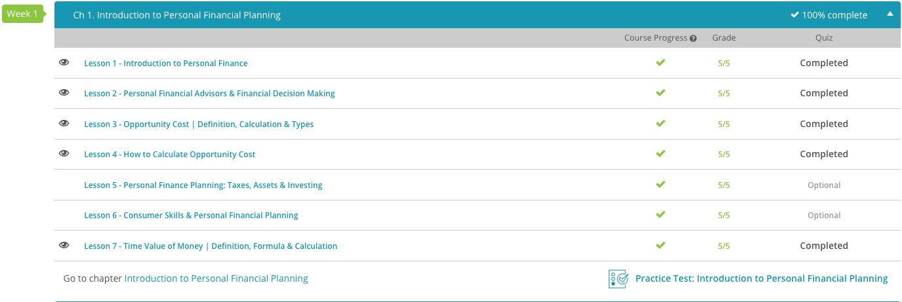

### Andrew Garber
### March 18 2024
### Personal Finance
### Chapter 1: Introduction to Personal Finance

##### 1.1 Introduction to Personal Finance
 - Assets are the things you own that have some monetary value. Cash is an asset, and so are old baseball cards or the china and silver you inherited from your grandparents. The difference between cash and the other physical assets is their relative liquidity, which refers to how easily something can be turned into cash.
 - Liabilities are the debts you owe. If you have a mortgage, a car loan, or a credit card balance, those are all liabilities. The difference between assets and liabilities is your net worth, which is the difference between what you own and what you owe. Some liabilities can be cash-flow liabilities, which are debts or costs over time. Asset-related liabilities are those you pay to increase equity in an asset.
 - Net worth is your assets minus your liabilities. 
 - While assets, liabilities, and net worth are all important financial metrics used to assess your personal financial health, cash flow is what pays the bills. Cash flow reflects how much money you have coming in compared to how much of your money goes out during a specific period of time. Under the right conditions, a negative net worth may be acceptable; however, a negative cash flow can be a sign of serious financial problems. 
 - Cash flow is also an important consideration for lenders when you ask for a loan. If you apply for a mortgage, most lenders will want to see a debt-to-income ratio of less than 50%. This means you're currently spending less than half of your monthly income on payments and bills.

#### 1.2. Personal Financial Advisors & Financial Decision Making
 - Most people don't realize a budget is simply an income statement of the individual's income and expenses. Income includes wages, monies from investing, or loans received. Expenses include rent, utilities, food, and other costs. Discretionary income is the money left over that is typically used for savings, emergencies, and non-recurring expenses.
 - Credit is the ability to borrow money. If a lender can't assess your ability to pay bills on time, then they may deny you credit or charge a higher interest rate. An interest rate is a fee to borrow money. Shoutout Jay Powell.
 - While it makes sense to establish credit, paying off the balance at the end of every month, or paying more than your monthly payment will ensure a high credit score. A credit score is a consolidated numerical value of your payment history.
 - A loan has three parts: the principal, how much you borrow, the interest, the fee to borrow money, and the term, the length of time you have to pay back the loan. 
 - A pension is where a specific percentage of the employee's pay is deposited into a fund. These funds are invested, and when the employee retires, they receive a monthly benefit for life. 
 - Another type of retirement plan is a 401k, which can be employer-sponsored or opened by the employee at a financial institution. A 401k is usually more voluntary, where the employee decides how much to deposit, and the retirement benefit is determined by the employee's contribution.
 - There is also social security, but that is a different topic(and semi-unjust, in a fairly Nozickian sense, but that's a different topic for a different day).

#### 1.3. Opportunity Cost
 - Opportunity cost is the value of the next best alternative that you give up when making a decision. For example, if you decide to go to college, the opportunity cost is the money you would have earned if you had worked instead. This example is a bit of a simplification, because the quantifiable value of a college education *while* you are getting it is not the same as the quantifiable value of a college education *after* you have gotten it, but the point stands.
 - Time is also a valuable resource - as Lucius Annaeus Seneca said, "It is not that we have a short time to live, but that we waste a lot of it." When Benjamin Franklin originally explained this concept in his book, titled Advice to a Young Tradesman, he said that ''time is money.'' He was trying to communicate the concept of opportunity cost by saying that what you do with your time, whether or not you are productive, can be just as important as any decision you make with money. Work on things important to you immediately, and don't procrastinate, don't waste time on bullshit. We don't have much time on this earth, and we should use it wisely and mindfully.
 - However, in a similarly Stoic sense, we are actually making a decision to do something with our time--and eating the opportunity cost--when considering past decisions and regretting them. We are wasting time by regretting past decisions about wasting time. 

#### 1.4. Calculating Opportunity Cost
 - Opportunity cost is a relative concept, which means that you're finding out how much of one thing you can produce in comparison to another thing.
 - Let's say the two things we produce are corn and beef. We can use land to either produce corn or produce beef.
 - The next thing we need to know in order to calculate opportunity cost is how much corn could we produce compared to how much beef we could produce. And remember that we're using the same amount of resources, so this kind of problem really is going to give us a basis for comparing two alternative choices.
 - If one acre of land can produce 10 tons of corn, or 5 tons of beef per season, the opportunity cost of either is 2 tons of corn = 1 tons of beef. Economics is all about getting the best results with the least amount of effort or producing a larger quantity of one thing with the same amount of resources. If the price of corn is $2 per ton, and the price of beef is $5 per ton(made up numbers, obviously), then the opportunity cost of producing corn instead of beef is a loss of $0.50 per ton of corn *relative* to beef. You can still make a profit, but you're not making as much as you could be.
 - Now, these are *objective* values - but the *subjective* value of something, perhaps an experience, education, or a relationship, or labor(because the labor theory of value is dumb) is not easily quantifiable. As much as I wish it were, it's not. Thus, the opportunity cost of doing something that is not quantifiable must be considered according to the individual's values, goals, precisions, and personal heuristics.

#### 1.7. The Time Value of Money
 - This is *not* the same as a theory of value. A theory of value is a theory of what makes something precious, useful, or desireable in an economic sense. Money is simply a medium of exchange, and that medium does have a certain value unto itself for its utility as a medium.
 - The value of future value, or how much money put in the bank today will end up as in the future, is determined by the input, the interest rate, and the time. The formula for this is $FV = PV(1 + r)^n$, where FV is the future value, PV is the present value, r is the interest rate, and n is the number of periods.
 - $100 in the bank for 5 years at a 5% interest rate will be worth 127.63.
 - The formula for present value, or how much you need to save today to have a specific amount at some point in the future is: $PV = FV/(1 + r)^n$. Where PV is how much he needs to have today, FV is the future value, r is the interest rate, and n is the number of periods.
 - An annuity is a series of equal payments or deposits made every year. Hence the same root as "annual", or "anniversary". If the annuities are deposited at the end of the year, or at the end of the period, it is called an ordinary annuity. If the annuities are deposited at the beginning of the period, it is called annuity due.
 - The future value of an annuity, for example putting $1500$ in savings every year for an ordinary annuity, is $FV = A * {(1 + r)^n - 1}/r$, where A is the annuity, r is the interest rate, and n is the number of periods.
 - For an annuity due, so for the beginning of the year, the formula is $FV = A * {[(1 + r)n -1] / r} * (1 + r)$
 - FV is how much you will have at the end, A is the payment, r is the interest rate, and n is the number of periods.
 - The present value of an annuity is when you want to know how much you need to save today to be able to draw a specific amount every year. The formula for this is $PV = A * {(1 - (1 + r)^-n)/r}$, where PV is the present value, A is the annuity, r is the interest rate, and n is the number of periods.

