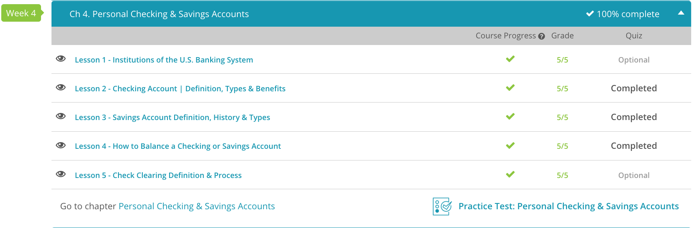

### Andrew Garber
### Personal Finance
### Chapter 4: Personal Savings

# 1. Institutions of the U.S. Banking System
 - When you think of a bank, you are probably thinking about a commercial bank. Her commercial bank is a depository institution. At a commercial bank, they accept deposits from individuals and businesses who place their money in the bank in a savings, checking, or money market account.
 - Meet Sam who works at a savings and loan association. Sam's savings and loan association accepts deposits like commercial banks. However, unlike a commercial bank, a savings and loan association is owned by the people that deposit money in it. Also, unlike commercial banks, who lend money for a variety of reasons, the primary business of a savings and loan association is to lend its deposits to people seeking to buy houses. However, Sam's business has expanded quite a bit because savings and loan associations have moved into providing services like those provided by commercial banks, such as checking account services.
 - Now meet Chris who works at credit union. Credit unions are nonprofit. The members of a credit union are the very people that deposit money with it. Credit unions are established to serve a particular group of people, such as teachers or employees of a particular company. The idea is to provide cheaper banking to members than provided by commercial banks. You can do this if you are not trying to earn a profit for your owners. Nowadays, credit unions provide most of the same services as a commercial bank to its members. Chris can set up a checking and savings account, help finance the purchase of a home, or restructure a member's debt.
 - An investment bank is an entirely different kettle of fish from the other banking institutions we've discussed so far. Investment banks are involved in raising capital for government and businesses rather than loaning money to individuals. Investment banks help companies issue stocks and bonds to raise money. They underwrite IPOs, mergers, and acquisitions. 

# 2. Checking Account 
 - A checking account is a financial account that offers easy access and security of your money for daily transactional needs. It allows you to deposit your paychecks and withdraw money for vacations, going out to eat, or anything else you would like to spend your money on. If you want to utilize a debit card or get cash out of an ATM, you must have a checking account opened at a financial institution. These accounts usually have a minimal fee or no fee at all and are an essential part of most people's financial lives.
 - As the name implies, these accounts offer the basics. If you're looking to use a debit card, get cash occasionally at an ATM, and write a few checks, this may be the account for you. These accounts are likely to have a small monthly or yearly fee which can be waived if you have a minimum balance or if you direct deposit your check every month. These accounts usually pay little to no interest.
 - These types of accounts are best for individuals who are not worried about maintaining a higher balance and do not write a lot of checks or plan a lot of monthly withdrawals. Sometimes it may make sense to have a basic checking account for daily transactions and a money market or interest-bearing account with your extra money.
 - For obvious reasons, Free Checking is a popular type of checking account. Free checking accounts have no monthly service charges or additional fees regardless of balance, number of checks written, or other activity. You can direct deposit, usually pay bills online, and write checks through these types of accounts, just like you could with a basic checking account. However, these accounts will usually pay the lowest amount of interest compared to any other accounts.

# 3. Saving Account Definition
 - You can use a savings account as an account to save your money and earn interest on it at the same time. Savings accounts are the least profitable type of short-term investments. Though they are simple, liquid, and easily accessible, they offer low yields. Most savings accounts do not even keep up with inflation, so you might not want to use them to store money over long periods of time.
 - Saving accounts have been dropping since the late 1980s, and the interest rate for it is not great.
 - 
 - There are three common types of savings accounts, which are traditional savings accounts, certificates of deposit, and money market funds.
	- A traditional savings account is an account held at a bank or credit union. People are allowed to deposit funds into the account and earn a small amount of interest. The funds can be withdrawn quickly and easily when needed by the customer.
	- Certificates of deposit (CD) are a very common type of short-term investment that is available to anyone. After making a deposit into a CD, the person agrees not to withdraw it for a specific period of time, in return for a higher yield. CD lengths range from three months to as long as five years. CDs are federally insured, so they are one of the safest types of short-term investments.
	- Money market funds are typically liquid savings accounts that offer a better yield. Money market funds are not federally insured, unlike the traditional savings account. This makes money market funds a higher-risk vehicle for short-term savings.

# 5. Check Clearing Definition & Process
 - Check clearing is the process of moving funds from one account to another. To make this easier to understand, let's think about a regular banking transaction, such as depositing checks.
 - What does that mean? It simply means that the checks, once deposited into the bank, need to be transferred to the clearing system, which then communicates with the other banks that the checks are from. The bank that Cindy uses has a policy of allowing customers to access the first $200 dollars, as long as their accounts are in good standing.
 - A customer pays for their goods using a check. The check is presented to the business. The business deposits the check in their bank. The bank sends the check to a central clearing house. This can be either a Federal Reserve bank or a private clearing house. A check that is drawn on another bank and is presented to a clearing house is called a transit check or a not-on-us check. The clearing house then communicates with the issuing bank to make sure that the money is available. If the money is available, the funds are cleared. If the money isn't available, then the check is returned, and the bank can charge the depositor who wrote the check an overdraft fee.
 - Banks are required to provide customers with disclosures stating when their funds will be available for withdrawal. This law is known as Regulation CC. The Check Clearing Act, known as Check 21, is used by many banks to make check clearing more efficient. Instead of the bank sending the physical check to the clearing house, the bank now sends a digital image. Checks clear faster this way.

