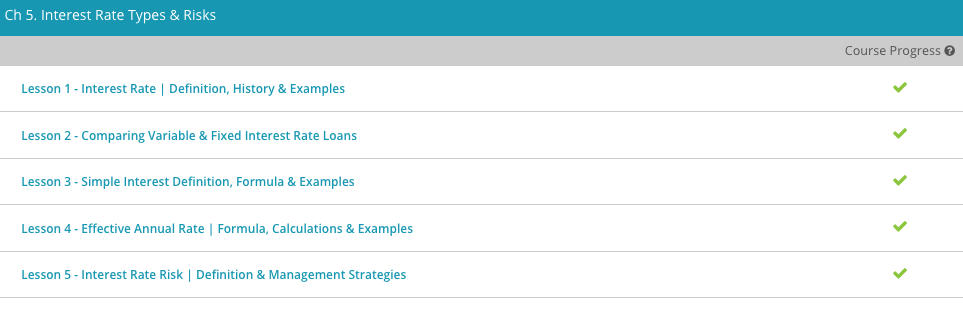

### Andrew Garber
### Personal Finance
### Chapter 5: Interest Rates

### 5.3. Simple Interest Definition
 - Simple interest is a type of interest that is applied to the amount borrowed or invested for the entire duration of the loan, without taking any other factors into account, such as past interest (paid or charged) or any other financial considerations. Simple interest is generally applied to short-term loans, usually one year or less, that are administered by financial companies. The same applies to money invested for a similarly short period of time.
 - The amount borrowed or invested is called the principal. 
 - It's customary for financial institutions to quote a quantity called the interest rate as a percentage. This interest rate represents a ratio of the principal borrowed or invested. Typically, this interest rate is given as a percentage per year, in which case it is called the annual interest rate. For example, if we borrow $100 at an annual rate of 5%, it means that we will be charged 5% of $100 at the end of the year, or $5.
 - The loan period or duration is the time that the principal amount is either borrowed or invested. It is usually given in years, but in some cases, it may be quoted in months or even days. If that is the case, we need to perform a conversion from a period given in months or days, into years.
 - The simple interest formula allows us to calculate I, which is the interest earned or charged on a loan. According to this formula, the amount of interest is given by I = Prt, where P is the principal, r is the annual interest rate in decimal form, and t is the loan period expressed in years.

#### 5.4. Effective Annual Rate 
 - However, this number that you see is not the effective annual rate, the actual interest rate when the calculations are done more than once a year, because the interest rate that they show you is the interest rate if the calculation is done just once a year. With credit card companies, the calculations are done on a monthly basis. Let me show you the difference when the calculation is done once a year versus once a month.
 - Say we have an annual interest rate of 11%. If we have $500 in the account, then at the end of the year, we will have $555 if we make the calculation just once a year. Now, if we make the calculation on a monthly basis, at the end of the year we will have $557.86. We have slightly more here than when our calculation was done just once a year.
 - The formula is:
 - 
 - In this formula, the i stands for the interest rate that is given to you by the company. The n is the number of times that calculations are made in a year. So, if calculations are done on a monthly basis, the n is 12. When using this formula, we change our percentage to decimal form.
 - Let's use this formula for our 11% annual interest rate and see what our effective annual rate is when our calculations are done on a monthly basis. Plugging in 0.11 for i and 12 for n, we have (1 + 0.11 / 12)^12 - 1 = 0.1157 for a percentage of 11.57. So, our effective annual rate is 11.57%.

#### 5.5. Interest Rate Risk 
 - Interest rate risk is one of five types of risk that are not specific to the firm that affect the return on investments in stocks and bonds. Unlike the other four types, interest rate risk has a significant effect only on bonds. If the required return, the return the market demands on the investment, is higher or lower than the bond's coupon rate, the rate on which interest payments are based, the price of the bond adjusts to provide the market's required return. As a result, if interest rates change, bond prices also change and bond investors can unexpectedly gain or lose money. Reinvestment rate risk, the risk that the investor won't be able to reinvest the money received from a bond at the same rate, is another form of interest rate risk.
 - In reinvestment rate risk, the concern isn't price, but rather the ability to reinvest the money received from a bond at the same rate. In this case, lower interest rates push the required returns on bonds down. As a result, investors must either settle for the lower return or expose themselves to increased risk in order to earn the same return.
 - The market interest rate is really the sum of five factors: the risk-free interest rate, the default risk premium, the inflation risk premium, the liquidity risk premium, and the interest rate risk premium. The four risk premiums are different for different levels of risk, and for now we'll assume that they don't change.
 -  Previously, we saw that an increase in interest rates causes the price of a bond to fall. The reverse is also true: if interest rates fall, bond prices increase. With that in mind, let's say that the Federal Reserve starts buying Treasury bonds in an effort to force their price up and their return down, thus lowering the interest rate by lowering the risk-free rate. With the exception of inflation, Treasury bonds are considered to be essentially risk free. Not only will the prices of Treasury bonds increase, all bond prices will increase, and it will be impossible to reinvest the money you had in bonds into new bonds at both the same return and the same level of risk.
 - There is a reason that Treasury Bonds are "0% Risk", it is because they have a far lower return than other bonds or the stock market(on average).
 - Interest rate risk will always be present to some degree in bond investments, but there are some ways to mitigate the risk. Zero coupon bonds are a form of bond that makes no interest payment and pays back its face (par) value at maturity. If we assume that a zero-coupon bond with a par value of $1,000 that matures in 10 years is selling to yield 7.5%, its price at issue will be $485.19.
 - A similar security is the stripped Treasury, which is a zero-coupon bond backed by coupons stripped from a Treasury bond with equal maturity. These were first introduced by Merrill Lynch in 1983, when the nation was recovering from a period of unusually high interest rates, resulting in interest rates that were falling very rapidly. Investors purchased the stripped Treasuries (Merrill Lynch called them TIGRs or tigers, standing for Treasury Investment Growth Receipts) at a discount similar to zero coupon bonds and were repaid the par value at maturity. The difference was that the Treasury bond coupons backing these bonds provided an extra degree of protection. They were essentially free of default risk, for example, making them attractive to insurance companies, pension funds, and other institutional investors.
 - Two additional strategies are available that will mitigate, but not necessarily eliminate, interest rate and reinvestment rate risks. The immunization strategy depends on finding a bond with the same duration as your need for the money. Duration (the full name is the Macaulay duration) is the weighted average maturity of the bond's cash flows. Calculating bond duration is a lengthy and rather complicated process, so we won't go into it here. The final strategy is to use financial futures contracts to hedge against interest rate risk. 

