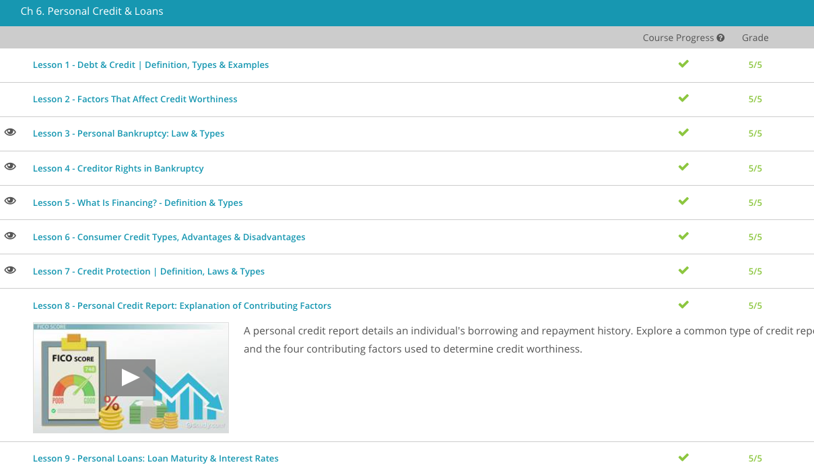

### Andrew Garber
### Personal Finance
### Chapter 6: Personal Credit and Loans 

#### 6.3
 - What happens if you simply cannot pay your debts? Many people consider filing for bankruptcy, but what exactly does that mean?
 - Bankruptcy is a legal term. A bankruptcy ruling means a court makes a legal determination that a debtor cannot currently repay the debts he or she owes. A bankruptcy ruling allows the debtor the legal right to reorganize his or her debts. It can also sometimes allow him to discharge, or dismiss debts. Of course, this is helpful to the debtor, but it is also designed to benefit creditors, the institution that is owed money by a debtor. Bankruptcy helps creditors because it enables them to collect some of what they are owed.
 - Let's take a closer look at the laws governing bankruptcy. There are different types of bankruptcy, designed for different types of debtors. However, all bankruptcies are governed by Title 11 of the United States Code. Title 11 is a collection of federal laws known as the Bankruptcy Code. Because they are federal laws, the bankruptcy process works generally the same in all states.
 - The types of bankruptcy are commonly referred to by their Bankruptcy Code chapter number. The two types used for personal bankruptcy are: Chapter 7 and Chapter 13. 
 - Chapter 7 bankruptcy is the most common type. To qualify for this, a debtor must first prove that his income is insufficient to pay off debts. Next, a bankruptcy court will appoint a trustee for the debtor's estate. The trustee is responsible for liquidating the estate. A liquidation means the debtor's assets are sold, and the proceeds are distributed to his creditors. Exempt assets aren't sold in the bankruptcy process; the debtor gets to keep them. Exemptions can vary from state to state, but normally include life necessities such as household appliances, some clothing, and one car. Everything else is considered to be a non-exempt asset and will likely be sold in order to cover the debtor's debts. This includes stocks, antiques, vacation property, recreational vehicles, and second cars.
 - After liquidation, creditors are paid in a particular order, known as priority. The order is set out in the Bankruptcy Code. Due to priority, some creditors might be paid in full while some might not be paid at all. For example, the law requires tax bills to be paid before credit card bills.
 - Not all debtors qualify for Chapter 7 bankruptcy. If a debtor earns more than the median income in his state, he may be required to use Chapter 13 bankruptcy instead. Chapter 13 serves as a structured repayment plan, usually in the form of a more manageable monthly payment. Chapter 13 is meant to aid debtors who have a regular source of income, but not enough income to pay all of their debts as they come due. This type of bankruptcy allows debtors to keep their assets and avoid foreclosure and repossession. The debtor's payments are restructured so that the debtor can manage the payments.
 - Once the bankruptcy court approves the Chapter 13 repayment plan, the debtor will make regular payments to the trustee. The trustee then makes payments to the creditors. Under the plan, the debtor must fully repay all secured creditors and all priority debts, like tax bills and child support. However, he won't usually be required to fully pay all unsecured debts.

#### 6.4
 - Now let's take a look at a third type of bankruptcy proceeding. If I decide to file bankruptcy as a business, then I'll consider a Chapter 11 proceeding. This type is a reorganization of debt for businesses. It's used for businesses that owe more than they are worth and want to restructure their debt but remain in operation. Some famous companies, like Six Flags and General Motors, have restructured through Chapter 11.
 - Before restructuring, the bankruptcy trustee must conduct an investigation and file a restructuring plan with the bankruptcy court. The plan must be approved by the bankruptcy judge and also typically by a creditor's committee. This is a committee appointed to represent the claims of the debtor's creditors. Under the plan, each creditor must receive at least as much as the creditor would receive in a Chapter 7 bankruptcy.
 - A restructuring means that the business can reduce and modify its debt obligations. The plan should help the business recover profitability and move forward as a successful enterprise. Under Chapter 11, a debtor can downsize if necessary by selling some or all of its assets. This is what GM did in 2008/2009. The company sold off some of its brands to raise cash, and used the cash to pay off some of its debts.

#### 6.5.
 - Financing means asking any financial institution (bank, credit union, finance company) or another person to lend you money that you promise to repay at some point in the future. In other words, when you buy a car, if you do not have all the cash for it, the dealer will look for a bank that will finance it for you. Upon approval, the bank will pay the car dealer the money for the car, and then they will send you a bill each month. The bank will lend you this money if you agree to pay interest on top of the money lent to you. In other words, financing is borrowing money with a promise to repay that money and some additional fee, or interest, over a period of time.
 - Why do banking institutions loan money to people? It is simple: they want to earn a fee, or interest, for loaning out their money. For instance, someone could borrow $100 from a bank for one year at a six percent annual interest rate. At the end of that year, the borrower owes the bank $106. That doesn't sound like much, but banking is a volume business. If the bank loans out $1,000,000 or $1,000,000,000, then the bank can earn a lot of money in interest, fees, and services.
 - Some may decry this as unjust, but I see nothing unjust about this. They are providing a service just like any other, and they should be compensated for it. If you don't like the terms of the loan, then don't take it. If you don't like the interest rate, then don't borrow the money. It is as simple as that.
 - There are three main types of financing that people use every day:
	- Revolving or Credit Card Financing: The issuer of the card, or the bank, creates a revolving account and grants a line of credit to the user, or customer. The customer can borrow money from the credit card for payment to merchants or receive a cash advance.
	- Mortgage Financing: A bank or mortgage lender will loan a large amount of money to a customer, typically 80% of the price of a home, and the customer must pay it back with interest. If the customer fails to pay back the loan, the lender can take the home through a legal process known as foreclosure.
	- Personal Loan: A personal loan is borrowing a sum of money from a financial institution for personal use. Individuals may use the money for almost anything. Some examples are a vacation, a car, home improvements or bill consolidation, etc.
 - Generally speaking, there are two types of financial loans. The first type is called a secured loan and the other is an unsecured loan. Let's look at detailed information on both loan types:
	- Secured Loans are loans that are secured with collateral. A great example of this is a car loan. When someone finances a car, the promissory loan lists the car as collateral and informs the borrower that if he stops paying or defaults on the loan, the financial institution will take the car back. In other words, the car is the collateral on the loan and represents the asset being financed.
	- Unsecured Loans are loans that are not secured with collateral. An example of this might be a personal loan that someone will use to take a vacation. For a borrower to qualify for this type of loan, he or she must have very good credit. In addition, these types of loans generally have a higher interest rate.

#### 6.6
 - Credit allows consumers to take possession of the items with a promise to repay over a specific period of time. Jan visits the furniture store her neighbor suggested and inquires about its credit options. For the rest of this lesson, we'll discuss the three different types of consumer credit: installment, non-installment, and revolving credit. You'll also learn about repayment requirements and if there's a cost to borrow the money.
 - They usually review what's called the five Cs of good credit: character, capacity, capital, collateral, and conditions. Character means how long you've been employed and if you pay your bills on time. Capacity evaluates your income and household expenses. Capital equals how much you own minus how much you owe. Collateral represents something tangible the borrower provides the lender in the event of default. Examples of collateral include a deposit, car, and home. Lastly, lenders take into considerations conditions, which include such things as the economy. Now let's review the different types of credit.
 - Installment credit is where the lender provides approval for that particular purchase and credit does not extend beyond that amount. It is not possible to add additional purchases to this type of credit, and once the original amount is paid off, Jan or any other customer must reapply if further credit is needed. The repayment period could extend months or years, depending on the original arrangement.
 - Non-installment credit is a one-time loan that must be repaid in full by a specific date. This type of credit is not revolving, meaning that once the loan is paid off, the credit is no longer available. The repayment period is usually short, such as 30 days. This can frequently get into loan shark territory, where the interest rates are very high.
 - Revolving credit is similar to a credit card - when charges are paid, the amount is available to make purchases. Customers are free to charge any amount up to the credit limit. If the customer has not reached the limit, then they can add additional purchases up to the credit limit. Each month the borrower will make payments towards the balance, plus interest, until the balance is paid off. It's important to make payments on time, and if the customer does, the lender may periodically increase the credit limit. However, if payments are late, the lender can reduce the credit limit and leave negative marks on the borrower's credit report.

#### 6.7.
 - Credit protection is just one of the many forms of consumer protection. It's a collection of laws, regulations, and services designed to help preserve credit health for both individuals and businesses. The protections are geared toward both those who seek credit and those who are already debtors. The credit protection efforts mostly work to shield consumers from any practice that might harm a consumer's ability to obtain future credit, typically by preventing practices that might unfairly result in an adverse impact to the consumer's credit score.
 - Our federal consumer protections, and therefore our federal credit protections, are regulated through the Federal Trade Commission (FTC). The FTC calls itself our nation's consumer protection agency. There are several different offices and bureaus within the FTC. One of these is the Bureau of Consumer Protection, or BCP. According to the FTC, this bureau works for the consumer to prevent fraud, deception, and unfair business practices in the marketplace.
 - The bureau has several main functions. The BCP:
	- Enforces consumer protection laws and regulations
	- Conducts investigations and litigation regarding fraudulent, unfair, or deceptive business practices
	- Develops rules and regulations as well as suggests laws to Congress
	- Educates individuals and businesses on their consumer and credit rights
 - The FTC's BCP regulates our federal credit protection laws. There are numerous federal credit protection statutes that have been developed and enacted throughout the years. Let's take a look at some of the federal laws specifically meant to protect our credit rights.
 - The Truth in Lending Act - It was enacted in 1968 and requires these lenders to disclose all credit terms, including finance charges. The goal is for borrowers to efficiently and accurately calculate the true cost of borrowing money.
 - The Fair Credit Billing Act - It's an amendment to the Truth in Lending Act enacted in 1974. It instituted several provisions that speak directly to credit protection. For example, it requires credit card companies to promptly credit accounts and correct billing errors.
 - The Fair Debt Collection Practices Act was enacted in 1977. It prohibits various abusive debt collection practices. For example, it prohibits debt collectors from calling you before 8:00 a.m. or after 9:00 p.m. in your time zone.
 - The Fair Credit Reporting Act - This is part of the Truth in Lending Act, enacted in 1970. It allows consumers access to their credit reports and sets out the procedures consumers can follow to correct any reporting errors or dispute any reported information.
 - The Fair Credit and Charge Card Disclosure Act is an amendment to the Truth in Lending Act, enacted in 1988. It brought about a fuller disclosure of the terms and conditions contained in credit card applications, such as interest rates and annual fees.
 - The Equal Credit Opportunity Act was enacted in 1976. It prohibits creditors from discriminating against applicants with respect to any credit decision. Discrimination can't be based on race, color, religion, national origin, gender, marital status, age, the fact that the applicant receives public assistance, or because the applicant exercised rights under the Consumer Credit Protection Act.
 - The Credit Card Accountability, Responsibility and Disclosure Act, or Credit CARD Act, became effective in 2010. It places several different prohibitions on credit card companies. For example, companies can no longer issue credit cards to people under age 21 without proof the person can pay the debt or without a parent or guardian co-signing the application.
 - I personally do not believe that the government should be involved in regulating credit. I believe that the market should be allowed to operate freely. If a company is engaging in unfair practices, then the market or the courts will correct it. The government being involved here simply amplifies innacurate price signals and distorts the market.

