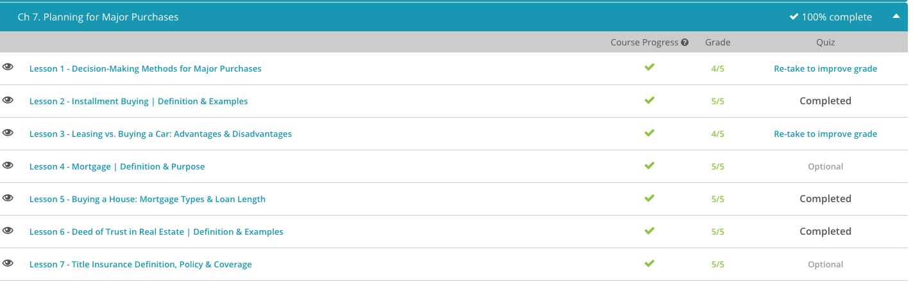

### Andrew Garber

### Personal Finance

### Chapter 7: Planning for Major Purchases

#### 7.1: Decision Making

    - The first key is needs vs wants. Needs are things that are necessary for survival, while wants are things that are not necessary for survival.
    - Next is to question whether something to be purchased is necessarily needed as new, or if it can be bought used.
    - The third key is to consider the opportunity cost of a purchase. This is the value of the next best alternative that is given up when a decision is made.
    - Fourth is to question whether the purchase is a good value. This has many factors, but things such as warranties, quality, price, and utility should be considered.
    - The fifth key is to consider whether renting, leasing, or buying is optimal for the situation. Renting is usually the most expensive option, but it is also the most flexible. Leasing is a good option for those who want to drive a new car every few years, or who value optionality. Buying is usually the cheapest option, but it is also the most permanent. You are also stuck with the depreciation of the item.
    - Finally, the sixth key is to consider the total cost of ownership of whatever item. If you are  financing it, if so interest is a factor.

#### 7.2: Installment Buying

    - Some companies will sell you something that costs quite a bit of money and let you make an installment purchase. This kind of purchase lets you pay for the item in several future payments. You get to enjoy the item while you pay for it.
    - You might see an advertisement for a knife set where you pay just four payments of $59.95. Installment purchases can be simple like that knife set or they can be more complicated. That all depends on the kinds of terms involved. Some installment purchases will have interest included while others won't.
    - The terms are the conditions of the installment purchase. They tell you what kinds of payments to expect and when you need to pay them. For the knife set, our terms are very simple. All we need to do is to make 4 monthly payments of $59.95 and we are done. There is no interest mentioned here. These are simple terms.
    - More complicated terms may have an interest payment involved. They might say that you need to make monthly payments for 5 years and also pay an annual interest of 5%. These more complicated terms are for much larger purchases, such as a car costing you $20,000.
    - Because there is an interest involved in our terms now, our monthly payment won't be the cost of our car divided by the number of months. We also have to include the interest payment. The formula for this is:

- 
  - Let's use this formula to calculate our monthly payments for our car that costs $20,000. Note that if n is yearly, then r will be the annual interest rate. If n is monthly, then r will be the monthly interest rate or the annual interest rate divided by 12. The annual interest rate is 5, so for monthly payments for 5 years is 60 payments. To get the monthly interest rate we divide 0.05/12 whic his 0.00416666667. We can now plug in our numbers to get our monthly payment. The monthly payment will be $377.42.

#### 7.3. Leasing vs Buying a car

    - If you want to keep the car until the tires fall off, then buying is one main advantage. Car loans usually have a term of 4-6 years. After the loan is paid off, you no longer have to make payments and can save the money or use it for other purposes.
    - Another advantage of buying is there are no mileage restrictions. If you drive a lot, you can put any number of miles on the vehicle because it's yours. While buying has advantages, there are also disadvantages; for one, the lender typically expects a significant down payment. A down payment is a percentage of the purchase price that reduces the total loan amount. For example, if the car costs $40,000, the lender may require a 5% down payment, or $2,000. You would then finance the car for $38,000 ($40,000 - $2,000).
    - Another disadvantage is negative equity. Negative equity exists when the car is worth less than the loan amount. Let's say you finance the car for $38,000, and six months later, the car manufacturer decides to discontinue the GZ Sport model. Suddenly, the value of the car drops significantly since it's not a popular car any longer. Let's say you decide to sell the vehicle, but buyers are only willing to purchase the car for $33,000, resulting in negative equity of $5,000 ($38,000 - $33,000). This means a buyer will give you $33,000 towards the loan payoff, and you're responsible for the other $5,000 to totally payoff the loan.
    - The advantages of leasing include a smaller down payment, as well as monthly payment. The smaller payments may also allow you to qualify for a more expensive vehicle.
    - Leases typically last about three years, and all parts and labor are covered under the warranty, ensuring you're not stuck with hefty repair bills. Some leases also have purchase options that allow you to purchase the vehicle after the end of the lease. Now let's review the disadvantages of leasing.
    - One major disadvantage is mileage restrictions. Most leases requires you to drive less than 15,000 miles per year, and any overages are charged on a per-mile basis. For example, let's say you drive 5,000 miles over your mileage limit. You could be charged $.25 per mile, or $1,250. Another disadvantage of leasing is that you never pay off the car and are essentially renting. Once the lease ends, you can purchase the vehicle (if that's an option), buy another car or lease another car. You never receive a break in making car payments.

#### 7.4. Mortgage

    - A mortgage is a loan and legal contract to finance the purchase of a home. In return for the bank loaning you money to purchase a home, it designates your new home as collateral. If you don't make your agreed upon payments, collateral gives the bank the right to take back the property and sell it to cover the debt. The process of the bank or lender taking back a home is often referred to as foreclosure. This is something you obviously want to avoid. Instead, you'll want to repay the debt and honor your contract by making monthly installments or payments that typically include the principal, interest, taxes and insurance for the home.
    - The problem with getting that first home is that it can be very expensive. It could easily take several decades to save enough money to pay cash for a home. Thus, many first-time homebuyers take out a mortgage instead. From the borrower's perspective, mortgages help those with a stable income and adequate credit history purchase a home earlier in their lives. Mortgages also can be used to repair or renovate a home or provide additions, such as an additional bedroom or a garage, to a home. From a lender's perspective, a mortgage provides a way to make money by charging interest on a loan, while protecting themselves with collateral in case of non-payment.
    - Now, let's take a look at some of the common components of a mortgage. We'll start with term. This is the amount of time you have to repay the loan. The most common terms are for 10, 15, and 30 years. As a general rule, the shorter the term the lower the interest rate on your loan. So if you're looking to pay your house off quickly and want to pay as little interest as possible, a 10- or 15-year loan might be a good idea. If you're more concerned with having lower monthly payments than paying extra interest, a longer term loan, such as 30 years, would be a better fit. Terms for 30 years are more common with first-time homebuyers and those focused on maximizing cash flow.
    - Next is principal. The principal is the amount of money you borrowed to buy your home. Before the principal is financed you might be required to make a 10% to 20% down payment. This shows the lender you have a vested interest in the property and increases the chances that you won't default on your loan agreement.
    - Interest is the amount the lender charges you to use the money you borrowed. This is usually expressed in a percentage rate, such as 5% or 6%. Your monthly payments largely go to interest during the early years of your loan repayment and to principal later. For example, if your house payment is $1,000 per month, $700 of that might be to pay interest in the early years on your loan with the remaining $300 going toward the principal, real estate taxes, and insurance.
    - Escrow is another component of a mortgage. This is part of your mortgage payment that is set aside by the lender to pay certain taxes and homeowner's insurance.
    - Next, we have private mortgage insurance (PMI). If your down payment is less than 20%, your lender might consider your loan riskier than those with larger down payments. Real estate taxes are taxes your local or municipal government charges you based on the value of your home.
    - And, finally, there is homeowners insurance. This covers your home and personal property against losses from fire, theft, weather and other causes.

#### 7.5. Buying a house

    - 7.4 first
    - A Federal Housing Authority (FHA) loan is a government-backed loan that provides less stringent qualifying factors for first-time homebuyers. Many new homebuyers choose an FHA loan because the down payment is lower. The required down payment is the percent of the purchase price required to reduce the loan amount. For example, if FHA requires a 3.5% down payment on a $100,000 home, they require $3,500 down and will only finance $96,500 ($100,000 - $3500). While an FHA loan may require a lower down payment, these loans have some restrictions.
    - The conventional loan addresses some of the disadvantages of an FHA loan, for example, there is not a maximum loan amount, and the home does not need to be owner-occupied. However, there are some disadvantages, such as a much larger down payment may be required, sometimes up to 20%. Therefore, if you're purchasing a $100,000 home, the down payment would be $20,000. Now let's look at a Veteran's Administration loan.
    - Veterans are men and women who are serving or have served in the armed forces. The Veteran's Administration (VA) loan is another government-backed loan and can be obtained by a veteran, spouse, widow or widower, and dependents. The main benefit of a VA loan is that a down payment may not be required. Additionally, there may be a lower interest rate than offered for an FHA or conventional loan, and income and debt requirements are more flexible. Based on the information Jan has heard at the seminar, she thinks an FHA loan suits her best.

#### 7.6. Deed of Trust

    - A deed of trust is an alternative method to mortgages in some states that lenders can use to secure payment of home loans. It is an agreement that includes the trustor, the trustee, the beneficiary. The trustor is the borrower who grants the deed of trust. The trustee is a neutral third party that receives legal title of the real estate from the trustor and holds it for the benefit of the beneficiary. The beneficiary is the lender.
    - While the trustee holds legal title, the trustor/borrower maintains equitable title over the property, entitling the borrower to the occupation, use, and enjoyment of the real estate.
    - Should the trustor default on her loan, the trustee is empowered to sell the real estate for the benefit of the beneficiary/lender who will be paid the money owed on the loan. Once paid in full, legal title will be returned to the trustor.

#### 7.7. Title Insurance Definition

    - The purpose of title insurance is to protect buyers and lenders from risks of claims against their rights. Imagine that you purchased a home and received the title from the previous owner. One month after moving in, you receive a notice demanding payment for an outstanding tax bill from the previous year. If the bill is not paid, your home will be auctioned off to satisfy the debt. Although you were unaware of the bill, as the new owner, you are responsible to pay it. The unpaid bill is an encumbrance.
    - An encumbrance is anything that hinders rights within the title. There are voluntary and involuntary encumbrances. Involuntary encumbrances commonly arise from lawsuits resulting in judgments and liens, such as a mechanics lien, which is when a contractor sues a property owner for payment. They could also be caused by clerical errors or fraudulent transfers of title. An example of a voluntary encumbrance is a mortgage. For instance, you agree to allow a lender to place a lien against your property as collateral until you repay the loan.
    - During real estate transactions, title companies are hired to investigate the history of the title to verify information and identify encumbrances. This includes a search of public records that may uncover liabilities, such as liens, judgments and outstanding debts. The searcher compiles the information in a title report
    - After examining the title report, risks are assessed. A determination is made regarding the status of the title and requirements that must be met before insurance can be issued. In some real estate transactions, a party may obtain an attorney's opinion of a title instead of purchasing title insurance. Although an attorney's opinion serves as an acceptable professional perspective, it does not provide the financial protection of title insurance on claims against the owner's rights.
    - A title insurance policy is a contract of indemnity. To indemnify means to compensate for damage, losses and liability. Title policies do not guarantee that there are no encumbrances, liens or defects in the title. Instead, it is as if the insurer is saying, 'If a claim results from a past event that affects the title, we will hold you harmless and pay it.' If the insurer pays a claim on your behalf, they may exercise subrogation rights, allowing them to take legal action against whomever caused the loss in order to recover the amount of the paid claim. The two primary types of title insurance policies are an owner's policy and a lender's policy.
    - An owner's policy protects the rights of the owner(s) and their heirs. The policy will remain in effect as long as the owner(s) or their heirs retain a right to the title of the insured property. Coverage for the owner will not exceed the purchase price.
    - In order to get a mortgage, a lender may require the buyer to purchase a lender's policy on their behalf. The insurance company will compensate the lender for losses up to the loan amount. As payments are applied to the loan, the value of the lender's policy decreases. When the loan is paid in full, the lender's policy will become ineffective.
    - Title policies specifically state covered risks, endorsements, exclusions, exceptions and conditions. Schedule A of the title policy references the effective date, insured parties, owner(s) and their interest in the land, coverage amount and the insured property description. It also lists covered risks that may include defects in the title caused by fraud and even an unpaid real estate tax bill.
    - But just as health insurance does not cover all medical expenses, there are exclusions to coverage in title policies. Some exclusions may include zoning regulations or claims caused by bankruptcy. Schedule B of the title policy lists exceptions from coverage, such as the former owners' utility bills. Title policies include conditions that may be required before the insurer pays a claim, such as proof of loss.

