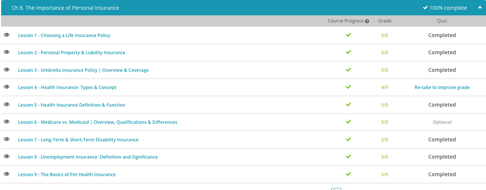

### Andrew Garber

### Personal Finance

### Chapter 8: Personal Insurance

#### 8.1. Life insurance

    - Many think life insurance is only for middle-aged people. But this isn't true. It is a good idea to talk to a licensed life insurance agent when you turn 18 years old, to determine if you need a policy.
    - For example, if your parents are helping you through college by taking out a student loan in their name, you need life insurance. If you were to die before graduating, or before the loan was paid off, your parents would still be responsible for loan payments. Life insurance proceeds could be used to pay off the loan.
    - In this example, you would be considered the insured, or the person being covered, and your parents would be the beneficiaries. A beneficiary is a person who is designated to receive life insurance proceeds. It's important to note a beneficiary does not need to be a family member. It can be a friend, charitable organization, a business or even a dog.
    - Life insurance can also be used to pay off a mortgage or other expenses, provide for college education, or simply allow the beneficiary(ies) to live comfortably.
    - The simplest form of life insurance is a term policy. A term policy provides coverage for a specific period of time. Life insurance terms can be 5, 10, 15, or 30 plus years. Upon receipt of your premiums (or payments to keep the policy active), and after the agreed upon term ends, coverage ends.
    - Let's use the parent-student loan example again. Your parents take out a $50,000 student loan and agree to pay it off in 10 years. They can obtain a 10 year term life insurance policy, which would provide coverage if you died before the loan were paid off.
    - In addition to providing coverage for a specific period of time, a term policy is also the least expensive of the life insurance policies. However, the biggest disadvantage is that coverage ends at the end of the term.
    - Whole life insurance is considered permanent insurance, since it provides coverage until your death. Similar to term, whole life provides financial protection and the ability to elect your beneficiaries. However, a main advantage of whole life is that it can build cash value.
    - When you make monthly premiums, the life insurance company invests those premiums. If they make money from the investment, it shows on your policy as cash value. The more premium payments you make over time, and the more successful the company's investments, the more cash value your policy builds.
    - Life insurance coverage is a legally binding agreement between the insured and the insurance company. As long as the insured provides factual information on the application, and makes the agreed upon premiums, the insurance company will pay out the proceeds upon death.
    - Providing accurate information about your age, health, and occupation is essential in determining your premium. A young, healthy person's premium will be much cheaper than an older person with numerous health problems, but an older person in excellent health may pay a smaller premium than a child with cancer. Some insurance companies may require a medical examination to assess the applicant's health condition.
    - Risk is also a factor in considering premiums. For example, a teacher's monthly premium will be less expensive than an airline pilot's, due to the nature and risk of a pilot's job. Entrepenurs may also pay higher premiums, due to the uncertain nature of their jobs.

#### 8.2. Personal Property & Liability Insurance

    - If you owned a $250,000 house and it was totally destroyed by fire, would you have the money to rebuild the home? Most would answer 'no,' hence the purpose of homeowner's insurance. Homeowner's insurance protects your home, personal property and detached structures against perils, which are the causes of losses. Perils could include fire, flood, hail, tornadoes, and much more. The homeowner's policy includes a liability component. If someone becomes injured on the property, such as Brown in our example, the policy will pay for the loss up to a specified amount. The homeowner's insurance also protects the owner against defamation. If the homeowner legally insults another person, at the home or another location, the policy could also pay in the event of a lawsuit.
    - Similar to a homeowner's policy, renter's insurance provides coverage for the items in the apartment as well as liability coverage. However, it does not provide coverage for the structure itself. For example, let's pretend your apartment is struck by lightning and the roof catches on fire, destroying your personal items. Your renter's policy will cover your personal items, whereas the roof and any structural damage would be covered by the apartment owner's policy.
    - Automobile insurance generally offers four main types of coverage: liability, property damage, medical and uninsured motorist. Property damage, medical, and uninsured motorist coverage provides protection for the policy owner, while liability provides coverage to the other driver. Only liability is mandated by law, meaning most states have financial responsibility laws requiring drivers to purchase liability coverage. As such, basic automobile insurance often includes only liability coverage with the option to add other types of coverage.
    - A PULP, or personal umbrella liability policy, protects against liability. If your homeowner's, automobile or renter's policy does not provide enough coverage in the event of a lawsuit, the PULP can provide the additional monies to cover the damages. Additionally, the PULP is also called a stand-alone policy, meaning you can purchase the coverage separately.

#### 8.3. Umbrella Insurance Policy

    - Umbrella insurance is a supplemental insurance product that provides coverage above the limits of other existing insurance policies. These policies also cover special situations that are usually excluded from other policies, such as if John were sued for libel, slander, or false arrest. The umbrella insurance policy begins paying for claims once the underlying coverage is maxed out.
    - Asset protection is a planning process that keeps a person from coming after someone's personal assets, like a house, car, or bank accounts in the event of a lawsuit. Most people have a homeowner's or automobile policy, but these policies may not provide enough coverage in the event of a lawsuit: perhaps for something like libel or slander. An umbrella policy can provide the additional coverage up to the limit of the policy.

#### 8.4. Health Insurance

    - Health insurance is a form of insurance that is used to pay for the treatment and diagnosis of certain medical conditions. It's important that you choose a health insurance plan that fits your lifestyle, monetary budget, and specific health needs. There are six major types of health insurance: Fee-for-service or traditional indemnity plans, Preferred provider organization (PPO), Health maintenance organization (HMO), Point-of-service (POS) plans, High-deductible health (HDHP) plans, Consumer directed health (CDHP) plans
    - Fee-for-service plan is one of the more straightforward types of health insurance. You can go to any doctor that you choose, and your doctor will submit a claim directly to your insurance company for payment. These plans usually have a deductible, which is a set amount that you are required to pay before your insurance kicks in. For example, your insurance company may not start paying benefits until after you've paid $250 toward medical expenses. After you reach your deductible, your insurance will cover a set percentage of your medical expenses.
    - Advantages: Flexibility in choosing a medical care provider, You can receive care just about anywhere in the U.S.
    - Disadvantages: More expensive than other plans, Some services, such as check-ups and preventative care, may not be covered, High amount of paperwork, i.e. saving receipts for payment reimbursement
    - A PPO (preferred provider organization) is a type of insurance plan where the insurance company has contractual agreements with certain 'preferred doctors and hospitals to offer services at a reduced rate. When you receive care from one of the preferred providers, you pay less than what you would if you receive care from a provider that is considered out-of-network (not a preferred provider). PPOs usually have a co-payment, which is a set amount that you have to pay for in-network providers. You may also still have a deductible.
    - In HMO (health maintenance organization) plans, you are given access to certain doctors and hospitals, and you can only see a specialist after you have obtained a referral from your primary care physician (PCP). Your PCP is in charge of managing your health care needs. Treatments that you receive outside of your network are usually not covered.
    - A POS plan contains features of both the PPO and HMO models. POS require the selection of a PCP; however, you have the option of going to a provider outside of your network and paying a higher amount. Your health insurance company will pay the cost if your PCP refers you to a doctor outside of your network.
    - A CDHP (consumer directed health plan) is high deductible insurance plan that is linked to a health savings account or some other similar product. A health savings account is a savings and spending account that is tax-exempt and can be used to pay for certain medical expenses. There are specific requirements that you have to meet in order to be eligible for the HSA.

#### 8.5. Health Insurance 2

    - Health insurance is a financial agreement for the payment of health-related costs made between an individual, such as yourself, or group of individuals and an insurance company. A person pays a premium for their health insurance. This is an amount that needs to be paid every set period of time to an insurance company in order to receive specific benefits. Some premiums are less than $100 a month and others can be well over $1,000 a month.
    - A premium is sort of like having to pay a monthly fee for cell phone service; if you don't pay up, you won't be able to make or receive calls. But just because you have health insurance and always pay your premium on time that does not mean that your insurance policy covers every aspect of your health care, nor does it mean that you will have no other out of pocket expenses for your health care costs. You'll see what I mean once we finish up this lesson.
    - In your agreement with your health insurance company, there are different roles and regulations that govern your use of the policy and covered costs. For instance, there is something called a deductible. This is an amount of money you must pay for health care services covered under your plan before the insurance company begins to pay for these services, meaning if your deductible is set at, say, $1500, then your insurance company doesn't pay anything for you until you pay the first $1500 for health care services that are actually subject to the deductible.
    - This is kind of like telling someone that you'll help them buy a car, so long as they pay a certain amount for it themselves prior to you even beginning to chip in. The deductible doesn't always apply to all services under your plan so you must read the terms of your contract very carefully. While you must pay your premium on a regular basis to be covered by health insurance, a deductible (or even any part of it) does not have to be paid at all until you actually use a health care service.
    - Another important concept related to your health care you must understand is coinsurance. Coinsurance is the percent share of the costs of a covered health care service that you are responsible for. This coinsurance kicks in only once you have already paid out all, that is to say 100%, of your deductible for the year. So, let's just say that in addition to your mandatory monthly premium, you've already paid out 100% of your deductible for covered health care costs and services you have used during the year.
    - Then, for some reason, you have to go to the doctor again where the doctor performs a $1,000 procedure covered under your plan. If your coinsurance is 20%, then your out of pocket costs for that procedure will be $200, which is 20% of $1,000. The rest (80%) of the bill will be paid to your doctor by the health insurance company.
    - Coinsurance should not be confused with a copay. A copay is a fixed amount, usually small, which you pay towards a service at the time of service. For example, when you go to the doctor you usually pay a certain amount right as you go to visit the doctor. A copay is a separate charge, one that's not part of the monthly premium, deductible, or coinsurance. It's sort of like having to pay at the entrance of a movie theater for a ticket to get in and see the show.
    - Now, just like your policy may cap the maximum amount you are responsible per year for out of pocket coinsurance costs, the insurance company might cap the amount of money they are responsible for a certain procedure. This is called fixed indemnity, a type of coverage that only pays a set amount for a particular service or procedure. As an illustration, if a procedure you are going to get costs $2,000, but the insurance company only covers $1,000 for that procedure, you are responsible for the other $1,000 out of pocket. Other times a health insurance plan simply has exclusions, procedures or services not covered by the policy at all. This means you are fully responsible for the cost of the service. Many times cosmetic procedures are subject to such exclusions.

#### 8.6. Medicare vs Medicaid

    - Medicare is a federally funded health insurance program for people 65 years of age or older. While commonly associated with the elderly, Medicare does provide health benefits for people of any age that have certain disabilities or if someone has end-stage kidney failure. Medicare was officially established in 1965, is administered by the Centers for Medicare & Medicaid Services (a part of the U.S. Department of Health and Human Services), and much of the funding for this social program comes from federal payroll taxes. The Centers for Medicare & Medicaid Services used to be known as the Health Care Financing Administration.
    - Medicare Part A, hospital insurance, covers the following things: Hospital stays, Care in skilled nursing facilities, Hospice care, And for some home healthcare
    - Medicare Part B, medical insurance, covers: Doctor's services, Outpatient hospital care, Medical supplies, Preventative services
    - Medicare Part C, Medicare advantage plans, refers to a Medicare health plan that is actually offered by a private company working in tandem with Medicare to provide a person with both Part A and Part B, and many times offers Medicare Part D. Medicare Part D is prescription drug coverage.
    - This is important for me to distinguish because Medicaid is such a similar term, but Medicaid is used as 'aid' by low-income people. More technically, Medicaid is a federally and state-funded program, administered by each individual state, which provides government insurance for people of any age whose incomes are insufficient to pay for healthcare.
    - Medicaid helps to provide millions of Americans with important healthcare, especially children, people with disabilities, seniors, and pregnant women.
    - At least according to federal guidelines, the Affordable Care Act (colloquially called Obamacare), recently expanded the coverage and therefore eligibility requirements for people to receive Medicaid. As of January 1, 2014, individuals under the age of 65 and with incomes of up to 133% of the federal poverty level qualify for Medicaid. But some of these numbers can be tweaked by individual states.
    - I personally disagree with subsidizied health care, this kind of government sponsored(and taxpayer funded) healthcare just for taxpayers is only necessary because of ridiculous government regulations that have driven up the cost of healthcare in the first place. Let the free market operate and we would have genuinely affordable, competitive healthcare. But that's a topic for another day.

#### 8.7. Disability Insurance

    - A isability is a mental or physical condition that limits a person's activities. There are two types of disability insurance: short-term and long-term. Short-term disability insurance provides coverage for a short period of time, usually 6 months or less. Long-term disability insurance provides coverage for a longer period of time, usually 6 months or more. Disability insurance can be provided by an employer or purchased by an individual. The cost of disability insurance is based on the individual's age, health, occupation, and the amount of coverage needed. The cost of disability insurance is usually less expensive than life insurance. Disability insurance can be used to pay for medical expenses, lost wages, and other expenses that may arise due to a disability. Disability insurance is an important part of a financial plan because it provides financial protection in the event of a disability.

#### 8.8. Unemployment Insurance

    - Unemployment compensation is a type of social insurance benefit paid by a state or federal government to eligible unemployed workers to help provide for the necessities of life. Unemployment payments will help Nathan pay for groceries, gas, utilities and help him keep up with his mortgage payments until he finds new employment. The unemployment insurance in the United States was provided for under the Social Security Act of 1935. Each state administers its own program, subject to federal standards. Nathan will apply for benefits through his state's unemployment office. Unemployment benefits are not indefinite. The typical period of eligibility is 26 weeks. However, in times of severe economic hardship, such as a recession, the federal government may extend benefits for a longer period of time. This is one of the (few) parts of the New Deal I support.
    - The Federal Unemployment Tax Act (FUTA) establishes part of the funding for unemployment compensation. It is a form of payroll tax that is paid by employers. The tax is based upon wages paid to employees. Unlike other payroll taxes, Nathan and other employees don't have any taxes withheld for unemployment. You can really think of the tax as being an insurance premium that employers are paying for unemployment insurance coverage. The taxes are paid to the U.S. Treasury's Federal Unemployment Trust where each state has its own account.
    - States also levy a tax on employers for unemployment coverage. This tax is often referred to as the State Unemployment Tax Authority (SUTA). State tax rates are based upon the amount of benefits people received in the past years from the unemployment fund. The state taxes are also a form of a payroll tax that are not deducted from employee wages.
    - Not everyone is eligible to receive unemployment benefits. While state eligibility requirements vary, all states generally require that an individual have worked for a minimum amount of time and earned a certain amount of wages. Additionally, an unemployed person must not have left employment on a voluntary basis without good cause.
    - Unemployment compensation has significant effects on employers, employees and the economy in general. Unemployment benefits are often the sole means of affording life's necessities for unemployed individuals and their families. An increase in unemployment in a state may increase the tax assessed to employers paying into the system. Additionally, employers who do not lay off employees may be entitled to a tax credit. This, of course, affects employers' bottom line.

#### 8.9. Pet Health Insurance

    - Pet health insurance allows many people to afford medical care for their pets, and at least one study suggested that this would help decrease unnecessary euthanasia of animals as a result. It's important you know all of the terms above when talking about pet health insurance with clientele so they can make a sound decision about health insurance for their pets. There are many pet health insurance companies, with each one having their own twists to my definitions and examples we just went over.
    - Despite the many positives of having pet insurance for a pet, pet insurance companies often place a lot of lifetime limits, or caps, on the amount they are willing to pay for any given condition, or for a pet's entire medical expenses in general, so each pet owner should read their policy carefully as to how much the insurance company is even willing to cover in the first place.
    - And some conditions may not be covered at all, especially for certain breeds of animals that are predisposed to congenital or hereditary problems. A congenital problem is a defect or abnormality present at birth that may or may not arise as a result of a genetic defect; whereas a hereditary problem is a genetic condition that's transmitted from parents to offspring that can cause disease in the offspring. Unlike a congenital condition, a hereditary condition or disease need not be present at birth.
    - Just as much, pre-existing health conditions are almost always excluded from health insurance coverage. This is why it's important for owners to get health insurance for their pets before trouble begins instead of when it's too late. Every policy's exclusions should be read just as carefully as all of its coverages and benefits prior to the purchase of a pet insurance plan.

