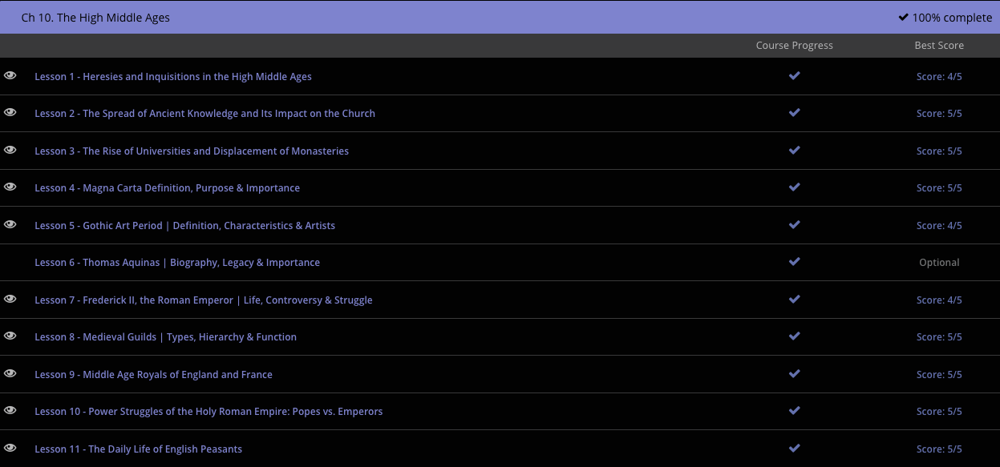

### Andrew Garber
### December 8 2023
### CLEP Western Civilization I
### Chapter 10: The High Middle Ages

#### 10.1. Heresy and Inquisition
 - Classical knowledge is knowledge of philosophy, science and astronomy in the ancient cultures around the Mediterranean Sea. Until the Middle Ages, classical knowledge was reserved for those who could read and write. This means that knowledge was heavily limited to the clergy and monks, who copied these texts to preserve them as treasures, but not to spread knowledge. As the population increased in Western Europe due to advances in technology and agriculture, there was a higher need for literate people to help keep records. Churches could no longer handle the growing need for education, and schools began to develop. Schoolmasters taught science and philosophy based on the classical manuscripts to many people. Students were encouraged to discuss this knowledge and exchange ideas. Although some scholars, like Thomas Aquinas, attempted to link classical philosophy with church doctrine, the spread of classical knowledge led to a deeper understanding of the church's place in society. There was a growing dislike of the church's power in secular matters, as well as the immense wealth and the corruption it created. 
 - Sometimes heretical beliefs became popular enough to see the formation of sects. One of these sects was known as the Cathars, or Albigensians. This group was popular in the 12th and 13th centuries in Italy and parts of southern France. Cathars were dualistic, meaning they believed in good and evil. They associated good with things that were spiritual and intangible, while they associated evil with things that were tangible. Cathars didn't acknowledge the sacraments performed by the Catholics, and didn't accept the physical birth and death of Jesus. They were very dissatisfied with the wealth of the Catholic Church and the large cathedrals they built. 
 - Pope Innocent III declared a crusade, or a holy war, against the Cathars in 1209 and succeeded in dissolving much of the group in France. Afterwards, the Inquisition occurred to root out any other Cathars and eliminate their practices. The Inquisition was the Catholic Church's weapon against heresy.

#### 10.2. The Spread of Ancient Knowledge
 - Aristotle is back on the menu!
 - Classical knowledge spread throughout Western Europe after the discovery of works of the ancient Greeks and Romans. During the Crusades, there was a large amount of people traveling to the East to join the movement. Classical manuscripts could be found in places like Armenia, Constantinople, Syria and Alexandria. Many manuscripts were obtained and brought back to Europe. Many intellectuals would hunt for these manuscripts and work to translate them from Greek into Latin, a language more well-known in Western Europe. As they worked to study ancient wisdom, they opened a door to modern learning.
 - In addition, as real schools/universities began to develop, the study of these texts grew outside of church cirles - analyzing them for their own sake instead of through religious lenses.
 - With the increasing literacy rates and growing accessibility to various types of texts, people were no longer left to be completely reliant on the church for answers. The pope would have felt immense pressure while he encouraged military campaigns for the Crusades and saw his power decline as knowledge spread throughout all social classes in Europe.
 - There was a growing sense of distrust among the people in regards to the church. Church clergy seemed to become corrupt while the church grew wealthier. Some dude named Martin is going to have some thoughts about this, but that's a later thing.

#### 10.3. The Rise of Universities
 - As educational centers were developing in Western Europe, many medieval people were forming guilds. Medieval guilds were formed by artisans and craftsmen to help regulate quality and ensure fair prices for goods. Likewise, students and teachers at educational centers organized themselves into associations and petitioned for legal rights. This is where the term 'university' comes from. The word universitas in Latin means 'a group of people organized into one guild'.
 - One example of this legal right is the idea of academic freedom. At one of the earliest universities, the University of Bologna, a charter was adopted that allowed a traveling scholar to be unimpeded as he pursued his scholarly ventures. A charter was a document that formalized the rights of a university.
 - Another of the earliest universities is the University of Paris. After a quarrel between a student, school officials, and locals in Paris, masters and students in Paris formed themselves into a universitas and approached the French king asking for protection and privileges. The representatives who spoke to the king threatened to leave Paris to teach elsewhere, and the king realized he would lose many people and their tax money if everyone involved in the Parisian educational center left. The king agreed to protect the members, and eventually educational requirements and standards were recognized. 
 - Before this formal recognition though, several English scholars had to leave Paris and settled in Oxford.  Several religious orders, like mendicant groups (including the Dominicans and the Franciscans), also settled in Oxford and created housing for the students. The University of Oxford sustained a high standard of education and exists as one of the most highly regarded universities today.
 - It eventually became a form of soft-power to have a strong university or universities in your country, and that soft-power could become hard-power when it led to new technologies/insights.

#### 10.4. Magna Carta
 - Upon the death of Richard the Lionheart, his brother John became king of England. John was a terrible king, and most of his nobles rose up in revolt against him. He also got into a fight with the pope, who excommunicated him. Unable to defeat the barons, he entered into negotiations with them, and they presented their terms for compromise.
 - John had no choice but to accept the terms that the barons set forth. The terms created would be formally issued as the Magna Carta, a document that limited the king's authority. The civil war continued, and John died in 1216. He was succeeded by his son Henry III, who allowed the Magna Carta to be reissued with several significant omissions related to safeguards of national liberties and restrictions on taxation.
 - The document was written in Latin. The Latin words 'Magna Carta' mean 'great charter.' It was basically the first Constitution in Europe. It contained clauses that addressed property rights of barons and other nobles. The charter required the king to seek the agreement of barons before issuing taxes. Also, it prevented the king from imprisoning or executing a person without due process. Further, a group of barons would be responsible for ensuring the king followed the terms of the charter.
 - In issuing this document, the king was basically putting himself under legal restrictions and allowing the barons more power. Future generations would use this document as a basis to further political freedom. Americans even used the Magna Carta as justification for their claims to freedom from England in 1776.

#### 10.5 Gothic Art
 - The Gothic style is most defined by its architecture. Large buildings, such as cathedrals, needed specific engineering solutions to support the weight of such immense projects. The answer was the use of the arch and the vault, which have been discussed in length in another lesson. Both of these architectural elements use curved surfaces to more efficiently redirect weight than horizontal surfaces.
 - The first culture to put these elements into widespread use was the Romans. This example shows a series of arches holding up a structure. They were adopted for the Romanesque style. Here, a vault forms a curved ceiling.
 - Next, the curve of the Romanesque arch and vault was replaced by a pointed Gothic arch. This more efficiently redirected weight and thus, allowed engineers to continue increasing the size of these buildings. That means this design was actually an improvement on the original Roman idea.
 - Romanesque and Gothic architecture also borrowed the layout of the basilica from Rome. Originally, the basilica was an administrative center, but Romanesque and Gothic builders used the basilica floor plan for Christian churches. In a church, the apse holds the high altar. The nave is where the majority of the congregation stood during services. The narthex is the entrance. The one big change is the addition of transepts, which gives the church the layout of a Christian cross. The transepts are the arms of the cross.
 - Classical art was dominated by lifelike sculpture. Many of these images were life-size or larger and freestanding. The details were intensely realistic.
 - In the Early Middle Ages, statuary largely vanished. Art became small and personal, such as rings, belt buckles, clasps, and ceremonial weapons. By the 12th century, however, Europeans were once more working on sizable stone sculpture. It began as relief carvings, which are figures carved into a flat surface such as a wall. This was a technique used in both Classical and Gothic styles. As time continued to progress, Gothic figures were becoming increasingly separated from their backdrop, although they don't become fully freestanding until the Renaissance.
 - The figures in Gothic sculpture, as with their architecture, were more pointed than many classical figures - looking at many Eastern European statues, you can see the pointed bodies and faces.
 - Before the Gothic style, medieval two-dimensional artwork was primarily limited to book illustrations. Book illustrations continued, but they slowly lost their abstract stylization. Instead, proportions became more realistic, and shading was introduced to create the illusion of three-dimensional space.
 - Large scale paintings also developed during this time period. Large panels of wood, sometimes dozens of feet across, were used as surfaces for painting. The paint used was a fast-drying material called tempera as well as sheets of gold leaf. In addition, the Buon fresco technique came back into use. This technique leads to longer lasting paintings.

#### 10.7. Fredrick II, the Roman Emperor
 - In order to understand Fredrick II, you need to understand Henry IV and Gregory VI. Gregory was a reformist and wanted the church to regain the act of investiture. Investiture was a formal recognition of a person's rank. Although this was officially a job for the pope, the nobles began to take over the practice. In an attempt to declare power over each other, both the king and the pope declared each other powerless. The pope said the king was no longer king, and the king said the pope was no longer pope. Because of the conflict over whether the pope or the king had the power of investiture, this incident is known as the investiture controversy. Both Gregory and Henry faced disapproval for their actions. The conflict lasted until the pope was forced to flee Rome.
 - After the investiture controversy, Germany saw the authority of King Henry IV and his successor Henry V decline. Two families were becoming more powerful in Germany at the time: the Welfs and the Hohenstaufens (Duke Rudolph's family). The Welfs supported Pope Gregory and his authority while the Hohenstaufens supported the authority of the German king.
 - When Henry V died without an heir, the two families began to fight for the throne. After a weak ruler named Lothaire (supported by the Welfs) died in 1138, nobles chose Conrad III (of the Hohenstaufens) as their leader. Conrad was the first of several rulers of the Hohenstaufen family. After his death in 1152, his nephew, Frederick I, became king.
 - Frederick was a strong leader and tried to increase the power of the German king both in Germany and Italy. To do this, he supported the growth of urban centers with their own administrative government. He also gained the loyalty of nobles and the pope. He reigned until he named his son Henry VI as his king and went abroad to fight in the Crusades. Frederick died in 1190. Henry tried to build allegiance for the succession of his son, Frederick II but died after a Sicilian revolt in 1197.
 - Frederick had promised Pope Innocent III that if he was crowned Holy Roman Emperor, he would break Sicily from the rest of the empire. He didn't follow through on this promise, however. Instead, he made arrangements to ensure his son Henry would be king of Germany, securing his imperial rights.
 - Frederick was formally crowned king of Germany in 1212. His competitor for the Holy Roman Empire, Otto of Brunswick, held a large following in northern Germany. Although Frederick ruled the entire country, he was mainly only recognized in the southern regions. Otto's fight to gain power in Germany was unsuccessful, and he died in 1218. Before Otto's death, the German princes again chose Frederick as their king. It was several years later that he finally succeeded in being crowned Holy Roman Emperor in 1220. 
 - One of the promises Frederick made in his negotiations with the popes at his election was to join the Crusade. A crusade is a holy war. However, he also backed out on this promise. Rather than joining the Fifth Crusade in 1217, he sent soldiers to Egypt without his leadership. The forces were welcomed, but Frederick was expected to arrive at some point, too. Negotiations stopped in anticipation of his arrival, and eventually, the crusade failed. Frederick took the blame for this disaster. The pope excommunicated Frederick for this reason.
 - The pope invaded Frederick's lands in Italy with a papal army. Frederick defeated them and passed legislation that provided each province to have a local administrating government. He did this in both Sicily and Lombardy. Lombardy did not like the new system and fought back against the king.
 - Frederick encouraged commerce and trade, helping urban centers grow. In turn, agriculture and industry in general were fostered. Although these actions helped with economic growth and expansion, Frederick continued to battle with small rebellions in Germany and Lombardy until he died in 1250. During his reign, Frederick II succeeded in re-establishing authority over much of the empire, but he remained in constant battle with the pope and parts of his empire throughout his reign.

#### 10.8. Medieval Guilds
 - As peasants who shared commonality in the product they sold or made formed into an organized group, they became known as guilds. Guilds created standards for their products and regulations for sale. Guilds provided a means for a person to move higher in the social class system. The guild set standards for the products of its members, and also for the means by which they were compensated. Guilds could grant protection to their members against high taxes or rent forced upon them by their lords.
 - A guild could fix the price of a product and prevent any advertisement or price reductions to stop competition among craftsmen and merchants. In doing so, the guild not only provided protection to its members, but also to consumers. Quality standards of the products offered also ensured consumers would not be taken advantage of.
 - Craftsmen and merchants weren't allowed to trade products with people who were not members. Guilds also provided care for members who became sick and protected them while they traveled. Similar to modern unions, they also petitioned for good working conditions and reasonable working hours. 
 - Each guild had its own official charter. The charter was the legislative grant written by the government that identified the group as a guild. In having official status, guilds were able to enforce rules on their members. Merchant guilds controlled the way trade was conducted in a town. They enforced rules, like bans on trading with non-members.
 - Some merchant guilds became very powerful, and their members were able to obtain higher social positions in their towns. Some held office within their cities while also representing their guild. As members could climb to the hierarchical ranks in a guild to help their social status, membership consistently increased.
 - Craft guilds were created to protect craftsmen and traders against merchant guilds. They worked much in the way of the merchant guilds, shielding members from excessive taxes and providing care and protection for its members. Guilds were formed by people who produced the same type of product. Some of the guilds formed at this time include the following: bakers, masons, painters, apothecaries, candle makers, clothiers, tanners and cobblers.
 - Although craft guilds attempted to regulate the number of members, the guilds grew in number and size very quickly. A hierarchy developed to regulate members. The newest members of a guild were known as apprentices. Apprentices were developing skills within their craft and learning the ways of business. They were given training by the guild along with food and shelter. Apprentices could rise to the rank of master, which was the highest rank in a guild. Masters were allowed to open their own shops and hire apprentices. They were also allowed to vote on guild matters. The middle rank of a guild was the journeyman. Journeymen were paid for their work, but they were not allowed to open their own shops or vote on guild matters.

#### 10.10. Power Struggls in the Holy Roman Empire
 - After the Investiture Controversy, German nobles defied the king's authority, leaving the German monarchy lacking in power. Italy was also experiencing unrest. Italian city-states were battling for independence and power over each other. Hoping to gain more power, they joined in the ongoing fight between the pope and the German emperors.
 - Frederick I Barbarossa ruled Germany from 1152 to 1190. He worked to re-centralize control over the German empire by forcing nobles to acknowledge his authority. He was successful in establishing his rule, but he needed Italy's resources to hold his control over Germany. Italy joined with the pope to fight against Frederick's heavy taxes. Italy and the pope dominated their battle with the German monarchy for over two decades.
 - Frederick's grandson, Frederick II, became king of Germany when he was just a child. He was placed in the care of Pope Innocent III, a very powerful pope. With the pope's support, Frederick was declared emperor in 1220.
 - Frederick's time with Innocent III did not protect him from conflict with the papacy. Italian city-states continued to fight with the pope against Frederick's authority. In the end, Frederick would fail at maintaining control, just as his grandfather did. However, he had even more conflict with the church during a crusading expedition. The Crusades were holy wars sanctioned by the pope. Frederick had agreed to join in a crusade but never made it to his destination, likely due to illness. That crusade was a failure for the church, and Frederick was excommunicated by the pope. When Frederick joined another crusade despite his excommunication, the pope excommunicated him again. Frederick then successfully gained control of Jerusalem, only to be excommunicated a third time by the pope.
 - As Frederick attempted to centralize control of Italy, he sacrificed his authority in Germany. He gave royal land to German princes and nobles in exchange for their support in his battle with Italy. Frederick had spent time in Sicily and had a particular interest in it. He was able to gain control of that area and create a centralized, bureaucratic government there. He created a uniform currency, abolished internal tariffs, and encouraged commerce.
 - The papacy's apparent victory over Frederick's successors cost the church some of its credibility. The pope had abused his spiritual power when he battled against Frederick and the Hohenstaufens. The actions of the pope mirrored those of the princes and aristocrats.
 - The Holy Roman Empire never again reached the height it did under Frederick I Barbarossa. Future emperors avoided conflict with the volatile Italian city states. They also stopped seeking the imperial crown from the pope. German monarchs slowly ceased their attempt to gain power over German nobles. Germany fell into political disunity that would last until the late 19th century.

#### 10.11 The Daily Life of a Peasant
 - The peasants were forced to bear the heaviest tax burden. They had to pay money either in taxes or rent to their lord for the land they worked. They also had to pay a tax to the local church, called a tithe. The tax was valued at 10% of the worker's yearly produce. Though the amount seems small, peasants produced and kept so little of their produce that this could break their ability to support their families.
 - In addition to their daily work, peasants also had to provide free labor on their local church's land. This took time away from the peasant's work on their lord's land. The church taught, however, that neglecting this duty was a sin, and those who did not provide free labor would be punished by God.
 - An added stress was the Domesday Book. This book was a record of what each person owed to the king in taxes. The book was a creation of William I, who gained control of England in 1066. He ordered a book be made that would hold record of who owned what land in his country. The book would also keep a record of what taxes were owed. Because this information was written in the book, there was no allowance for disputing it. By creating this book, William lessened the ability of nobles (who were also subject to these taxes) to fund private military expeditions against him, but it also added an additional burden on the peasants. Once taxes were paid, peasants could keep whatever remained, which was often very little.
 - A peasant's family lived in a cruck house. These houses were framed in wood and plastered with a mixture of mud, straw, and manure. The straw helped insulate the house. The manure was used as a binding agent and held the mixture together. The mixture would be dried in the sun and formed the building material.
 - Homes were small and cheap to construct and had thatched roofs. Floors were lined with straw, and there would be very few pieces of furniture. Windows were holes in the wall, and doors may have only been covered with fabric.
 - Animals, like pigs, chickens, or cattle, were very valuable to a peasant family. To avoid the animals being stolen or killed by wild animals, the livestock would be kept inside the house at night. As you might imagine, the animals brought with them filth and flies. There was no soap, running water, or bathrooms. The dirt and fleas from daily work and animal guests of the house would have covered the human inhabitants of the home. The toilet would have been a bucket that was emptied into the closest river every morning.
 - In addition, all of this happened in a single room. The family would sleep, eat, and work in the same room. There was no privacy for the family, thus work and family life were very closely intertwined. The family would have to work together to survive. 
 