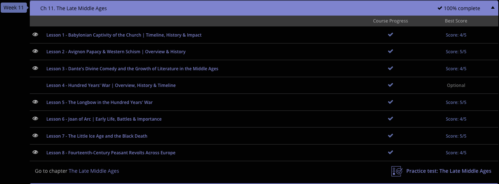

### Andrew Garber
### December 19 2023
### Late Middle Ages

#### 11.1-11.2 Avignon Papacy
 - In 1309, the Pope moved his court from Rome to Avignon in France and remained there until 1376. Francesco Petrarch, an Italian scholar, referred to this event as the 'Babylonian captivity.' Petrarch believed the popes during this time lost their spiritual integrity and became enslaved to the ambitions of the king of France.
 - Pope Gregory XI was pope from 1370-1378. He decided to move his court back to Rome after conflict developed and spread through Italy. Gregory died soon after the move, and Urban VI was elected the new pope. Urban was Italian, and it alienated the French cardinals. The French cardinals then held their own election and named their own pope, Clement VII.
 - He was succeeded by Benedict XIII from 1394 to 1423, Benedict XIV from 1424 to 1429 and Benedict XIV from 1430 to 1437. Because the popes who served from Avignon beginning with Clement VII were seen as illegitimate and had a very small following, they are referred to as antipopes. After 1378, only popes who served in Rome are considered legitimate popes.
 - This action began a schism within the Catholic Church. A schism is a division among people. The argument over who was the legitimate pope lasted from 1378 until 1417. A council was held in 1409 in an attempt to end the schism. Another pope, Alexander V, was elected but the other two popes did not step down. Now, there were three popes.
 - Another council was held in 1414 at Constance to bring an end to the schism. At this council, claimants to the Papacy were either forced from office or resigned and a new pope was elected to end the schism. The council then elected the new pope, Martin V. Although there were a few factions of people who continued to support the other popes, the council succeeded in finding a solution to the schism.
 - One of the earliest and best examples of the power of the French king over the pope was the disbanding of the Knights Templar. The Knights Templar were a religious military order that protected Christians who travelled to Jerusalem. They grew so wealthy and powerful that King Philip IV ordered them arrested in 1307. Many were tortured into confession and executed. The king pressured the pope to support his actions against them. People were outraged that the knights were tortured into confessing to crimes of which they were accused, like heresy and devil worship. Many went to the pope hoping for help. In response, after more pressure from King Philip, the pope issued a rule that required all Christian rulers in Europe to arrest all Templar knights.
 - The Avignon popes seemed to fall further under France's influence during the Hundred Years' War between England and France. During this time England made claims to the French throne while France attacked English territories within its borders. England fought to keep control of its land and was successful during the early part of the conflict. The war reached a turning point after Joan of Arc began rallying French troops. Politics held a major involvement in the war, and the power and influence of the pope was coveted by those involved. Conflict was also rampant in Italy, where aristocrats battled over control of Italian provinces. 
 - Pope Gregory XI moved the papal court back to Rome in 1377, hoping to gain more control over papal land. Gregory died shortly after the move, and, under the influence of a threatening crowd, an Italian pope, Urban VI, was elected. Urban was an unpopular choice among the French cardinals, who elected their own pope, Clement VII, who took up residence back in Avignon. The division among the curia over who was the legitimate pope is called the Great Schism or Western Schism.
 - Clement VII served as pope in Avignon from 1378 to 1394. He was succeeded by Benedict XIII. Benedict served from 1394 until 1423. He was followed by three other popes. He was followed by Benedict XIV, who served from 1424 to 1429. In 1430 Jean Carrier was elected pope in Avignon and also chose the name Benedict XIV. He served from 1430 to 1437.
 - The Dance continued for ~40 years, but in 1409 a council was called in 1409 to end the schism. It failed

#### 11.3 Dante's Divine Comedy
 - Dante's full name is Dante Alighieri, and he was a poet in the Middle Ages. He was also interested in philosophy and politics. He studied the poetry of classic poets like Cicero, Ovid, and Virgil. As a child, he met a woman named Beatrice Portinari, who he was friends with for several years. Dante fought for Florence when he was young and also held public office. He fought in the Battle of Campaldino in 1289. Also, the first Italian dreadnought battleship would be named after him - launched in 1913. 
 - In the 13th century, Florence was experiencing political turmoil. Dante was allied with the White Guelphs, a political faction who opposed the Pope. Dante visited the Pope on a diplomatic quest but was detained by the papal authorities. In his absence, Florence was terrorized by the Black Guelphs, a political faction who supported the Pope. In 1302, as the government came under the influence of the Black Guelphs, Dante was charged and convicted of crimes he was thought never to have committed. He was exiled from Florence under the threat of execution if he returned. While in exile, Dante traveled from one place to another, never settling in one place as home and always remembering Florence as such.
 - *The Dinine Comedy* is by far Dante's best known work, and is structured into three parts: Inferno, Purgatorio, and Paradiso. There are 33 cantos in each part. The plot is about one man who is generally assumed to represent Dante himself. The man goes on a journey visiting souls in Hell (Inferno), Purgatory (Purgatorio), and Heaven (Paradiso). He is guided by two other people. Virgil leads the man through Hell and Purgatory. Beatrice leads the man through Heaven. The journey of the man through these places can be seen as representing Dante's exile from his home as well as the Christian idea of man becoming distanced from God. During Dante's visit to the Inferno, he meets with souls that are damned to remain in Hell. It is revealed that Hell is divided into nine circles, each with their own designated group of sins.
 - I am not going to list all of the circles and their sins, but the ninth circle is the important one - in it, Satan is here - he is a three-headed beast, and in each mouth are the wrost sinners. Judas, Brutus, and Cassius(famous for their role in the killings of Jesus, and Julius Caesar, respectively).
 - After visiting Inferno, Dante and Virgil proceed to Purgatory. Purgatory is a mountain on an island. The mountain has seven terraces corresponding to the seven deadly sins in Catholic doctrine. As they travel through Purgatory, the two meet souls guilty of each of the seven sins. As he approaches each terrace, he finds the inhabitants in various positions shouting out penance for their punishment. For example, those condemned to stay on the lustful terrace are forced to walk in fire and shout examples of chastity.
 - Finally, he is led to Heaven. He is led by Beatrice through the nine levels of Heaven, he meets Saints such as Peter, John, and Thomas(better known to philosophy fans as Aquinas). Finally, Dante sees Mary and the Holy Trinity. He meets God, and Dante's soul becomes at one with God and the universe - he is at peace. This is why it is a comedy - it ends happily(comedy has a slightly different meaning in this context).
 - One of the most important impacts The Divine Comedy had in Dante's time was to develop the Italian language. Until this time, major literary works were written only in Latin or Greek. However, Dante composed this work in Italian vernacular, or common dialect. Dante hoped to bridge gaps and create a national culture by using a common language. It also helped Italian become recognized as a literary language alongside Greek and Latin.
 - Within his poem, Dante uses knowledge from Christian doctrine along with mythology, politics, and philosophy in his conversations with various souls. The poem's popularity continued to grow and has been said to have influenced many famous writers throughout history, including Geoffrey Chaucer, John Milton, Victor Hugo, and James Joyce.

#### 11.5. The Longbow 
 - The longbow was an incredibly powerful, if difficult to scale, weapon in the Middle Ages. It was most famously used by the English in the Hundred Years' War, and is responsible for their devastating victories at Crecy, and most notably, Agincourt. The longbow had a large range, if not as good as the crossbow, but the real devastating power of the longbow was its rate of fire. A skilled archer could fire 10-12 arrows per minute, while a crossbow might fire at most 5 per minute, though this rate was rare and unsustainable.
 - The longbow was also incredibly cheap, made out of yew wood that could be found readily in England. The problem was, it took *years* to train a skilled archer - training normally began in youth, and consistent practice was required to maintain the strength and skill required to use the longbow. 
 - Eventually, with improvements to crossbows(mostly machining improvements), and then the development of firearms, as well as the increasing shortage of yew wood, the longbow fell out of use. However, for its time, it packed a per soldier punch that was only bested by the knight, and even then, only in certain situations.

#### 11.6. Joan of Arc
 - Joan of Arc was a Frenchwoman born around January of 1412. She was born a peasant but became a hero to the French. Joan's father was a farmer. She couldn't read or write. She experienced a fairly normal childhood. However, as she grew older her life changed.
 - Around 1425, Joan claimed she began to hear voices or see visions. She would later claim that her visions were of angels and saints that would offer her counsel. Included in her visions were St. Catherine, St. Margaret, and the archangels Michael and Gabriel. These visions would eventually lead her to come to the aid of the king who was at war with England.
 - She was born in the middle of the Hundred Years' War between England and France. The war began in 1337 and lasted until 1453(so it is really the 116 years war, but nobody calls it that). During the early part of the war, England dominated France. It wasn't until Joan joined the battle that France began to experience major victories. In 1429, after an examination by high-ranking Catholic clergy, Joan convinced the king to allow her to accompany an army to Orleans. She arrived dressed in men's battle attire. She immediately began to reform the troops by requiring them to go to church and to confession. She disallowed swearing and looting and harassment of the civilians in the area.
 - She helped the French Army recover, and win at Orleans and Patay. She was then captured by the English, and ransomed - she was then tried for heresy, and burned at the stake. The trial was, from all accounts, a farce, she was the only one allowed to testify, and she was charged with witchcraft(though this charge was dropped). Eventually, she was burned at the stake.

#### 11.7. The Little Ice Age, and the Black Death
 - Before the 14th century, Europe experienced a large population growth. However, by the late 13th century, this resulted in land being overworked and production being slowed. In addition to the overworked soil, the global climate experienced a cooling phase. The reasons for this are unknown. Although the temperature change was small, maybe as little as one degree, it had a large impact on agricultural production. The cooling phase brought with it wet conditions and heavy rainfall. This period in history has been labeled the Little Ice Age.
 - During the cooling phase, the growing season changed by up to 20%. This basically means the normal growing season was shortened by up to two months. Seeds that were used to growing at the time were not able to withstand extreme changes in the weather and moisture as we see in our modern seeds. These factors led to a shortage in usable crops. Wheat and rye, which were staples at the time, experienced a significant drop in production across Europe. Snow could be found on the ground late in the spring, encouraging the existence of parasites that devastated crop growth. There was also less hay to feed livestock, and straw or pine was used as a substitute. Still, much of the livestock had to be slaughtered to feed starving nations. As crop production declined, famine began to spread across Europe. Famine began around 1315 and lasted until around 1317. This was a slight beginning of population decline.
 - Several years later, around 1347, an even more devastating event began. The Black Death began to spread throughout Europe. The Black Death was devastating and wiped out at least a third of Europe's population in less than a decade.
 - The Black Death, sometimes referred to as 'the plague,' was spread by rat fleas. A person who contracted the plague could die within a matter of days - usually less than five. People who contracted the plague experienced a high fever, diarrhea, delirium, swollen lymph nodes, and eventually black splotches on the skin, giving it its moniker. Plague victims could also experience bleeding in their lungs, nausea and vomiting, muscle pains, and disorientation.
 - The worst of it was in the cities, where the poor sanitation and close proximity made it easy for the plague to spread(shoutout Marcus Aurelius, who was dealing with the same problem about a thousand years earlier).  People, having no medical knowledge, began to blame the disease on witches, astrology, or religious groups. The plague spread and encircled Europe within about five years, then disappeared.
 - One of the major side effects of the Black Death was that the value of labor increased DRAMATICALLY. With a smaller population, the efficiency of labor became more important(hint hint, modern civilization - total factor productivity is important), and this put the first nail in the coffin of the feudal system. It would take centuries for the feudal system to totally collapse, but it was the beginning of the end.

 