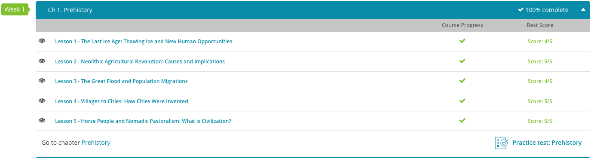

### Andrew Garber
### CLEP Western Civilization I
### Chapter 1: Prehistory
### September 7 2023

#### 1.1: The Last Ice Age
 - As humans developed, they moved from just scavenging to genuinely hunting, and evolved to be able to walk upright, and have a larger brain. In addition, they domesticated dogs, which helped them hunt, and kept them safe from predators. 
 - From the base of domesticating dogs, humans began to domesticate other animals, such as sheep, goats, and pigs. This allowed them to settle down, and not have to move around as much, as they could now have a steady supply of food. Despite this, they still had to move around, as they would exhaust the land, and have to move to a new area. This led to a period known as pastoralism, where they would move around, but not as much as before.

#### 1.2. Neolithic Agricultural Revolution
 - As humans settled down to stationary farming, crop yields became such that one person could feed more than just themselves. This allowed certain people to specialize in other areas, whether it was pottery, metalworking, or the ruling/religious class. This led to the development of cities, and the first civilizations.
 - With specialization, new technologies were developed, this allowed a single farmer to produce more food, and allowed for more people to specailize. This positive feedback loop of development is one that continues to this day, and is the reason why we have such advanced technology and society.

#### 1.4. The First Cities
 - The very nature of civilization is that once a food surplus is possible, one farmer producing more than they need, people will begin to specialize and this specialization will draw in more people, and the city will grow. This is the reason why cities are so important to civilization, as they are the center of it. When there are 10,000 people in a city, there could be dozens of people in one specialized field, and this allows for the development of new technologies, and the advancement of society.
 - With these advancements, military technology also advanced, and this allowed for the development of empires. These empires would conquer other cities, and take their resources, and this would allow them to grow even more. While the initial empires were small, they would eventually grow to be massive, and would conquer most of the known world.

#### 1.5. Nomadic Peoples
 - Not all civilizations were sedentary, as some peoples would continue to migrate and move around. These people were known as nomads, and largely survived by herding animals, and moving around to find new pastures. These people were often looked down upon by the sedentary civilizations, as they were seen as uncivilized, and barbaric. However, these people were often very skilled at riding horses, and would often be able to conquer the sedentary civilizations, and establish their own empires. This military prowess largely came from the short horse bow, which was a very powerful weapon, and allowed for the nomads to conquer the infantry based civilizations.

## Screenshot of Completion
 - 