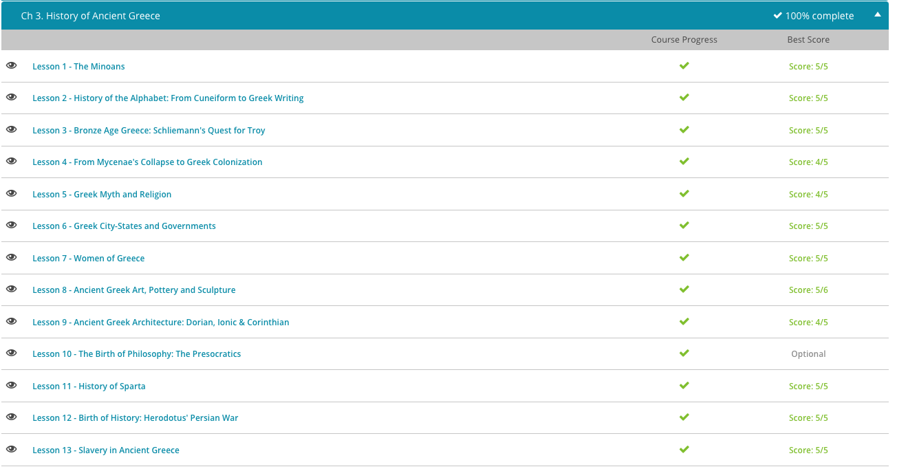

### Andrew Garber
### September 15 2023
### CLEP Western Civilization I
### Chapter 3: Ancient Greece

#### 3.1. The Minoans
 - The Ancient Athenians tell a story of Theseus, a man sent to Crete to be sacrificed to the minotaur. According to the story, Theseus killed the minotaur and won Athens' freedom from Crete.
 - Most people believe that the story of Theseus is a myth, and that there was no labyrinth, however a man named Sir Arthur Evans disagreed.
 - In 1900, Sir Arthur Evans began digging on the island of Crete, in a place known as Knossos. In the course of his dig, Evans uncovered a huge complex of interlinking rooms, much like a maze, or a labyrinth. The palace was adorned all around with symbolic bull horns, known as Horns of Consecration. Digging deeper, Evans uncovered a throne room and wall paintings of bulls and bull jumpers.
 - Evans believed that he had found the palace of King Minos, and that the story of Theseus was true. As Evans continued to dig, he found other things, including axe heads and records written on clay tablets. 
 - There is good evidence that the Minoans were first and foremost a trading people. Minoan culture really seems to have taken off in the early Bronze Age, around 2700 BCE, and quickly spread across the Mediterranean. Archaeologists have discovered Minoan wares all along the Mediterranean coast, from Egypt to Spain. Their most important trade goods seem to have been saffron, a yellow spice still much treasured today, and tin, which, when mixed with copper, creates bronze. This may help us to understand why the Minoan civilization thrived during the Bronze Age and fell from glory during the Iron Age, when bronze, and therefore tin, was no longer needed in such quantities.
 - After over a thousand years dominating the seas of the eastern Mediterranean, Minoan civilization declined sharply around 1450 BCE. Archaeologists disagree on what caused this decline. Some have claimed, as we noted above, that the advent of the Iron Age meant that people no longer needed so much bronze, and thus the market for Minoan tin declined, and with it the Minoans. Yet the most population explanation for the end of the Minoans was the eruption of the volcano on the island of Thera, and it could have caused a tsunami that wiped out the Minoan fleet and destroyed their cities.

#### 3.2. The Alphabet
 - The change from Cuneiform, symbols for words or sounds, to Phonemes solves a lot of problems because a standard alphabet to represent sounds can make thousands of words with only a few letters.
 - The Phoenicians seem to have begun this process. About 1050 BC, the Phoenicians did away with the symbolic pictographs of cuneiform and invented simple characters to represent specific sounds.
 - With its limited number of characters, the Phoenecian alphabet soon replaced all other writing forms in the West. By the end of the Neo-Assyrian empire, it had replaced cuneiform. All future alphabets would be derived from the Phoenecian model. Hebrew and Arabic are modern examples of a Phoenician-style alphabet or abjad, where characters represent only consonants, and the reader must supply the vowels from context.
 - The inclusion of vowels in an alphabet was a distinctly Greek invention. The Greeks got their version of the Phonetic alphabet from the Minoans, who used a script we now call Linear A. Bronze Age Greeks from Mycenae used Linear A, with some small adaptations to write in Greek. We call this script Linear B. These writing systems were abjads, consonant only alphabets like the Phoenician model.
 - Around 730 BC, a Greek wanted to write down the epic poems of Homer. This proved problematic, as Greek poetry requires one to record the length of vowel sounds. So, the Greeks came up with characters for seven vowels. It is interesting to note that we only have five. Recording the lengths of vowels was so important to the Greeks that they felt the need to distinguish a long 'E' (eta) from a short 'E' (epsilon) and a Long 'O' (Omega) from a short 'O' (omicron) From this fact, some have suggested that what we now recognize as an alphabet was probably invented for the sole purpose of writing poetry.
 - This simple alphabet created a massive literacy rate unparalleled in the ancient world, and it was why the Greeks led the Western World in culture for such a long time.

#### 3.3. Bronze Age Greece
 - For a very long time, scholars believed that the stories of the Iliad and the Odyssey were just that - stories. But one man, named Heinrich Schliemann, was certain that Troy and Mycenae were real places. He believed that Greek epic, when combined with the historical accounts of Herodotus and the geographical accounts of Strabo, provided enough detail to find these ancient cities of myth. Schliemann was not so much what we would call an archaeologist - more of a treasure hunter.
 - After years of searching, Schliemann found Troy, yet the Troy he found did not match the description in the Iliad. This Troy was built centuries later. The Troy he sought was buried beneath several layers of cities. It seems the Greeks were not the first to burn Troy to the ground, nor would they be the last. In his fervor to find the Troy of the Iliad, Schliemann destroyed the cities above it, making no effort to protect or even catalog their contents.
 - Having successfully found Troy, Schliemann felt confident that he could locate Mycenae as well, and oh, did he. The city he found was wondrous. Unlike Troy, which had been rebuilt and rebuilt several times after the Bronze Age collapse, Mycenae was already a ruin and tourist attraction by Roman times. As a result, Schliemann was unable to mess things up as he did in Troy. The first thing he discovered was a circular graveyard in which he found precious artifacts, including the Cup of Nestor and the Funeral Mask of Agamemnon.
 - Mycenaen civilization seems to have begun around 2300 BCE. They were heavily influenced by the Minoans. By 1700 BCE, Mycenae was a powerful city in its own respect and began to build the citadel that Schliemann discovered. Around the 15th century BCE, Minoan Civilization collapsed, probably due to the explosion of Thera, a volcanic island. The ensuing tsunami seems to have shaken up the entire eastern Mediterranean. In the power vacuum left by the Minoans, Mycenae rose in power. From 1400-1200 BCE, Mycenae expanded its rule, eventually conquering Crete for themselves and sacking the city of Troy. 
 - However the Bronze Age Collapse hit Mycenae hard. By sea, the invasion of the sea peoples tore Mycenae's maritime empire to pieces. By land, a mysterious people known as the Dorians invaded from the north. Like the rest of the civilized world at the time, Mycenae could not withstand such a sustained assault and became another victim of the Bronze Age collapse.

#### 3.4. Greek Colonization
 - Since the Dorians left us with no written records and very few material goods, we know almost nothing about Greece in the Dark Ages. Most of our knowledge is rather inferred from The Iliad and The Odyssey, which were composed in this age, and some scant archaeological findings. From these, we believe that the Greeks of the Dark Ages lived in autonomous village communities, ruled over by a king who was little more than a warlord.
 - Any assemblies were simply gatherings of warriors. There were no formal legal institutions, and crimes, like murder, were dealt with by vengeance on the part of the family. The economic situation was not much better. With no currency, trade was reduced to bartering. The Greeks of this age didn't even have a word for merchant.
 - It was during this age that the central beliefs of Greek religion and myth began to form. This age gave rise to most of the myths of the classical era. However, organized religion as we know it today, with professional priests and places of worship, was all but unknown.
 - This lack of centralized rule, combined with the need for self-sufficiency, drove Greek villages to develop the fiercely independent autonomy that would characterize them as city-states in the centuries to come.
 - By 800 BCE, the Greeks had shaken off their Dark Age doldrums. Villages united around central towns, and these towns grew into cities, and these cities, in turn, became city-states. The city-state emerged as the iconic political unit of Greece.
 - On the mainland, Athens, Sparta, Thebes and Corinth were established. Miletus appeared in Asia Minor. Naxos and Samos arose on the islands of the Aegean. As the populations of these city-states swelled, they soon outstripped their local resources. City-states began colonizing lands outside of Greece.
 - These were originally small, though they grew into large states of their own right. The most famous of these were in Sicily, and Southern Italy and were known as Magna Graecia, or Greater Greece.

#### 3.5. Greek Myth and Religion
 - Greek myths have been incredible enduring in the Western World. 
 - The difference between myth and religion is also not uniform, as the decentralized nature of Greek city-states meant that each had its own spin on the myths and religious practices in order to justify their own political and social structures.
 - For example, at least six islands claimed to be the birth place of Zeus and had their own unique myths and festivals to commemorate their special relationship to the god.
 - Another reason Greek religion might diverge would be to explain or legitimize customs. For example, the Athenians claimed to have received their custom of trial by jury from the Goddess Athena, who held the trial of the mythical hero Orestes in Athens, ending the cycle of vengeance and bloodshed which had destroyed the Mycenaean royal family. The Athenians believed this story. The Spartans, who had no such trial system, and who held the Athenians in contempt, probably did not.
 - The Greek gods are anthropomorphic, meaning that they take on the shapes and characteristics of men. As such, it is not surprising that Hesiod's account of the creation of the gods reads like a family tree with new gods being born just as humans are: from sex.
 - According to Hesiod, in the beginning there was chaos - a gaping nothingness. From this chaos was born the basic stuff of the universe, among which was sex. Through sex, the rest of the universe was created - the sea, the heavens and the earth. Then mountains and rivers, then hills and streams and so on. This is the first generation of gods - the stuff of the universe.

#### 3.6. Greek City-States and Government
 - Greek civilization, like Greek religion, was a decentralized affair. For most of ancient Greek history the largest political unit was the city-state, which they called a polis (plural poleis). From this word we derive many English words: politics, for the running of a polis; police, a man who serves the polis; and even polite, meaning you have the manners of a civilized person.
 - This was not a Greek invention, no, it was just due to the nature of Greek Geography(and culture) that smaller city-states became the norm rather than larger kingdoms.
 - Thus we can see how the mountainous geography of Greece prevented the consolidation of a unified Greek kingdom and maintained the independence of the Greek polis. Each polis was fiercely independent, with its own customs, its own myths and its own festivals. With such variety, it is difficult to make generalizations about them. Yet there are some things that the Greek poleis shared in common. Religion/myths, language, and a central structure of what a polis was.
 - Every Greek polis had a constitution. While these constitutions varied greatly from one polis to another, the fact that every polis felt they needed a codified system of government (one which held true for the high as well as the low) bears witness to the Egalitarian spirit of all Greek poleis. 
 - Another thing the various Greek Poleis had in common was colonialism. Since the mountainous terrain of Greece offered little arable land, a prosperous polis would quickly outgrow its limited surrounding countryside. As populations grew, new sources of food needed to be found. The Spartans solved this problem by conquering and enslaving their neighbors. This was made possible by the relative flatness of the Peloponnese compared to the rest of Greece. Most Greek poleis did not have this option; instead, they established colonies elsewhere.
 - Perhaps the most important unifying feature of Greek culture was their fixation on competition. The Greeks always want to find out the best of every field: the best potter, the best playwright, the best athlete, the best constitution, the best polis. To decide the winners, the Greeks held countless competitions at all levels.
 - From local court cases that read like high school speech competitions to Pan-Athenaic theatrical festivals in which citizens from all of Attika competed at Athens. To Pan-Hellenic Olympics, athletic competitions between all the Greek poleis, at the holy city of Olympia. To the Pan-Hellenic sanctuary of Apollo at Delphi, where the Greek poleis tried to outshine each other with ornate treasuries full of lavish donations to the oracle.

#### 3.7. Women of Greece
 - The words 'progressive' and 'Sparta' don't always seem to go well together, but when it comes to the rights of women, the Spartans seemed to have the right idea. It was said that since Spartan women raised Spartan warriors, they deserved a certain amount of gratitude and respect. More pragmatically, it just made sense for Sparta to treat its women with respect.
 - Most of the population of Sparta was actually made up of slaves and, since large numbers of men would be out campaigning at any given time, it was to everyone's benefit to make sure that Spartan women had rights and were respected by everyone. Sure, a Spartan woman couldn't fight, nor could she vote or take part in politics, but at the very least, she had a great deal of social and economic freedom. 

#### 3.8. Art, Pottery, Sculpture
 - Much the same could be said of Greek sculpture. The subjects of Greek sculpture were no different from the cultures before them: gods, men, animals and activities. What distinguishes Greek sculpture from all the rest is the material it is made of.
 - Cultures sculpt with what they have at hand. The Sumerians had clay, so they used clay. The Assyrians had limestone, so they used limestone. Egypt was blessed with a variety of stones: limestone, sandstone and granite. So they used all of those. The Greeks found themselves sitting on mountains of marble, so they used marble.
 - Without getting into too many details, we can see why marble makes for better sculptures. Marble is stronger than clay, limestone or sandstone, yet marble is softer than granite. The mixed-up nature of marble also means that you can cut marble at any angle, whereas a misplaced blow on more crystallized sorts of stone, like sandstone and granite, could ruin an entire sculpture.
 - Because of the ease of working marble, it could be refined down to the smallest detail without risking of braking the whole thing. 

#### 3.10. The Presocratics
 - When we think of Greek philosophy, our minds leap immediately to Socrates, Plato, and Aristotle. Yet Greeks had been engaging in philosophy for nearly 200 years before Socrates was born. These philosophers are known today as the Presocratics. Presocratic philosophers attempted to tackle the same questions philosophers argue over today: 'What is the universe made of?' and 'Why do things change?'.
 **However, Philosophers in this time were not focused on merely academic philosophy - they were asking these questions so that they knew how to live *right***
 - The Monists, Thales, Aniximander, Anaximenes believed that the universe was made of one singular substance transmuting into different forms.
 - Heraclitus of Ephesus (535-475 BCE) had a very different idea. For Heraclitus, the only constant was change. He believed the opposing forces of the universe were constantly trying to tear the world apart. These opposites were only held together by natural law, or [*logos*](../../11TH_GRADE/Philosophy_101/Writing/marcus_aurelius_revision.md). He compared this to the two ends of a bow pulling away from each other. This pulling is meaningless on its own. Left to their own devices, the two opposing ends will just make a worthless stick. Yet held together by the string of natural law, they make a powerful, dynamic tool. Like Pythagoras, Heraclitus had decided that the constants of the universe were not in matter itself, but rather in how matter behaves. From him, we received the adage 'All things change, so that all things may remain the same.' His ideas would later be revived in chaos theory. His work on the Logos is the most enduring though, being heavily influential on the Stoics most notably.
 - The Eleatics were the opposite of Heraclitus in this, believing that nothing really changed - the universe was just a sphere of unidentifiable stuff. Zeno of Elea(different person from Zeno of Citium, the founder of the Stoic school) tried to prove this with a series of paradoxes, which bear striking resemblance to Einstein's theory of relativity.
 - The Pluralists, Empedocles (490-430 BCE) and Anaxagoras (500-428 BCE), took ideas from their predecessors and mixed them into a single coherent system. Like the Milesians, the Pluralists insisted that matter had to be eternal and unchanging. Unlike the Milesians, they had no problem with there being more than one sort of matter. Empedocles believed that there were four sorts of matter: earth, air, fire, and water. Combinations of these basic elements resulted in the wide variety we see. Anaxagoras held that there was an infinite variety of basic materials to work with. Flesh is made out of flesh particles, eyes are made out of eye particles, thought made out of thought particles and so on. Empedocles believed that these pieces flopped around, forming different shapes at random until they found arrangements that made the animals, plants and materials we know today. 
 - Like Heraclitus and Pythagoras, the Pluralists also believed in a force outside of matter that made matter behave as it should. Yet, Empedocles and Anaxagoras disagreed on the number and nature of this force. Anaxagoras agreed with Heraclitus that a single natural force held the disparate forces of the universe together, though he called this force nous, or 'mind,' instead of logos. Empedocles, by contrast, thought there were two forces, love and strife, that governed the universe. Love brought disparate elements together, while strife tore them apart. These two forces ran in cycles. 
 - Finally, we come to the Atomists. Today, we understand atoms as the basic building blocks of the world. We tend to think of this as a modern discovery. But the existence of atoms was first suggested 2,500 years ago in the fifth century BCE by a philosopher named Leucippus. We know almost nothing of Leucippus, but the works of his student Democritus (460-370 BCE) have survived in fragments.
 - Democritus believed that the universe was made up of tiny, invisible things called Atoms, and that with Atoms it was very possible that there was a void. This made the use of statements like "*not*" possible, which while it seems trivial to us, was a huge step forward in philosophy.

#### 3.11. Sparta
 - Sparta has a problem. In a frenzy of ambition, it has conquered its neighbors in the regions of Messenia and Lakonia. The conquered people become helots in the Spartan system, serfs who worked the land for the Spartans. The problem is that the helots actually outnumber the Spartans, by some estimations by a factor of ten to one. To keep this subjugated population under control, every Spartan must be a warrior. In Greece, that meant a Spartan must be a hoplite and fight in a phalanx. The Phalanx was the most advanced form of warfare in the western world in its day, and it was only so powerful due to the discipline of the troops who fought in it. The Spartans were the most disciplined troops in the Greek world, and they had to be. If the helots ever rose up, the Spartans would be doomed.
 - The phalanx did have weaknesses though, specifically over uneven ground - which is why almost all of Greek warfare was done on flat plains with Phalanxes crashing into each other. The Romans used the Phalanx system for much of the early republic, but the adoption of the Maniple system solved these coordination problems and allowed for more flexible warfare. The Maniple allowed the Romans to annihilate the Phalanx based armies surrounding them, and eventually the Romans would conquer the Mediterranean with this system.
 - According to legend, the problem of how to order Spartan society came from a figure named Lycurgus. A leader (but not the actual king), Lycurgus is credited with developing a training system called the agoge. The agoge was many things. It was a series of trials that would cull the weak and cowardly from the Spartan stock. It was a system of education that would take the strong and make them stronger, and take the brave and make them braver. Finally, the agoge was a society that would forge these powerful individuals into a single deadly unit.
 - The first thing to do upon the birth of a Spartan was to bathe them in wine - this is unimaginably painful, effectively as if your whole body was a cut and you were dunked in rubbing alcohol. 
 - After this bath, the Spartan Council of Elders examined the children closely. If he seemed sickly, deformed, weak, or slow, he would be left in the hills to die of exposure or cast off a cliff and forgotten. Past this first hurdle, boys enjoyed a semi-normal childhood until age seven, when he was torn from his mother's arms and thrown into an agela or bouai, or herd of boys around his age. This broke down the bonds of family and got young Brasidas to consider his comrades his family. These boys were barely fed. This got them used to hunger and encouraged them to hunt, forage or steal to feed themselves. 
 - Around age 12, Brasidas faced a strange rite of passage. He and the other boys of his agela had to steal honey cakes from an altar of Artemis. Protecting the altar were older boys with whips.
 - After this rite of passage, a boy was given the only article of clothing he'd have for one whole year, a blood red cape called a phoinikos. At around the same time, a boy was expected to choose one of the older boys who'd just whipped him to complete his education. This older boy introduced the boy to his warrior society, with whom he would eat, sleep, practice and fight. He served as a mentor, a teacher, a comrade and a lover, binding Brasidas ever more tightly to his phalanx cohort.
 - At 18, a boy graduated to join a paidiskos, a military reserve unit. At age 20 he was a full citizen and joined the full military service, and was encouraged to find a wife and start producing children - though he had to stay in his barracks. Finally at age 30 he could leave the barracks and live with his family, though he was still eligible for military service. 
 - To support this warrior society, Lycurgus created a caste system. At the top of this system were the Spartiates: the warrior class, and the only class with rights of citizenship and political power.
 - At the bottom of the system were the slaves, who had no rights, and the helots, who were a broader labor class. The helots were spread about the countryside, and were not so much slaves as serfs, bound to their land and trade in service of the Spartans. This freed the Spartiates from the need to feed, clothe and shelter themselves, allowing them to focus on war. Yet even helots had some rights. They could earn money and could even buy their freedom, but they could not serve in the military and, therefore, held no political power, despite comprising the majority of the population.

### Completion Screenshot: 