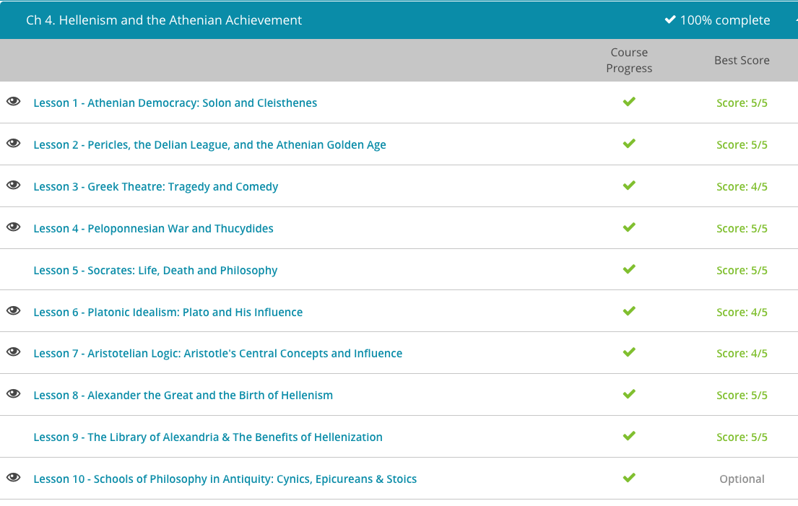

### Andrew Garber
### AP Environmental Science
### Chapter 4: Hellenism and the Athenian Achievement
### September 22 2023

#### 4.1. Athenian Democracy
 - By the 6th century BCE, Athens was in major trouble - it was facing triplicate economic, social, and political crises. 
 - On the economic side, Athens was barely able to feed itself, and small farmers were going into ever greater debt.
 - On the social side, the only way for the poor farmer to get a loan was to put himself and his family down as collateral(a common practice until relatively recently), leading to ever greater numbers of debt-slaves.
 - On the political side, the aristocractic families were fighting amongst themselves for power instead of trying to actually form a working governmental system. At the time, Athens was run by 9 archons, elected for one-year terms(semi-similar to the later Roman Consuls) by a council of former archons. The archons used their positions to enrich themselves and their families, while doing little to actually improve Athens.
 - The solution to this came in the form of a man named Solon, who was elected to serve as a tyrant(similar to the later Roman Dictators who were elected in times of crisis, to act decisively, and then handed back their absolute power - Cincinnatus, for example). Solon set about solving the problems that plagued Athens immediately, including encouraging the planting of olives for olive oil exports, forbidding the export of foodstuffs abroad(though Adam Smith would object), and abolishing debt-slavery as an institution in Athens. He made it illegal for one Athenian to own another, and wiped the slate clean of all debts. He also reformed the political system, notably by changing the requirements for political power from lineage to wealth. This allowed wealthy, non-aristocrats to have a say in government(and was *more* meritocratic comparatively).
 - To ensure that the poor had a voice in politics as well, Solon expanded membership to the Athenian general assembly. He allowed all citizens of the realm to vote, whereas before the vote had been limited to the citizens of the city of Athens itself. He also gave the general assembly real power. He gave them the final decision of electing public officials and created a council of citizens to act as judges. 
 - This lasted only five years though, and while Solon's cousin Peisistratos was a fair ruler, his son, Hippias, was not.
 - In 510 BCE, Cleisthenes, the son of a prominent aristocrat and political leader, with the help of the Spartans, drove Hippias from Athens. Like Solon, Cleisthenes was more interested in reforming the system than in holding power. His program of reform and justice for the common people upset the aristocratic families. Under the leadership of Isagoras, the aristocrats drove Cleisthenes and his allies from the city, again with the aid of Spartans.
 - Isagoras had no interest in reforms, and Cleisthenes was unable to do anything about it(he couldn't really find any army just laying around to help him). With no nobility to save them, the people of Athens just revolted, executed the leaders of the coup, and brought Cleisthenes back to power. In doing so, they ushered in the worlds first democracy.
 - Cleisthenes broke the allegiance between a land's people and their aristocratic family by dividing Athenians into tribes, undoing the most significant powers of the aristocracy. 
 - With his new democratic state thus sheltered from the aristocracy, Cleisthenes placed the running of the state in the hands of the Athenian general assembly, in which every citizen, regardless of locale or wealth, had just one vote. The old positions of archon, as well as the old council of the Areopagus, were retained. Yet their power was greatly reduced. Proposal of measures, deliberation, even election of Archons was transferred to the general assembly. The old oligarchic Areopagus was left with little to do except offer advice and oversee trials for murder, treason and religion, though even then the final verdict lay with the assembly.

#### 4.2. Pericles, and the Athenian Golden Age
 - *Ring up Jordan McDeere, there is probably a television show to be bought **obscure reference**.*
 - After the second defeat of the Persians, all of Greece rejoiced. Together, they had overcome the mightiest empire the world had ever seen.
 - Fired up with Panhellenic pride, the Athenians spearheaded an alliance to take vengeance on the Persians. This alliance was called the Delian League. Islands and city-states across the Aegean built ships, armed crews and sent lavish donations to the League's treasury on the island of Delos. Always afraid of a slave revolt at home, Sparta declined to participate. Driving the Persians off was one thing, but picking a fight with them was quite another.
 - Yet the Spartans need not have feared. The superior triremes of the Greeks allowed them to attack with impunity. They sunk Persian ships and raided Persian towns. Worse yet, at least in the eyes of the Persians, the Greeks staged revolutions in the cities they conquered, killing off rich aristocrats and establishing democracies. Persian soldiers would arrive to reinforce a town only to find the gates barred to them while the Greeks had sailed on to attack somewhere else.
 - This naval dominance was a direct result of their maritime culture, as the lands of Greece were too rocky and too mountainous to support widespread agriculture, they had to import much of their food.
 - The Delian League grew rich off this plunder. Working together, they would teach the Persians never to mess with Greece again. Yet this giddy Panhellenism did not last forever. As the years stretched on, the members of the Delian League began to wonder if Persia had not been punished enough. The constant warfare was exhausting. People wanted to return to their normal lives.
 - But Athens would have none of it. As the head of the Delian League, Athens had become incredibly rich and powerful, establishing colonies and garrisons across the Aegean and Asia Minor. Moreover, the war was just the thing the young democracy needed to cement itself. As we've seen, political power usually came with military usefulness. With the offensive in Persia, suddenly all those poor citizens could make an important contribution to the war effort. They could row triremes, and in a month of rowing they could earn more than in a year of farming.
 - The other members of the League were less gung-ho about the whole arrangement. Yet they also did not want the angry Persians to be able to come back and take revenge. So, instead of providing ships and crews, they started just providing gold, food or raw materials and letting the Athenians take care of building and running the navy. And just like that, the states who had just fought for their freedom from Persia were now paying tribute to the Athenian empire.
 - While this doesn't sound great for the smaller states, it was objectively better than being under Persian rule, and to a certain degree insulated them from potential military disasters if a battle didn't go their way. Athens would take the brunt of the damage.
 - This fact was not lost on the Athenians, least of all on a leading statesman of the time, named Pericles. Pericles looked this bustle of activity, at all this wealth and all this power, and then he looked at the city of Athens. Athens had never been properly rebuilt after the last Persian invasion. The Athenians were too busy running their empire to bother with imperial trappings. Their grand temples were burned ruins, high atop the Acropolis for all to see. Their Great Assembly took place on a hill. This was no way for the seat of an empire to look; this was no way for things to be run. Someone needed to show the democratic Athenians how to be imperialists, and Pericles was the man for the job. 
 - The first thing Pericles did was to hold the Delian League together, by force of the Athenian navy. More or less, the Athenians had built a massive navy off of the tribute of the smaller states, and then decided to use that same Navy to say 'no' to the smaller states wanting out of the arrangement.
 - With the fiction of the Delian League out of the way, Pericles raided the treasury at Delos and brought it home to Athens. Now he had something to work with. Flush with cash from the treasury, Pericles rebuilt all the temples of Athens. To return beauty and grandeur to the Acropolis, he commissioned the Parthenon, with its huge golden statue of Athena. He also built a new meeting hall for the General Assembly as well as several other public buildings.
 - Pericles' enrichment of the Athenian state was not limited to building. He invited sculptors from around the empire to beautify the city. Meanwhile, he patronized a growing circle of philosophers, poets, playwrights and artists, giving rise to the glorious culture that came to be identified with all of Greece. For the next 2,000 years, Athens would remain a center of learning and art for the whole world.
 - Yet the art of Athens was not its greatest creation, it was its democracy. Pericles was one of the truest "democrats" of the ancient world, and under his leadership Athens shone like a beacon.
 - Yet this glorious democracy was paid for by the servitude of Athens' allies, and they would not tolerate it forever. One by one, members of the Delian League began to rebel. Terrified of Athens, they appealed to Athens' ancient rival, Sparta, for help. The result was the Peloponnesian War, which would strip Athens of its empire and power and bring its glorious experiment with radical democracy to an abrupt end.

#### 4.3. Greek Theatre
 - Each generation reinvented the old myths, telling the same old story from a new perspective or with a different emphasis. This constant reinterpretation kept the Greek myths fresh and relevant. In short, it brought myth to life. The Greeks called this process the theatre.
 - The Greeks divided their theatre into three genres: satyr plays, comedies and tragedies.
 - Satyrs are goat men, drinking buddies of Dionysus and known for their promiscuous behavior. We know little about the early history of satyr plays besides that they were part of a ritual to Dionysus, and that they were generally lewd and low brow, a lot of codpieces and hitting people over the head with things.
 - We actually get the word lampoon from the statesman Lampon, who was viciously ridiculed in several plays by the Athenian comedian Aristophanes. More or less, comedies were political or social satires, making fun of the rich and powerful. They were also bawdy and crude, so not much has changed in the last 2,500 years.
 - Yet some questions cannot be addressed so flippantly, some ideas are timeless and cannot be dismissed and some issues simply should not be laughed about. To address these deeper questions with the seriousness they deserved, the Greeks invented the most profound form of theatre, the tragedy.
 - Where Greek comedy is ridiculous, Greek tragedy is painfully serious. Tragedies examine mythical heroes from a moral perspective and find the heroes lacking. Despite all their virtues, every Greek hero suffers from the vice of hubris, or excessive pride. This pride leads them to believe things that are not true and to do things that they should not do.
 
#### 4.4. Peloponnesian War
 - The Peloponnesian War was a chaotic, messy conflict between Athens and Sparta that dragged on for nearly 30 years. At the beginning of the war, Athens controlled a vast maritime empire. By the end of the war, Athens had been stripped of its empire and did not even control itself. So what happened to bring the mighty Athenian empire low?
 - The causes of the Peloponnesian War stretch back for decades. After the Persian navy was destroyed at the battle of Mycale, the Athenians founded the Delian League to punish the Persians by taking their colonies in the Aegean and adding them to the Athenian Empire. With no navy to defend them, the Persians were soundly defeated, and within 30 years, the Athenians controlled a vast maritime empire containing most of the islands in the Aegean and much of the coast of Asia Minor. Meanwhile, back at home, as Athens grew ever richer and more powerful, the Spartans were feeling increasingly nervous about Athens' growing power. The Spartans were objectively the most powerful land army in Greece, but they simply did not have naval power equal to Athens. 
 - Sparta had its own league, the Peloponnesian League, which included most of the city-states of mainland Greece, and they did not appreciate the Athenians trying to poach their member states for their Delian League. In 465 BCE, Sparta's slave class, the Helots, attempted to throw off their Spartan oppressors. Every Greek city-state sent soldiers to help put down the revolt. The Athenians sent a large contingent of over 5,000 soldiers, but the Spartans would not allow them into the country, fearing that so large a force intended to take advantage of the chaos, not to help with it. This was but the first of many insults each side offered each other. The next major insult came in 449, when two members of the Peloponnesian League, Megara and Corinth, started fighting. Eager to gain a stronghold on the mainland, Athens formed an alliance with Megara and entered the fighting. The result was a 15-year-long struggle between Athenians and Spartans, which some have called the First Peloponnesian War.
 - For the next 15 years, Athens starting acting more and more like a bully. They crushed revolting colonies, they sowed dissent among Sparta's allies, they vied with their neighbor, Corinth, for control of the islands of the Aegean and they even imposed economic sanctions on their former allies the Megarians - until, in 431, the rest of the world could take it no longer. Athens had made enemies of the Spartans, the Peloponnesian League, the King of Macedon, the emperor of Persia and even their own allies. Everyone was so mad at Athens that a conflict was inevitable.
 - Their leader, Pericles, had been certain that the 30 Years' Peace would not live up to its name. So as soon as the Spartans had left the land surrounding Athens, they had started building a long wall connecting the city of Athens to its port, Piraeus. In this way, Pericles said, Athens could behave like an island. It did not matter that the Spartan army was invincible. Athens never had to meet Sparta on land. It did not matter if Sparta burned their fields and stole their flocks. 
 - Moreover, that navy allowed the Athenians another advantage over their land-based foes the Spartans. An army is only useful in a battle. It spends most of its time moving from point A to point B. This might take months. As a result, that amazing Spartan army was really only useful for a few days out of the month. By contrast, with their ships, the relatively small Athenian army could show up anywhere at any time. They could disembark, do their damage and beat back to sea before their enemies could muster any resistance. The speed and mobility of the Athenian navy was especially dangerous to Sparta since their slaves, the Helots, were always on the brink of revolt.
 - So, despite being surrounded by enemies, it seemed the Athenians were in an excellent position. They could hold their empire, Pericles warned, so long as they did not try to expand upon it. Yet there were things that Pericles did not account for.
 - The first and foremost of these was that when you shove thousands of people within city walls for months with no room and only primitive forms of sanitation, people tend to die. The walls protected the Athenians from the Spartans, but the tight quarters made them prone to disease. Within the first year of the war, a plague swept through the city of Athens, killing over 30,000 Athenians. It was a dreadful affair, not the least because the plague took Pericles, the visionary who'd turned Athens into an empire. Without their leader, the democratic Athenians found it impossible to prosecute the war effectively. They had no single mind, no single vision to unite them. Instead, Athenian strategy vacillated from aggressive to defensive as different demagogues rose to power and fell from grace.
 - That would never happen in the modern day *cough* *cough*.
 - They switched commanders on a dime, yet held onto disastrous strategies year after year. When the first expedition to Sicily failed, they sent another, and then another, until nearly the entire Athenian fleet had been destroyed and most of the Athenian navy had been sold into slavery. Despite these catastrophes, the Athenians struggled on for another decade. They raised new armies and built new ships. Yet their continued naval supremacy was mostly due to the genius of their commanders. Unfortunately, in a fit of rashness, in 406 BCE the Athenians executed their greatest naval commanders after the battle of Arginusae. Though the battle was a great victory, the generals had retreated to save their fleet from a storm instead of remaining behind to collect stranded soldiers and finish off the Spartan fleet. For this, they were sentenced to death. With no decent leaders left, the Athenians blundered hopelessly. In 405 BCE, their last fleet was destroyed by a Spartan force sailing in Persian ships, and the following year Athens surrendered.
 - The Spartans ended the democracy of Athens, and replaced it with an oligarchy. Within a year though, Athens rebelled, killed the oligarchs, and replaced its democracy - despite this, it would never reach the heights it had before.

#### 4.6. Platonic Idealism: Plato's Influence
 - *Funny that I get this one now, considering I just wrote [this](../English/Writing_Assignments/plato_ideal_society.md)*
 - Plato's most notable work is *The Republic*, but he also wrote a number of other important works on epistemology, metaphysics, logic, ethics, and politics. 
 - One of the everlasting contributions of Plato is his *Allegory of the Cave*, which has become a vivid image for the human condition in the modern world.
 - Plato's theory of Forms is also notable, and is the basis for his idealism. Plato believed that the world we see is simply a shadow of the real world, in which we see only a part - for example, a "chair" is simply a shadow of the ideal "chair", which is a perfect chair. This is more aptly applied to ethics, where the "good" is simply a shadow of the ideal "good", which is a perfect virtue.

#### 4.7. Aristotelian Logic
 - Aristotle was a student of Plato, and probably his greatest admirer. Aristotle's work is notable for its breadth, as he was a decided polymath, writing on everything from biology to ethics to politics to logic. Not for any belief in his own granduer, but because it was widely believed that all forms of philosophy were interconnected, and that to understand one, you had to understand them all. Logic was connected to physics, which was connected to ethics, which was connected to politics, which was connected to logic, and so on.
 - Aristotle did actually study at the Academy(uppercase important), but beyond his writings he had a far more lasting impact on the world. He was hired by Philip II of Macedon to tutor the Macedonian School of Pages(Royal School of Pages), of whom Alexander the Great(Philip II's son) was one of 50. Alexander's companion cavalry was largely made up of these Pages, and from similar schools, and they were the deciding factor in many of Alexander's victories. Alexander the Great was tutored by Aristotle, and in a way Aristotle was the tutor to the world's first Philosopher-King as Plato had envisioned(not that Alexander was a great and wise ruler, but he had a philosphical education and was a great conqueror).
 - The first of his teachings we'll seek to understand is probably his most popular. It is a type of logic reasoning, known today as a syllogism. In technical terms a syllogism is an argument which is based on two true statements making a third statement also true. This is the basis for much of mathematical proof, `if a > b and b > c, then a > c`. This is a syllogism, and it is true. Aristotle's syllogisms were more complex, but the idea is the same.
 - Along with the use of syllogism, Aristotle believed in the idea of causality, or the relationship between two events. In Aristotle's logic, there can be more than one cause or relationship between events, and these causes can build on one another. For example, a ball rolls down a hill because it was pushed, and it was pushed because someone threw it, and it was thrown because someone wanted to play catch. This is a chain of causality, and it is a very important concept in Aristotelian logic.
 - The Stoics took the idea of casaulity and ran with it, believing that *almost* everything was caused by an unbreakable chain of events stretching far beyond - this was their form of determinism. However, that didn't mean that a person didn't have agency, or the ability to make choices - it simply meant that the choices you were given were limited, but you still HAD to make a choice, and the right choice was the one that was in line with nature. This is the basis for Stoic ethics, which we'll get to later.
 - Aristotelian ethics was largely based on the idea of the "mean", the middle between two extremes - we see this in math(see, everything is connected), but in an ethical sense it meant the moderate position between two extremes. For example, courage is the mean between cowardice and recklessness. This is the basis for Aristotelian ethics, and was the foundation of his idea of the "man of virtue".
 - His writings became so popular during the late Middle Ages and Renaissance that he was simply known as "The Philosopher", which is a striking title to have.

#### 4.8. Alexander the Great
 - At the time of Philip II's ascension to the throne of the Macedonia, it was a semi-poor, relatively unimportant kingdom. It was a backwater compared to Athens or Sparta, and wasn't really worth conquering. After the Peloponnesian War though, Athens and Sparta were both exhausted. Philip took advantage of this to conquer Thessaly, Thrace, and Molossia to form a real Empire(for Greece). 
 - Yet, Philip was more than just a conqueror. Rather than attempting to invade wholesale, Philip used the wealth of his new empire to begin establishing his own league of allies, forming a Macedonian party. As more and more key city-states joined his cause, Philip was able to pressure the remaining Greek city-states into submission. The end result was the League of Corinth, an alliance that included most of Greece with Philip of Macedon at their head.
 - Philip was going to go after Sparta, telling them that "if I bring my army into your land, I will destroy your farms, slay your people, and raze your city." The Spartans replied with a single word: "If." This is actually similar to the Americans in Bastogne during the Battle of the Bulge, when the Germans asked them to surrender, they replied with a single word: "Nuts." The Spartans were not going to surrender, and Philip was not going to attack. He had bigger fish to fry.
 - Nevertheless, rather than having to conquer the Greeks, Philip sought to lead them, and after a brief period of resistance, they fell into line. The Greeks respected Macedon's martial prowess, and the Macedonians respected the cultural and intellectual achievements of the Greeks. With the Macedonians leading the charge, Greek culture was poised to conquer the world.
 - Yet, just as everything was looking so grand, Philip was assassinated in a lovers quarrel with his ex-boyfriend, Pausanias. The rule of the empire fell to Philip's son, Alexander.
 - We think so much of Alexander's military prowess that we often don't give the credit to Philip II where it is due, as he left Alexander with a well-trained army, a strong economy, a stable empire, and a cast of advisors who would serve Alexander well.
 - Alexander's conquests are too numerous to list here, but in a number of well commanded battles he conquered Turkey, Egypt, Persia, most of the Middle East, and to the Northern Steps of India. Everywhere he conquered, he built cities, and testaments to Greek culture - Alexandria in Egypt, for example, was a center of learning for centuries, and the Library of Alexandria was the largest library in the world for centuries.
 - In the end, Alexander did not get to enjoy the fruits of his empire for long. He never even made it home. Alexander died in Babylon, though our sources are not clear whether it was from poison, sickness or pure exhaustion. With no clear heir, Alexander's empire was in danger of collapsing as soon as it was formed. Alexander himself was of no help. On his deathbed, he bequeathed his empire 'to the strongest.' As no one was sure who this meant, Alexander's generals and kin fell to fighting among each other. In the end, Alexander's empire was divided into four smaller kingdoms: the Kingdom of Macedon, the Kingdom of Pergamon in Asia Minor, the Ptolemaic Kingdom of Egypt and far to the east, the Seleucid Empire.
 - The Ptolemaic Kingdom of Egypt is the one most relevant to the historical narrative of this course, as we shall see its influence on the greatest player of the Ancient World: Rome.

#### 4.10. Schools of Philosophy of Ancient Greece: The Cynics, The Epicureans, and the Stoics
 - Cynicism was a philosophy of happiness found in the most unlikely of places: the streets - through self-suffiency and virtue, rather than wealth of pleasure. Virtue to Cynics, means living in accordance with nature and reason - asceticism, or the rejection of pleasure(empty pleasures, as we would call them today) and the adoption of strict self-discipline, as real pleasures were found only in Virtue. 
 - Cynics are often viewed as rebels, and we don't much care whom we offend when we speak out, criticizing the ridiculousness of typical social relationships and customs. Diogenes of Sinope was a prime example of the Cynics' disdain for the things that the world values. He lived in poverty, begged for food, vigorously argued for his cynical views, and purposefully disobeyed laws to show his disregard for convention. He even barked at a passersby who labeled him a 'dog' and according to legend, once told Alexander the Great to get out of his way because he was blocking the sun.
 - Epicureanism is far different, as Epicurus advocated for a life of pleasure - not animal pleasure, but freedom from fear and pain and the growth of tranquility of the soul. 
 - Epicureans in the modern parlance is a person living in excess of everything: excessive eating, excessive drinking, excessive sex, etc. What Epicureanism itself was really about was simple pleasures, like intellect and the appreciation of true beauty in the world. Strong friendships, quiet contemplation, and a simple life. Epicurus himself lived in a commune with his friends, and they spent their days discussing philosophy and enjoying each other's company.
 - The word *Stoic* in modern parlance means something very different from Stoicism in actuality - a *Stoic* is someone who is unemotional, who doesn't show their feelings, who is cold and unfeeling. Stoicism is actually a philosophy of happiness, and it is one of the most influential philosophies in the history of the world.
 - Stoicism was founded by a man named Zeno of Citium, who was apparently shipwrecked in Athens and while looking for something to do with his life bumped into a Cynic philosopher named Crates. Zeno became a student of Crates, and eventually founded his own school of philosophy right in the middle of Athens, the Stoa Poikile, or the Painted Porch. They argued their philosophy right in the middle of the city, and the name stuck.
 - Stoicism was not advocating no emotion, but instead the rational control of emotions. Anger is irrational, they believed, and so is fear and most kinds of sadness. Thus, we just shouldn't accede to them. Instead, we should be rational, logical, and virtuous, and embrace those emotions which are rational - joy, love, happiness for others, and so on.
 - The stoics also believed in a rational order of the universe, and thus a collective rationality of humanity. They believed that the universe was governed by a divine reason, which they called the Logos, and that this Logos was the source of all reason and rationality in the universe. The Stoics believed that the Logos was in everything, and that everything was connected to everything else. Thus, all human beings are fundamentally connected to each other, so anger at another would be anger at yourself - you are angry at those traits which you see in yourself. This is the basis for the Stoic idea of cosmopolitanism, or the idea that all human beings are citizens of the world, and that we should treat each other as such.
 - I could rant about Stoicism for a while longer, but I already wrote an essay [on that very thing](../../11TH_GRADE/Philosophy_101/Writing/marcus_aurelius_revision.md)

#### COMPLETED: 