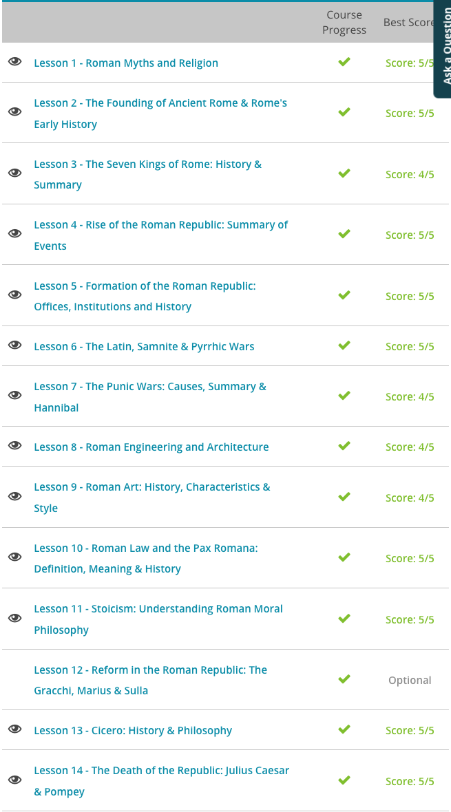

### Andrew Garber
### October 5 2023
### Chapter 5: The Roman Republic

*My having listened to the entire *The History of Rome* podcast by Mike Duncan makes this chapter a bit of a review, but far more exciting.*

#### 5.1. Roman Myths and Religion
 - Roman religion was a mixture of Greek and Etruscan influence, as very little is actually original about Roman religion. 
 - Luckily for the Romans, they didn't have to go that far to get that influence. The Greeks had built a massive colonial presence in what is now southern Italy and Sicily, which they collectively referred to as Magna Graecia. This meant that there was plenty of first-rate Greek civilization occurring just a short journey away from Rome, and the Romans wanted in on it.
 - As a result, eventually the Romans had adopted a great deal of Greek religion. Of course, they updated it and put a Roman spin on it, all by changing the names of many of the gods, goddesses, and other figures. For example, Zeus - the Greek king of the gods - was now Jupiter, or even Jove, depending on what myth was being alluded to. Ares - the Greek god of war - was now Mars, but the Romans tended to view him in a more positive light. Heracles became Hercules.
 - To prove this, the Romans needed to look no further than one of their great national epics, The Aeneid. This work told the story of Aeneas, the ancestor of the mythical founder of Rome, Romulus. It turns out that Aeneas was himself Greek but was tasked with fate to found a civilization whose destiny was to rule the world. In this, the Romans acknowledged that the Greeks had been the first to worship that set of gods, but that it was sheer destiny for the Romans to worship them as well.
 - Other earlier influences became part of the Roman religious belief, especially from the Etruscans, a group that had lived where the Romans did and heavily influenced their culture. Notably, Rome had multiple gods of war. Of course there was Mars, who showed up in all the myths; but there was also Janus, a two-faced god who was believed to assist Roman armies on campaign. Also, there were the Vestal Virgins, who were loosely linked to the Greek Pantheon. The Vestal Virgins were a group of unmarried women who tended to the holy fire of Rome.

#### 5.2. Early Roman History
 - The Italian peninsula was already occupied by Etruscans in the north and Greeks in the south. We actually know very little about the Etruscans. We know that they didn't speak Latin or any of the other Indo-European languages that had spread from the Black Sea basin. This suggests that the Etruscans had been living in Italy since as early as 3-4,000 BCE. In the centuries that followed, the Etruscans made some neat architectural innovations, including the Arch.
 - The Greeks also inhabited the South, in what the Romans would later call "Magna Graecia", or "Greater Greece". It was a series of colonies that the Greeks had established largely for trade and farming.
 - Our main source for the history of these early Latins is the Roman historian Livy, whose work 'Ab urbe condita,' From the Founding of Rome, served as a textbook of Roman history for centuries.
 - No one is quite sure where the Latin invaders came from. The Romans claimed that their Latin ancestors emigrated from Troy, a far-off city on the coast of Asia Minor and scene of the famous Greek epic The Iliad. Historians do not take this claim very seriously. The general assumption is that the Roman link to Troy was an attempt to co-opt some of the glory of Greek civilization. It is much more likely that the Latins weren't civilized people from Asia Minor but rather barbarians from somewhere in Northern Europe(the irony that centuries later they would decry all Northern Barbarians was lost on them). Whatever their source, these people forced their way down into the Italian peninsula sometime between the first and second millennium BCE.
 - The Latins established cities from the Alps all the way down to Central Italy, violently displacing the native Etruscans. According to Livy, these Latin cities banded together for mutual protection, forming the Latin League. At the head of this league was the city of Latium, also known as Alba Longa. Latium was ruled by a series of kings who engaged in all of the normal scheming and political maneuvering one might expect from rulers.
 - According to Roman myth, one of these rulers, a fellow named Amulius, stole his brother's throne. Fearing his brother's daughter, Rhea Silvia, might produce an heir to challenge him, Amulius forced Rhea to become a vestal virgin. Despite the enforced chastity of her new position, Rhea became pregnant. Some said that Mars, the god of war, did the deed, but even Livy doesn't give this claim much weight. Rhea was cast into prison, and her twin sons, Romulus and Remus, were cast into the river. 
 - This is where the myth gets really interesting, because according to legend, Romulus and Remus were rescued from the river by a she-wolf, and raised by a shepherd. When they grew up, they killed Amulius and restored their grandfather to the throne of Latium. They were so confident in their victory that they immediately set out to found their own city. They found the perfect spot along the river Tiber and marked out its boundaries. All that remained was to give the city a name. Each of the brothers thought the city should be named after himself. Eventually the conflict came to blows, and Romulus slew his brother Remus, giving the city its new name: Rome. Livy gives the date of this founding as 753 BCE, a date that even modern historians seem to agree with.
 - This is when the legend becomes darker, as the original inhabitants of Rome were an *unsavory cast* - mostly poor farmers and men on the run from other cities. Thus, not enough women would marry a Roman man. The solution to this: steal a bunch of women from nearby towns. It has been immortalized in paintings literally entitled *The Rape of the Sabine Women* by Peter Paul Rubens, and many other besides. Thus, the original unsavory reputation of Rome was made all the more unsavory.
 - 

#### 5.3. The Seven Kings of Rome
 - Rome is viewed in the modern lens either as a republic, or an empire, but few know that before there was ever a Roman Republic there was the Kingdom of Rome. The first seven kings of Rome are largely legendary, as it is easy to point to any of them and say *This one is the reason we have this religion", or "This one is the reason we have this institution", but it is definitely true that the Rome *had* kings before it had a republic.
 - According to Roman legend, the first king of Rome was Romulus, who founded the city and gave it its name. We're not sure if Romulus was a real person or just a figure of legend, but he certainly seems to have been a rather enlightened leader for his time. Romulus did not establish an absolute monarchy in which the king controlled every aspect of the state. Nor did he set up a dynastic monarchy in which princes succeeded their fathers to the throne. Instead, Romulus set up a sort of limited monarchy in which the power of the king is checked by other government bodies. He established a council of founding fathers known as the Senate. The Senate was mostly advisory in function. The only real power Romulus granted the Senate was the power to elect future kings. He probably got this idea from the Etruscans, who used a similar system to elect their own kings.
 - More than this, the King served as both the combination of all secular and non-secular power - both the controller of all military/political and an intermediary between the gods and man.
 - After the death of Romulus, we get Numa - once again, it is unclear whether he was a real person but he is one of those kings that the Romans could attribute things to - in his case, Religion. 
 - After Numa, we get Tullus - who probably was a real person - and he is the one who gets credited with Rome's military prowess and military tradition.
 - After Tullus, we get Ancus Marcius - who was also probably a real person, and is apparently Numa's grandson - and he is credited with Rome's expansion and the founding of the port city of Ostia.
 - The last of the elected Kings was Lucius Tarquinius Priscus, more commonly known as Tarquin the Elder, who was not actually a Roman by birth by an Etruscan immigrant. According to the legend/history, Ancus Marius was so impressed with the competence of Tarquin that he appointed him the caretaker/regent for his children. Upon the death of Ancus Marius, he was in a fine position to declare his candidacy for King and was duly elevated. He was seen by the later Romans as perhaps the most impressive(save for Romulus) of their kings, and his military prowess was legendary - going after the Latins, Sabines, and Etruscans.
 - The death of Tarquinius Priscus marked the end of the legitimate kingship in Rome. Tarquinius Priscus was not succeeded by an elected king but rather by his son-in-law, Servius Tullius, who ruled from 578 BCE to 535 BCE. Despite his unusual path to power, Servius was remembered fondly by the Romans, who attributed many important parts of their society to him. Servius supposedly tried to decrease the power of the aristocracy and grant greater power to the common people. He came up with a new class system that extended the vote to a much larger portion of the Roman population, and changed voting rights to align with people's place of residence rather than their lineage. He also replaced the aristocratic comitia curiata with the more inclusive comitia centuriata.
 - Yet, Servius still took efforts to maintain the authority of the aristocracy by making sure that the few votes of the rich could always outweigh the many votes of the poor. These reforms had a military aspect as well, since the divisions of classes determined a person's military obligation to the state.
 - The last king of Rome was Lucius Tarquinius Superbus, or Tarquin the Proud, the grandson of Tarquin the Elder. Tarquin the Proud's reign included some great military feats, some failures, and a *lot* of tyranny(according to the Legend/History). He killed his predecessor to seize the throne, killed a lot of senators who opposed him, and took a lot of wealth from pillaging for *himself* instead of the troops/state - which is never a smart move.
 - He tried to pull the same move that Commodus would later attempt - buying the masses adoration through games and festivals - but when the money ran out, he had to keep conquering to try and keep paying for it. When the campaign went poorly, Tarquin the Proud's son Sextus raped a noblewoman named Lucretia. Lucretia was so ashamed that she killed herself, but not before telling her husband and father what had happened. They were so enraged that they led a rebellion against Tarquin the Proud, and the Roman people rose up against him. Tarquin the Proud was thrown out of Rome by the people, led by Lucretia's widowed husband, Lucius Junius Brutus - whose descendant would later be the one to kill Julius Caesar(a family with an anti-tyranny streak, it appears).
 
#### 5.4. The Rise of the Roman Republic
 - Several major factors contributed to the dramatic rise of the Roman Republic in comparison to any other states, notably their comparative acceptance of the cultures of the people they conquered, their military prowess, and their ability to adapt to changing circumstances. 
 - As a Republic, their ability to elect new people to deal with new challenges was an inherent strength of the system.
 - The acceptance of the local cultures was meant as a way to minimize revolts, and the difficulty in converting the culture of a whole people. However, this would later not be a great help to the Empire, as the local cultures would cling to their own identities and not be as loyal to Rome as they might have been.
 - The military prowess of Rome was legendary, both due to an iron determination(as we will see in the Punic wars), and their tactical innovations. We haven't gotten to it yet, but the Maniple system was so great an innovation that it eliminated the Phalanx as a viable military formation, the Phalanx being the formation that had dominated the Mediterranean for centuries(it was the formation that Alexander the Great used to conquer the known world, with help from his Companion Cavalry).

#### 5.5. Offices of the Roman Republic
 - The political structure of the Roman Republic bears little resemblance to any modern state(though the idea of President and Vice President as a senior and junior consul would be a good one to really implement), but it is a good exemplar of Roman pragmatism. 
 - The first thing the Romans needed to do was replace their king with some sort of executive. The warlike Romans knew that command could not be handled by a large group. Leadership, especially in war, offers little opportunity for debate. It requires split-second decisions and unquestioned authority.
 - At the same time, the Romans didn't want to give that sort of unquestioned authority to a single man, and they certainly didn't want anyone holding such power for very long. So, the Romans came up with a novel solution: They'd take the responsibilities of the king and split them between two people, called consuls. That way, neither consul had absolute power, since the other consul could veto him. And, to make sure no consul was able to cause too much trouble, they limited the consul's term to one year and required them to wait 10 years before serving a second term.
 - This was added to by the fact that they also added the power of a "dictator", which meant that in times of crisis, the Senate could appoint a dictator who would have absolute power for a period of 6 months. This was a very rare occurrence, but it did happen(and every time it did, they voluntarily gave up power after the crisis was over - until Julius Caesar). The most extreme example of this is perhaps Quintus Fabius Maximus, who was appointed dictator to fight perhaps the greatest general the Romans ever faced, Hannibal Barca. Fabius is who we get the term "Fabian Tactics" from, to refuse pitched battle and win through attrition(see Ukraine Summer Counteroffensive, 2023 - a little joke for my own amusement). Also notable was Cinncinatus, who was appointed dictator, and more or less offered the position of dictator for life(how real this offer was is up for debate, but it isn't that relevant as the myth of it was more important than the reality) and he refused it, and went back to his farm. He was held up as a standard for virtue and patriotism for centuries, and was a personal model for George Washington(who also worshipped the Stoic philosophers, and put on a play at Valley Forge about Cato the Younger - perhaps the most stubbornly virtuous man who has ever lived).
 - Splitting up the authority of the king was just the first step the Romans took to check the power of their government. They also greatly increased the power of the Senate. The Senate was a council of Roman aristocrats, called patricians, that used to advise the Roman kings. Under the Republic, the Senate gained control of public funds. This added another effective check to the power of the consuls, since whatever the consuls decided to do, the Senate could always deny them the money to do it. The patricians of Rome also found another outlet for power in the Assembly of the Curia.
 - The Curia were the 30 foremost patrician families of Rome. In the early republic, these families would send representatives to an assembly, which voted on legislation, tried capital court cases, and most importantly, elected the consuls. Between the Senate and the Assembly of the Curia, the patricians of Rome now held far greater sway than they had under the king. However, the common people of Rome, known as plebeians (or just plebs), still felt as powerless as they had ever been.
 - A few decades after the foundation of the republic, efforts were made to increase the voice of the plebs. Another assembly, the Assembly of Centuries, came to the forefront. This assembly, made up of Roman soldier divisions, called Centuries, had supposedly been around since the time of Roman kings. In the Republic, this Assembly of Centuries gained much authority, eventually taking many of the powers of the Assembly of the Curia. Eventually, they got the right to elect consuls, as well as some other new positions, like censors, who were in charge of measuring the Roman population and adding new members to the Senate.
 - Finally, only the Assembly of the Centuries could declare war. The Assembly of the Centuries was neither purely plebeian nor purely patrician. It was a mixed bag. However, the superior number of the plebs were outweighed by the fact that the weight of one's vote in the Assembly was determined by the amount of property one owned. Thus, the richest members of Rome still controlled most of the voting power.
 - Another new assembly was the Assembly of Tribes. The Assembly of Tribes came about as the result of a reorganization of the Roman population. Instead of being divided by lineage and relationship to a patrician family, the Tribes of Rome were instead divided by geographical location. The resulting tribes formed an assembly, which voted on legislative matters. They also elected public officials, such as quaestors, who were the police of the time. The assembly was also a mixed bag of patricians and plebs. Unlike the Assembly of the Centuries, the weight of one's vote was not dependent on one's property or wealth. 
 - The Plebians weren't happy with those though, so in 494 BCE as they made up the bulk of the legions they "went on strike", and threatened to leave Rome and form their own city unless they were given real representation. This formed the Plebian Council, which could elect a Tribune - who could veto any law or action of the Senate or other legislative body. In the United States, this would be the equivelant of the House of Representatives electing someone to have Presidential Veto Powers.
 
#### 5.6. The Latin, Samnite, and Pyrrhic War
 - (Each of these could comprise their own chapter, but I am going to keep it to a brief overview)
 - Latins were not the only people who sought Rome's protection from powerful neighbors. In 343 BCE, the Campani people of Capua, under attack from their Samnite neighbors, surrendered their city and territory to Rome rather than have it fall into the hands of invaders. This put Rome into something of a pickle, since they had already negotiated a peace treaty with the Samnites. They sent emissaries informing the Samnites that Campania was under Roman protection. When the Samnites attacked anyway, Rome declared war, and this began the First Samnite War.
 - Rome sent two armies - one to defend Campania and the other to attack the Samnites at home in Samnium. The Romans enjoyed several victories, and after two years of fighting, the Samnites were soundly defeated and signed a peace treaty with Rome. Rome's territory now included the lands of the Campania.
 - Declaring war for the Romans was nothing they took lightly, they required a *Casus Belli*, or a reason for war. 
 - As the Romans grew, the small Latin States began to feel threatened - they were considering revolting against Rome right as the Samnites were defeated, but instead turned their armies around on the defeated Samnites and started attacking them. The Samnites, who had *just* concluded a peace treaty with Rome, were understandable annoyed about this and told them to control their vassal. 
 - But, when Rome tried to rein in the Latins and Campani, they turned against Rome in a full-scale revolt, known today as the Latin War. This war was the last bid of the smaller states of central Italy for independence. The Latins and Campani were joined by the Volsci, the Sidicini, and the Aurunci.
 - The Samnites jumped in to support Rome though, and together they demolished the Latins and their allies, and Rome now had control of all of central Italy.
 - Yet, this newfound friendship between Rome and Samnium would not last long. The Romans were eager to spread eastward into the mountains. The Samnites wanted to establish a foothold on the western coast of Italy. As the Romans began establishing colonies in, technically, Samnite land, the Samnites seized control of the city of Neapolis, modern day Naples. The people of Neapolis appealed to Rome for help, and the Second or Great Samnite War began. This war stretched for the better part of two decades with neither side able to pull off a decisive victory. The Romans were eventually able to brute force their way to victory, but it was only really possible due to changes in how Rome operated - greater conscription, the establishment of new colonies, and the building of their first navy(though this was more of a transport fleet than a navy).
 - Frustrated by Rome in central Italy, the Samnites attempted to expand southward, in the vain hope of regaining some sort of coastal territory. They attacked the Lucanians, who, in turn, appealed to Rome for help. Alarmed by this Samnite aggression, Rome once again declared war, beginning the Third (and final) Samnite War. Seeing this as perhaps their last chance to halt the progress of Rome, a wide variety of northern Italians joined forces with the Samnites. Etruscans, Umbrians, even the barbaric Gauls joined forces with Samnium against Rome. Though the Romans were hard pressed to face this unified front, their superior discipline and leadership led them to defeat the combined forces. By 290 BCE, the Samnites had been conquered completely. Rome now controlled central Italy from coast to coast.
 - Having proceeded as far east as they could go, the Romans now turned their eyes south to the lands controlled by Greek colonies. They found an excuse to start a war when the city of Tarentum sunk some Roman ships off their coast. Rome declared war on Tarentum. Tarentum appealed to the Greek mainland for assistance. Pyrrhus, King of Epirus, answered their call.
 - In 280 BCE, Pyrrhus landed in Italy with a significant army. Though King Pyrrhus was nominally victorious, he suffered heavy casualties in his battles with the Romans. The result was a war of attrition. The Romans were simply able to replace soldiers faster than Pyrrhus could. After less than five years of war, King Pyrrhus was soundly defeated, and the Romans added southern Italy to their territory. A decade later, to the north, the last Etruscan stronghold fell. In two and a half centuries, the Romans had effectively conquered the whole of Italy, from the Arnus river to the tip of the peninsula.
 - 
#### 5.7. The Punic Wars
 - In 264 BCE, the ambitious Roman Republic and the wealthy Carthaginian Empire collided on the island of Sicily in the first Punic War. This war was very similar to Athens' battle with Sparta in the Peloponnesian War in that it pitted a powerful army against a large and maneuverable navy. It was a drawn-out, bloody affair, with the Carthaginians trying to keep the battle at sea, and the Romans trying to force the battle to land.
 - After 24 years of continuous warfare that exhausted both cities, Carthage was driven from Sicily and forced to pay Rome a huge war indemnity, or fine. Bankrupted by the war and the indemnity and unable to pay its mercenaries, the Carthaginian Empire was thrown into a mercenary war. Rome took advantage of the chaos to add the islands of Corsica and Sardinia to its growing Mediterranean empire.
 - The second Punic War began in 218 BCE when the Carthaginian general Hannibal attacked the city of Saguntum, a Roman ally, in Spain. Hannibal smashed every army the Romans put in front of him, but without siege equipment, he was unable to take Rome itself. Instead, Hannibal laid waste across the countryside and tried to entice other Italian cities to rebel. For some reason, not one Italian city took up arms against Rome. Perhaps it was loyalty, or perhaps these cities feared Rome more than they feared this invader. Whatever the reason, Hannibal's plan to turn Rome's subjects against it failed. Nevertheless, through his military genius, Hannibal ravaged Italy for 16 years. More than this, he specifically targeted the properties of the Roman Consul Fabius Maximus, who invented Fabian Tactics to try and wear Hannibal down, making it look like Fabius had a deal with Hannibal.
 - Now enters one of the greatest Romans who ever lived, Scipio Africanus. He was the only one who wanted the command in Spain where Hannibal's brother Hasdrubal had been kicking the Romans around. He won in Spain(a daring assault with the tides) and then led the Roman Army to Africa, where the war was eventually decided.
 - *This is where that line from Gladiator comes from, when Commodus says "Didn't the Romans win the Battle of Zama"*
 - The Third Punic War is the least interesting of them, as there was more or less no chance of Carthage competing with the power of Rome by that point. The Romans were just looking for an excuse to destroy Carthage, and they found it when Carthage attacked a Roman ally. The Romans laid siege to Carthage for three years, and when the city finally fell, they burned it to the ground. The Romans then salted the earth so that nothing would ever grow there again. The Carthaginian Empire was no more.

#### 5.8. Roman Engineering and Architecture
 - The Romans were great engineers, and they built some truly impressive buildings, but the style was not their own - the Romans borrowed heavily from the Etruscans and the Greeks most notably. When they wanted an inmpressive building, they would copy the style of the Greeks. Roman Architecture was notably difference for one reason though, and that was the different materials - the Romans had an extremely strong concrete that they used to build their buildings, and this allowed them to build much larger buildings than the Greeks could, and much longer lasting(the Colosseum is still standing, after all).
 - Moreover, the Romans LOVED arches - they used it to build gigantic aqueducts to carry water for miles with just gravity. 

#### 5.9. Roman Art
 - Romans borrowed much of their artistic foundation to the Greeks, though they did innovate themselves - notably, in the form of portrait sculptures and narrative reliefs.
 - The tradition of portrait sculpture stretches back to the earliest days of Roman history. It was probably derived from the Roman custom of creating ancestral images. When a Roman man died, his family created a wax sculpture of his face, which they kept in a special shrine at home. These sculptures were more like records of a person's existence than works of art, so emphasis was placed more on realistic detail than artistic beauty.
 - As Rome grew wealthy and gained access to Greek sculptors, Roman aristocrats, called patricians, began making these portraits from stone rather than wax. Yet, despite this transition, they maintained their preference for accurate rendition over artistic expression. In the example below, the Roman portrait is stark, realistic, and without any sort of idealized flair. The Greek version is expressive, idealized, and beautiful.
 - 
 - Yet, Roman sculpture was not just about revering the dead, but also about honoring the living. Important Romans were rewarded for their valor or greatness by having statues of themselves put on public display. Below is one of the earliest of these sorts of statues that we've found, and this pattern continued all the way through the death of the Republic.
 - For exmaple, the statue of Marcus Aurelius, copied from Rome itself and stands in the middle of Brown University's campus. Or, the statue of Augustus(Octavian):
 - 
 - With the ascent of the emperor, another form of sculpture rose to prominence in Rome: narrative reliefs depicting the emperor's exploits. Like the portrait busts, these reliefs have their roots in a much older Roman tradition. Victorious Roman generals would often commission paintings commemorating their conquests. These were often carried during triumphal parades and set up for public display.
 - However, these paintings were never meant to be grand works of art but rather pictorial depictions, advertising the hero's achievements. The fact that none of them have survived to today suggests that these paintings were treated like we treat posters. With the greater resources available to emperors, the art of proclaiming one's victory became much more serious, permanent and monumental, moving from paintings on wood panels to sculpted stone.
 - Three of the most famous examples of such monuments are the Ara Pacis, or 'Altar of Peace,' celebrating Augustus' triumphs in Hispania and Gaul; the Arch of Titus, celebrating Emperor Titus' victories, including his successful siege of Jerusalem; and Trajan's Column, portraying Trajan's successful campaigns against the Dacians.

#### 5.10. Roman Law & The Pax Romana
 - *(NOT THE LAW OF JUSTINIAN)*
 - Of all of the creations of Roman Civilization, law is perhaps the most important. The Romans *LOVED* lawyers(they were not really called as such), and they were the first to really codify their laws into a "coherent" legal code. 
 - Roman law has a history nearly as old as Rome itself. In the early days of the republic, Roman law was held in the minds and memories of Rome's judges and magistrates. Such a system was prime for abuse. A magistrate could forget or even change laws on a whim, and there was no way to question him. And, since magistrates were aristocrats (or patricians, as the Romans called them), the common people, or plebs, had little hope of finding justice in such a system.
 - The plebs protested this justice system for many years, until at last, in 450 BCE, Roman law was codified and written down in the famous Twelve Tables of Rome. This written law guaranteed that all, high as well as low, were subject to the laws of Rome.
 - The Romans divided their law into three branches: civil law, the law of peoples, and natural law.
 - Civil law was the law of Rome and its citizens. These laws enumerated the rights and obligations of Roman citizenship. It included statutes of the senate, decrees of the emperor, the edicts of praetors, and of course, customs older than Rome itself.
 - The law of peoples was a later development that came about as the Romans rushed to provide laws for the peoples they'd conquered. Unlike civil law, which was only intended for Roman citizens, the law of peoples applied to all people, regardless of nationality. The law of peoples established the rights of personal property. The law of peoples also laid down the laws of trade, commerce, and contracts.
 - Natural law was more of a philosophical concept, and was largely led by the general Roman cultural adoption of Stoicism(it fit a lot of Rome's existing cultural values) and the Stoics belief in the "Cosmopolis". This was the belief that the whole universe obeyed a single, rational, and eternal order and that this order was just. The Romans called it "Natural Law", and the great orator Cicero(not a card-carrying Stoic, but a man who had studied them in great detail) wrote and spoke extensively about how natural laws stand above those of any nation or people.
 - This legal spirit did not end with the death of the republic. Indeed, under the steady leadership of Roman emperors, the Roman Empire and its laws expanded across the Mediterranean. This system of law and order was known as the Pax Romana, or 'Roman Peace,' and it spread everywhere Roman Legions marched - which was more or less their whole known world.
 - 
 - Though the peoples and cities the Romans conquered likely resented Roman subjugation, they could not deny that their lives were far more peaceful and orderly than they had been before. Roman law was rather fair and balanced for its time, and it was enforced by the armies of a mighty empire.

#### 5.11. Stoicism, Rome's Moral Philosophy
 - *Wow, it is almost as if I know a lot about this topic*
 - [Marcus Aurelius Paper](../../11TH_GRADE/Philosophy_101/Writing/marcus_aurelius_revision.md)
 - Roman society was ruled by custom as much as by law. This was a very conservative society. The older a custom was, the more sacred the Romans held it. This network of customs was called the mos maiorum, or the custom of the ancestors. These customs governed everything from the individual family to society as a whole.
 - At the family level, the mos maiorum established the pater familias, the father of the family, as the head of the household. The pater familias held absolute power over his household. However, he was supposed to exercise this power with moderation and justice. Failure to do so was deeply shameful. At the societal level, the mos maiorum referred to the system of patrons and clients that comprised Roman society. Patrons had obligations to their clients, and clients in turn had obligations to their patrons. This generally took the form of social and political support - the client would show up at the patrons house, ask for money, and then vote for the patron in the next election. This later just took the form of a social status, *I have #x of clients*. 
 - We can gain a clearer perspective on the mos maiorum by examining the virtues it extolled. The foremost Roman virtue was virtus. Though we derive the word 'virtue' from this word, in Latin, 'virtus' meant 'manliness'. By manliness, the Romans did not simply mean courage and strength, though those two concepts played an important role in Roman virtus. Virtus also implied the discernment to recognize good and evil and the wisdom to make informed decisions. Virtus encompassed several other sub-virtues governing a man's relationship to his fellow man, and society as a whole.
 - Disciplina, from whence we derive the word 'discipline,' refers to each man's need for discipline, training and self-control. The importance of this virtue was key in the iron discipline of the Roman Army. Disciplina is closely related to gravitas, a sort of dignified self-control that was meant to protect oneself and one's family from shame and dishonor. Also closely related to disciplina is the virtue of constantia, which the source of our word 'constancy.' This virtue called on Romans to put on a brave face, even in the midst of terrible adversity. The British would later call this "Stiff Upper Lip". 
 - The final Roman social virtue was fides, from which we gain the English word, 'fidelity.' Like its English derivative, fides means trustworthiness, faithfulness, reliability and credibility. In Rome, a man was only as good as his word. 
 - The Romans had a phrase for this, they said "Not everyone can be a Cato" - the Cato family were known as so uncompromisingly ethical that they were the standard for virtue in Rome. 
 - Considering the importance of religion in morality, it is not surprising that the mos maiorum also included several virtues concerning religion. There was religio, the source of our word 'religion.' Religio referred to the obligations between mortals and their gods, in much the same way that fides dealt with the obligations between patrons and clients. There was cultus, from whence we get the word 'cult.' Cultus governed the performance of religious traditions and rituals. Thus, the ultimate religious virtue was pietas, which we translate as 'piety' - faithfulness to the gods.
 - Now, what does that have to do with Stoicism, the lay person might ask? Well, Stoicism was a philosophy developed in Athens(shoutout to Zeno of Citium!) that incorporated a lot of these same cultural aspects and made them rigorous and logically consistent. For example, the Stoics had four virtues that they held above all others: Wisdom, Courage, Justice, and Temperance - all of which are just knowledge in different forms. 
 - In relation to the "Stiff Upper Lip", the Stoics(uppercase *S*) had a belief that most emotions are irrational in some way, and that we should take the time to evaluate each emotional response(and train ourselves to not react emotionally) to see if it is rational or not. If it is rational, then we should act on it, and feel it fully. If it is not rational, why would we let it control us? 
 - The Stoics also emphasized the equality of all men, be they the lowliest slave or the loftiest emperor. They highlighted the fact that everyone, regardless of status, wealth or physical condition, had something to contribute to the whole, like the two rows of teeth, upper and lower, which seem to work against each other, but actually work together for the good of the whole body. A person's importance was not determined by society, but by nature itself, which values the toil of the slave as much as the leadership of an emperor.
 - This Stoic philosophy aligned well with the mos maiorum of the Romans, especially the social virtues. Virtus implied a knowledge of natural law and a desire to act in accordance to it. Disciplina acknowledged that everyone had a place in society, and that society works best when everyone fulfills their role. Finally, constantia and gravitas both called for a similar strength of will and character, even in the face of outrageous misfortune. 
 - There are a long list of important Roman Stoics, but the most important are Cicero - a master orator, and translator of Stoicism from Greek to Latin - Seneca - a playwright, writer, and tutor to the Emperor Nero - Epictetus - a former slave who became perhaps the most rigorous teacher of Stoicism since its peak with Chrysippus(though Epictetus was not much for logical proofs and paradoxes, being almost entirely focused on ethical considerations), and lastly, Marcus Aurelius - the last of the "Five Good Emperors" and arguably one of the greatest men to ever live. This is not the place for a rant about the greatness of Marcus Aurelius, but suffice it to say, we would not be lacking for anecdotes that display his greatness.
 - Some selected Stoic quotes:
    - "To err is human" - Seneca
    - "Enjoy present pleasures in such a way as not to injure future ones" - Seneca
    - "Books are the training weights of the mind" - Epictetus
    - 'Some things are in our control and others not. Things in our control are opinion, pursuit, desire, aversion, and, in a word, whatever are our own actions. Things not in our control are the body, property, reputation, command, and, in a word, whatever are not our own actions.' - Epictetus(Enchiridion)
    - "When you wake up in the morning, tell yourself: the people I deal with today will be meddling, ungrateful, arrogant, dishonest, jealous and surly. They are like this because they can't tell good from evil. But I have seen the beauty of good, and the ugliness of evil, and have recognized that the wrongdoer has a nature related to my own, not of the same blood and birth, but the same mind, and possessing a share of the divine." - Marcus Aurelius
    - "The best revenge is not to be like your enemy." - Marcus Aurelius
    - "The happiness of your life depends upon the quality of your thoughts." - Marcus Aurelius
 - *The Study.com article is incorrect in saying that Seneca was teaching Caligula, he was a tutor to Nero*
 - I could keep going, but I think I should move on to another lesson.

#### 5.13. Cicero
 - Cicero was the greatest mind of his age and one of the greatest minds that Rome ever produced. A weak and sickly youth, Cicero was ill suited to military service, so he sought to expand his mind instead. He learned Greek at an early age and studied in Athens for several years.
 - Cicero's political career began in 75 BCE, when, at age 31, he served as quaestor for the province of Sicily. During his time there, the people of Sicily persuaded Cicero to bring charges against their old governor Gaius Verres, who had used his position to plunder the populace. For his defense, Gaius Verres hired Quintus Hortensius Hortalus, then the greatest lawyer of his age. Cicero's case for the Sicilians was so solid, his speeches so persuasive, that he defeated Hortalus completely, earning him great fame and making him one of the most sought-after lawyers in Rome.
 - His fame bolstered, Cicero climbed the Roman political system with surprising speed. He served as an aedile in 69 BCE (age 37), and praetor in 66 BCE (at age 40). And in 63 BCE, he attained the highest honor a Roman citizen could hope for, being elected consul at the incredibly young age of 43.
 - As consul, Cicero had to deal with the Catiline Conspiracy, an attempt to overthrow the Republic with a foreign army. He rallied the Senate against Catiline and his co-conspirators in a series of speeches called the Catiline Orations, which survive to this day. After assembling a mountain of evidence against the conspirators, Cicero had them all summarily executed.
 - For having them executed without trial, he was banished to Greece - and then almost immediately brought back to try and deal with the greatest challenge that Rome had ever faced - Julius Caesar. 
 - If the Senate had hoped Cicero would help deal with Caesar, they were sadly mistaken. Caesar was far too popular at that point and had powerful allies in Pompey and Crassus. Though Cicero tried to rein in Caesar, his measures were defeated, and Cicero retreated to the literary life. When Caesar brought his army to Rome, Cicero fled with the other senators and Pompey.
 - Yet Cicero need not have fled, since Caesar was actually very keen on having Cicero as an ally. In 60 BCE, Caesar had invited Cicero to join his alliance with Pompey and Crassus, but Cicero refused, seeing this triumvirate as a danger to the Republic. Before Cicero's flight in 49 BCE, Caesar again tried to court the great orator's support. Upon Cicero's return to Rome in 47 BCE, Caesar pardoned him without reservation, hoping to bring Rome's great orator into his camp.
 - After Caesar's assassination, Rome divided into two camps: the Senatorial camp, who supported the aristocracy and strove to restore the Republic, and the Caesarian camp, who supported Caesar and his many reforms. Cicero became the foremost representative of the Republic and the Senate, while Caesar's right hand man, Mark Antony, led the Caesarian camp. This marks the height of Cicero's political power.
 - When Caesar's heir, the young Octavian, came on the scene, Cicero attempted to turn Octavian and the Republic against Mark Antony, with a series of speeches known as the Philippics. Cicero succeeded at first. He got Mark Antony declared an enemy of the state, and sent Octavian with an army to defeat him. But Octavian and Antony eventually united and turned against the Senate. Antony returned Cicero's dislike with interest, and had the great orator labeled an enemy of the state.
 - Cicero's name was added to the list of proscriptions, and in 43 BCE, Cicero was dragged from his litter and summarily executed at the age of 63. Upon his murder, his hands were nailed to the rostrum of the Roman Forum.

#### 5.14. The Death of the Republic: Caesar & Pompey
 - In the last century before the Common Era, the Roman Republic was ready to tear itself apart. The Republic was gripped by civil war, as those who supported the rights of the plebs, known as populares, tried to wrest the Republic from the hands of the optimates, who sought to protect the privileges of the aristocracy.
 - The first object of their hope was Gnaeus Pompeius, known today as Pompey Magnus, or Pompey the Great. His name was well earned.
 - Pompey was from a pleb family. His father was the first in his family to serve as consul under the dreadful Sulla. Despite his lowly origins, Pompey was acclaimed as one of Rome's greatest generals. Everywhere he went he brought victory. He'd won campaigns in Sicily, Africa, Spain, and Syria and even cleared the pirates from the seas. These achievements led to Pompey being elected consul.
 - If the plebs were hoping Pompey would use his newfound authority to restore their political rights, they were sadly mistaken. Pompey was a conservative at heart. He had worked very hard to join the upper class, and he was as jealous of its privileges as any ancient patrician family. Pompey might intimidate the Senate now and again with the threat of his legions, but he had no real interest in undermining the upper class, now that he was a part of it.
 - Instead of actually giving rights and privileges to the plebs, Pompey used his power to more or less buy them off - festivals, feasts, bread, games and money were all used to keep the plebs happy. Obviously, this couldn't be sustained forever(except during the Empire, when it was).
 - As Pompey was reaching the height of his power, an aristocrat named Gaius Julius Caesar started making waves in the Roman political scene. Unlike Pompey, Caesar was from an ancient patrician family. But he was also the nephew of Gaius Marius, the leader of the populares, whereas Pompey had been fighting on the side of the optimates.
 - Recognizing this kinship, Caesar formed an unofficial alliance with Pompey by marrying his daughter, Julia, to the aging general. With this marriage, Caesar elevated Pompey to the senatorial class and cemented their alliance.
 - Caesar persuaded Pompey to include a senator named Crassus into their scheming. Crassus had earned some fame putting down the slave rebellion led by Spartacus, but his most notable achievement was that he was the richest man in Rome. These three came together to form the First Triumvirate: an alliance between Julius Caesar, Pompey Magnus, and Marcus Licinius Crassus.
 - Of these three, Caesar was the least powerful. He was a sort of junior member of the Triumvirate. His few military exploits, though successful, were not really noteworthy. His family was ancient but bankrupt. Caesar's role in the First Triumvirate was to ally the wealth of Crassus with the political power of Pompey.
 - With political support behind him, he ran for consul and won - and then immediately set about using that power to go to Gaul(Southern France) and go do some conquering. He spent something like 10 years conquering, conquering some more, and doing a little more conquering. He then wrote a book about it called "The Gallic Wars". 
 - While Caesar was out conquering Gaul, things were turning sour back at Rome. Caesar's daughter, Julia, died. Without her marriage to Pompey, the Triumvirate was on shaky ground.
 - The next year, Crassus died in battle in Parthia. This shattered the old Triumvirate and deprived Pompey of his wealthiest supporter. With less money to fling around, Pompey could no longer keep the plebs happy and distracted. The old class struggles came to a head, and the city was descending into riots.
 - Afraid of Caesar's growing power, Pompey turned against his old ally and formed an alliance with the Senate. The Senate declared Pompey sole consul and declared Caesar an outlaw. It is unclear whether the Senate and Pompey truly meant to threaten Caesar, or if this was all meant to be a bluff to bring Caesar in to line.
 - But Caesar had no intention of being brought in to line, especially considering he had an army personally loyal to him at his back. He crossed the Rubicon river, which marked the boundary between his province of Gaul and Italy, and marched on Rome. Pompey and the Senate fled, and Caesar took control of the city.
 - As Caesar established himself in Rome, the Senate and Pompey fled to the Eastern provinces to raise an army. With Rome secure, Caesar chased after them. In 48 BCE, the two sides met at the Battle of Pharsalus in central Greece. Though Pompey led the larger force, Caesar's superior tactics won him the battle. His army destroyed, Pompey fled to Egypt, with Caesar hot on his heels.
 - We're not sure what Caesar intended to do with Pompey when he caught him, but when Caesar arrived in Egypt, he found that Pompey was already dead. The Pharaoh of Egypt, a boy named Ptolemy XIII, presented Pompey's head to Caesar as a gift. Caesar was not amused. He used the opportunity to support Cleopatra's claim to the throne, and perhaps he even had a child with her(though this is disputed).
 - Done with Egypt, Caesar completed Pompey's earlier conquest of Asia Minor in an astoundingly short time, then swung back to Africa to mop up the last few senators who stood against him.
 - In 46 BCE, Caesar returned to Rome, glorious with victory and rich with plunder. With a delicate balance of amnesty and military threat, Caesar got the Senate to name him absolute dictator of Rome for ten years.
 - In the years that followed, Caesar began dismantling the Roman Republic.
 - Instead of a few aristocratic families vying with one another for power, Caesar slowly began funneling all of the power to himself. Ironically, his task had been made much easier by the very aristocrats who had opposed him. Rome's aristocrats had already taken political power away from the common people, who now hated the aristocracy with a passion. This meant that the majority of Romans had no stake in the government anyway and did not care if Caesar took power from abusive aristocrats.
 - Caesar started centralizing power in himself - he started stacking the senate with his own supporters, and handing himself titles. 
 - And Rome, which had been without a king for nearly 500 years, now had a king again. He might not have called himself a king, he might not have dressed like a king, but Caesar was a king. There was no doubt about it. The Republic was dead.
 - This doesn't mean that everyone was happy about it though - Caesar was assassinated by a group of senators who were afraid that he was going to make himself king. There is a famous legend about the wife of Brutus, Porcia, the daughter of Cato, who to prove that she could be trusted with the secret of the assassination, stabbed herself in the thigh with a knife. 
 - Another civil war broke out after Caesar's death, and the Republic was dead for good.

 