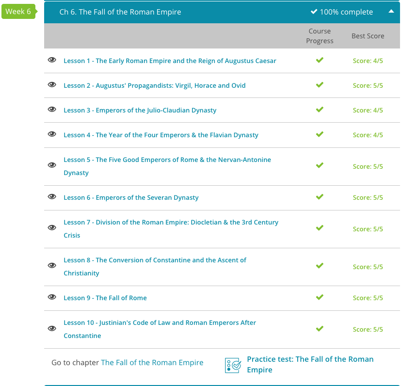

### Andrew Garber
### October 19 2023
### CLEP Western Civilization I
### The Fall of the Roman Empire

#### 6.1. The Early Empire
 - The Emperor Augustus, who found Rome a city of bricks and left it a marble, was not actually named Augustus. His name was Gaius Octavius, and his grand-uncle was Julius Caesar. When Caesar was assassinated, Octavius was named in his will as his heir. 
 - Octavian was not the only fellow hoping to succeed Caesar. When Octavian arrived in Rome after his uncle's assassination, he found Caesar's right hand man, Mark Antony, making his own bid for power.
 - The Senate used Octavian to get rid of Antony, yet the Senate had gotten more than they had bargained for in Octavian. Using the menace of Mark Antony as a goad, Octavian bullied the frightened Senate into granting him extraordinary powers for a man of his age. He was made a senator and granted the same powers as the consuls. More importantly, he was given legal control over the armies of Rome.
 - With his right hand man Agrippa(who deserves SO much more credit than he gets), Octavian defeated them in Gaul.
 - If Octavian had hoped for a hero's welcome upon returning to Rome, he was sorely disappointed. The Senate had grown wary of the young Octavian and were reluctant to grant him any more glory or power than they could avoid.
 - Realizing the situation, Octavian allied himself with Antony and another of Caesar's supporters named Lepidus. The three formed the Second Triumvirate, an alliance between Octavian, Antony, and Lepidus. Working together, these three men killed off their political rivals and seized their property in a series of political murders, known as proscriptions. This removed the last obstacles to absolute power and made the three very wealthy.
 - While Octavian and Antony had been fighting among themselves in the West, Caesar's assassins had been amassing power in the East. A conflict was inevitable, and in 42 BCE, the two sides clashed at the Battle of Phillipi. Caesar's assassins, the last champions of the Republic, were completely defeated, and Brutus, who had betrayed Caesar, took his own life.
 - A few years later in 36 BCE, the Triumvirate destroyed the fleet of Pompey Magnus's son, Sextus Pompeius, wiping out the last of those who had opposed Caesar.
 - With their common enemy destroyed, the members of the Triumvirate turned against one another. Lepidus attempted to claim Sicily, but his troops abandoned him, and he was exiled. But the biggest rivals in this conflict were Octavian and Antony, who soon turned against one another.
 - Antony was far more ambitious than Lepidus; he wanted the entire eastern Empire. He was setting himself up as an eastern despot and sought to rule all of the Empire from Egypt, with his queen Cleopatra, or at least that's what Octavian tried to convince the Romans. It might have even been true. Eventually this conflict came to a head, and in 31 BCE, the two sides met in a naval battle at Actium, in which Antony and Cleopatra's fleet was utterly destroyed.
 - After suffering another defeat the next year at Alexandria, the two committed suicide together, inspiring poets and playwrights through the ages.
 - After that many victories(shoutout Agrippa!), Augustus was bestowed the title "Imperator", of which we get the title "Emperor".
 - Augstus/Octavian was a crafty guy though, and rather than seizing authority and becoming a dictator, he allowed many of the offices of the Republic to remain. Octavian refused to be named dictator or even consul for life. Instead, he just made sure he held enough important positions to get him what he wanted. By maintaining the illusion of the Republic, Octavian gave his reign legitimacy.
 - That being said, the Senate still laid on the titles. They named Octavian proconsul: the governor of a province; they called him tribune: by which they meant he was a defender of the people; they hailed him as princeps: the first among equals; and finally, they gave him title by which we know him today, Augustus: which, in Latin, means dignified, majestic, sacred, venerable, and worthy of honor. We get the word "august" from this title.
 - By the time of his death, Augustus Caesar had transformed Rome from a city of bricks into a city of marble - and more than that, the Roman Republic was for all intents and purposes, dead, and the Roman Empire had been born.

#### 6.2. Augustus' Propagandists
 - Augustus' friend and advisor, Gaius Maecenas, was a great patron of the arts. He had collected a fine selection of poets, all eager for imperial sponsorship. Among his top talent were the poets Horace and Virgil. Though they probably did not know it, these poets would usher in a whole new age. Through their work, they would proclaim the glory of the Empire through the ages and establish their patron, Augustus, as the father of a new era, an Augustan era of peace and prosperity.
 - Virgil was a fanatical believer in Augustus, and he wrote a poem called the Aeneid, which was a rewriting of Roman history, putting Augustus center stage in the mythology of Greece & Rome. Throughout the Aeneid, Virgil suggests that the entirety of Roman history, from Aeneas' flight from Troy through Romulus' founding of Rome, was all leading up to Augustus. 
 - Quintus Horatius Flaccus, or as we known him, Horace, was a long time opponent, but in converting Horace, Augustus won great legitimacy. He wrote a series of poems proclaiming the great moral, military, and political victories of Augustus.
 - Finally, there was Ovid. By the time Ovid showed up, Augustus' propaganda project had long since completed its aim. Augustus' authority was unquestioned, and Augustus himself was revered in a way normally reserved for gods.
 - Yet, Ovid also seems to have had a rebellious streak. While Augustus was busy trying to reassert the sanctity of marriage and family values, Ovid wrote a set of naughty poems called the Ars Amatoria, or the Art of Love, which showed little regard for Augustus' strict moral code.
 - He also wrote his masterpiece, the Metamorphoses, in such a way that was seen as a backhand slight at the changes Augustus had implemented. Whether Ovid was trying to be subversive or not, Augustus clearly thought Ovid was dangerous, or at least annoying, for in 8 CE he exiled the poet to Tomis, a flyspeck of a town on the banks of the Black Sea. This was essentially banishment to the end of the Earth. Poor Ovid would spend the remainder of his life pining away for the city and culture he loved.

#### 6.3. Emperors of the Judio-Claudian Dynasty
 - The Judio-Claudian dynasty is perhaps the most famous of all dynasties in the Roman Empire. It included the reigns of Augustus, Tiberius, Caligula, Claudius, and Nero. The extremes of Roman emperorship are on display in this dynasty, from the heights of Augustus' reign to the depths of Nero's.
 - Ironically, Augustus never declared himself emperor, but instead called himself the First Citizen. However, due to the power and control he wielded, history and tradition have awarded him the title of the first Roman emperor. During his reign, he definitely lived up to this title, having complete authority over every Roman colony. This power enabled him to restore peace within the Empire, beginning the famous Pax Romana, or Roman Peace. Under this peace, the agricultural production, economy, and arts of the Empire boomed, and in 2 BCE Augustus was declared Pater Patriae, the father of his country.
 - He MASSIVELY expanded the reach of the empire, arguably setting a dangeorus precedent that would lead to the overstretching of the Empire in the future.
 - After Augustus/Octavian, comes Tiberius. In fact, Tiberius was the son of Augustus' wife from her first marriage. He was, what we would call, Augustus' step-son. In order to make the family connection even stronger, and in perfect soap opera style, Augustus forced Tiberius to divorce his wife, and then take the hand of his, Augustus', daughter in marriage.
 - Unlike his predecessor, Tiberius was a soldier who never really wanted to be an emperor. Not one for enjoying the pomp and circumstance of Rome, he spent a large part of his reign on the island of Capri. While there, he abandoned most of his imperial duties to his advisor, Sejanus. Unfortunately, Sejanus decided to have an affair with the wife of Tiberius' son. This didn't go over to well with Tiberius, and after a series of very dramatic events, Sejanus was brutally executed.
 - This didn't end well for Tiberius, after his paranoia reached a fever pitch, a member of the Praetorian Guard, the elite soldiers who protected the emperor, murdered him.
 - After Tiberius, comes Caligula, the adopted son of Tiberius. Caligula was very much in the model of Tiberius, paranoid, cruel, tyranical, and a bit of a madman. Whether all of the stories are true, it doesn't much matter, because Caligula was also killed. 
 - After Caligula, comes Cladius, the uncle of Caligula. Claudius is what we would call a nerd. He was picked by the army(they thought he would be easy to control), but they were wrong. Claudius was an extremely comptent soldier and administrator, though not very good at wife-choosing. His wife Agrippina killed him to put her son Nero on the throne.
 - Now, Nero. How much of the stories about Nero are true, we don't know, but we do know that the historical reputation of him was not good. He has been accused with starting the Great Fire of Rome, and then blaming it on the Christians. He also probably murdered his Mother(like Mother like son), to which Seneca - the great Stoic philosopher - wrote a speech defending him. 
 - Eventually the senate got tired of all of the murder. Facing a sentence of death from the Roman senate, Nero committed suicide. Dying with no heir in place, his suicide brought the final violent death to the Julio-Claudian Dynasty.

#### 6.4. The Year of the Four Emperors & The Flavian Dynasty
 - When Emperor Nero was deposed without an heir in the year 68 CE, the position of emperor was up for grabs. What ensued was a bloody year in which four men claimed, then tried to hold, the crown. The first man to begin the Year of the Four Emperors was Galba. As a respected general, Galba seemed to have what it took to be emperor. Unfortunately, he was old, and when he chose his heir, a man named Otho challenged this decision. When a supporter of Otho assassinated Galba, Otho took the throne as the year's second emperor.
 - Sadly for Otho, he lacked the military might to hold the throne. When Vitellius, another military man, challenged the throne, Otho actually committed suicide, handing the crown to Vitellius, the year's third emperor. Ironically, Vitellius proved to be as weak as his predecessor. Within a very short time, his generals had more power than he did, and Vitellius was actually dragged into the streets and murdered.
 - In comes Titus Flavius Vespasianus. Known to history as Vespasian, he took and held the crown, beginning the Flavian Dynasty of emperors. Since Vespasian sort of won the Year of the Four Emperors, we're giving him the nickname, Vespasian the Victor. This is especially fitting since he restored stability to the Empire after a year of chaos. As the victor, he also suppressed several rebellions throughout the Empire, the most famous being the Jewish rebellion, centered in Judea.
 - Adding to these victories, Vespasian won the heart of Rome by creating a well-oiled propaganda machine. For example, when his son, Titus, sacked Jerusalem, Vespasian organized an extravagant ceremony, or triumph, in which they showed off their spoils of war. Not content with only showing off the spoils of war, Vespasian won public opinion by beginning the construction of one of Rome's greatest treasures, the Colosseum, known to ancient Rome as the Flavian Amphitheatre. Winning the game of public opinion, Vespasian ruled until his death by illness, not assassination, in the year 79 CE. Upon his death, his eldest son, Titus, took his crown.
 - It was within Titus' reign that Mt. Vesuvius erupted, burying the cities of Pompeii and Herculaneum under volcanic ash. Adding to this tragedy, a fire ravaged Rome in the year 80 CE. As if this wasn't enough to earn him the nickname Titus the Tragic, his reign also saw the outbreak of the plague within the Empire. On top of all these ill-fated events, Titus himself succumbed to illness, dying in 81 CE.
 - Upon the tragic death of Titus, the third and last Flavian emperor took the throne. His name was Domitian, son of Vespasian and younger brother of Titus. 
 - As a domineering emperor, this famous Flavian considered himself a god. While previous emperors at least referred to themselves as 'first citizens' or 'first among equals,' Domitian preferred to be called 'master and god.' Seeing himself in this light, Domitian usually ignored the desires of the Roman senate and aristocracy. He dealt cruelly with his critics, seizing their property, and ordering their deaths. He also levied heavy taxes, and spent a great deal of money staging extravagant games and building monument after monument in his family's honor.
 - Eventually, the aristocracy of Rome reached their fill of Domitian and his domineering ways. In 96 CE, Domitian was assassinated. Since he died without a living heir, the famous Flavian Dynasty died with him.

#### 6.5. The Five Good Emperors: The Nervan-Antonine Dynasty
 - When Emperor Domitian was assassinated without a living heir in the year 96 CE, the Roman Senate quickly and wisely chose a man to take his place. This man's name was Nerva, and lucky for the Empire, this choice was a good one. Nerva's reign began the Nervan-Antonine Dynasty, which included what history calls the Five Good Emperors. In order of their reign, they were Nerva, Trajan, Hadrian, Antoninus Pius, and Marcus Aurelius.
 - These were some of the best emperors in Roman history, and they created an era of stable leadership despite turbulent times. Interestingly, every one of the successions was by adoption here, not by blood. Sadly, the greatest failure of the greatest of these emperors was his naming of his son Commodus as his heir.
 - Nerva began the reign of the Five Good Emperors in 96 CE. Unlike many emperors, he is remembered in history as a rather honorable guy. He lessened the strain of taxation on his people and worked to bring back into the fold of Rome those who had been mistreated and exiled by his predecessor, Domitian. Since Nerva was up there in age when he took the crown, his reign was short lived. However, before he died, he adopted Trajan as his heir, thus beginning the custom of adoption to the throne.
 - Trajan ruled as a soldier and more or less focused his rein entirely on military conquest. The problem was, the Empire was near its administrative capacity, and many of these outlying provinces were difficult to defend.
 - Unlike Trajan, Hadrian did not work to extend the boundaries of the empire. On the contrary, he is most famous for the wall he built in order to plant them firmly in place. Although the most famous of these is Hadrian's Wall in Britain, several others were constructed throughout the empire.
 - Antoninus Pius reigned from 138 CE to 161 CE. Although his reign was long, we know very little about the man himself. Perhaps the least famous of the Five Good Emperors, history tells us he was actually very well-liked by the subjects he ruled. Unlike his predecessors, Pius was content to stay within the borders of Italy, ruling the Empire during one of its most peaceful eras. His adoptive son, Marcus Aurelius, would credit him greatly in his *Meditations* for his abilities as a ruler.
 - Now, the greatest of them all(and a man who contends for the greatest who ever lived), Marcus Aurelius. Lesser known to history, Marcus Aurelius had a co-emperor: Lucius Verus. Verus was by no means the equal of Marcus, but he was certainly not without abilities and was known as a comptent military leader. Sadly for history, Verus died young, and Marcus Aurelius was left sole emperor of Rome. 
 - Marcus's political and military achievements are frequently overshadowed by his philosophical production, my favorite book of all time, the *Meditations*. This was the personal journal of Marcus, written in Greek, as a kind of commandment to himself(another title of the work) to be better. 
 - However, Marcus's reign was not without strife - the good luck Antoninus had did not extend. With invasions from the north, a plague, the Parthians causing trouble in the east, and then a rebellion from his most trusted general, Marcus Aurelius had his hands full. However with the philosophy of Stoicism, he apparently held the Empire together with grace and dignity.
 - Sadly, Marcus Aurelius was apparently not of the greatest health, and upon his death, his son Commodus took the throne. Commodus was a terrible emperor, and the Nervan-Antonine Dynasty ended with him.

#### 6.6. The Severan Dynasty
 - Septimus Severus came to power in the Year of the Five Emperors, and came to power due to his military prowess and general ruthlessness. 
 - To stabilize his lands, Septimius the Soldier disbanded the very large and very corrupt Praetorian Guard, or the emperor's elite bodyguards. He was also the first emperor to create a standing, or permanent, army within Italy. Not only did this keep the homeland safe, it also made Septimius very formidable. Anytime there was a threat to his power, he had an army ready and waiting! In order to keep the soldiers on his side, he increased their pay and benefits. Working to keep the citizenry content, he put on games, supplied grain, and even forgave the debts of his powerful friends.
 - Although all these actions kept him safe from assassination, it added a huge financial burden to the empire. This burden was so large, many historians actually blame his policies for the eventual fall of Rome. I don't think this is as ridiulous as it sounds, because the financial burden of the army was a huge problem for the empire.
 - After the peaceful death of Septimius the Soldier, his sons, Caracalla and Geta, were co-emperors of Rome. Not really keen on the idea of sharing power, Caracalla arranged for the murder of his brother and took outright control of the empire. Caracalla is most known for his Antonine Constitution, making every free person a citizen of the empire. He was also a brutal, cruel man who was known for ordering massacres in return for the slightest offense - Marcus Aurelius would not approve.
 - Having had enough of Caracalla the Citizen, one of his relatives, Macrinus, murdered him and claimed the title of emperor. He died about a year later, being murdered by another Severan known to history as Elagabalus. 
 - Unfortunately for Rome, Elagabalus was a young teenager when he became emperor. Like lots of teenagers, he had more interest in partying than ruling. For this reason, history says very little about his accomplishments. He enjoyed pretending to be a female prostitute, marrying both men and women, forcing those around him to participate in sexual acts, and generally doing things not worthy of an emperor.
 - Being fed up with his antics, his bodyguards murdered him, and his very young cousin, Severus Alexander, was put on the throne. Upon taking the throne, Severus's rule was dominated by his mom.
 - Fortunately for Rome, Alexander Severus' mom, Julia Avita Mamaea, wasn't all bad, and his rule was marked by peace. Although she was a rather jealous woman who got rid of anyone who challenged her control, she did make sure Severus was surrounded by wise council. She was also very fiscally strict and imposed cuts to the military and its spending. This, along with the fact that Severus and his mom tried to bribe enemies rather than fight them, made the military mutiny. Like most of the other Severans, Alexander Severus and his mom were assassinated in the year 235 CE. 
 - Thus ended perhaps the most turbulent dynasty in Roman history.

#### 6.7. Diocletian
 - The 3rd century crisis was a period in which the Roman Empire nearly fell apart - everything was breaking simultaneously, civil war was rampant, foreign invasions were constant, and the economy was in shambles.
 - As the Emperor was in chaos following the murder of Severus Alexander, the territories of Gaul, Spain, and Britain decided they didn't want to be a part of the Roman Empire anymore and declared the Gallic empire. 
 - Witnessing the rebellion of these territories, the eastern provinces, comprised of Syria Palaestina and Egypt, also decided to try their hands at revolution. Making matters worse, the territories that did remain loyal to Rome were burdened with warring generals trying to assert their power. These generals, who were mostly killed in battle or assassinated, are known to history as the Barracks Emperors.
 - With less money flowing, it was increasingly difficult to actually defend the empire. Germanic tribes pillaged the borders, and damaged the economy even further. Then, to top it all off, a plague hit Rome and devestated cities and villages alike - further weakeneing the Empire.
 - Fortunately for Rome, competent emperors came on to the scene. First, Emperor Claudius II began shoring up the borders around 270 CE. He did this by running the Gauls out of the Empire. Sadly, the plague got him before he could finish the job.
 - Know comes on to the scene on of the greatest emperors in Roman history, Aurelian. He was a military genius, and he was able to defeat the Gallic Empire, and then the Palmyrene Empire, which was a breakaway state in the east. Sadly, his bodyguards murdered him before he could finally reunite the Empire.
 - In the year 284 CE, Diocletian came onto the scene, claimed power and began to pull the Empire from the pit of despair. Picking up where Aurelian left off, he instituted several reforms. Also, in order to let people know he was boss, he took a page from Aurelian's book and began calling himself Lord and God. This move set him up as a deity, not to be messed with.
 - In the matter of the economy, Diocletian also took the bull by the horns. He introduced coins with purer metal content. These coins became known as the gold solidus, the Latin word for solid, and soon became the standard currency of the Empire. To battle inflation, he instituted an Edict on Maximum Prices, which was basically a comprehensive list, telling suppliers what they could and could not charge for an item. In other words, the edict, not the market, determined price.
 - Not one to back away from a fight, Diocletian also took on the military. Unlike many of his predecessors, Diocletian was not afraid to leave the safety of Rome. This made him a force to be reckoned with. Adding to this, he created a cavalry-based army which he could deploy as soon as trouble arose. He also split troops into layers, leaving some at the borders, but also placing some within the interior of the Empire. Perhaps his greatest military tactic was the creation of the Tetrarchy, in which he placed four rulers across the Empire to keep his laws and orders. In doing this, Diocletian could keep his finger on the pulse of the Empire.
 - At the end of Diocletian's remarkable reign, the Empire had crawled its way from the dark pit known as the Crisis of the 3rd Century. Yes, problems like foreign invasion, a pathetic economy and civil war would eventually sink the Empire. However, Diocletian will be remembered as the man who conquered the Crisis of the 3rd Century, and kept the Empire standing for a little while longer.

#### 6.8. Constantine the Great
 - Constantine's conversion to Christianity(and the official conversion of the Empire), is one of the most important events in the history of the world. It elevated Christianity from a small, persecuted sect to the official religion of the Roman Empire, and gave it political power and legitimacy. More than this, it made Judeo-Christian morality the moral code of the Western world, the basis for most of our laws and social norms(right or wrong).
 - His conversion is largely attributed to a vision, tradition holds that Constantine converted to Christianity after an odd experience in the 312 CE battle of Milvian Bridge. While warring against Maxentius, his co-heir, Constantine began praying for assistance. In the midst of such prayer, he saw a beaming cross bearing the words: in hoc signo vinces (translated 'by this sign you will conquer'). When he had a dream that very night in which God reaffirmed this vision, Constantine was sold.
 - Now, whether Constantine's conversion was heartfelt or whether he used his new found faith as an exaggerated good luck charm is still fodder for great debate among historians and theologians. However, everyone agrees on one point. Constantine's conversion caused the political ascent of Christianity. 
 - For starters, Constantine wasted little time promoting his new found faith. In 313, his reign saw the issue of the Edict of Milan, which legalized Christianity and freed its followers from the vicious, state-instituted persecutions experienced under emperors like Nero and Diocletian. Even the Five Good Emperors, who were generally more tolerant of Christianity, had their moments of persecution. 
 - Not content with merely legalizing Christianity, Constantine had no problems mixing church and state. In fact, the integration of church and state is often referred to as Constantinism. In other words, he enacted legislation that acted like fertilizer for the faith. He declared Sunday as an official Roman holiday, making getting to church much easier for his subjects. He also offered tax exemption to the church and many of its clergy. Adding to this, Constantine changed December 25th from a celebration of a pagan God to a celebration of Christ's birth, giving Christianity and kids all over the world Christmas(despite the fact that Jesus was probably born in the spring or early summer).
 - It must be mentioned that although these things definitely aided the ascent of Christianity, many historians also credit them with its corruption. Seeing the favor Constantine bestowed on the church and its members, it's believed many flocked to the faith for political gain and personal advancement. Yes, their hearts may have been a bit tugged but their pocketbooks were downright sucked in.
 - Perhaps the most well-known and lasting piece of Constantine's political portfolio is the 325 Council of Nicaea, a gathering of about 300 bishops issuing an official statement affirming Jesus Christ as completely divine. This statement of faith is known as the precursor to today's still famous Nicene Creed. Without a doubt, Constantine put his political weight behind this creed, and the world still feels his influence.
 - Constantine also played a role in validating the Bible. Wanting Christendom to rally around the sacred texts, he led the Council of Nicaea to begin the process of formal acceptance, or canonization, of scripture. Since the word canon actually means measuring stick, this was an official proclamation saying these books measure up! They are inspired by God.

#### 6.9. The Fall of Rome
 - One of the most impactful events in world history is without a doubt the sacking of Rome in 476 CE. Rome, known as the Eternal City, had been the capital of the Roman Empire for over 500 years. It was the center of the world, the seat of power, and the pride of the Roman people. Yet, in 476 CE, the unthinkable happened. Rome was sacked by a barbarian army, and the Roman Empire in the West came to an end.
 - When Dioclentian split the Empire into two halves, he did so for a reason. He wanted to make the Empire easier to manage. However, this split also made the Empire easier to conquer. The Western Empire was much smaller than the Eastern Empire, and it was also much more vulnerable. More than this, when Constantine moved the capital of the Empire to Constantinople in order to be closer to the action, he left the Western Empire even more vulnerable.
 - To history, the Eastern part of the Empire came to be known as the Byzantine Empire, while the Western half remained under the faltering control of Rome. Since the political force of the Empire had moved East, Rome was, in a manner of speaking, left to fend for itself against not only corruption from within, but also our third reason for its fall: outside invasion.
 - As the Byzantine Empire of the East began to thrive, Rome and its surrounding areas faced further decline. With the political power of the Empire now in the East, and with the city of Rome suffering from corruption from within, the ancient city was ripe for attack. Soon nomads from the North, known as the Germanic tribes, began attacking along the northern borders of the Empire.
 - Without a strong leader, or a strong, well-disciplined military, the city could not mount a suitable defense. Around the year 410 CE, Rome, the city once thought unconquerable, was invaded by the Germanic Visigoths led by Alaric, a name which has become synonymous with the demise of Rome. The Eternal City was looted, much of its ancient architecture was reduced to rubble, and its people were ravaged. For many historians, this event signaled the beginning of the very end for the Eternal City.
 - In 476 CE, the Western Roman Empire came to an end. The last emperor, Romulus Augustus, was deposed by a Germanic general named Odoacer. Odoacer then declared himself king of Italy, and the Western Roman Empire was no more. The Eastern Roman Empire, or the Byzantine Empire, would continue on for another thousand years, but the Western Roman Empire was gone forever.

##### 6.10. Justinian
 - The fall of the Western half of the Empire was without a doubt a major blow to the Roman Empire. However, the Eastern half of the Empire, known as the Byzantine Empire, would continue on for another thousand years. The Byzantine Empire was ruled by a series of emperors, but perhaps the most famous of these was Justinian. Justinian ruled from 527 CE to 565 CE, and his reign was marked by both great achievements and great failures.
 - SHOUTOUT BELLISARIUS! Justinian's greatest general, Belisarius, was a military genius who gets next to no credit in the modern day. Even far lesser names like Rommel rank higher than him in the modern day.
 - By the time Justinian came to the throne in the year 527, the Eastern Roman Empire was also known as the Byzantine Empire. It was Justinian's goal to bring the Empire back to its glory days. Not one to waste any time, he sent his military to reclaim much of the Western Empire that had been lost after the Battle of Adrianople and the fall of Rome. This even included Italy and the beloved city of Rome.
 - Not content with merely reclaiming lands, Justinian also respected the laws of ancient Rome. In order to cement them into his time and his Empire, he called for all of Rome's ancient laws to be recorded. In doing this, Rome's ancient laws, also known as the Twelve Tables, were broken down into categories. Outdated laws were done away with, and complex laws were simplified.
 - Desiring the Empire to thrive, Justinian also added new laws dealing with the fair treatment of those within the Empire. For instance, one of his laws held that a person is innocent until proven guilty. This one should be very familiar to anyone who has sat in a history class or watched a TV cop show.
 - Justinian's new laws, together with the laws of ancient Rome, are known today as the Corpus of Civil Law or Justinian's Code of Laws, in latin, the *Corpus Jurus Civilis*. Completed around the year 529, these laws have formed the basis for the judicial systems of the Western world.
 - He also reformed the tax system of the Eastern Empire, under a man named John the Cappadocian - who was a bit of a jerk, but a comptent jerk. He also reformed the military, and built a series of fortifications along the borders of the Empire(including the famous ones at Dara, but would not be enough to stop Khosrau Anushirvan, the king of the Sassanid Empire, from invading the Empire and generally slapping the Byzantines around.)

