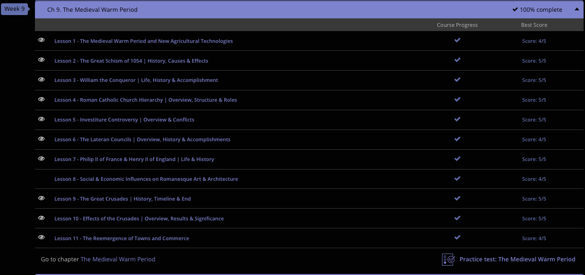

### Andrew Garber
### November 28 2023
### CLEP Western Civilization I
### Chapter 9: The Warm Medieval Period

#### 9.1. The Medieval Warm Period
 - Between the years 1050 and 1300, Europe underwent an agricultural revolution. Crop yields multiplied by at least threefold. Europe's population followed suit, tripling in less than three centuries. The average European lifespan increased by as much as two decades.
 - After centuries of dormancy, merchants and artisans finally began to reappear. After the chaos and confusion following the fall of the Roman Empire, the medieval world was finally beginning to stabilize.
 - This stabilization was largely due to two factors, the first of which was a shift in climate which made Northern and Central Europe more hospitable to agriculture. The second was the end of the Viking raids, which had destabilized and terrorized Europe for centuries.
 - Around 950, Europe entered the Medieval Warm Period. Climatologists speculate that earth's temperature might have increased by as much as one degree centigrade. For about 300 years, Europe became a much warmer and dryer place. Why this happened is still pretty unclear, but it is speculated that it might have been due to a change in volcanic activity, or something causing a temporary(on planetary timescales) wobble in the earth's orbit. Whatever the cause, it was hugely helpful to Europe.
 - As the weather warmed, Viking invasions started to step down. Perhaps the Vikings were finally able to produce their own agricultural surpluses, and no longer felt the need to raid their neighbors in the south so often.
 - At the same time, centralized governments in Europe were becoming stronger, and a real sense of stability was returning to Europe for the first time since the collapse of the Roman Empire. In this period of relative peace, Europeans no longer needed to cluster around the local fortifications of their lords. They were finally able to disperse and settle new lands.
 - Aristocrats gave up their hunting grounds in the interest of generating profit from agricultural surpluses. Forests retreated as isolated pockets of agriculture spread until they at last met. The untamed woods of Northern Europe gave way to field after field, as far as the eye could see.
 - Critical to this agricultural boom was the introduction of the heavy plow, which was finally able to really break through the heavy clay that characterized so much of Northern Europe, the three-field system which allowed for a modicum of crop rotation, and the horse collar, which meant that beasts of burden were finally able to pull plows and carts without choking to death.

#### 9.2. The Great Schism
 - The Great Schism of 1054, also known as the 'East-West Schism,' divided Christianity, creating Western Catholicism and Eastern Orthodoxy. Although 1054 is the official date of this divide, tensions between the East and the West had been brewing for years. What finally broke the camel's back was the question of Papal Authority.
 - In around the year 330, Constantine moved the political capital of the Roman Empire from Rome to Constantinople. From there, he managed to rule the entire empire. However, this was no easy task, and soon the empire broke down into Western and Eastern Empires, each with their own emperors. In fact, Theodosius, who died in 395 CE, was the last emperor to rule over both halves. Although the two halves seemed to be separated politically, the Christian Church still tried to maintain its power, though this wwas difficult due to poor communication.
 - The question of Papal Authority was simply whether the Pope had authority over Eastern Bishops. The Pope wanted to further his control over the entire Church, while the Eastern Bishops were willing to give the Pope simply honorary authority while maintaining autonomy. The East even went as far as calling their Bishop of Constantinople the ecumenical patriarch, meaning 'universal patriarch.' This was a direct challenge to the Pope's authority.
 - In 1054, the power struggle bubbled over when the Patriarch of Constantinople, Michael Cerularius, dared to condemn some of the religious practices of the Western Church. He even went as far as to close down Eastern churches that followed the same practices. The Pope and the Patriarch excommunicated each other, and the Great Schism officially began.
 
#### 9.3. William the Conqueror
 - Despite the lack of historical records from the late dark ages and early medieval period, a few people succeeded in making their marks on the history books - both in their times, and through their descendants. One such person was William the Conqueror, arguably the most important figure in the history of England(though he was actually French).
 - Born in Normandy, of modern-day France, William became Duke of Normandy at a very early age. As duke, he set his sights on a unified Normandy under his power, and accomplished this great task by about 1060 CE. Now remember, he did this during the Dark Ages, so obviously this guy had some smarts and some military might. With all this going for him, he set his sights beyond Normandy. This leads us to his dealings with England.
 - When Edward the Confessor, king of England, died in the year 1066, he left no heir to take the throne. However, William of Normandy was a relative of Edward, and you better believe he was more than willing to wear England's crown. Unfortunately for William, there were several other English noblemen who felt they deserved the crown, the most popular and powerful of whom was Harold Godwinson.
 - This story is actually quite a bit more complicated, but the gist of it is that both William and Harold believed that Edward had promised them the crown. Because Harold was actually *in* England, he was able to get crowned first. Making this messy situation even messier, The King of Norway, Harald Hadrada(yes, another person named Harold) also believed he had a claim to the throne. He invaded England, and was defeated by Harold Godwinson at the Battle of Stamford Bridge. However, Harold's victory was short-lived, as William of Normandy invaded England shortly thereafter.
 - Landing on the southern shore of England as Harold was marching north to meet Harald, William was able to get a fairly firm beachhead. After Harold defeated Harald(annoying), Harold Godwinson had to rush south to meet William. This was an incredibly difficult task, as he had to traverse effectively the entire length of England after just fighting a major battle to go and fight another major battle. He was able to do this, but his army was exhausted and depleted. William, on the other hand, was fresh and ready to win.
 - Setting up his army at the village of Hastings(calling it a city would be a stretch), William's machine of war was ready to go. Armored knights and archers together, with the backbone of the infantry were all ready to go and just mauled Harold's army. Harold was killed in the battle, and William was crowned King of England on Christmas Day, 1066.
 - While this cemented the Norman Conquest of England, William spent the rest of his reign dealing with revolts, revolts, and more revolts. The angle-saxons were not happy with their new French overlords, and William had to spend the rest of his life putting down rebellions. He died in 1087 while fighting in Northern France, and was succeeded by his son, William II.

#### 9.4. The Roman Catholic Church 
 - It's been said that every society needs structure in order to survive. In other words, someone's got to be in charge. If not, chaos ensues. After the 5th century fall of Rome, Europe found itself in just that - chaos. To fill the power void, the Medieval Church stepped up to give society order.
 - How successful this was is debatable, but it is without question that the Church exercised a gigantic deal of influence over both the day-to-day lives of the peasants and the political directions of the kings and emperors.
 - First, there were the priests. Priests were in charge of the individual parishes, or a small church area or district. These guys (and I do mean guys; there were no women priests), were the ones who had face-to-face interaction with the community. They provided sacraments, or religious ceremonies and rites, to the common people of the day.
 - Next up were the bishops, these were in large part a political position, as they were in charge of the diocese, or a large church area or district. They were in charge of the priests, and spent most of their time schmoozing with the nobility.
 - Above them are the archbishops, who were in charge of the archdiocese, or a large church area or district. They were not a really official position, they mostly just installed themselves at one point and then just kept it going for generations(obviously not their children, but you get the idea).
 - After archbishops, we come to cardinals. Cardinals were the most important, senior archbishops. Numbering no more than 24 during the Medieval period, Cardinals were originally the senior clergy within the Diocese of Rome. However, during the Middle Ages, senior bishops outside of Rome could also become cardinals. As the word 'cardinal' actually means 'hinge,' the cardinals supported the Pope. When a Pope died, the cardinals took over the administration of the church. Even more important, the cardinals held the power of choosing the next Pope, a responsibility they still carry today.
 - And this finally brings us to the Pope. The Pope is also known as the 'Bishop of Rome.' Believed to be the successor of St. Peter himself, the Pope was and is the earthly head of the Roman Catholic Church. As the head of the Medieval Church, the Pope made the final decision on the teachings of the Church. The Pope also got to decide who were the friends and enemies of the Church.

#### 9.5. Investiture
 - The Investiture Conflict of the 11th and 12th centuries is one of the most important controversies ever to arise between church and state.
 - To begin, the Investiture Conflict was a nasty conflict between the Pope and the Holy Roman Emperor over who held power to appoint or invest Church officials. Traditionally, the power to appoint Church officials was held by secular authorities whose rulers were not clergy and whose power was not derived from a spiritual basis. In other words, kings and emperors, not the Pope or bishops, handed out places of power within the Church.
 - Now, this isn't that big of a deal at the lower levels of Church hierarchy. However, when we realize the emperor had the right to appoint the Pope, it's pretty plain to see how much power accompanied the ceremony of investiture. Making things even more convoluted, the Pope then got to turn around and choose the next Holy Roman Emperor. In essence, the process became a giant political game of 'you scratch my back, I'll scratch yours!'
 - It really came to a head when a group called the Gregorian Reformers, who believed that the Pope was only answerable to God took an opportunity when the young Henry IV of Germany was crowned Holy Roman Emperor. All of a sudden, the Pope and related clergy were no longer willing to play the game and gathered in Rome to issue a decree that the Pope could only be elected by Cardinals.
 - In the year 1075, Pope Gregory VII took things a step further. In the Church statement known as the Dictatus Papae, the Church completely eliminated the practice of secular investiture.
 - This bold move didn't sit so well with Henry IV, who was a young boy at the time of the earlier In Nomine Domini statement, but who had now grown-up. Effectively, Henry IV told the Pope that he was no longer Pope, to which the Pope responded by telling Henry IV that he was no longer Emperor. Neither side could really do anything about it, so the investiture controversy continued.
 - However, the Pope got lucky on this one. When the power-hungry nobles of Germany realized the kingship was at stake, they saw it as an opportunity to gain more land and power. Not wasting any time, they rebelled against their king, in a revolt known as the Great Saxon Revolt. The rebels even went as far as to elect a guy named Rudolf to be their new king.
 - With his country in chaos, Henry IV waved the white flag to the Pope in the year 1077. In a dramatic scene known as the Walk to Canossa, tradition tells us the bedraggled king actually stood barefoot in the snow to apologize to Pope Gregory VII. However, this apology was short-lived. In 1081 King Henry IV came back with a vengeance. He captured and killed the rebel king, Rudolf, and set his sights on removing Gregory VII once and for all.
 - When Henry IV invaded Rome, Pope Gregory VII made a fatal error. In order to protect himself, he called on the Normans, or Vikings from modern-day France, for help. Although these Vikings from the north did manage to ward off Henry IV's forces, they also decided to rape and pillage Rome and its people, making the Pope, the guy who invited them in, rather unpopular. With this, Pope Gregory VII was forced to flee Rome, in essence, beating himself! After all the fighting for power, Pope Gregory VII died as an exile in Norman lands.
 - Sadly, neither his death nor the death of King Henry IV ended the Investiture Conflict. Each of their successors picked up where their predecessors had left off. Finally, in 1122, a compromise known as the Concordat of Worms was reached. As a rather flimsy statement, it removed the secular right of investiture, but gave secular leaders the right to have an unofficial say in the appointment of Church officials. This didn't really solve anything, but it did end the violence.

#### 9.6. The Lateran Councils
 - The First Lateran Council was called in 1123 and it was effectively a review of questions of Church discipline and basic religious beliefs. The council also officially condemned the practice of simony, which is the buying or selling of church offices.
 - The Second Lateran Council was called in 1139 by Pope Innocent II to condemn the heresy of Arnold of Brescia. Arnold was a monk who condemned the Pope, and the Pope was not happy about it.
 - The Third Lateran Council was held in 1179 and called by Pope Alexander III, it was a response to some radical groups called the Albigenses and Waldenses. These groups said that the Bible was the only authority, and that the Church was not a necessary part of salvation.
 - The Fourth Lateran Council, called by Pope Innocent III in 1215, was the most important of the Lateran Councils. It had a huge attendance, and mostly focused on the expulsion of non-Christians from the Holy Lands - in effect, Crusades! The council also condemned heresy, and made it a requirement that all Christians confess their sins at least once a year.

#### 9.7. Philip II of France & Henry II of England
 - Henry II is the first Angevin king and also the first king of England's Plantagenet dynasty. We get the term Angevin from the fact that he came from a ruling family of Anjou, France. The term Plantagenet comes from the yellow flower that was the emblem, or symbol, of his family.
 - Known to history as one of England's strongest kings, Henry II ruled from 1154 CE to 1189 CE. Not only did this powerhouse rule England, he married the ex-wife of the king of France. Her name was Eleanor of Aquitaine, and, when they married, Henry II neatly folded her French lands under his royal control. Not only did Henry II rule England, he also controlled Wales, Anjou, Normandy, and Gascony - in effect, half of France. 
 - His sons however, were not so helpful - they bickered(and when Princes bicker, they usually include armies) and fought over who would get what land. In the end, Henry II's son Richard, would succeed him as King of England - we know him by his famous sobriquet, "Richard The Lionheart".
 - Although Richard's rule spanned over a decade, he spent very little time in England. Instead, he occupied himself with the Crusades, or Europe's attempt to free the Holy Lands from Muslim control. When not off crusading, or being held prisoner, he was often found in, yes, you guessed it, France. In fact, some sources even go as far as to say that he, the king of England, spoke very little English. The prison debacle was a result of his capture by the Holy Roman Empire, but that's a story for another time.
 - When Richard died (in France, he stood up thinking he was out of range of the archers on the walls of a castle, and was not), his brother John became king. In short, John was a terrible king. He lost a whole bunch of French lands, and most famously was forced by his nobles to sign the Magna Carta, or Great Charter, which limited the power of the king - this is arguably the foundation of British parliamentary democracy, and thus the American system of government.
 - Now, we must turn our attention to Philip II of France - the man who took all of that land from John. Philip II had a very strange relationship with the English Kings, at one time Richard and Philip were strong allies, and then Philip betrayed him to support John, and then betrayed John when he took a French wife with a bunch of land.

#### 9.9. The Great Crusades
 - It is important to note that the First Crusade's miraculous success was due in large part to the fact that the Muslim world was in a state of disarray. There were very limited Muslim forces in the Holy Land, they were all out either fighting each other or the central Asian invaders. The Crusaders were able to take advantage of this and capture Jerusalem while also setting up four Crusader states in the Holy Land. 
 - These Crusader states were the County of Edessa, the Principality of Antioch, the County of Tripoli, and the Kingdom of Jerusalem. 
 - The Crusaders were able to take advantage of this chaos in the First Crusade. In the later Crusades, the Holy Land was prepared for the Crusaders, and the many failings of the crusading movement led to a series of unmitigated disasters. The gross ignorance of the Crusaders combined with their lack of clear leadership and failure to commit all combined to doom the later Crusades.
 - The Crusaders had no real notion of the geography, climate, or political structure of the Near East. Crusaders often failed to even make it to the Holy Land. Northern Europeans, in their full armor, sweltered in the heat of Mediterranean summers. The shifting political power of the Middle East meant that a Crusader would sign a peace treaty with one leader, only to have that peace treaty violated by another. The Crusaders also had no clear leadership. Lords and kings squabbled among themselves, and popes struggled to keep the crusading armies pointed in the right direction.
 - The Crusaders never seem to have made a real commitment to retaking the Holy Land. The kings of Europe had more important matters to deal with, like expanding their territory and maintaining the dynasties at home. Had Europe turned its full power on the Middle East, they very well might have held on to the Holy Land. Instead, the efforts of Western kings in the Holy Land became ever more half-hearted. Going on crusade became something of a moral obligation. It was just something one was expected to do. In effect, the Crusades became a kind of opportunity to just go ransack *someone's* land and then when it all fell apart, you could just go home and say you tried. 
 - The Second Crusade seemed off to a good start. Unlike the First Crusade, which was led by a few lords, this crusade was led by two kings: Louis VII of France and Conrad III of Germany, who led their armies east to rescue Jerusalem. Though neither of these kings were particularly great leaders, and though neither had very large armies at their disposal, they must have set out with a fair expectation of success. Louis even brought his wife, Eleanor of Aquitaine, with him. Louis and Conrad never even made it to Jerusalem. Their armies were cut to pieces in Asia Minor. With what remained, they attempted a failed siege of Damascus, before finally heading home with their tails between their legs.
 - The Third crusade is perhaps the most famous of them all(save for the First), as it was led by perhaps three of the most famous kings in history: Richard the Lionheart of England, Philip II of France, and Barbarossa of Germany.(Yeah, the guy that Operation Barbarossa was named after). These three great kings went up against the great Muslim leader Saladin the Great. The drama gets even better once we learn that Barbarossa actually died en route to the Holy Land, and that Richard was *way* more interested in actually fighting than Philip was. In the end, Richard got captured en route home, and John took over as king of England - the whole thing was a mess.
 - The Fourth Crusade was just *weird* - the Venetian merchants who were providing the shipping for the expedition convinced the Crusaders to go and sack Constantinople, the capital of the Byzantine Empire. It never fully recovered from this, though it took a while for the full collapse to happen. 
 - The Children's crusade is also worthy of note, because it was basically just a bunch of random people who figured they could just take the Holy Land back by themselves. This for *OBVIOUS* reasons, did not work out well for them, and many of them were sold as slaves.
 - The Fifth Crusade was arguably the first success in a while - the Pope got them to redirect their efforts at Egypt, but after capturing a few cities they couldn't hold them and had to retreat.
 - The last crusade to end with something vaguely resembling of victory was the Sixth Crusade. Yet, it was a victory of diplomacy rather than a victory of warfare. Unlike previous crusading kings, Frederick II of Germany actually bothered to learn Arabic. This allowed him to negotiate the return of Jerusalem with the Egyptian Sultan Al-Kamil. Unfortunately, this peace was short lived, and by 1244, Jerusalem was once again in the hands of Muslims.
 - I am not going to mention the Seventh, Eight, or Ninth Crusades because they basically just lived up to the formula of poor planning and poor execution that had plagued ALL of the previous crusades.
 
#### 9.10 Effects of the Crusades
 - One of the immediate effects of the Crusades from the first one was an increase in warfare - Christianity had always been a pacifist religion up to that point, but now that the Pope had sanctioned war in the name of God, Kings took this as a justification for war.
 - As kings struggled to deal with the logistics of moving thousands of soldiers across thousands of miles, and the incredible expense of maintaining military outposts, like Acre in the Holy Land, systems of bureaucracy and taxation were perfected, and Western Europe's first (true) nation states began to emerge.
 - While Europe's monarchies were growing stronger, the Papacy grew ever weaker. Though Pope Urban II greatly increased the power and prestige of the Papacy with the stunning success of the First crusade, his successors had far less luck in the crusading game. Their failure results from a couple factors. At the simplest level, the constant, devastating failure of each subsequent crusade led to a steady decrease in papal prestige.
 - Yet the real deathblow to the Papacy came from the abuse of crusading by Popes. Once Popes began using Crusades against their political enemies, the Papacy began to lose the moral high ground it had held for centuries. The fact that Popes were offering people indulgences in exchange for killing off their political rivals, or even just for charitable donations to armies killing off their political rivals, further eroded the Papacy's credibility.
 - The protestant reformation is arguably a direct result of the Crusades - the corruption of the Papacy and the Church in general led to a lot of people questioning the Church, and eventually led to the formation of new doctrines and new churches.

#### 9.11. The Reemergence of Towns and Commerce
 - Following the fall of the Western Roman Empire, Western Europe was in a state of economic and political chaos. The old Roman cities were abandoned, and the population of Europe was in decline. The old Roman roads fell into disrepair, and trade between the various regions of Europe all but ceased. The only real trade that continued was the trade of luxury goods, like spices, silks, and other exotic goods, from the East. Still, this was nowhere near the total economic capacity of the Roman Empire.
 - For three centuries, Europe languished in an economic slump. Then, around 1050, the European economy started turning again, slowly at first, but quickly accelerating. Trade began to flow across Europe's roads and waterways. Urban centers that had been all but abandoned began to grow again. Old trades re-emerged, and new trades were invented. The change was nothing short of an urban revolution. In the course of a couple centuries, Europe went from a continent of farmers, an economic dead end, a cultural backwater, to a land of merchants and craftsmen, living in bustling cities, generating culture at an unprecedented level.
 - The scope and speed of Europe's urban revolution is rather startling, considering its stagnation during the Dark Ages. The old Roman cities, which had never been more than fortified outposts to start with, became the centers of growing urban sprawls. Paris, London and Cologne doubled in population between 1100 and 1200, and doubled again between 1200 and 1300. Outside the old empire, new towns were established. 12th century Germany witnessed the founding of such prominent cities as Freiburg, Lubeck, Munich and Berlin. The height of this urban explosion was Italy. Venice, Genoa and Milan already had populations of over 100,000 in the 12th century. These populations would triple in less than two hundred years.
 - No single event lead to this, instead it was a few things happening in parallel that made it happen. First, A decline in Viking raids, combined with the development of stable central governments, at last allowed Europeans to stop huddling around feudal manors and start taming the great wilderness of the north. New agricultural technologies and techniques were producing unprecedented surpluses in European farms. The heavy plow was breaking up the rich soils of northern Europe. The three field crop rotation system was allowing farmers to wring the most from each acre. These agricultural surpluses would be essential to feed Europe's growing urban population.
 - Meanwhile, labor saving technologies were freeing up human beings from many time consuming tasks. By the 12th century, Europeans had harnessed horses, the wind and rivers to do work that people used to do. This meant that it took far fewer people to run a farm. Instead of digging in the dirt with sticks or grinding grains by hand, people could pursue skilled trades in Europe's growing cities and leave the grinding and digging to horses and mills. These agricultural shifts were having an impact on the European aristocracy as well. Feudal lords were beginning to realize that they could make a lot more profit by charging rents on free peasants than they could by manning their own fields with serfs. Free peasants could not leave the land their ancestors had been chained to for centuries, and move to the cities.
 - Yet, the greatest factor in the urban revolution was the resurgence of trade in Europe. This probably started locally in most of Europe as free peasants made their way to market towns to trade their small surpluses: a sack of grain here, a few dozen eggs there. The availability of basic foodstuffs emboldened some farmers and lords to specialize in specific goods that had a greater market value. Soon enough, the sea routes were reopened and a rush of road building began in order to carry all of this new trade. 
 
#### COMPLETION