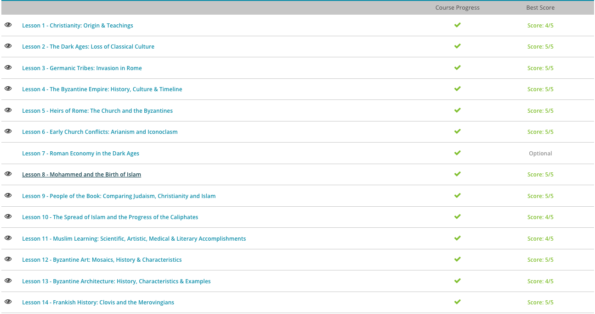

### Andrew Garber
### October 26
### Western Civilization
### Chapter 7: The Dark Ages

#### 7.1. Christianity
 - The early church began with small groups of followers meeting in homes. The news of Jesus was spread by word of mouth. The message was strengthened by the acts of these early believers - people who gave up worldly possessions, shared them with those in need, and cared for the sick. This spreading of the story and meaning behind Jesus' death brought Christianity to many Roman cities. Because of clashes with the Jewish and Roman authorities, many early church leaders were killed for their beliefs.
 - As Christianity continued to spread, bishops and other leaders began to be appointed. A key development was when Emperor Constantine I began to support Christianity in the early 4th century, legalizing Christian worship for the first time and actively encouraged the religion. He also convened the First Council of Nicaea, which was a gathering of Christian bishops. This was the first major standardization of the Christian belief system. It established the relationship between Jesus and God the Father, and decided on a date for Easter, among other things. The support of Constantine I and future leaders eventually led to Christianity becoming the Roman state religion in 380 CE, a decision which accelerated its growth even more and spread it to the edges of the Empire.
 - More than this, as it became part of the empire's political system it cemented its place as a part of all future political systems after the fall of Rome(in the West).

#### 7.2. The Loss of Classical Learning
 - Much of the learning of the Roman Empire was lost after its demise due to the lack of a common language - when Latin was the language of the whole empire, it was easy to spread knowledge. However, after the fall of Rome, the languages of the various Germanic tribes became the dominant languages in the West. This made it difficult to spread knowledge, as there was no common language. The only people who could read and write were the clergy, and they were more concerned with religious matters than secular ones. This led to a decline in literacy and the loss of much of the knowledge of the Roman Empire.
 - As well as this, the Church wanted to stamp out classical ideas that went against Christian beliefs.
 - This had signficiant impacts, as Europe went from the most advanced, literate place on the planet to a place where most people were illiterate and had no knowledge of the past.
 - Technological advancement ground to a total halt, and nothing really changed for hundreds of years. 

#### 7.3. Germanic Tribes
 - Although the Visigoths and Ostrogoths were forces to be reckoned with for a short while in the Roman Empire, both groups fell into obscurity. Other groups, like the Franks and the Saxons, hold a stronger place in history. The Franks were originally from the area between the North Sea and upper Rhine River in Germany. They expanded into France in the fifth century. The Frankish leader Clovis converted to Catholicism and began battling against pagan barbarian tribes.
 - As they took control of France, the Germanic tribesmen began a cultural fusion with Romans in France. By allowing the two cultures to join together, the Franks created a new culture and became a part of the area's existence, rather than perpetually trying to hold a dominant control and eventually being driven out.
 - Can you guess what the Franks are called today? Eventually, the Franks would become the French!
 - The Anglo-Saxons were a group made up of tribes called Angles, Saxons and Jutes from Germany and Denmark. The Anglo-Saxons had invaded mainly in what we now know as England. Rather than assimilating and fusing cultures as the Franks did in France, the Anglo-Saxons found little of Rome's culture that they saw fit to absorb. They ignored Rome's legal system and followed only a Germanic tribal governmental structure. They eventually converted to Christianity, but it took much longer, and instead of keeping the Roman use of Latin, they used their own language. This led to the development of the English language. This is why when England is in a war, we called it the "Anglo-x" war, or in world war 2, the "Anglo-American" alliance.

#### 7.4. The Byzantines
 - The Byzantine Empire started as the Eastern Roman Empire in 330 CE when Constantine, a Roman emperor, founded Constantinople, the Roman Empire's new capital, on the ancient site of Byzantium.
 - 'Byzantine' is a 19th century term that modern scholars have applied to this culture and its people. Byzantines, on the other hand, called themselves 'Romans' from the beginning of the Byzantine Empire until its fall to the Ottomans in 1453, which was long after the Western Roman Empire collapsed in 476 CE. Thus, most of the history of Byzantium is a continuation of the Roman period, and most of the culture of Byzantium is a continuation of the Roman way of life.
 - The language of the Byzantine Empire also shifted during this time. From the reign of Constantine to Justinian, the official court language was Latin. This meant that laws and official documents were written in Latin. However, Greek was the primary spoken language. After Justinian's reign, Byzantine Greek became the primary language for both spoken and official written documents. However, Western Europe still spoke Latin, which caused a language divide in communication. This led to difficulties and confusion in terms of religious terminologies and laws.
 - Given the differences in language and customs, among other things, that developed over Byzantium's history, the Eastern Greeks and Western Latins endured what is known as the Great Schism in 1054. The two Churches, now the Greek Orthodox Church and the Roman Catholic Church, had different beliefs concerning Jesus Christ, the nature of God, and the date of Easter. The two factions split, forming two separate religions that still exist today.
 - Tensions further rose in 1204, when the Latins launched the Fourth Crusade. The Fourth Crusade was intended to re-capture Jerusalem from the Muslims; however, the majority of the Latin forces did not make it to the Holy Land. Instead, they sacked Constantinople, which marked a major turning point in the history of the East-West Christian Schism.
 - In 1261, Michael VIII Palaeologos recaptured Constantinople from the Latins. Michael VIII's return to Constantinople also marked a rebirth in classical studies and traditional Byzantine education, which is called the Palaeologan Renaissance. The Byzantine Empire continued to flourish until the final sack of Constantinople by the Ottoman Turks.
 - The Ottoman Turks sacked Constantinople in 1453 and renamed the city Istanbul. The Ottomans were also primarily Islamic, so the majority of earlier churches were converted into mosques.  In this period, people were still speaking Byzantine Greek, but the language would eventually evolve into Modern Greek in the 19th century. Ultimately, Turkish culture took over, and the Byzantine Empire was no more.

#### 7.5. Heirs of Rome
 - At its height in the early second century AD, the Roman Empire was powerful and expanded into vast areas. However, it weakened and began to fall apart in the West after the invasion of Germanic tribes like the Goths, Vandals, Franks and Anglo-Saxons in the fifth century. In the eastern part of the Empire, though, a new culture developed in Constantinople, a large, important city in the Roman Empire. The society in this area included influences from both Romans and Greeks. It also included influences from the dominant Christian religion.
 - However, as Christianity spread, many people in this area developed disagreements with the church. Some of these disagreements were over the display of religious images (resulting in iconoclasm, or the destruction of religious images) and clergy members' rights. Eventually, the church split into two major divisions: Western Roman Catholicism and Eastern Greek Orthodox. In addition to this split, a preference for language further separated the eastern and western parts of the Empire. In the East, Greek was preferred, but in the West, Latin was dominant.
 - This would later cause even more problems, as translation differences and language barriers would cause confusion and conflict between the two sides.
 - Western Europe underwent a change in economy and politics as the Roman Empire declined. As Germanic peoples expanded in power, urban areas and systems of government declined and stratified. As people spread out into more rural areas, commercialism also underwent a decline. One of the only unifying factors left for peoples formerly of the Roman Empire was religion. Catholicism had spread and remained dominant over much of the Empire's lifespan. In those times of uncertainty, people were searching for something to provide continuity and authority. Although people no longer belonged to the Roman Empire, they could still belong to the Catholic Church.
 - Of course, Europe was not without its conflicts. But, when Germanic tribes invaded the Roman Empire with force, they were met with a new culture. Some tribes assimilated into this culture by adopting many of the practices they saw. For instance, after a victory in battle, a Frankish king named Clovis converted from paganism to Christianity, and his fellow tribesmen followed suit.
 - Eastern and Western Christians disagreed on several tenets of their religion. Regardless of the tension, responsibility to care for the people of the Christian nation fell on the pope. Left without a centralized government, the people of the Empire allowed the church to take over basic administrative functions. In addition to seeing to the basic needs of the people, the papacy also took responsibility for managing foreign political affairs. Without the papacy stepping in to take control of the Empire, civilization may have crumbled.
 - Another religion became dominant in the seventh century in an area known as Arabia. Islam is a monotheistic religion that became popular in the Middle East. Islamic nations did not separate church and state, but instead saw the two as completely intertwined. As Islam became popular and spread, Arabic rulers came into contact with Christians. Starting in 1096, Western Christians began to go east to battle their religious enemies in the Crusades. This led to Christian troops being reintroduced to classical texts that had been preserved by Easterners, a key ingredient of the eventual European Renaissance.

#### 7.6. Early Church Conflicts
 - The first threat to the church came in the 4th century AD. Although Catholic Christianity was growing in dominance among native Romans at the time, invading Germanic tribes, who moved into Roman territories from surrounding areas after being displaced by the Huns, brought with them a new form of Christianity called Arianism.
 - One of the key tenets of Catholic Christianity is the Holy Trinity - that the Father (God), the Son (Jesus) and the Holy Spirit are three aspects of the same divine being. On the other hand, Arianism is a form of Christianity in which believers thought that God, Jesus, and the Holy Spirit were three separate entities. The name comes from Arius, who created the Arian belief system. 
 - Basically, Arian Christians believed that God never changed or grew. However, Jesus was born and grew like a human. His changing nature meant that Jesus was not God and couldn't be a divine entity. Instead, God created Jesus. The belief that the Holy Trinity were separate but formed from a similar substance is known as homoiousios. The Catholic belief that all three pieces of the Holy Trinity were formed from the same substance is known as homoousios.
 - This conflict spread throughout the Christian nation. Arianism was officially condemned after the issuing of the Nicene Creed, which reinforced homoousion as correct. But, as Germanic tribes continued to invade the Roman Empire and converted to the Arian version of Christianity, eventually Arianism was even endorsed officially in some areas of the Empire. The conflict continued between Catholic and Arian Christianity in the Roman Empire until the popularity of Arian Christianity just died out (especially after many Germanic tribesmen reached Rome) and Catholicism became their dominant religion.
 - Another conflict in the early church was that of iconoclasm, or the intentional destruction of a religious image. Conflicts of iconoclasm developed over concerns of how religious images were treated during worship. Some people were concerned that worship may become directed towards the image rather than the person or being that it represented. The basis of this concern is in the Ten Commandments mentioned in the Old Testament of the Bible. The Commandments forbid the worship of idols. 
 - Iconoclasm was a problem in the Byzantine Empire, the inheritors of the Roman Empire, beginning in the 8th century. Like the Romans, the Byzantines were also Christians. Some in the empire grew distressed because there had been an increasing amount of religious imagery displayed. Earlier, an emperor had even included the image of Jesus on Roman coinage. Religious icons became the blame of the loss of military battles and economic decline. Muslims also had a history of iconoclasm, and their spread into Roman territory may have influenced natives to take up this practice. Icons were destroyed while at the same time the cross became a popular image for church decoration.

#### 7.8. Mohammed
 - Before the time of Islam, the Arabian Peninsula was populated by nomadic peoples who claimed to be the descendants of Noah's oldest son, Shem, and thus became known as Semites, or Semitic people. In this way, they shared a common connection with other Semitic peoples in the region, including followers of the Torah, or the Hebrews.
 - Still, most Arabs were predominately polytheistic, following not one god, but many gods. The center of their worship was the city of Mecca, at a site known as the Kabba. It was here that over 300 statues and other idols were kept for worship by the various Arab tribes. Mecca was, even at a time before Islam, a center for Arab worship and devotion, as well as a place of religious pilgrimage known as the Hajj.
 - Historians believe that at this time, Mecca was a city of peace, a place where no tribal disputes were allowed to be discussed, no warfare fought, and no weapons utilized. It was into this world that Islam's prophet was born.
 - Mohammed was born into a world of polytheism and tribal disunity in the year of 570 CE in the city of Mecca. He lost both parents by the time he was six years old and was raised by one of his uncles.
 - At the age of 12, Mohammed entered the family business, the caravan trade, and was off on what many believe were journeys to the outside world, including Syria, where he had contact with Christians, Jews, a host of other faiths, and peoples from all over the world who came to the region to trade.
 - By the age of 25, Mohammed was married for the first time to a wealthy woman of 40 years of age, Khadijah, who was also in the caravan trade. Though he would marry an additional 10 times in his lifetime, it was through Khadijah's influence that Mohammed was exposed to a group of Arabs known as the Hanefites .
 - What made this tribe unique was the fact they rejected idol worship and polytheism in favor of monotheism. Their religion was not fully formed - rather, they were influenced by both Judaism and Christianity - and they would often retreat to the solitude of caves for prayer and intense meditation, hoping to find a path to the one true God.
 - It can be safely assumed that this tribe, along with the teachings of Judaism and Christianity, had a strong impact on Mohammed as he searched for his own answers to life and to God. By 610 CE, tradition tells us he had his first vision while meditating in a cave. Upon reporting this vision to Khadijah and the extended family, it was declared by the Hanefite elders that the vision was from God - the one true God, Allah. Mohammed was subsequently declared a prophet and embraced by his community as the last prophet in a long line dating back to the time of Noah.
 - It spread rapidly from there, Arab tribes began to convert to Islam, and Mohammed's teachings were embraced by the people of Medina. However, Mecca was not so easily converted. After a year in the city, Mohammed fled with a small group of converts to Medina, where he was welcomed as both a prophet and political leader. He proved to be an effective leader, helping enrich his small group of followers by raiding the caravans of the polytheists, which was seen as a justifiable action until these groups submitted to the religion of Allah, at which time the raids would stop.
 - The city of Mecca responded to these raids by sending 1,000 soldiers to punish the Muslims of Medina. In 624 CE, much to the chagrin of the Meccan leadership, the Muslims defeated their army, and the victory was used to strengthen Mohammed's position as a religious leader, as well as a political one.

#### 7.9. People of the book
 - First, let us look at the religion of Judaism, the religion of the Jewish people. It's not the largest, but certainly the oldest of the three traditions. The date of its founding is unknown - that's how old it is - and some believe it may be the world's oldest organized religious tradition. There are debates among historians about when exactly Judaism first emerged into known history, but it is believed to be during the Bronze Age. Many scholars believe it was between 2000 and 1800 BCE, with its main religious text being the Torah.
 - The Torah is a collection of the books of Moses and the stories of Abraham, Noah, and many other prophets and men of great renown that are so familiar to Christians and Muslims. Both Christianity and Islam view the Torah as sacred and part of the revelation of God to humankind.
 - What is more, Judaism teaches there is but one god, as well as angels, demons, and other supernatural forces at work in the world - all beliefs shared by Christians and Muslims. Judaism also teaches that humans need God due to our sinful nature, a nature that starts at the very beginning of our species in the Garden of Eden - a story also shared by Christianity and Islam.
 - Moreover, in Judaism, God is the only source of forgiveness, as is the case in the other two faiths, and only those who follow the righteous path, those faithful to God and his laws, go to Heaven after death. Those who are not… well, they end up in a place of punishment - once again, a set of beliefs shared by the adherents of Islam and Christianity.
 - Christianity is the largest of the three faiths, with over 2 billion followers, and builds upon the traditions already established in Judaism. It originates out of the city of Jerusalem.
 - First and foremost, Christianity considers itself monotheistic, just as the other two, with a religion built upon the revelation of God to his creation. They believe the Torah to be the word of God. What is more, the central figure in Christianity, Jesus Christ, was a Jew whose name was Yeshua ben Yosef, or Joshua, son of Joseph. It was only later, when Christianity spread to the Greek-speaking world, that the name Yeshua became Iesous and found its way to the English-speaking world as Jesus.
 - As a Jew, Christianity's central figure would have been well-versed in Judaic customs, laws, and stories from the Torah, and we can see from the teachings and stories of Jesus, compiled in what Christians call the Gospels and other books that make up the New Testament, that the basic elements of the Jewish faith remain intact, with some modifications.
 - The one major modification, that of Jesus being the Messiah (God incarnate), still builds upon earlier traditions in the Torah. Throughout the Torah, the idea of a redemptive figure who will come to save the Jewish nation and uplift the populace is a frequent theme. They believe this messiah will be a strong religious and political, as well as social, figure. So, it's written in the Torah that the messiah will come - it's just that the Jewish faith does not accept Jesus to be that promised figure. 
 - Christians, on the other hand, took Jesus to be this Messiah and went a step further, assigning him the qualities of a deity.
 - Islam is the youngest of the three faiths, but is second only to Christianity in the number of followers, with over 1.3 billion. Like Christianity and Judaism, Islam is a monotheistic faith with origins in the Middle East, in fact, what is now Saudi Arabia.
 - Islam holds the teachings of Judaism and Christianity in high esteem and respects what these religions teach but feels the revelations in the Torah and the Gospels are incomplete. To Muslims, their prophet Mohammed provided the last and most complete set of revelatory expositions from God, all collected in their holy text known as the Qur'an.
 - What might surprise many non-Muslims is that the teachings in the Qur'an are not so different from those found in the other holy texts. There is an emphasis on charity, prayer, submission to God's will, and on the golden rule of doing unto others as you would have them do unto you. Jesus and Mary are also featured in the Qur'an, both held in high esteem, though not given divine status.
 - Their holy places are found right alongside the holy places of Judaism and Christianity, and while this does cause conflict among the more orthodox and conservative elements in all three religions, when the blinders of racism, ethnocentrism, and religious bigotry are removed, one can see the beauty and symmetry of the commonality shared.
 - Something HAMAS would do well to remember when it's charter contains the explicit desire to "Erradicate all Jews".
 - 

#### 7.10: The Spread of Islam & The Caliphates
 - After the death of Mohammed, the new religion of Islam was at a crossroads. Having unified the tribes of Arabia and solidified Mecca as the capital of their faith, the followers of Islam were faced with their first leadership crisis. Who would take up the mantle of Mohammed and lead?
 - The successor to Mohammed, given the title of caliph, was destined to be one of two men. The first man, named Ali, was believed by some to be Mohammed's personal choice. He was a cousin and a son-in-law to the prophet. Yet others believed Abu Bakr had a stronger claim. Abu Bakr, a longtime friend, confidant and father-in-law to Mohammed, had been the first male convert to Islam. Ultimately, it was Abu Bakr who got the nod from the majority of the elders to become the first caliph of Islam. He only reigned 2 years, but proved remarkably successful in that time. Upon his death, the Caliphate would then turn outward to continue its expansion.
 - Their first target was the Sassanid Empire, who controlled Persia(what is now Iran), and followers of the Zoroastrian religion. (Shoutout Khosrau Anushirvan).
 - The second empire was Byzantium, an empire based in Constantinople. They were equally wealthy, prosperous and as culturally rich as the Sassanids, but they were Christians. Byzantium controlled much of the former lands of Romans, including what is now modern-day Palestine, Israel and Syria, as well as extending their power into Egypt.
 - Effectively, the Caliphate decided that to spread their religion, they would have to military conquer their neighbors - and then preceeded to do so.
 - The second caliphate (from 634 - 644 CE) was led by Umar, another father-in-law to Mohammed, and was marked by several successful military campaigns against the Byzantine Empire, including the capture of Damascus in the year 635 and the capture of Jerusalem in the year of 637 CE. Once he had conquered these lands, he instituted a modern form of Islamic government, allowing for both Jews and Christians (as well as others) to practice their faith if they paid the jizya (religious tax).
 - To the east, Umar's forces moved against the Sassanid and captured the capital city of Ctesiphon in 637 CE. Historical records of this time tell us that while the inhabitants of the city were not harmed, their palaces and libraries were burned. As a result, ancient knowledge and countless artifacts were lost forever. Sadly, this marked a disturbing trend in warfare for centuries to come, where priceless works of human culture were burned in the name of religion from Persia to as far east as India.
 - Muslim armies continued to have success in their war with the Sassanid and Byzantines, eventually capturing Babylon in 641 and the city of Alexandria, Egypt in 642 CE. Much of the Muslim armies' success was due to their internal unity. They were buoyed by their faith, and also, the internal divisions found in both the Sassanid and the Byzantine empires weakened both from the inside. By the time of Umar's death, Islam controlled a swath of territory second only to the Tang Dynasty of China.
 - Umar's successor was a man named Uthman, he defeated the Byzantine's when they tried to retake Alexandria and then pushed west of Egypt across the northern coast of Africa. He also pushed east into the farthest reaches of Persia, and even took Cyprus. However, his reign is probably most significant for the creation of a unified version of the Qur'an.
 - But not all Muslims were happy with this leadership. Many felt Uthman had become too powerful, manipulating religion for his benefit. When Uthman was ultimately assassinated, a civil war erupted, and Ali, Mohammed's cousin and son-in-law, was declared the fourth caliph. Ali would also face immediate opposition, but he managed to maintain control from 656 - 661 CE, when he was assassinated in violence that threatened to tear the Islamic world apart.
 - From this chaos, the clan of the Umayyad ultimately emerged victorious. They would establish a new caliphate that would last until 750 CE, when another challenger would prove too strong even for them to resist.
 - The excesses of the Umayyad did not go unnoticed by many in the Islamic world, and challengers were abundant. Yet few had the power to make a real go at ruling. One group that did was the Abbasid clan, so named as they claimed descent from Abbas ibn Abd al-Muttabib, one of the younger nephews of the Prophet Mohammed.
 - They detested what they perceived to be secularism of the Umayyad and considered them immoral by Islamic standards. The Abbasid also appealed to non-Arab Muslims, who felt they were treated as second-class citizens within the Umayyad Empire.
 - Eventually, they took control and founded what would become the Abbasid Dynasty/Caliphate(the terms get used interchangably, but Dynasty is probably more correct due to the numbering scheme previously used for the caliphates.)
 - Known as the Islamic Golden Age, the Baghdad-based Abbasid Dynasty rekindled much of the secular intellectual pursuits that had suffered under previous rulers. Many classic works of philosophy, science and religion were translated from Greek and Persian into Arabic, saving much of the region's ancient knowledge for future generations and helping spur the scientific revolution that would come centuries later.
 - The Abbasids' empire was vast, but it was also this vastness that made controlling it problematic. What is more, the Umayyads were overthrown but not entirely destroyed, and they fled across the Mediterranean Sea into Muslim-controlled areas of the Iberian Peninsula, establishing themselves in what is now Spain by the year 756 CE.
 - Other divisions included the breaking away of the Shia sect of Islam, those believing Ali was the true successor of Mohammed. The Abbasids had at first embraced Ali's followers but later disavowed any support towards Ali's legacy and the Shia tradition.
 - Combined with a continued fight with the Byzantine Empire, Crusaders from Europe and internal rebellions, the Abbasid's power steadily declined. It would meet its ultimate end in the mid-13th century - not at the hands of Christians or Persians, but at the hands of an unbeatable military force: the Mongols. In 1258 CE, Hulagu Khan, grandson of Genghis Khan, attacked Islamic lands and destroyed the Abbasid capital of Baghdad. The last reigning Abbasid caliphate was executed on February 20 of the same year.
 - Islam would of course survive the Mongol onslaught, but the Abbasid dynasty would not. In its place, a fragmented Islamic world would emerge, and fragmented it would stay for the next 300 years, until once more it was unified under the Ottoman Empire of the 16th century.

#### 7.11 Muslim Learning
 - Islamic scholarship is responsible for much of the knowledge that we have today, as well as Coffee, Perfume, and the number 0-9.
 - While Europe was going through the Dark Ages, diverse scholars gathered or were summoned to Baghdad's House of Wisdom to preserve knowledge of classical civilizations and to make advances in many academic disciplines that are still relevant today. And, that was just one of many centers of learning established during Islam's Golden Age.
 - Islamic religious tradition discourages the depiction of human figures in religious art, so Muslim artists developed or adopted many unique decorative elements. The art of glass blowing was perfected. Miniature paintings adorned glass, silver, brass and ivory objects. Manuscripts were often written in calligraphy and painstakingly illuminated. Royal robes and other textiles feature lavish embroidery. But The Golden Age of Islam is especially well-known for architecture, which combines many of these other art forms.
 - Islamic buildings of this era borrow domes and arches from the Byzantine Empire and are adorned with calligraphy, geometric designs and arabesques. A good example is the Dome of the Rock in Jerusalem. Built in 691 CE on top of Judaism's holiest site, this shrine is at once a political statement, a religious monument and a display of grandeur. Its outer walls were originally tiled, as seen in a modern restoration. The exterior of the dome was once lead and was replaced by varying metals throughout time. Today the dome is covered in gold leaf. The interior of the dome is decorated with mosaics and calligraphy.
 - The House of Wisdom helped to centralize much of Eurasia's knowledge, from Chinese Papermaking, classic writings, and many other things.
 - Scholars at the Islamic learning centers also contributed to the scientific world. They dabbled in chemistry and alchemy, and excelled in astronomy and medicine. They studied ideas from Greece, Iran and Persia to improve scientific instruments, such as an astrolabe for telling time. They refined earlier methods for recording scientific observations, leading to accurate calculations for the movements of the sun, moon and the five known planets. Islamic scholars analyzed Ptolemy's model of the universe. They studied eclipses and calculated the circumference of the earth. These achievements were applied to other disciplines, including agriculture, physics and even astrology.

#### 7.12. Byzantine Art
 - One of the clearest distinctions between early Christian art and Byzantine art is the insidious insertion of imperial propaganda into religious images. To understand where this propaganda came from and what it was trying to say, we need to take a look at the man who financed so much of this art: the Byzantine emperor Justinian. Where the church in Rome was a purely religious body (at least for the moment), the church in Constantinople was bound tightly to the political structure of the empire. The emperor was both the head of the state and head of the church. This combination of religious and political authority gave the emperor unprecedented power over the art and architecture of the Byzantine Empire. And no emperor exercised this power more than Justinian. Justinian constructed new churches all over his empire and decorated those churches with symbols of religious inspiration and imperial power. By combining these two, he was able to create a new image of the emperor as a divinely inspired ruler. This image was so powerful that it would be copied by emperors for centuries to come.

#### 7.14. Frankish History
 - France has given the world some very memorable leaders. There's Napoleon, Joan of Arc, and Marie Antoinette, just to name a few. One who is not given as much attention is Clovis.
 - Clovis was a member of a Germanic tribe known as the Franks. The Franks inhabited the territory of Gaul, now modern-day France, and parts of Germany.
 - Although the people of this area were all called Franks, there were sub-groups among them. For instance, there were the Salian Franks, of whom Clovis was a ruler. These Salian Franks were very militaristic and subdued the other groups to form the Merovingian Dynasty.
 - Not only did Clovis unite the Franks under one crown, he also united them under one religion. Although many of the details of Clovis' reign are sketchy, history holds that he converted to Catholicism sometime around the year 496 CE. In doing this, he established the precedence for future Frankish kings to rule under the Catholic faith. Since Gaul also had non-Frankish Catholics living within its borders, this helped to ease the tensions between the groups. In short, if people were going to be forced to submit to Frankish rule, at least they were ruled by a fellow Catholic 
 - His conversion to Catholicism also gave him close ties to Catholic Rome. Although the Roman Empire had lost most of its power, the Papacy, or the office of the Pope, was still a force to be reckoned with. On converting, Clovis gained himself an ally in the Church and could count on their support and their aid.
 - Had he not done so, we could have seen crusades against the West as well as the East.
 - As Church influence grew within the Merovingian Dynasty, cultural advancements in the arts also grew. This was especially true in the Dynasty's architecture. Under Clovis' dynasty, churches and monasteries began mixing the styles of old Rome with architecture from the north, specifically places like modern-day Armenia, and even Syria. Clovis' Franks also began placing ornate stone coffins behind the altars of their churches, a practice still seen today. This styling was brand new, never before seen in the churches of Rome.
 - Although Clovis was a man of great power who united the Franks, his Merovingian Dynasty only stood for about 300 years. One main reason for this was simply how the Dynasty was structured. In accordance with Frankish tradition, a ruler's holdings were always divided amongst his sons. Since Clovis had four sons, the lands he worked hard to unite were split four ways. Before long, conflicts and all-out wars between Clovis' descendants became commonplace. As each generation passed, the monarchies became weaker and weaker.

