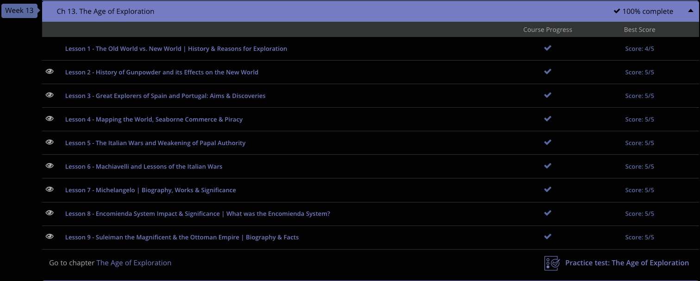

### andrew garber
### december 22
### clep western civilization 1
### chapter 13: the age of exploration

#### 13.2 gunpowder
  - [Paper I wrote on the subject](Writing_Assignments/effects_of_gunpowder.md)

#### 13.4. Mapping the World, Seaborne Commerce, Piracy
 - The age of exploration was a time of great change in the world with europeans setting out to increase their understanding of the world and to increase their wealth. 
 - One Renaissance man willing to foot the bill for excursions into the unknown was Prince Henry of Portugal. Henry, known to our world as 'Henry the Navigator,' began the first school of oceanic navigation and also sponsored countless expeditions into the dark seas. Although Henry never actually joined any expeditions, he helped to create maps used by later explorers while also whetting the appetite of all of Europe with the spirit of exploration.
 - Henry wasn't the only guy playing cartographer, the fancy word for 'mapmaker.' When news reached Europe that the Italian navigator and cartographer Amerigo Vespucci had reported the West Indies were not part of Asia but were in fact a new continent, all of Europe became atwitter.
 - Amerigo Vespucci didn't actually name America after himself, but was instead named after him by German mapmakers Ringmann and Waldseemuller. The name stuck and the rest is history.
 - In the early stages of exploration, Spain and Portugal would probably have to share the medal for first place. Shortly after Columbus's first voyages, trading vessels were racing across the seas. Using new and improved maps, these two empires developed a vigorous seaborne trade system. We might find it strange to think of Portugal as one of the foremost powers in this regard, but at the time, Portugal was a major player. 
 - During this time, the bulk of Spain's wealth came from gold and silver mined from the Americas. However, the Americas also supplied important agricultural products, which helped line the pockets of Spain. While Spain increased her trade with the Americas, she also grew her Oriental and Indian trading franchise.
 - Oddly, in the first stages of this new seaborne commerce, most of Europe stayed out of Spain and Portugal's way, choosing to cross the Atlantic in the north. Canada and the northern United States were the main areas of exploration for the English and French(and Dutch, for that matter), while the Spanish and Portuguese focused on the southern United States, Mexico, and South America.
 - Some of the first acts of piracy during this era were committed by the French against the Spanish in the waters off the Azores, a group of islands off the coast of Lisbon. During these raids, French privateers, which were basically government-sanctioned pirates, boarded and raided Spanish ships carrying wealth and treasure.
 - Along with the French, the Dutch got involved with their own breed of privateers, known to history as Sea Beggars. Although these Dutch pirates were a nuisance to Spain, they were nothing compared to the famous Sea Dogs of England, arguably the most skilled pirates of the Age.
 - In the mid-16th century, John Hawkins emerged as the de facto leader of the English Sea Dogs. Hawkins spent his time at sea raiding Spanish ships across the Caribbean while also dabbling in the African slave trade. After a close call in which several of his fleet's ships were captured and destroyed, Hawkins pulled back a bit from his pirating, making way for his cousin, Sir Francis Drake, to take the reins as England's premier privateer!
 - To the delight of England, Drake was excellent at his job. As a British explorer, slave trader, and privateer, Drake served his country well - so well, in fact, that the Spanish dubbed him El Draque, meaning the Dragon, and King Phillip II of Spain put a bounty on his head equal to the amount of four million dollars. 

#### 13.6. Cardinal Richelieu
 - (A French WW2-era battleship was named after him)
 - Armand Jean du Plessis, who would become Cardinal Richelieu, was born in 1585. He was a dominant figure in French history. He is considered to be one of the greatest politicians in 17th century France. He was the third son of the Lord of Richelieu, and was destined for a career in the church following college and time in military school. At the time, Marie de Medici(yes, those Medicis), was the regent of France for Louis XIII, who was too young to rule. Via this connection, he was appointed Secretary of State for War and Foreign Affairs.
 - After an exile following Louis XIII coming to the throne, he was back in power and a major Royal Councilor(eventually becoming Chief Minister) and played an active role in France's policy throughout the Thirty Years war.
 - Richelieu's most notable victory was over the Huguenots where he won a major victory for the French crown's centralization of power. By the time Richelieu reached his Chief Minister status, the Huguenots had eight groups in the southern part of the country and an army of troops. The sect was so large they had established an internal system of administration. This further angered Richelieu, who was loyal to the French royalty. In the interest of gaining more esteem in Europe, he believed France needed to have very little conflict within its borders. Stability was key to France's power. He saw the Huguenots as a threat to this stability. Richelieu knew the Huguenots could attack if France's monarchy was distracted by foreign affairs, affording them a strong advantage.
 - In 1627 the Huguenots revolted again with the help of England. Richelieu sent troops to fight the Huguenots again. After driving English troops out of the Huguenot area, he ordered the harbor at La Rochelle be blocked off to prevent Huguenots from obtaining supplies by land. Richelieu waited with his troops for the Huguenots to be starved out of their capital. In 1628 Louis led an attack that defeated what was left of the Huguenots in La Rochelle. In 1629 the Huguenot military organization was broken up while their strongholds were destroyed under the Edict of Grace.

#### 13.5. Italian Wars
 - The First Italian War began when the Duke of Milan allowed King Charles VIII of France to pass through his lands on his way to conquer Naples. This move caused Venice, the Papal State, the Holy Roman Empire, and Spain to rise up against France. For those of you wondering, the Holy Roman Empire pretty much encompassed the modern-day areas of Germany, Austria, Switzerland, the Czech Republic, and Northern Italy. Even against all these enemies, France was initially successful. However, the game changed when the Spanish war hero Cordova rose to defend Naples.
 - A few years later, France tried again in the Second Italian War. This time, the new French king, Louis XII, got crafty and asked Ferdinand I of Spain to join his side with the promise that the two of them could divide Naples among each other. Working together, their campaign against Naples was a success. Not surprisingly, France and Spain couldn't agree on how to divide the plunder. Fortunately for Spain, they still had their hero, Cordova. In a short time, Naples was under Spanish rule and France was left with only Milan.
 - During the years following the Second Italian War, the Papal State of Rome, ruled by the Pope, decided to get in on the game. In a shrewd move, Pope Julius invited the Holy Roman Empire to attack Venice. When the Holy Roman Empire couldn't get the job done, the Pope turned to France and Spain. These players, along with the Holy Roman Empire, created the League of Cambrai. Knowing they were outnumbered, Venice made a deal with the Pope by surrendering some of their territory to the Papal State, which is exactly what the Pope had wanted all along. In doing so, the Pope had minimized the power of Venice, which was a major player in the region.
 - Shortly after this, the Pope got worried about France's holdings in Italy, namely Milan. In another shrewd move, he rallied Venice (yes, the area he had just trounced), Spain, Britain, and the Holy Roman Empire to take on France. Their league didn't last long, as France convinced Venice to switch sides. The fact that they could hold against the Pope's power here was a major victory for France, and a major defeat for the Pope's prestige.
 - Throughout all these conflicts, Spain and France kept a close eye on one another; each making sure the other wasn't getting too far ahead in the race for Italian and European dominance. When Charles V, King of Spain from the Habsburg Dynasty, was selected to also be the new Holy Roman Emperor, France had had enough. Making matters even more infuriating for France, Charles V was also the king of Austria and the Netherlands. War soon ensued.
 - Liking the idea of France suffering, England joined the Spanish team. The Pope also fought with Spain in what came to be known as the Four Years' War. This is where things start to get very, very hairy. After several devastating losses, France turned the game completely upside down by stealing the Pope and England from Spain's side. France, England, and Rome then formed the League of Cognac to fight against Spain.
 - When Charles V of Spain heard about this, he attacked and then conquered Rome - the Pope was now on the run, and after seeing the devastation, France backed down and gave the Habsburg's predominance in Italy. The Pope was eventually able to return to Rome, but the damage was done. The Pope had lost his power and prestige, and Spain was now the dominant force in Italy.

#### 13.8 Ecomienda System
 - Already did this in AP European History last year. [HERE](https://arc.net/l/quote/lboqslgs)

#### 13.9. Suleiman the Magnificient
 - Suleiman was one of the actual 'greats' that human nations have produced. Alexander, Justinian, Peter, Khosrau, and Suleiman are the ones I think of first.
 - While his reign was not without its faults, Suleiman was a great leader who brought the Ottoman Empire to its zenith. His rein was filled with military victories, but he was almost exclusively not a military commander - he was an administrator, and left *most* of the war fighting to his generals.
 - Suleiman filled his palace with music and poetry. At the beginning of his reign, Suleiman ruled his people with kindness. He freed hundreds of slaves, even making one of them his most trusted advisor(this was a man named Ibrahim, and would become the equivelant to an administrative Zhukov or Vasilevsky to Suleiman, as Zhukov or Vasilevsky were to Stalin). He showered military officers with gifts and erected schools. In turn for these acts of kindness, he demanded complete loyalty from his subjects.
 - Although kind to his people, Suleiman also had his father's conquering blood coursing through his veins. Upon his ascension, Suleiman set out to improve his military. To his weapons pile, he added hundreds of cannons. He also expanded his army of Janissaries, the elite Turkish warriors, which were oddly former war captives and Christian youths pressed into service. Of course, all of these soldiers were forcibly converted to Islam and trained under the strictest discipline.
 - With his military and navy finely tuned, Suleiman led his forces in a campaign to destroy the Ottoman's Christian enemies at the edge of the Empire. Due to his skilled forces, the Ottomans captured the Christian city of Belgrade in less than thirty days! This win not only gave Suleiman access to the important Danube River, it also spread fear of the name Suleiman across all of Christian Europe.
 - Although the chance to invade further into Europe was within his fingertips, Suleiman turned his attention toward the Island of Rhodes, located in the Mediterranean. Rhodes was the home base of the Knights Hospitaller, a group of Christian knights who swore to protect the Holy Lands. However, in protecting the Holy Lands, they attacked Ottoman trading ships, which led to Suleiman launching an attack against the knights in 1522.
 - The Knights fought hard for months, but with over 400 ships, a land force of over 100,000 men, and more cannons than any battle had ever seen, Suleiman was determined to capture the Island of Rhodes. After about five months of being trounced, the knights gave in, and Suleiman allowed the survivors to depart. Taking Rhodes might seem like a small thing, but it was an incredibly important strategic naval anchorage for Christian Europe. With Rhodes in his hands, Suleiman had a major advantage over his enemies.
 - With Rhodes now under Ottoman control, Suleiman's sights turned back to Hungary and Eastern Europe. War again waged against the Hungarians. In the 1520s, Suleiman defeated and killed the Hungarian Louis II at the Battle of Mohacs. With the death of Louis II, the Hungarians will to fight was gone, giving the Ottoman Empire control of Eastern Europe.
 - However, this control would soon be tested when remaining Hungarians decided Ferdinand of the Habsburg Dynasty, the ruler of Austria, should be the new Hungarian king. With the support of his brother Charles V, the Holy Roman Emperor and the guy in charge of Spain and much of central Europe, Ferdinand regained control of Hungary.
 - In 1529, Suleiman returned to the battlefield and soon retook Hungary. Perhaps wanting to teach his opponents not to mess with him, Suleiman was not content with only Hungary. With thousands of men, Suleiman moved to conquer Vienna, Austria. Unfortunately for Suleiman, his eyes were a bit too big for his forces, and he was defeated by the Austrians. Not wanting to give up and not accustomed to losing, Suleiman tried again in the year 1532. Much to the shock of Suleiman, he was again handed his hat by the Austrians.
 - With these victories over Suleiman, the Habsburgs of Austria tried to regain control of Hungary. Battles waged during most of the 1540s, but Suleiman held strong. Within a few years, the Habsburgs were forced to give up their Hungarian dreams. Although the battle over Hungary had ended, the hatred between the Habsburgs and the Ottomans continued well into the 20th century. This would eventually prove problematic in WWI, where they were theoretically on the same side, and should have mopped up the Balkans fairly easily - but could not coordinate their forces to defeat Serbia in any timely manner.
 - While there is much more to note about Suleiman, I would be remissed if I didn't mention Roxelana - originally a kidnapped slave woman, probably from Ukraine, Suleiman fell in love with her and made her his wife. She was the mother of his children, and would break down just about every barrier for the Harem system in the Ottoman Empire. She was a major power player in her own right, and was a major influence on Suleiman's policies.
 - In the 1560s, the aging Suleiman took to battle once more against Europe. In an ironic end, the illustrious Suleiman died in a battlefield tent in 1566. His son, Selim II, became the next sultan. Unlike his father, Selim II was an incompetent ruler with no interest in political affairs. He was so bad that history knows him as Selim the Drunkard! Sadly for the Ottoman people, the succeeding sultans were not much better. This eventually led to the decline of the Ottoman Empire.

