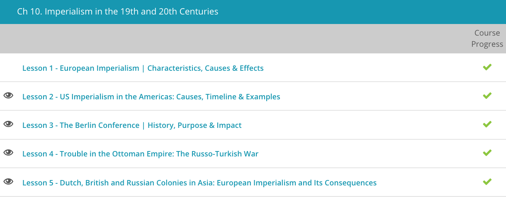

### Andrew Garber
### CLEP Western Civilization II
### Chapter 10: Imperialism in the 19th and 20th Centuries

#### 2. US Imperialism in the Americas
 - I haven't started it yet, but if Samuel Zemurray isn't in here, I'm going to be very disappointed. 
 - Although the 1800s had seen most of Latin America gain independence, the area continued to struggle. Sadly, life for most of its people did not improve. Poverty continued, as did civil wars. The wealthy continued to rule over the poor, and local dictators known as caudillos became the law of the land. With these troubles brewing for decades, it's not difficult to see why the United States was able to step in and use their influence to gain power. Known to the world as Yankee Imperialism, America's military and economic influence crept further into the Western Hemisphere.
 - As Latin America broke their chains with Spain, and had *generally* poor relations with much of Europe due to their colonial past and geographic distance, the United States was able to step in and fill the void. The Monroe Doctrine, which was established in 1823, stated that the United States would not allow European powers to interfere in the Western Hemisphere - this gave America a sphere of influence in North and South America. While the Europeans didn't much care, it was a valuable justification for the United States to use in their dealings with Latin America as well as to up-their game on the world stage.
 - [I wrote about this before](../../11TH_GRADE/AP_US_HISTORY/monroe_doctrine_effectivness.md)
 - Not content with merely trade, the U.S. set its sights on more. With this, we come to the presidency of Teddy Roosevelt. Known for his desire to elevate the U.S. to a world power, Roosevelt was bent on lessening Europe's influence in the Western hemisphere. Making this desire formal, he issued the 1904 Roosevelt Corollary. As an addendum of sorts to the famous 1823 Monroe Doctrine, in which the U.S. basically proclaimed the Americas were no longer open to European colonization, the Roosevelt Corollary took this a bit further. In true Roosevelt form, it aggressively declared that the U.S. held the right to intervene if Europe threatened to seize or control any republic in the Americas. 
 - Of course he immediately followed this up with the Panama Canal, so not a magnanimous gesture by any means(though the Panama Canal is a top 10 engineering project for the benefit of human wellbeing in history).
 - This was seen in the Platt Amendment, in which the U.S. forcibly took temporary control of Cuba after it tried to rebel against their elected government. Of course, many believed this elected government was pretty much a puppet with the U.S. pulling its strings. Perhaps proving these rebels' case, and making the U.S. look even more imperialistic, a few years later the United States set up a permanent naval base at the famous Guantanamo Bay.
 - Following in Roosevelt's footsteps, President William Howard Taft picked up the imperialist mantle. However, unlike Roosevelt, Taft preferred to use economics over force. Known as Dollar Diplomacy, the U.S. realized it could indirectly control other nations by using economic means. To be blunt, if they simply controlled the money and the resources, they could push Latin America around. An excellent example of this is the Taft administration's financial and military backing of Nicaraguan rebels. Of course, once the rebels were successful, the U.S. gladly stepped in offering loans, making the new regime indebted to them. In excellent Dollar Diplomacy style, money was used to leverage power.
 - By any objective measure, American Imperialism existed on a scale far smaller(in both land&peopled controlled, and in terms of brutality) than European Imperialism. However, it was still a significant force in the world, and it's important to understand the role the U.S. was not a magnanimous force in the world, but rather a nation that was willing to use its power to get what it wanted. In the words of Bismarck, "The great questions of the day will not be settled by means of speeches and majority decisions but by iron and blood."

#### 3. The Berlin Conference
 - Often called 'Africa's undoing', the Berlin Conference saw the powers of Europe divide the African continent among themselves. The conference was called by the German Chancellor Otto von Bismarck in 1884, and it was attended by representatives from every major European power. Bismarck was actually minimally interested in Africa, but he saw the conference as a way to keep the peace in Europe(or more accurately set the stage for greater Prussian power).
 - To make trade easier for everyone, the conference decided the Congo and Niger Rivers would remain neutral and open.
 - Beyond this, the conference declared Europeans were free to aggressively colonize Africa. Making matters even worse for the Africans, it also established the Principle of Effectivity which made it acceptable for one European nation to claim-jump another European nation's African claims if they were not fully exploiting the land. In other words, the Berlin Conference pretty much told Europe they couldn't establish a colony in name only - they had to use it or lose it. This was manifested most disastrously in the Congo, which had such unbelievable resources that it was quickly exploited(**BRUTALLY**) by the Belgians(and other passing Europeans) who were more than happy to use the land and its people to their advantage.
 - By about 1900, the division was almost completely done with only two independent African nations remaining - Ethiopia and Liberia. Ethiopia was able to remain independent due to its strong military and the fact that it was able to play the Europeans against each other. Liberia, on the other hand, was a bit of a different story. It was so *not* valuable that trying to potentially mess with America over it wasn't worth it.
 - Great Britain got Uganda, Kenya, South Africa, Egypt, Zambia, Zimbabwe, and more. France got Algeria, Tunisia, Morocco, Madagascar, and more. Germany got Namibia, Tanzania, Cameroon - they weren't as interested in investing the resources to make their colonies worth-it, they just needed a token presence to keep up with the other European powers. Belgium got the Congo, Portugal got Angola and Mozambique, and Italy got Libya and Eritrea. Spain got Equatorial Guinea and Western Sahara.

#### 4. Russo-Turkish War
 - The Russo-Turkish War of the late 19th century signaled a turning point in Europe's balance of power. Pitting Russia against the once powerful Muslim Turks of the Ottoman Empire, this conflict ushered in sweeping change. For Russia, these changes would eventually work out rather well(though not as well as they hoped). For the Ottoman Empire, however, the war was a disaster. It was the beginning of the end for the once mighty empire - it showed the tottering weakness of the Ottomans and the newly ascendant power of Russia, once again returning to the role of the boogeyman waiting in the wings.
 - Although the Crimean War was officially won by the Ottomans and their European allies, what ensued were years of on-again-off-again fighting as Russian pushed further and further into Ottoman lands, gaining control of parts of the Black Sea. Despite the desire of most of Europe, Russia continued to move into Ottoman lands. Unfortunately for the Ottomans, this conflict came to a decisive head in the Balkans.
 - In the mid-1870s, Christian Slavs living in the Ottoman-controlled provinces of Bosnia, Herzegovina, and Bulgaria rebelled against their Muslim rulers. Inspired by the concept known as Pan-Slavism, these Christian Slavs believed that all Slavic people should be autonomously united as one. Also moved by their Pan-Slavic dreams, other Slavs across the region joined the fight. Unfortunately, these people groups were no match for the Turkish army. The Turks dealt them a decisive defeat and tens of thousands of Slavs were massacred.
 - (Pan-Slavism was eventually semi-realized in the form of Yugoslavia, which its Slavs then hated.)
 - Seeing their fellow Slavs massacred, and also seeing an opportunity to gain some more land, Russian forces descended on the Ottoman Empire. After a very bloody campaign, the Russians, joined by the Romanians, defeated the Ottoman armies at the Siege of Pleven. This victory opened up the gateway for Russian forces to move further into Ottoman lands, seizing Adrianople in the year 1878. The Ottomans were forced to sign the Treaty of San Stefano, which was a very harsh treaty for the Ottomans. It recognized the independence of Romania, Serbia, and Montenegro, and it also created a large autonomous Bulgaria. The Ottomans were forced to give up a large amount of land--more important than this land though, was the fact that Russia was now able to exert its influence over the Balkans.
 - Unfortunately for Russia, the rest of Europe, especially Britain and Austria-Hungary, had no intention of letting Russia control the land delineated under the Treaty of San Stefano. Instead, the powerhouses of Europe stepped in with the Treaty of Berlin in which Russia's winnings were greatly reduced. Forced to accept this or perhaps face more fighting, Russia walked away with only new lands in the mountainous Caucasus regions. Bosnia and Herzegovnia were given to Austria, while Romania was declared independent. This continued the feud between Russia and Austria-Hungary, and it also showed the world that the Ottoman Empire was on its very last legs.

#### 5. Colonies in Asia
 - With the coming of the Industrial Revolution, the wealth and technology of Europe greatly increased. With these new resources jingling in their pockets, the powerhouses of Europe were itching to increase their powers and extend their boundaries. With this, they turned their eyes toward Asia.
 - Prior to the 19th century, Europe's holdings in Asia had mostly been limited to holding trading posts on the continent. Content to make money from these commercial outlets, Europe usually didn't impose direct rule upon Asia. However, as the 19th century progressed, Europe grew discontent with this setup, and a shift in Asian relations occurred. Known as New Imperialism, Europeans began to seek formal political control over foreign and overseas areas. As the old saying goes, 'they had been given an inch and they wanted a mile.'
 - Steam ships were the key here, as they allowed Europeans to travel to Asia much more quickly than before. A fleet based in home waters could now reach the farthest corners of the globe in a matter of weeks. This was a game-changer, and it allowed Europeans to exert their influence over Asia in a way they never had before. With the coming of the dreadnought age, the Europeans could exert *HUGE* power while keeping the majority of their ships and crews in Europe.
 - As European merchants, troops, and even missionaries began flooding into Asia and other parts of the globe, this New Imperialism took hold and the political landscape of Asia was jostled in its wake. Swept up in New Imperialism, the Dutch claimed Indonesia and sent hundreds of thousands of Europeans into Asian lands. Although many of these people succumbed to disease or high-tailed it back to Europe, the Dutch influence in Indonesia is still present today. The economic structure that the Dutch set up in Indonesia is still in place, being a huge exporter of raw-materials to the world and only now building a strong manufacturing base.
 - The Dutch were even able to trade in Japan, a feat no other European power was able to accomplish until the mid-19th century.(Commodore Perry) 
 - Unfortunately for Russia, they had to forfeit their Great Game with Britain due to conflict with Japan. Trying to push the borders of their empire a bit too far, the Russians set their sights on Manchuria and Korea. Having no intentions of letting Russia have these areas, Japan attacked the Russian navy in 1904. This conflict lasted over a year and was known as the Russo-Japanese War. It was significant because it saw Russia defeated and forced to give up its imperialist dreams in the Far East. The problem was not overwhelming Japanese military superiority, though they were militarily superior, but rather the fact that Russia was unable to supply its troops in the Far East. It had a single track railway that ran pretty much from Moscow to Vladivostok, and its throughput was not enough to supply the troops in the Far East. This was a problem that would come back to haunt Russia in the First World War when trying to move goods in the opposite direction.
 - With New Imperialism sweeping the land, China also felt the impact. For instance, due to many unfair treaties, some parts of China saw Europeans immune from Chinese law. Therefore, they could not be tried in Chinese courts. This caused abuses to occur all over and frequently. These unfair treaties also led to things like the mid-19th century Opium Wars. As the name implies, this conflict saw Britain and China at war over the forced importation of opium into China. Sadly for the Chinese, the British were victorious.
 - China wasn't done getting the treatment, as Germany, Russia, Japan, and the US all forced concession of ports. 
 - By the year 1900, tensions in China had hit the boiling point. This is plainly seen in the Boxer Rebellion, in which Chinese nationalists murdered thousands of foreigners in an effort to rid their land of outside influence. Although many foreign lives were lost, the conflict saw the same end as the Opium Wars. Not surprisingly, the nationalists were subdued by European forces and China's ruling dynasty was further weakened.

