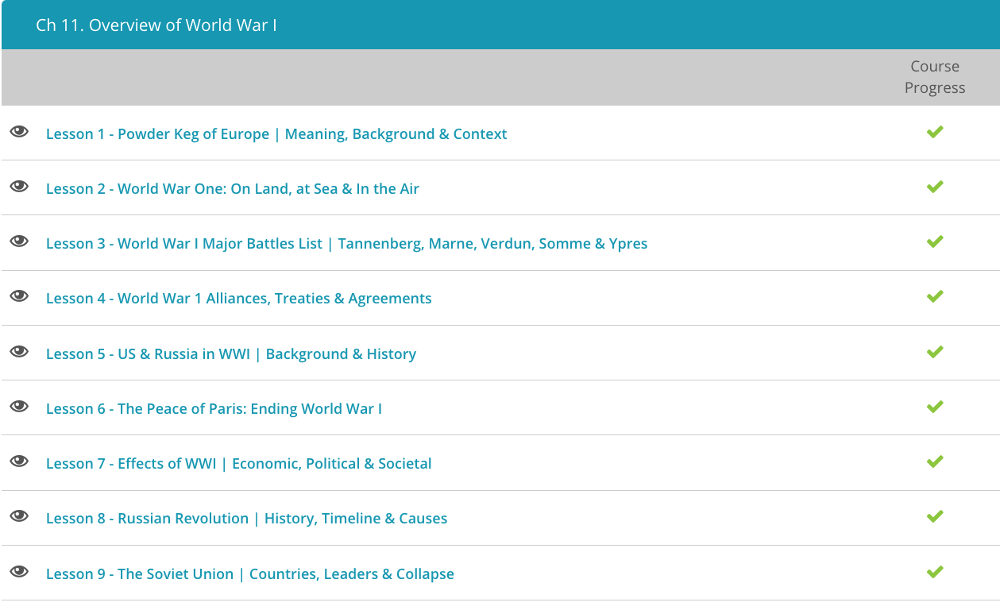

### Andrew Garber
### CLEP Western Civilization II
### Chapter 11: World War I

#### 2. War on land, sea, air
 -The Great War was characterized by trench warfare, in which opposing armies would dig sophisticated trenches into the earth in order to provide themselves with cover. The open space between the opposing trench systems was commonly referred to as 'no man's land' because no man wanted to enter this dangerous area. Holed up underground for weeks and months at a time, the men living in trenches experienced horrible conditions. Cold weather, rain, mud, food shortages, rats, and disease were just a few of the difficulties they had to bear.
 - Each side would rain down heavy artillery shells across 'no man's land' hoping to weaken enemy positions. Those who stuck their heads above the trench risked being hit by a sniper's bullet. The constant noise of artillery barrages day and night caused some men to suffer mental instability. When one side felt it was in a position to advance, officers ordered their men to climb over their trench and embark on a suicidal charge across 'no man's land' with the hope of climbing into the enemy trench and overrunning it.
 - Another major change in World War I land warfare was the improved machine gun, which was capable of bringing death to the hundreds of men charging across 'no man's land.' Although the Gatling machine gun saw limited action during the American Civil War, by the time the Great War broke out, machine guns had undergone dramatic (not to mention deadly) improvements. The most commonly used machine guns of the Great War were the British 'Vickers' machine gun and the German Maschinengewehr 08, or MG-08.
 - The problem was that despite massive increases in the lethality of weapons, the technology to move them around(what would become tanks), and the doctrine to conduct that kind of war hadn't been developed yet.
 - Another scary first of World War I involved the use of poison gas. World War I was the first war in which modern chemical warfare was used. Mustard gas and chlorine gas were among the most commonly used poison gases. To protect themselves from gas attacks, many soldiers were issued gas masks.
 - Although submersible vessels were used in the Civil War, and even the Revolutionary War, it was not until World War I that submarines saw widespread use. Germany's U-boat fleet was particularly formidable. U-boat stands for 'Unterseeboot', which means 'undersea boat' in German. German U-boats were used with deadly efficiency against Allied merchant ships in the Atlantic. In May 1915, U-20 torpedoed the RMS Lusitania, resulting in its sinking and the loss of nearly 1200 lives.
 - Throughout World War I the British Royal Navy was the most dominant naval force, with the Imperial German Navy following behind. In the years leading up to the outbreak of World War I both nations, as well as others like Russia and France, modernized their naval forces. The result was that when war broke out, powerful battleships roamed the seas. Naval blockades became a common tactic as nations attempted to starve one another into submission by preventing imported goods from coming in.
 - The u-boats were only able to submerse for very small periods, and spent much of the time cruising on the surface, but anti-submarine warfare was in its infancy, and the u-boats were able to sink many ships.
 - The Great War was also the first war in which the airplane saw widespread use. Observation balloons and other kinds of airships had been in use for decades, but were primarily designed for reconnaissance. Not surprisingly, at the beginning of the war, aircraft was used for that same purpose: reconnaissance. As the war progressed, however, the value of 'fighter' and 'bomber' aircraft became realized. The French, in particular, helped pioneer military aviation, while the British, Germans, and others soon caught on, developing their own formidable air corps. Within a short period of time, military aircraft became remarkably sophisticated; machine guns were mounted on airplanes and became synchronized so that they could fire through the plane's propellers. 
 - German Zeppelin airships, named after Count Ferdinand von Zeppelin, had come into production a few years before the war. Throughout the war, they were used widely for bombing and reconnaissance missions. Because they could appear directly above major cities and drop bombs, Zeppelins had tremendous psychological effects on the people of London and other Allied cities, although their military effectiveness is a matter of debate. (They were *really* expensive to build and maintain, and were very vulnerable to anti-aircraft fire and fighter plane, but were also monstrous and terrifying to the people below them.)

#### 3. Big battles
 - The Battle of Tannenberg was fought between the Russian Second Army and the German Eighth Army from August 26-30, 1914. This Eastern Front battle resulted in a decisive defeat for the Russians, who were led by General Alexander Samsonov. Samsonov's plan was to invade East Prussia, with the help of General Paul von Rennenkampf's First Army. Initially, things were going well for the Russians. They held a 2:1 numeric superiority. Under General Maximilian von Prittwitz, the Germans were retreating.
 - The German general staff decided they couldn't allow this, though to win the war in the West they probably should have. They sent in General Paul von Hindenburg and his chief of staff, Erich Ludendorff, to take command. Hindenburg and Ludendorff were able to outmaneuver the Russians, who were forced to retreat and encircled many of them at Tannenberg. Samsonov, realizing the hopelessness of his situation, commited suicide.
 - The Battle of the Marne, or sometimes called the First Battle of the Marne, halted the German advance through Belgium and Northern France. This Western Front battle was fought between the French and British on one side, and the Germans on the other. It was fought September 5-12, 1914 along the Marne River, which is east of Paris. The battle was immensely important because it prevented a swift German victory. The Allied victory prevented the Germans from advancing into Paris, and it forced a four-year entrenched war along the Western Front. Had the Germans not been stopped at the Battle of the Marne, they very well may have won the war.
 - One of the most enduring legacies associated with the battle involves the use of taxi cabs to transport troops to the front. 'The Taxis of the Marne,' as they have been called, consisted of 600-some Parisian taxi cabs that were commandeered for military use. In French memory and history, they hold an almost mythical status.
 - The Battle of Verdun is one of the most well-known battles of World War I. This devastatingly brutal Western Front engagement was fought throughout most of 1916: between February 21 to December 18. Verdun was of critical strategic importance to the French. Hosts of major forts protected the city, with Fort Douaumont being the most important. Verdun also had tremendous symbolic significance among the French - for centuries the region had been a bulwark against the threat of invasion.
 - Finally, in December, the Germans were forced to retreat, enabling a French victory. By most accounts, roughly 700,000 combined casualties resulted from the Battle of Verdun, although some historians believe it could be as high as one million. On a side note, General Philippe Pétain emerged from the battle as a national hero. He would later become a great national villian during World War II, when he collaborated with the Germans in the Vichy puppet government.
 - The Battle of the Somme was fought between the French and British on one side and the Germans on the other. This Western Front battle was fought between July to November 1916, along the Somme River in Northern France. Like other World War I battles, the Battle of the Somme was a dreadfully bloody engagement, with over one million casualties. Historians regard it as one of the bloodiest battles in history.
 - The Battle of the Somme was intended to be a decisive break through German lines. The Germans, however, had better defensive positions than expected, and British and French forces became bogged down amid torrential rainfall. The Battle of the Somme is generally considered a stalemate, although, we should understand, it did help relieve pressure on the French by diverting German forces from the Battle of Verdun.
 - There were actually three Battles of Ypres. The First Battle of Ypres was fought in October and November 1914. The Second Battle of Ypres was fought through April and May 1915. The Third Battle of Ypres, and probably the most well-known, is also called the Battle of Passchendaele. It was fought between July to November 1917. The Third Battle of Ypres began as an Allied offensive under the leadership of British General Douglas Haig. The plan was to break through the German defensive line and sweep north toward the coast. After initial success, Allied armies eventually became bogged down due to heavy rain. Although General Haig claimed victory, the offensive failed to break through German lines and resulted in little change in momentum for the Allies. Like other battles of World War I, it was characterized by futility. It is believed over half a million casualties ensued from the Third Battle of Ypres.
 - Do these all sound like futile actions with little change to the military situation except for mass-attrition? Yup. That's World War I for you.

#### 4. Alliances
 -  In 1882, the Triple Alliance was formed between the countries of Germany, Austria-Hungary, and Italy. To counter this alliance, France, Great Britain, and Russia formed their own alliance in 1907, the Triple Entente. When World War I broke out in 1914, the Triple Alliance was more or less pitted against the Triple Entente.
 - The Triple Alliance became known as the Central Powers, while the Triple Entente became known as the Allied Powers, or just the Allies. There is one exception here, and that is Italy. Italy basically wimped out once the war started, and opted to remain neutral. Then it eventually switched sides, and joined the Allies.
 - The important thing to remember here is that even before war broke out in 1914, the major European powers were involved in systems of entangling alliances. This meant that if any one country went to war against any other belligerent country, all the countries would become involved because of their binding alliances. Not a good situation!
 - The spark that set off World War I was the assassination of Archduke Franz Ferdinand by a Serbian nationalist named Gavrilo Princip. This set off the July Crisis, a diplomatic crisis among the major European powers lasting throughout most of the month. Negotiations proved useless as ultimatums and counter-ultimatums eventually led to the outbreak of war. It would be hilarious if it wasn't so tragic.
 - Between the end of 1915 and the beginning of 1916, with the war in full swing, France and Great Britain held a series of secret meetings to draw up plans for the dismemberment of the Ottoman Empire following an Allied victory. Russia was also involved in negotiations to a small degree. The result of these negotiations was the Sykes-Picot Agreement, or the Asia Minor Agreement.
 - The agreement divided up spheres of influence between France and Great Britain. Portions of what is now Syria, Iraq, Turkey, and Lebanon were divided up between the British and the French. Russia was also to get a small portion of land in Turkey. The secret agreement was named after French diplomat François Georges-Picot and British Sir Mark Sykes.
 - Although the agreement was drawn up in secret, it came to light when the Bolsheviks blabbed. See, following the Russian Revolution in 1917, the Allies refused to honor the agreement with the new Bolshevik government. This made the Bolsheviks mad, and to get back at their former allies, a copy of the agreement was printed in the communist newspaper, Pravda.
 - In November 1917, British Foreign Secretary Arthur Balfour sent a letter to Jewish leader Walter Rothschild. This letter has come to be known as the Balfour Declaration. In the letter, Balfour expressed Great Britain's support for a Jewish state in the region of Palestine. The Balfour Declaration ultimately led to the League of Nations granting Great Britain control over the region under the Palestinian Mandate of 1922.
 - The interception of the Zimmermann telegram, or the Zimmermann note, was an important event that helped sway American opinion toward intervention in World War I. The telegram was sent by German Foreign Minister Arthur Zimmermann to the German ambassador in Mexico. In the telegram, Zimmermann proposed that Mexico join the Central Powers in the event of war against the United States. In return, Germany would help Mexico regain territory lost to the United States in the Mexican-American War. The British intercepted the telegram and leaked it to the American press. The Zimmermann telegram was one of the factors that led to the United States declaring war on Germany in April 1917. Despite this, America had a smaller impact on the war in its actual fighting than with its economic and industrial might.
 - Russia suffered astounding losses throughout World War I. The unpopularity of the war helped bring about the Russian Revolution of 1917, resulting in the abdication of Tsar Nicholas II and the installment of a socialist government. Upon securing power, the radical Bolsheviks, led by Vladimir Lenin, moved quickly to withdraw from World War I. The Treaty of Brest-Litovsk, signed on March 3, 1918, formally ended Russia's involvement in World War I. The Bolsheviks originally rejected the treaty, but after the Germans launched a massive offensive, they were forced to sign it. The treaty resulted in Russia losing a significant amount of territory, including the Ukraine, Finland, and the Baltic states. The treaty was a major blow to the Allies, as it allowed the Germans to focus their efforts on the Western Front.
 - On November 11, 1918, the Armistice of Compiegne ended the fighting of World War I. In a railway car in the Compiegne Forest of Northern France, German officials agreed to French terms of surrender. However, the official peace treaty ending the war, known as the Treaty of Versailles, did not come about until June 28, 1919, five years to the date after Franz Ferdinand's assassination. The Treaty of Versailles required Germany to make territorial concessions, pay enormous reparations, and essentially shoulder the responsibility for the war.

#### 5. US AND RUSSIA 
 - When World War I first broke out in 1914, isolationist sentiment was strong throughout the United States. While there may have been some sympathy for the plight of Great Britain and France, most Americans felt neutrality was in their best interest. After all, why should America become involved in a European war? This war had nothing to do with the United States; that was the mentality most Americans shared. In fact, President Woodrow Wilson campaigned in 1915 with the slogan 'He Kept Us Out Of War.'
 - Two important events, however, began to change public opinion toward American intervention. The first was the sinking of the RMS Lusitania on May 7, 1915 by a German U-boat, U-20. Although the RMS Lusitania was a British liner, over 100 Americans lost their lives. The sinking of the Lusitania, along with Germany's policy of unrestricted submarine warfare, outraged Americans. What is unrestricted submarine warfare? Basically, it's the policy of attacking merchant and other non-military vessels without notice.
 - A second critical event influencing American public opinion toward intervention was the interception of the Zimmermann telegram. The Zimmermann telegram, or the Zimmermann note, was a telegram sent in January 1917 from Germany to Mexico, inviting them to join the Central Powers. In return for Mexican collaboration, Germany would assist them in re-conquering portions of the American Southwest, like Texas and New Mexico.
 - The telegram, named after German State Secretary of Foreign Affairs, Arthur Zimmermann, was intercepted by the British, and passed on to the United States. The telegram also indicated Germany would resume unrestricted submarine warfare, which had been temporarily halted in order to not offend the U.S. The news of the Zimmermann telegram outraged Americans and incited further waves of anti-German sentiment.
 - The continued sinking of American vessels by German U-boats was the last straw. Amid growing support for American action, President Woodrow Wilson petitioned Congress for a declaration of war against Germany on April 2, 1917. After legislation passed both houses of Congress, the United States formally entered World War I alongside the Allies on April 6, 1917. Unlike in World War II, public support for war was by no means universal. Many Americans still had reservations about entering World War I.
 - Imperial Russia suffered staggering losses throughout World War I. While many in the Russian Empire initially greeted the war with enthusiasm, within a few years it had become highly unpopular. Food shortages, riots, and general unrest led to Tsar Nicholas II falling out of favor with the Russian people.
 - In early March 1917 (February according to the Russian Julian calendar), the situation came to a head in the February Revolution. Large-scale demonstrations swept over the then-capital city of Petrograd (now St. Petersburg) as peasants, workers, and even soldiers protested the rule of the Tsar. As the city devolved into anarchy, Tsar Nicholas II was forced to abdicate the throne. Following his abdication, a provisional government was installed.
 - Many leaders of the provisional government favored withdrawing from the war and securing a peace. Increasingly, radical factions of the provisional government, like the Petrograd Soviet and the Bolsheviks, called for an immediate end to the war. Just so we are clear, the Petrograd Soviet was basically a loose coalition of Petrograd labor unions that acted as a sort of city council. The Bolsheviks, of course, were a Marxist political group who were followers of Vladimir Lenin; they were composed primarily of industrial workers.
 - In October 1917, the Bolsheviks seized power in what has come to be called the October Revolution, or sometimes the Bolshevik Revolution. Taking up arms, the Bolsheviks overthrew the provisional government and declared their own socialist state. The nuances and politics can be a bit tricky, but basically this state became the foundation for the Soviet Union. Upon seizing power, the leader of the Bolsheviks, Vladimir Lenin, ordered the military to cease all hostilities. For the Bolsheviks and many others in Russia, the war was simply not worth fighting; the Russian people were war-weary.
 - By November 1917, significant portions of the Russian Army had laid down their arms, although some factions continued to fight. After months of negotiations, the Treaty of Brest-Litovsk officially ended Russia's involvement in World War I. The treaty between the new Bolshevik government and the Central Powers was signed March 3, 1918.

#### 6. peace
 - While the actual fighting had come to an end under the Armistice of Compiegne, a permanent peace treaty took longer to iron out. The Paris Peace Conference began in January 1919, and lasted roughly a year. The goal of the conference was to secure a lasting European peace, one that hopefully would prevent future wars from breaking out. The conference was a major diplomatic event with over 30 countries represented. Among the leading figures at the conference were Georges Clemenceau from France, David Lloyd George from Great Britain, Vittorio Orlando from Italy, and Woodrow Wilson from the United States. These leaders are sometimes referred to as the Big Four. President Wilson suggested a peace centered around his Fourteen Points. He also promoted the formation of the League of Nations, which was an international council aimed at maintaining world peace. Think of the League of Nations as a sort of precursor to the United Nations. As much as President Wilson championed the League of Nations, the United States did not join. The U.S. Senate voted down American participation in Wilson's beloved league. The major product of the Paris Peace Conference was the Treaty of Versailles.
 - The Treaty of Versailles formally ended World War I. It was signed June 28, 1919, five years to the date of the assassination of Archduke Franz Ferdinand. Just as in the Armistice of Compiegne, Germany had virtually no room for negotiations. The ravaged nation was basically forced to accept whatever treaty it was presented with. One of the most controversial conditions of the Treaty of Versailles was outlined in Article 231, also known as the War Guilt Clause. This section required Germany to take full responsibility for all damage done throughout the war. It also required Germany to make territorial concessions and pay enormous reparations. Requirements for disarmament and limitations on military capabilities were also written in. Basically, it was an admission of guilt: the war was Germany's fault. Article 231 was written by U.S. diplomats Norman Davis and John Foster Dulles.
 - The general consensus among historians is that the Treaty of Versailles was unduly harsh toward Germany. It has normally been seen as a 'victor's peace.' Many historians cite the harsh terms of the Treaty of Versailles as a major cause of the rise of Adolf Hitler and his National Socialism during the 1920s and 1930s.

#### 9. Soviet Union 
 - The Union of Soviet Socialist Republics, or the Soviet Union, has played a monumental part in 20th-century world history. Since its creation in 1922, the Soviet Union has been at the center of world affairs. The world's first communist state, the Soviet Union rose to power in the 1920s and 1930s.
 - If there was any single event that led to the formation of the Soviet Union, it was the Russian Revolution of 1917. The Russian Revolution refers to the series of revolutions that swept Russia throughout 1917. Of course, these revolutions did not come about overnight. Social and political unrest had been building in Russia for decades. For example, in the Revolution of 1905, massive protests resulted in Tsar Nicholas II making reforms, including the formation of the Duma, which was a legislative assembly. The major revolutions, however, happened throughout 1917.
 - The February Revolution resulted in the overthrow of Tsar Nicholas II and the installation of a leftist provisional government, while the October Revolution resulted in the overthrow of the provisional government, and the establishment of a permanent communist government. The Bolsheviks were primarily responsible for these revolutions. Bolsheviks were followers of Vladimir Lenin's Marxist ideology; they were typically members of Russia's working class.
 - Immediately following the October Revolution, Vladimir Lenin declared Russia to be a socialist state. Officially, it was called the Russian Soviet Federative Socialist Republic. Not everyone in Russia, however, was on-board with the Bolshevik's radicalism. The Russian Revolution immediately spawned the Russian Civil War, in which Bolshevik 'Reds' fought conservative 'Whites.' Although the anti-Bolshevik 'Whites' were supported by the United States and other Western European democracies, they were ultimately unable to stop the tide of communism in Russia. The Russian Civil War ended in 1922 with the Bolsheviks firmly in power.
 - Now that we understand how the Soviet Union came into existence, let's very quickly highlight a few key events in Soviet history. When the Soviet Union was founded in 1922, Vladimir Lenin was its head of state. When he died in 1924, Joseph Stalin consolidated power through political intrigue to become Lenin's successor. Stalin essentially became the dictator of the Soviet Union.
 - Under his rule, the Soviet Union emerged victorious in World War II, having helped defeat Nazi Germany and Imperial Japan. Stalin was an important leader; under his rule the Soviet Union emerged as one of the two world superpowers (the United States, of course, being the other). Under his leadership, the Soviet Union also successfully exploded its first atomic bomb in August of 1949. 
 - Immediately following World War II, the United States and the Soviet Union began to see things very differently. The former allies disagreed over how European nations should be reconfigured. The Soviet Union wanted Eastern Europe to be composed of communist countries, whereas the United States wanted these countries to be democratic. The Cold War stemmed from these issues and others. The Cold War was a prolonged period of tension between the United States and the Soviet Union. It lasted roughly half a century - from the end of World War II to the fall of the Soviet Union in 1991.
 - 
