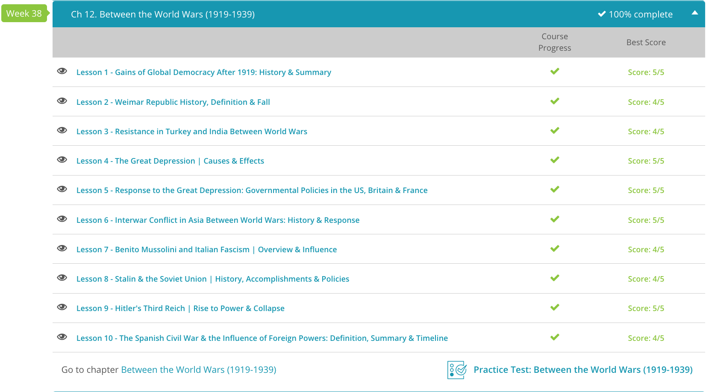

### Andrew Garber
### CLEP Western Civilization II
### Chapter 12: Between Two Wars

#### 12.1 Gains of Democracy
 - Separate treaties with Austria-Hungary dismantled that sprawling eastern European state. The Treaty of Saint-Germain en Laye and Treaty of Trianon recognized the independence of several states who had already declared independence as the war was ending, and further severed the dynastic union between Austria and Hungary, acknowledging Hungary as a democratic republic without a monarch. The northern parts of the Empire primarily inhabited by Czechs and Slavs were made into the new nation of Czechoslovakia or were given to Poland. In the Balkans, much of Austria-Hungary's territory became part of the state of Yugoslavia.
 - The creation of many of these new states was done in large part due to U.S. President Woodrow Wilson, who pushed at the various peace talks for ethnic and national self-determination, meaning the boundaries of Europe should be redrawn to accommodate ethnic groups and allow them to choose their own forms of government. Naturally, this led to many of these postwar entities to adopt forms of democracy, including even in Germany where the Weimar Republic was founded in 1919.
 - The final defeated nation that received harsh treatment by the allies was the Ottoman Empire. The Ottoman Empire had been slowly declining in power and relevancy for more than a century, and defeat in WWI signaled its death. The settlement in formerly Ottoman territory was far different than in Eastern Europe; rather than national self-determination ruling the day, the Ottoman Empire was carved up with an imperialist mindset. Large parts of the Middle East were given as international 'mandates' to Great Britain and France and reduced to little more than colonies. The Turkish homeland itself barely survived, requiring a nationalist government and army to be hastily setup by Mustafa Kemal Ataturk to defend itself and survive as a political entity.

#### 12.3 Turkey and India 
 - For centuries prior to World War I, the Ottoman Empire had ruled over vast parts of the Middle East, Northern Africa and even large swaths of the Balkans in Europe. The expansive empire, however, had been slowly declining over the previous few hundred years, losing much of its territory in the Balkans in separate conflicts with Austria, Russia and other European powers. Economically, it had been slowly weakened by the colonization of North America and the growth of the Atlantic trade routes, as Western Europe no longer relied solely on trade with the Far East through the Mediterranean and Ottoman-controlled waters.
 - Not all Turks were willing to take the breakup of the Ottoman Empire lightly. Soon after the empire's partitioning, a nationalist movement cropped up. While these Turkish nationalists were willing to accept the breakup of the Ottoman Empire, they refused to accept the partitioning of the Turkish homeland and called for all Turkish-speaking peoples to rise up in resistance to foreign powers taking control of territory in Asia Minor. This movement was fostered and led by a former Ottoman official, Mustafa Kemal Atäturk. Atäturk had fled the Ottoman capital soon after the allies' occupation, and by 1919, his forces were fighting a guerrilla war against the Greeks, and they soon set up a Turkish nationalist government in Ankara.
 - Full-scale battle between the Turks and Greeks continued throughout 1920 and 1921, with Atäturk winning several victories, forcing the Greeks out of inner Anatolia. In 1922, Atäturk's troops continued to push back the Greeks, even to the point of capturing Smyrna, the city the allies had granted the Greeks in the partitioning of the Ottoman Empire. What remained of the Greek forces were forced to evacuate across the sea back to Greece.
 - The Treaty of Lausanne in July of 1923 confirmed the borders of a Turkish state that largely is the Turkey we know today, with the exception of a few border disputes with Iraq, which were settled by the League of Nations later in the decade. Furthermore, the nationalist government installed by Atäturk at Ankara was recognized as the only legitimate government of the Republic of Turkey, and Mustafa Kemal Atäturk was confirmed as Turkey's first president.
 - Whereas Turkey was fighting off attempts at colonization by the victorious powers of World War I, Indians in the interwar period had to contend with colonialism that had been established in prior centuries. Prior to World War I, India had been increasingly ruled by the British crown, who wrested power over India from the declining British East India Company. The British ruled with paternalist views that insulted the intelligence of Indians and Indian society. The British believed that through their rule they could educate and modernize Indians using anachronistic western principles until Indians could rule themselves via European-style institutions and government.
 - Intellectual resistance to colonialism began in India with the institution of the Indian National Congress in 1885. In its early years, the Indian National Congress argued against the narrow-minded view of the ruling British that Indians were incapable of ruling themselves. In the early 20th century, the Congress grew a large following not just within the intellectual and upper classes, but across all portions of Indian society. While it gained widespread support, opinions as to how to best redress their grievances varied wildly. Some wanted to work through the existing system to oppose British rule, others wanted a violent uprising and still others had their own unique plans.
 - Enter Mahatma Gandhi, the most influential man of the movement for independence from British rule. Gandhi was born in India but had been a law clerk and human rights activist in South Africa before returning to India during World War I. Upon his return, he became a vocal critic of the British government and encouraged peaceful uprisings across the Indian subcontinent in the 1920s. The British responded to these uprisings with violent suppression, including a massacre of hundreds of peaceful protesters in Amritsar in 1919. For fomenting rebellion - however peaceful his demonstrations may have been - Gandhi was imprisoned in 1922.
 - In 1930, he led a march to the sea in protest of the new British salt tax, and in 1931, he attended the Round Table Conference in London with the hopes of securing greater freedoms for Indians. Though Gandhi's goal of a free India would not be recognized until 1947, his work and use of non-violent protest are often considered the greatest contributions to Indian independence.

#### 12.5 Response to the Great Depression
 - The Great Depression struck in 1929 and lasted in varying degrees up until World War II, when large sectors of the economy were put back to work producing goods and products for the war effort. The Depression occurred for several reasons. Market speculation by both individual investors and banks had artificially inflated the prices of many stocks traded on Wall Street and, to make matters worse, banks had used large amounts of customer deposits as capital to trade openly on the market. This made the life savings of the growing middle class susceptible to the volatility of the market.
 - The increased market prices, in turn, caused a glut of goods to be sold at these higher prices. For example, farmers flooded the market with grain and crops in order to sell their foods at the higher prices of the 1920s. This precarious balancing act of artificially high stock prices and a very real high amount of supply came to a head on Black Monday, October 28, 1929. On that day and the Tuesday following, the stock market lost nearly a quarter of its value.
 - The burden of deciding how to care for those affected by the swift and immense economic downturn fell largely to the Western governments. In the United States, the government initially implemented a string of isolationist policies, aimed at closing the U.S. off from the international community. This did little to alleviate the problems, and matters only got worse in the first few years of the Depression, likely costing Herbert Hoover his reelection bid.
 - When Hoover's opponent, Franklin Delano Roosevelt, took office in January 1933, he immediately focused his attention on the U.S. economy - taking the United States off the gold standard (which meant that all U.S. dollars had to be tied to a certain amount of gold) in order to allow more currency into circulation. Though this would likely cause long-term inflation problems, in the short term it would put more money into the ailing U.S. marketplace.
 - Roosevelt also instituted a host of public works projects, financing the new agencies with government money in order to put Americans back to work and build the country's infrastructure at the same time. There were so many new agencies with such varied acronyms - the WPA, FDIC, the SEC, FHA - that commentators began calling them Roosevelt's 'alphabet-soup' agencies.
 - In foreign trade, Roosevelt reengaged the U.S. economy with foreign powers. He created the Import-Export Bank to regulate U.S. trade with foreign countries. Furthermore, Roosevelt made it easier for foreign countries to trade with the U.S. by signing reciprocal trade agreements with 19 nations in the 1930s alone, from countries and economies as small as Honduras to countries as large as Great Britain.
 - The New Deal, as Roosevelt's policies were called, did not solve the Depression, but it tangentially stopped many from starving. His greatest impact was not political at all, but rather an act of personal belief: he asked the American people to put their trust in the banks, and in the U.S. government. This trust was the first step in the long road to recovery, largely hindered(not helped) by Roosevelt's alphabet soup. The National Recovery Administration, for example, was both blatantly unconstitutional and largely counterproductive: trying to eliminate "waste" as a result of competition by setting up cartel-like monopolies in various industries and setting prices for goods and services is obviously not a good idea. 
 - Many of the same initial policies that the United States instituted were undertaken elsewhere in the Western world as well. For instance, Great Britain went off the gold standard even before the U.S., in 1931. British policy immediately after the beginning of the Depression was as isolationist as the United States, as Britain looked to protect its own industries. This had the unintended effect of harming the U.K.'s manufacturing industry, already reeling from the massive fall in British exports corresponding to the international economic downturn.
 - Protectionist tariffs further hurt the orders these sectors of the economy got from foreign countries. It should be noted, however, that the Great Depression's effect on Great Britain was far more regional than in the United States; the North of England, which relied heavily on manufacturing and industry, was hurt far worse by the Great Depression, whereas in the Midlands and in the South, recovery from the Depression came much quicker than in either the North or in the U.S.
 - France, unlike Great Britain and the U.S., held on steadfastly to the gold standard. Although France experienced less of an economic depression than in either the U.S. or Great Britain, its effects were felt for a longer period of time due to this refusal to abandon basing their currency on finite amounts of gold. While riots occurred in manufacturing-heavy regions of the country, many protectionist measures were already in place in France, which lessened the overall effect of the Depression. Just as in the U.S., it took World War II to eventually sweep away the economic downturn in France.

#### 12.6 War in Asia 
 - Prior to the mid-19th century, Japan had been closed to any foreign travelers or traders. This xenophobic policy, that had been in place since the early 17th century, was extreme; stories emerged of shipwrecked sailors from Western Europe being killed just for washing up on the island nation's shores. However, this changed in the 1850s, when an American fleet led by Commodore Matthew Perry forced the Tokugawa shogunate, which ruled Japan, to sign treaties that opened its ports to foreign trade. The Meiji restoration in 1868 further opened Japan to the world, and the country quickly industrialized and modernized.
 - As quickly as Japan industrialized, the country began looking to expand its foreign influence. In 1894, Japan fought a two-year conflict with China, which freed the Korean peninsula from Chinese control and opened Chinese ports to Japanese trade. Ten years later, Japan went to war again, this time against the encroaching Russian presence in Manchuria. Victorious again, Japan gained protectorate status over the Korean peninsula and forced Russia out of Chinese land.
 - By the time World War I broke out in 1914, Japan was looking to extend its influence into China proper while Europe was occupied elsewhere. In 1915, they presented China with the Twenty-One Demands. Though not all the demands were recognized, Japan gained protectorate status and effective rule over large areas of Northern China including Manchuria and Inner Mongolia, as well as economic interests in Chinese state-owned mining operations. As part of the Treaty of Versailles in 1919, Japan further gained the rights to Germany's sphere of influence in China's Shandong province.
 - As one might guess by the developments just discussed, as Japan's star rose in the international sky, the power and clout of the Chinese state was falling in the 19th and early 20th centuries. The 19th century saw China's long period of stability under the Ming Dynasty interrupted by the arrival of Western powers. Through several conflicts that the Chinese were ill-prepared to fight, Western powers carved out of China economic spheres of influence - regions that were still under nominal Chinese control, but whose economic profits were largely shaved off by foreign, Western European powers.
 - In reaction to the humiliation caused by this blatant foreign incursion into Chinese lands, nationalist sentiment grew within China, often calling for China to 'self-strengthen' from within. This anti-foreigner movement was best exemplified by the Boxer Uprising in 1900. In the uprising, Chinese nationalists spread across Northern China, murdering foreigners and missionaries, and eventually laying siege to the foreign-controlled cities of Beijing and Tianjin. The rebellion was brutally put down by a group of Western allies, and most of Northern China was occupied by Western troops afterwards. A 1911 revolution in China installed a republican form of government.
 - After World War I, internal Chinese politics saw an internal power struggle between the republican nationalists and the growing, Soviet-supported, Chinese Communist Party. After an attempted kidnapping of the nationalist leader, Chiang Kai-Shek, in 1926, Chiang imposed severe restrictions on communist activities, although a communist underground was slowly growing support in the countryside. A librarian and devoted communist from Beijing, Mao Zedong, was slowly building soviet-style enclaves in rural China and recruiting a guerrilla force. Chiang Kai-Shek, meanwhile, spent ever increasing amounts of resources fighting the communists in Northern China, eventually forcing what was left to flee in the "Long March" where ~100,000 communist soldiers and civilians fled to the remote mountains of Northern China, less than 10% of the original force surviving the journey.
 - While Chiang chased Mao's communists around the interior of the country, to the east loomed the continuous presence of an expansionary and increasingly militaristic Japan. Indeed, Japan was not content merely with its control of the Korean peninsula and influence in Shandong Province, so in 1931, Japan invaded Manchuria and set up a puppet Chinese government under Japanese control. Though the League of Nations and Western Europe condemned Japan's seizure of Manchuria, there was little they could do to aid China - the 1929 Wall Street collapse and the Great Depression left most Western states incapable of paying for military intervention in China.
 - Even more notably, the Japanese invasion of China proper(starting with the Marco Polo Bridge Incident) in 1937 was met with little resistance from the Western powers. The Japanese army quickly captured Beijing, Shanghai, and Nanking, and the atrocities committed by the Japanese army in Nanking were some of the worst of the war. The Japanese army killed hundreds of thousands of Chinese civilians and soldiers, and raped tens of thousands of Chinese women. Something like 250,000 Chinese were killed in the massacre, and the Japanese army's actions in Nanking were so brutal that the whole world took notice.
 - The failures of the nationalist government in defending China against Japanese incursions led to the growth of the Chinese Communist Party, who had continued operating in rural China, outside the scope and reach of either the nationalists or the Japanese invaders. During WWII, party membership rose exponentially, rising to 1.2 million members in 1945.

#### 12.9: Hitler's Third Reich 
 - Born the third son of a third marriage to an aging Austrian customs official in 1889, Adolf Hitler did not enjoy a happy childhood. Adolf and his brothers were treated harshly by their father, a strict disciplinarian who likely beat his children and most certainly beat Adolf's mother. In 1900, Hitler escaped his boyhood home, being sent to Linz to study to become a civil servant. Despite this choice by his father, Hitler resisted, hoping to become an artist.
 - A few years after his father's death, Hitler took all of his savings and inheritance and moved to Vienna in order to apply for art school. His failure, coupled with his mother's death from cancer, threw Hitler's life in disarray. Out of his strong sense of German patriotism (Hitler considered himself more German than Austrian), he enlisted in the German military in World War I (WWI).
 - Serving with distinction as a message-runner on the Western Front, he stayed in the army post WWI, working as a spy for the German Army's intelligence division. It was during this time that, on a mission, he encountered the National Socialist German Worker's Party, what we would come to know as Nazis.
 - He joined as member #55. The party rapidly gained membership, partly as a result of Hitler's natural gift for rousing oratory. As the Nazi Party rose in notoriety, the German economy floundered due to the terms imposed by the Allied powers after WWI. With Germany in disarray, Hitler saw his opportunity to seize power, and in 1923, organized a plot to overthrow the Weimar Republic. The Beer Hall Putsch, as it has become known, failed miserably and Hitler was tried for treason the following year and imprisoned. During his time in prison, Hitler wrote the part autobiography, part philosophical treatise Mein Kampf, which served as a partial manifesto for the Nazi Party after his release. This book, a rambling and often incoherent work, laid out(on the first page) his intention to militarily expand. Of course, the book was not taken seriously by many at the time, but it was a clear warning of what was to come.
 - Hitler resumed his political involvement and assumed leadership of the Nazi Party after his release from prison in December 1924, having served only nine months in prison. Though Hitler was banned by the Bavarian government from public speaking for two years, he spent this time reorganizing his party. Hitler's new Nazi Party was not aimed at overthrowing the German government, but instead at gaining power by working within democratic rules. At the same time, Hitler organized his party officers and foot soldiers, the notorious SA & SS, into something akin to a paramilitary force under his direction.
 - Still, Nazism was not doing well in the democratic Weimar Republic. It took a long time, especially during the low years of the 1920s to keep the party afloat, but following the great depression and the collapse of the German economy, Nazism began to gain traction. In 1932, through political maneuvers, Hitler got himself appointed Chancellor of the Reichstag by President Hindenburg only three years later. Utilizing his SA & SS and the political clout the Nazi Party had gained in the Reichstag during the 1932 elections, Hitler and the Nazis began stripping the German government of its democracy, centralizing authority in the Chancellorship. By April 1933, Hitler was the virtual dictator of Germany.
 - The 1930s saw Germany become increasingly enveloped by Hitler's cult of personality and the incredibly nationalist, xenophobic, and antisemitic values of the Nazi Party. Hitler centralized power through reorganizing the SA & SS and forming the Gestapo, murdering, exiling, or imprisoning many former devotees in the process. Jews came under increased pressure, as the Nazi Party sponsored boycotts of Jewish businesses, and events like the Night of Broken Glass in 1938 fostered increased violence against Jewish institutions and Jews themselves. In 1935, the Nuremberg Laws were instituted, which placed hundreds of restrictions on Jews and Jewish life in Germany.
 - At the same time, Hitler's Germany began flouting international laws in the name of uniting all ethnic Germans under the German flag. In 1936, the German army marched into the Rhineland, where they were forbidden to be by the terms of the Treaty of Versailles, and in 1938 and 1939 annexed Austria and Czechoslovakia, respectively.
 - German militarism and expansion in the 1930s caused international tensions to rise, and Neville Chamberlain's policy of appeasement (essentially, conceding territory and rights to Germany to avoid war) only emboldened Hitler and Germany. In 1939, Germany began World War II (WWII) when it invaded Poland, causing Great Britain and France to come to Poland's aid. Hitler's German forces quickly advanced through the Low Countries and France, taking Paris in June 1940.
 - While Germany spread its influence over Europe, within Germany and in the lands it conquered, Hitler began his systematic elimination of the Jewish race, the disabled, and any foreign nationality Hitler came across which he despised, in particular Russians and Poles. This plan he termed his 'Final Solution,' and he carried it out by shipping these people to camps where they were often worked to death and then murdered. As the war dragged on, these camps increasingly became extermination camps, where prisoners, especially Jewish ones, were executed soon after arrival. All told, by the end of the war, approximately 11 million were murdered in Hitler's death camps, with as many as six million being Jews, though estimates vary wildly.
 - I will not give a full military history of the war, as I could be writing all day(and would enjoy it), but suffice it to say that the war was a brutal and bloody affair. The war ended in 1945 with the unconditional surrender of Germany, and following the Atomic Bombings and Soviet Invasion of Manchuria, Japan's surrender as well. Hitler, probably, shot himself in his bunker in Berlin, and the world was left to pick up the pieces.
