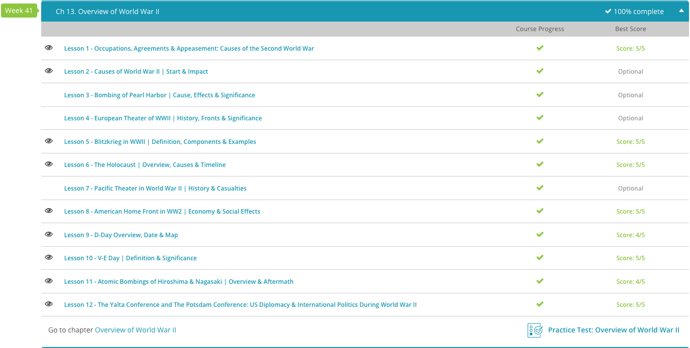

### andrew garber
### april 17 2024
### western civilization 2

#### 13.1. causes of the second world war
 - World War II was totally different. Europe did not accidentally 'stumble' into this war. Instead, it was brought about by the will of one man: Adolf Hitler. Hitler was to blame for World War II. Fueled by fanatical antisemitism and a desire to see the German Reich expand, Hitler started World War II when he sent troops to invade Poland in September 1939. Nothing about this war was accidental. It was a war of aggression, and it led to the deaths of tens of millions of people.
 - After Adolf Hitler came to power in the early 1930s, he embarked upon a plan to restore German 'national honor' according to National Socialist aims. This involved defying the Treaty of Versailles by remilitarization and expanding German territorial claims.
 - In early 1936, the Rhineland was remilitarized, in direct violation of the Treaty of Versailles and the Locarno treaties of 1925. For the most part, Germany's neighbors stood by idly, doing little to punish Hitler's Germany. A few months later, when the Spanish Civil War broke out, Nazi Germany supported fascist, nationalist forces under the leadership of Francisco Franco. This was important because it allowed German weaponry to be tested in battle.
 - Throughout the 1930s, Germany secretly began rearming itself. For example, the Treaty of Versailles forbade Germany from having an air force. To get around this, Germany trained pilots in secret, and under the mantle of the German Air Sport Association. This organization was headed by Hermann Goering, who in a few years would be in charge of Germany's Luftwaffe, or air force. Similarly, Germany also began rebuilding its U-boat fleet in secret.
 - The signing of the anti-Comintern pact with Japan in 1936 was another important step, with Italy joing the pact in 1937. This pact was aimed at containing the spread of communism, and was a precursor to the Tripartite Pact of 1940, which would bring Germany, Italy, and Japan into a formal alliance.
 - In 1939, Germany and the Soviet Union signed the Molotov-Ribbentrop Pact, which was a non-aggression pact. This pact was important because it split Eastern Europe into spheres of influence, with the Soviet Union getting the Baltic states, Bessarabia, parts of Poland, and notably Finland. This pact also allowed Germany to invade Poland without fear of Soviet intervention. Finland is important here because the Germans and Finns had a fairly cordial relationship, and the Finns would later take part in Operation Barbarossa(they called it the Continuation War), to reclaim territory lost to the Soviet Union in the Winter War of 1939-1940.
 - In March 1938, Germany annexed the Republic of Austria in what is called the Anschluss. This German word means 'union,' and usually refers to Austria being absorbed into Nazi Germany. This annexation did not come about overnight; for years Nazi Germany had supported the Austrian National Socialist Party in an attempt to win over the country. The Western powers figured that Austrians were pretty much Germans, and so they did little to stop the Anschluss. This annexation was important because it cemented Hitler as the great leader of a United Germany, making him domestically unassailable.
 - Realizing European neighbors were unwilling to confront him, Hitler proceeded to claim other regions in an attempt to expand the German Reich. Soon after the Anschluss of Austria, Hitler instigated the Sudeten Crisis. The Sudeten Crisis of 1938 stemmed from Hitler's desire to see the Sudetenland area of Czechoslovakia annexed to Germany. Hitler essentially employed the same scheme he did against Austria; he reasoned that because the Sudetenland contained high percentages of ethnic Germans, the region should belong to Germany.
 - The dispute between the Western European powers and Germany over the Sudetenland was finally resolved in the Munich Agreement. This settlement between France, Great Britain, Italy, and Germany, permitted Germany to annex the Sudetenland in exchange for Hitler's guarantee that Germany would make no more territorial demands in Europe. Sadly, representatives from Czechoslovakia were not even invited to the settlement meeting; the Western European democracies basically turned their back on Czechoslovakia. Just months later, with the vast majority of their defenses now in German hands, the Czechs were forced to cede the rest of their country/given an ultimatum to surrender to Germany. This was the end of Czechoslovakia as an independent state until the end of World War II(and even then it was under Soviet domination).
 - Just months later, September 1, 1939, German Jackboots marched into Poland. This was the final straw for the Western powers, who could no longer hold the appeasement line. France and Great Britain declared war on Germany, and World War II had begun. The deadliest conflict in human history had begun.

#### 13.5 Blitzkrieg
 - The title of this lesson is 'Blitzkrieg in WWII', but I am going to just go from what I know here becuase #1: Blitzkrieg was not a term used by the Germans, and #2: the Germans did not use a single strategy in World War II. The Germans focused on a *doctrine* of combined arms maneuver warfare, 'bewegungskrieg', literally just maneuver warfare. It combined armor(tanks, half-tracks), motorized/mechanized infantry, artillery(self-propelled or towed), and air support to rapidly break-through and exploit into the rear of an enemy. 
 - This doctrine depended entirely on the enemy force being "brittle", meaning all of its strength was concentrated in the front lines. The Germans would then use their superior mobility to bypass the front lines and attack the enemy's rear, cutting off their supply lines and encircling them. This was decisive in the first years of the war, but by 1942 the Germans were facing enemies who had learned from their mistakes and were no longer so brittle. Now it was the Germans unable to adapt, but continued trying to implement it--ocassionally with success, notably in Kharkov-Belgorod in 1943(also known as Third Battle of Kharkov)--but more frequently failing, such as Kursk in 1943, Normandy in 1944, and the Ardennes in 1944/45.

#### 13.10 V.E Day 
 - In real life, we are rapidly approaching V.E. Day(current April 17, today in 1945 the Soviets are infiltrating the Seelow Heights, the last major defensive line before Berlin). V.E. Day, or Victory in Europe Day, is the day when the Allies accepted the unconditional surrender of German forces in Europe. Grand Admiral/Reichpräsident Karl Dönitz, who had been appointed Commander-In-Chief of German Armed Forces in the North, dispatched Alfred Jodl, one of Hitler's longest-serving generals, to sign the surrender documents. The surrender was signed in Reims, France in the middle of the night, and on May 8 1945. 
 - Several select reporters were chosen to be present at the signing, including a journalist namedEdward Kennedy of the Associated Press. The military had requested all reporters hold off on breaking the news for an additional day until Stalin could hold his own signing ceremony. Kennedy disagreed with this directive, however. Because this was a story of historic proportions, this delay seemed unnecessary and unacceptable. Delaying the news could continue the fighting (and the dying) unnecessarily, also. Kennedy felt this showed that the delay was clearly political grandstanding and not a military necessity. He chose to release the story to the newspapers after he learned that German radio had already reported the surrender to their own people, but his decision would cost him dearly. He lost his career for it.
 - The Soviets were *very* angry about it. Despite the Soviets being represented during the entire process by General Ivan Susloparov, Stalin felt left out. He also felt the documents should have been signed in Berlin, not in France at the headquarters of the Allied Command. Additionally, he complained that although Susloparov was present, he had not been given the authority to approve or sign the surrender documents at all. Therefore, Stalin declared this a 'preliminary surrender' rather than a total surrender.
 - Prime Minister Winston Churchill learned of the Soviet dissent over the revisions, but he decided to announce the German surrender anyway. Although Stalin insisted on and conducted a second signing ceremony the following day, Churchill and other country leaders decided that it didn't matter. Nazi Germany was defeated.
