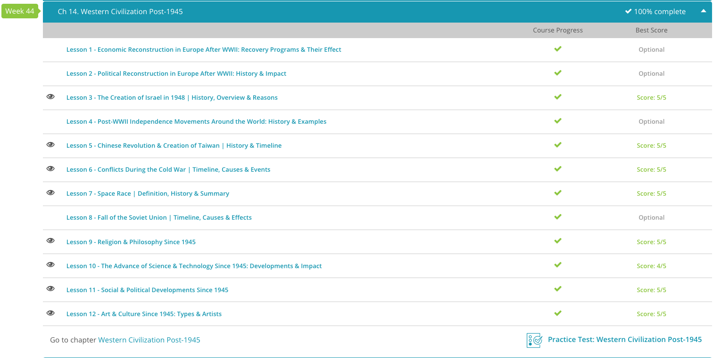

### Andrew Garber
### Western Civilization 2
### Ch 14 Post-1945 World

#### 14.3 Israel: A New Nation(1948)
 - This lesson is certainly a controversial one, though I don't think it should be, but must be taken with some tact considering the events of the past few months(starting with Hamas's attack September 7th. )
 - Though the real political maneuvers which fostered the creation of Israel took place in the 20th century, the movement of Jewish people back to the Holy Land began even earlier. In the mid and late 19th century, antisemitism throughout eastern Europe led to violent attacks against Jewish people. These had occurred sporadically and locally throughout European history, but these attacks were particularly fierce in Russia, where pogroms killed thousands. In reaction to this persecution, many Jews began to believe the only way to ensure their own and their community's safety was to begin organizing in solely Jewish enclaves. Many of these same Jews believed in Zionism: the belief that the Jewish people should return to the Holy Land and establish a Judaism-centered state. By the mid-19th century, this region was largely inhabited by Arabs, many of whom were Muslim. What few Jews who already lived there were largely concentrated in Jerusalem.
 - As the Zionist movement grew, large groups of Jews began migrating to the Holy Land in the 1880s and setting up Jewish agricultural settlements. Only a decade later, Theodor Herzl began publishing a magazine promoting the creation of a Jewish state and held the first Zionist Congress in Switzerland in 1897. Herzl was the man whom many consider the founder of political Zionism.
 - Despite offers of territory in Africa from colonial Great Britain, Zionists wanted control of ancestral territory in the Holy Land. Indeed, another large wave of Jewish immigration to the Holy Land from eastern Europe took place when violence against Jews escalated once again in Russia after the turn of the 20th century. Many of these new settlements were bankrolled entirely by wealthy European and American Jewish families.
 - In the first half of the 20th century, the Zionist movement continued to gain support amongst Jews and non-Jews alike. For example, in 1917, the British government signed the Balfour Declaration, which stated that the British government would do everything in its power to create a Jewish state in the Holy Land. This support was a huge boost for the Zionist cause because Great Britain controlled Palestine after the breakup of the Ottoman Empire following World War I. This endorsement in part led to another huge surge in Jewish migration to the Holy Land in the decade immediately after the war.
 - Meanwhile, antisemitism was growing at an alarming rate in central and southern Europe under fascist regimes, most notably in Germany and Italy. Jews were singled out and often forced to wear clothing which identified them as Jewish, and violence against Jewish businesses and Jews themselves became state-sponsored. During WWII, the vitriolic antisemitism of one man in particular - Adolf Hitler - led to the worst genocide of Jews in modern history. During WWII, Hitler's German forces executed approximately 6 million European Jews.
 - The Holocaust - as the genocide of 6 million Jews has become known - created worldwide sympathy for the Jewish people and the Zionist cause. In 1947, only two years after the end of WWII, the newly formed United Nations passed a resolution calling for the creation of two states - one Arab and one Jewish - out of the British mandate of Palestine. The resolution divided Palestine into two states and left Jerusalem under UN control.
 - While the Jewish population in Palestine and abroad was overjoyed at the creation of a Jewish state in the Holy Land, the existing Arab population of Palestine was outraged. Violence between Jewish settlers and Arabs in Palestine soon escalated in the territory, and both sides armed themselves. It is notable that this broadly parallels the situation in India and Pakistan around the same time, though that led to each side taking to its "corner", and broadly finding peace. That has not happened in this instance.
 - When Britain pulled out the last of its troops in May of 1948, David Ben-Gurion declared the independence of the state of Israel. Palestinian Arabs and the Arab world, in general, saw this establishment as a major encroachment upon Arab sovereignty, and the Arab League nations of Egypt, Transjordan, Syria, Iraq, and Lebanon rushed to Palestinian aid and declared war on the new Israeli state.
 - The Israelis themselves mobilized quickly and combined their many paramilitary groups into the Israeli Defense Forces. Despite initial setbacks from the pan-Arab invasion, Israeli forces slowly took back territory, eventually occupying even territory the UN intended to be part of Palestine. When the armistice between Israel and the Arab states was signed in early 1949, Palestine was left with only the West Bank and the Gaza Strip, and even these were held by Jordanian and Egyptian troops, respectively.
 - There would be more wars between Israel and its Arab neighbors in the future, but the creation of the state of Israel was cemented.

#### 14.5. Chinese Revolution, Taiwan 
 - In the early 20th century, the once mighty Chinese Empire was a shadow of its former self. Large parts of China, especially important ports of trade and other large cities, were effectively owned by western powers, like Great Britain and France, who had carved 'spheres of influence' out of China. The Qing Dynasty ruled in name only, and most of the countryside was effectively controlled by local warlords. In 1911, Chinese nationalists forced the emperor to abdicate and attempted instituting the Republic of China. The Republic faltered when its president, Yu'an Shikai, attempted to declare himself emperor and local warlords all but ignored the central government.
 - In the meantime, the western-educated Sun Yat-Sen was slowly building a nationalist, democratic movement in the south. He founded the Chinese Nationalist Party, the Kuomintang, and set up a Chinese nationalist government in 1919. Sun Yat-Sen wanted to unify all of China into a democratic, socialist republic, and made concessions to the Chinese Communist Party (founded in 1921) in order to attempt to include Chinese of all political persuasions in his new nation.
 - However, after Sun's death in 1925, party leadership fell to nationalist hardliner and leader of the Kuomintang Army, Chiang Kai-Shek. Chiang quickly consolidated his hold over the Kuomintang government and by 1928 was virtual dictator of the area the Kuomintang controlled. Chiang hated communism, and in 1927 he broke off the tacit cooperation between the Kuomintang and the Chinese Communist Party. What followed was a decade of intermittent civil war, where Chiang alternated between fighting local warlords and rooting out communists.
 - The communists were led by Mao Zedong, a devoted communist and librarian from Beijing who had begun establishing Soviet-style communist enclaves in the countryside. Mao gathered a small guerrilla army which attacked Kuomintang supply trains, scout forces, and other secondary targets. More importantly, Mao's communists gained adherents throughout the Chinese countryside.
 - Some fighting between factions, some cooperation between factions against the Japanese was the 1937-1945 story, but post war is when it gets interesting(to this topic).
 - The communist party emerged from WWII far stronger and more popular than it had been prior to the Japanese invasion. Throughout the conflict, the communists had not only fought the Japanese, but actively helped rebuild burnt villages and otherwise aided Chinese civilians - actions which garnered the communists many followers.
 - As the Japanese were pushed further and further out of China, the Kuomintang and Mao's communists began fighting yet again. After Japan's surrender, all out civil war broke out between the factions. Though fighting was fierce, the communists eventually prevailed in 1949, with a major military victory outside the Chinese capital of Nanking. The communists prevailed largely due to their strong support from the Chinese people and their superior military organization - Chiang's Kuomintang Army, in contrast, was rife with corruption. To make matters worse, as the communists scored more and more victories, droves of soldiers from the Kuomintang Army defected to the communist side. On October 1, 1949, Mao Zedong proclaimed the People's Republic of China.
 - After Mao's proclamation, Chiang Kai-Shek and the Kuomintang Army retreated to the island of Taiwan, taking with it the entire government apparatus of the Republic of China, including a parliament containing delegates for all the provinces now part of the People's Republic of China and all of China's gold reserves. One and a half million Chinese followed the nationalist government there. Once established in Taiwan, Chiang declared martial law, suppressed the culture and language of the native Taiwanese, and made plans to retake mainland China, though these plans never came to fruition. Taiwan has since become a prosperous, democratic nation, but the People's Republic of China still considers it a renegade province and has threatened to retake it by force if necessary. I personally believe these threats to be empty, both due to lack of sealift, the risk to the Chinese economy, Taiwan's own military, the threat of US intervention, and most notably the fact that anti-Taiwanese rhetoric is a useful tool for the Chinese Communist Party more than the actual retaking of Taiwan would be. 
 - I also personally believe that letting Taiwan become the 51st state of the United States would be a good idea, but that's just me.

#### 14.6. Cold War Conflicts 
 - One of the main reasons the United States felt the need to fight communist uprisings in several smaller, strategically unimportant nations was the domino theory. The domino theory was propagated after WWII ended, largely as a result of a communist uprising in French-controlled Vietnam. Policy analysts in Washington worried that a successful communist revolt in Vietnam would encourage the communist factions of other Southeast Asian nations to similarly rise, causing the other precarious monarchical, capitalist states of Southeast Asia to fall to communism one after another, like dominoes. This theory has largely become a laughingstock, but I don't think it was entirely without merit. I do think much of foreign policy is precedent-based, and that the US had to show that it would not allow the spread of communism to continue unchecked.
 - Furthermore, the Soviet Union called for all communist, Soviet, and Warsaw Pact states to aid one another in maintaining and spreading communism throughout the world. This policy has become known as the Brezhnev Doctrine, named for the Russian premier Leonid Brezhnev, who led the Soviet Communist Party from 1964 to 1982. According to Brezhnev, each communist country was not only responsible for spreading the movement, but also for ensuring that other communist countries did not stray far from the course. Perhaps the most violent example of this policy was the violent crackdown on moderation in Czechoslovakia in 1968.
 - As a result of these two proactive policies from opposing nations, conflicts throughout the world in the second half of the 20th century largely became proxy wars between the United States and the Soviet Union as both nations picked sides. The first of these conflicts - the Korean War - occurred only a few years after the end of WWII. The Korean War was instigated by North Korea when it invaded its democratic neighbors, South Korea, in June 1950. Before the end of the summer, the United States had sent troops to aid the South Koreans, viewing the war as an ideological fight against communism.
 - The Korean War went back and forth, with the North Koreans and Chinese communists see-sawing against the United Nations forces. The war ended with a ceasefire, but no peace treaty was ever signed. The Korean Peninsula remains divided to this day, with North Korea and South Korea still technically at war.
 - Less than a decade after the armistice in Korea, World War III was on everyone's mind yet again, when the Soviet Union sent a large shipment to the newly communist Caribbean nation of Cuba in 1962. The shipment consisted of missiles and mobile launch vehicles capable of carrying nuclear warheads. The United States, who had secretly funded a disastrous failed coup against Fidel Castro's communist government the year before, threatened invasion of Cuba when it learned of the Soviet missiles. After a tension-filled two weeks when many Americans felt the world was on the brink of nuclear holocaust, the Soviets agreed to remove the missiles from Cuba in return for the United States removing their own missiles from Turkey.
 - Only a few years later, the United States would get involved in the long struggle between the communist north and French-backed south in Vietnam. In the early 1960s, as fighting between communist factions in the south and the South Vietnamese government escalated, the United States stepped up its aid, hoping to stem the spread of communism in Southeast Asia. When two U.S. warships in the Gulf of Tonkin were torpedoed in August 1964, the United States began bombing targets in North Vietnam and in the summer of 1965, began sending combat troops to the region. Meanwhile, the communist North Vietnamese were largely funded and supplied by the Soviet Union, as the communist Viet Cong were supplied with Soviet-made AK-47s and American pilots often encountered Soviet-made MiG fighter jets.
 - The war was fought in a brutal, guerrilla style, with the North Vietnamese and Viet Cong using tunnels, booby traps, and other unconventional tactics to fight the better-equipped Americans. The United States, in turn, used massive bombing campaigns, defoliants like Agent Orange, and other tactics to try and root out the North Vietnamese. In turn, the per-American-Soldier training/effectiveness decreased as the war went on due to conscription and a lack of belief in the war. The war was deeply unpopular in the United States, and in 1973, the United States withdrew its troops from Vietnam. Two years later, the North Vietnamese captured Saigon, the capital of South Vietnam, and the country was united under the Communnist government of North Vietnam. Over the last couple of decades though, the Communist rule of Vietnam has been maintained politically though economically it is a thoroughly capitalist nation.
 - Yet another Cold War proxy battle occurred in Afghanistan later in the 1970s. In 1978, a small, Soviet-backed communist party overthrew the current government and installed a highly-detested communist government. When the people of Afghanistan rose up in opposition, the Soviet Union invaded the country in 1979 to support the fledgling communist state. The Soviets quickly took control of most of the country, though a strong resistance force, the mujahideen, continued to fight a guerrilla war against the Soviets in the countryside. Hoping to create problems for their Cold War adversary, the United States began secretly funding and training the mujahideen and helped the Afghans eliminate Russian air power through shipping handheld antiaircraft missiles to the guerrillas. These same guerrillas, and their descendants, would later fight against the United States in the early 21st century.

#### 14.7. The Space Race 
 - The event which is considered the starting point of the space race was the Soviet launch of the satellite Sputnik in October of 1957. Sputnik was a small metallic satellite about the size of a beach ball, which orbited the Earth, sent radio signals back to Russia, and could be seen with the naked eye. This terrified the American public; there was now an enemy craft directly overhead! Only a month later the Soviets launched a second craft into orbit, this one carrying a dog, Laika.
 - The successful launches surprised the American government as well. They responded with a flurry of action, as President Eisenhower created the National Aeronautics and Space Administration (NASA) the following year, and in January of 1958 hurried to launch their own satellite, Explorer I. Despite this, the Soviets were the first to reach the next major benchmark: putting a human into orbit safely. In April of 1961, Yuri Gagarin became the first human to orbit the Earth in outer space and return safely, orbiting the Earth in 108 minutes aboard the capsule Vostok I. A month later, the first American, Alan Shepard reached outer space. It took another year for the Americans to launch their first astronaut into orbit. That man was John Glenn. 
 - The Americans were losing the space race at every turn. This is partially what made President Kennedy's remarks in May of 1961 so surprising. In Congress, Kennedy announced the ambitious plan that the United States would put a man on the moon before the end of the decade and do it before the Soviet Union did. Within a few short years both the United States and the Soviet Union had begun programs specifically designed to deal with the problems of deep space flight and lunar landing and takeoff.
 - Both programs, the American Apollo program and the Soviet Soyuz program, became the chief goals of their respective aeronautics agencies. Both suffered tragedy and setbacks. For instance, in January of 1967, three American astronauts died in a fire during a launch simulation. Apollo 1 was a tragedy, but it also led to a complete redesign of the Apollo spacecraft(notably not using *PURE OXYGEN* in the cabin).  Despite these obstacles, the Americans struck first in the race to the moon, when Apollo 8 successfully orbited the moon in December of 1968. The most important prize came the following year, when Apollo 11 successfully landed and returned from the moon, with Neil Armstrong becoming the first man to walk on the moon, famously stating, 'That's one small step for man, one giant leap for mankind.'. The Soviet Union never landed cosmonauts on the moon, though their N1 Rocket(though never successful) was the largest rocket ever built UNTIL starship from SpaceX.
 - Sadly with the end of the Space Race, the progress of humanity slowed significantly. We are only now regaining our footing, and that is due to private companies--go capitalism!--and not government programs(NASA funding private companies to go do stuff is way better than them trying to do it themselves).

#### 14.10 Technological Advances since 1945
 - Communications and the dissemination of information is so ubiquitous now that we hardly even realize the constant flow of information hitting us. Prior to WWII, the main form of household communications devices most people had in their homes was the radio. Televisions existed, but they were generally very expensive and the programming options were very few. The television exploded in popularity in the 1950s, allowing people to watch important events as they happened in real time.
 - For example, many Americans watched Neil Armstrong's landing on the moon in 1969 from the comfort of their own couch. Likewise, the televised 1953 coronation of Queen Elizabeth II allowed many British residents to see the pomp and circumstance surrounding a royal coronation for the first time.
 - As the decades wore on, television technology became better and better as color televisions largely replaced the original black-and-white sets in the 1970s. Accessories such as video cassette recorders (VCRs) proliferated as screens got larger and the definitions became crisper. In the 1990s, high definition (HD) televisions hit the market which produced a markedly more crisp and vibrant picture than before, though it took approximately a decade before HD televisions became household items in the United States.
 - Telephones also experienced a similarly accelerated increase in use and technological development after WWII. From its invention by Alexander Graham Bell in the late 19th century, the telephone grew increasingly popular and largely replaced the telegraph by WWII, with approximately 30 million phones in service by 1948. After WWII, telephone use continued to expand quickly and by the 1970s over 100 million phones were in use.
 - The next major advancement in telephone communication came in the 1990s with the proliferation of the cellular phone. Though portable and in-vehicle phones had been experimented with since the 1940s, the first true cellular phones (that is, one that pedestrians could carry with them) did not arrive until the 1980s, and even then they were relatively large, clunky objects and were too expensive for the average person. This changed in the 2000's as cell phones got smaller, faster, and cheaper.
 - The world of transportation has seen similar improvements in technology since WWII, though not nearly the same level of innovation. Indeed, our main modes of transportation - automobile, airplane, train, or ship - are still the same, though they have all undergone serious transformations to improve safety and efficiency.
 - The world of automobiles, for example, remained largely unchanged for the first century of its existence, but in the past quarter century, environmental awareness and the high price of oil and gasoline has spurred research and development in cars fueled by alternative sources of fuel. All major auto companies now either have an electric car being developed or on the road, and all have successful gas/electric hybrid models, such as the Toyota Prius or the Ford Fusion Hybrid.
 - Air travel has made more significant advances since WWII with the advent of the jet engine in the 1950s. Prior to the jet engine, all planes were prop-engines, which used large propellers to generate the speed and air flow over the wings necessary for flight. The jet engine provided enormous amounts of thrust, which made the propeller obsolete, though it should be noted many prop planes are still in service today.
 - While all of these innovations are certainly important, arguably the most significant innovation of the 20th century has come in computing. The advances in computing are all the more impressive when you consider that prior to WWII automated computing devices were virtually nonexistent! Indeed, when the first computers were created in the 1940s and 1950s, they were routinely as large as entire rooms and could only complete very simple tasks like basic arithmetic.
 - Once computer scientists got going though, innovation came quickly. In 1953, IBM unveiled the first commercially available computer, the IBM 701. In 1964, Douglas Engelbart created the mouse to help ease onscreen manipulation, and in 1971 the first microprocessor was invented. The invention of the increasingly powerful microprocessors allowed for more and more information to be stored on smaller and smaller amounts of space, making computers smaller and faster. By the 1980s, both Apple and their rival Microsoft had created the first in-home computers with a graphic user interface meant for the lay-user.
 - As public use of computers grew and corresponding microprocessors got smaller and more powerful, computer companies began innovating portable computers that users could take on the go, the laptop. Though laptop computers were first created in the 1980s, they became less expensive and increasingly used in businesses and in the home in the 1990s. Corresponding devices - the Personal Digital Assistant, or PDA - were created utilizing computer and microprocessor technology that allowed people to keep entire schedules, address books, and other information on a device that could fit in their pocket.
 - The transistor has become one of the symbols of the modern world, but we need to accelerate progress in more than just digital technology. We need to accelerate progress in energy, in transportation, in medicine, in space exploration, in everything. We need to accelerate progress in everything, and we need to do it immediately and continuously to ensure the growth and flourishing of humanity.

#### 14.11 Social and Political Advances 
 - After WWII, and especially in the 1960s and 1970s, university and college students across the Western world began exercising what power they could to protest the injustices of the world. One of the largest and most vociferous of American student movements was in opposition to U.S. involvement in the Vietnam War. Students across the country disliked the U.S. motives for going to war - that is, stopping the spread of communism.
 - Furthermore, they felt it was unfair so many men of their own age would be fighting and dying in a war which had little to do with American safety. Student anti-war activism took on an angrier, anti-establishment tone in the 1970s after the Kent State Massacre of May 4th, 1970, when a detachment of the Ohio National Guard fired on student protestors, killing four and wounding nine others.
 - February 1960 is often seen as the beginning of the student civil rights movement, when several black students staged the first 'sit-in' at a Greensboro, North Carolina, Woolworth's by sitting at the white-only lunch counter and refusing to leave until they had been served. The event and the publicity it received touched off numerous sit-ins across the South, and student-based civil rights organizations, such as the famous Student Non-Violent Coordinating Committee, or SNCC, proliferated across the country. Students often played key roles in many of the famous civil rights marches of the 1960s, such as the famous Selma to Montgomery march to end intimidation of black voters in 1965, where several protestors lost their lives after being beaten by white police and vigilantes.
 - Another area which required a grassroots movement to encourage change was the role of women in society. Indeed, although women had attained legal equality in the first half of the 20th century in many Western countries, in most they were still socially disadvantaged, especially in the workplace. In conjunction with the civil rights movement of the 1960s, women's equal status in society began to be legislated into existence, and other advances further gave women greater control over their own lives and their own bodies.
 - One of these occurred in 1960 when the first daily, oral contraceptive hit the market, known colloquially as 'the pill.' The pill gave women total control over their own fertility, allowing them to plan their lives accordingly. Women pursuing an exciting career or degree no longer had to postpone their lives to have children; now they could decide when having children was most appropriate for them while still enjoying their sexual freedom.
 - This advance has been checked to some degree by the 2022 Dobbs v Jackson case, which overturned Roe v. Wade and allowed states to restrict abortion as they see fit. That government has any say over this at all is a travesty, and I hope that a new consensus of "get government out of our lives" can be reached soon(though I doubt it will be).

#### 14.12 Culture 
 - Perhaps the post-war medium which we are most familiar with today is the television. Believe it or not, even though nearly every household has at least one television today, prior to World War II (WWII) televisions were a novelty and the programming options were few and far between. After WWII, the television exploded in popularity and new networks gained traction on the airwaves. Viewers could now see live events from the comfort of their own homes.
 - Remember, they previously would have had to listen to them described on the radio. Many of Western culture's most popular radio shows were converted and filmed for television, including one of the most successful programs of all time, The Lone Ranger. By the end of the WWII, several of the major networks, namely NBC and CBS, were setting up affiliate broadcasting stations in major metropolitan areas like New York and Washington D.C.
 - Cable television, which today brings subscribers thousands of different programs on hundreds of different channels, was first pioneered in Pennsylvania in the late 1940s. Innovations, such as devices which boosted the signal over long-distance cable lines, allowed cable to spread quickly in the 1950s, and by 1962, nearly 800 cable systems across the United States were bringing cable television to approximately 850,000 homes. Cable is now effectively dead, as streaming services have taken over the market, but it was a major innovation in its time(and still exists mostly for News, Sports, and *Jeopardy*).
 - Popular music is likely as old as human civilization itself, but only in the post-WWII West was the spread of single tracks or entire albums of music possible due to the vinyl record. First pioneered in the 1930s, the vinyl record exploded in popularity in the 1950s. Prior to the vinyl record, live shows or expensive and poor-quality gramophone records were the only way to experience music. With the advent of the record, bands, orchestras, and individual singers could record their best versions of their most popular songs in a studio and record it on a record to be reproduced and sold to the mass market.
 - This allowed music to be enjoyed in the home as well as in the music hall, and a corresponding proliferation of music styles, bands, and genres occurred alongside the growth in the record's popularity. Rock music arguably began with popular bands and singers, like Elvis, Buddy Holly, and The Beatles, who utilized new instruments like the electric guitar and broke many of the conventions of pre-war popular music, which before WWII had largely been focused on big band, orchestral arrangements.
 - With wider access to music available, rock, along with a multitude of sub-genres and competing genres, flourished in the second half of the 20th century. From the disco of the 1970s to the burgeoning hip-hop genre of the late 1980s and early 1990s, it's unlikely many of these types of music would have gained the nationwide popularity they had without the dissemination of music through the record or its descendant, the compact disc, or CD. 
 - Enter Sean Parker and Napster, but that is a discussion for another time.
 - In art, the changes of the second half of the 20th century were less about medium and more about style. The tumultuous first half of the century, with two major wars which killed tens of millions worldwide, had a major impact upon the art created after the conclusion of WWII. Immediately after WWII, some artists felt conventional images and painting could not correctly convey the true meaning and feeling behind their art.
 - These artists, such as Jackson Pollock and Mark Rothko, moved toward a form of art many call abstract expressionism. Abstract artists during and after WWII tended to avoid painting definite things, instead preferring to purposely paint colors and shapes and other things often intended to invoke certain emotions in the viewer, while still allowing the viewer to shape his or her own meaning of the painting. Rothko famously stated once (in not so many words) that he did not like to paint words on his canvasses, as he felt it would inhibit the imagination of the viewer to see what he wanted to see.
 - The other major innovation in art technique in the post-war West was Pop Art. Many pop artists felt that the art of the abstract expressionists and the cubists (from before WWII) was too highfalutin or pretentious and sought to bring the art world back to a more realist perspective. These artists preferred to paint scenes from everyday life, often providing commentary on Western society through subtleties within the painting itself, such as characters' expressions.
 - Perhaps the most popular and well-known pop artist of the second half of the 20th century was Andy Warhol, a New York-based artist who painted scenes of Americana at a prolific rate. His depictions of life in America can still often be found or referenced in magazines, books, and even in calendars.

