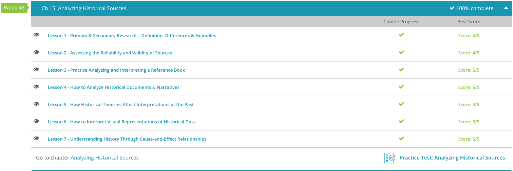

### Andrew Garber
### CLEP Western Civilization II
### Chapter 15: Analyzing History

#### 15.2. Assessing the Relibility and Validity
 - **Reliability** is the extent to which a source can be trusted to provide accurate information.
 - **Validity** is the extent to which a source can be trusted to provide information that is true.
 - Let's first understand the two basic elements of reliability. First is the primary source, which is the original results of the experiment, such as eyewitness accounts, legal documents and the results of an experiment. The secondary source is when someone writes about a primary source, such as comments, discussions or observations. These secondary sources can be found in magazines, journals, online articles or even academic journals. There are some key areas that must be examined in order to judge the reliability of a source.
 - Validity is largely determined by contextual factors such as if it is in a peer-reviewed scholarly journal, how many(and how reputable) the citations are, 

#### 15.3. Refrence Book
  - A reference book is a book consulted for specific matters. It contains useful or specially organized information. Examples include an encyclopedia, a dictionary, an almanac, and an atlas.
 - Material in a reference book is typically organized in alphabetical order so that topics can be located quickly. An index is usually provided to serve as a guide to the thousands of topics found in that book, or to locate the smaller subtopics of the larger subjects.
 - Reference books also have a cross reference to help readers out. A cross reference guides the readers from the subject entry that is not used to one that is or to where related information is located. In an index for an encyclopedia, it often says 'See also…' For example, in the index of a book about Nobel Laureates it might say, 'See also Mandela, Nelson'. Or within the text, it might say 'Allies: See Allied Powers'.
 - An encyclopedia can provide a general overview on a subject, or you can consult a more specific type of encyclopedia that has more detailed information on one specific topic. A more general encyclopedia would be the World Book Encyclopedia of People and Places, while the Encyclopedia of American Crime or the Astronomy Encyclopedia would be more specific examples.
 - A dictionary is a reference book that provides the definition of words and what part of speech they are through an abbreviation such as 'n.' for 'noun' or 'adj.' for 'adjective'. It also typically gives the origin of words and the way they are pronounced by using phonics.
 - An almanac is an annual reference book of useful and interesting facts and statistics that relate to countries, sports, entertainment, etc. There are a variety of almanacs, such as the World Almanac, the Almanac of American Politics, and the Weather Almanac.
 - An atlas is a geographical reference book of maps. It can contain different types of maps, such as those that show population, climate, and transportation routes. A couple of examples include The Times Atlas of the World and the World Atlas of the Oceans.

#### 15.4. How to Analyze Historical Documents & Narratives
 - It is important for historians to analyze historical documents and narratives in order to understand the past: critically, the authenticity of the document, the author's perspective, and the context in which the document was written.
 - Information has to be relevant to a historian as well. If you're writing about the Norman Invasion of England in 1066, chances are that you don't need a source on the Battle of Britain in 1940. Sure, it could be real interesting, but it would be a waste of your time to read about it.
 - Authority, or the overall trustworthiness of a source, is important for historians as well. When an important historian says something is true, chances are that it is. After all, these people have years of experience examining the past. However, sometimes the writings of non-historians can be more valuable than those of historians. For example,
 - Having a new perspective is always useful as a historian. For decades, generations of American schoolchildren were taught that slaves were happy working as forced laborers on plantations. However, with new perspectives from the writings of former slaves, we see that is anything but the case. As a result of being willing to accept a new perspective, a whole field of history was shaken and ultimately made much more accurate.

#### 15.6. How to Interpret Visual Representations of Historical Data
 - For most historians, the most often used type of visual aid is a simple map. Maps help track the development of empires, the progress of diseases, and even the spread of new technologies. Also, they really help do exactly what visual aids are supposed to do in history - condense complicated information to as few words as possible, so as to reduce the chance of misunderstandings from occurring. Think about it like this. I could describe, in a very lengthy block of text, how the Black Death progressed across Europe, starting in the Southeast and then traveling by trade until it was everywhere. Or I could just show you this map, which through the different shades shows exactly how the progression took place. Combine the map with a bit of explanation about how Italian cities were major trading posts with those cities in the Middle East that were first affected, and suddenly the whole subject of the Plague's spread makes much more sense. Of course, an animated map would be impossible in a book, so historians often show progression through different shades of the same color.
 - 
 - Sometimes the knowledge needed to examine a particular historical question is independent of geography. After all, the location of New York City is firmly established; thus, a study of its population growth over time would not benefit from a map as much as it would from a graph or a chart. Just like in math class, graphs and charts can show how quantities differ between groups, as well as how quantities change over time. In that first confusing chart from Florence Nightingale, reproduced below, each slice of the pie is a month and the colors represent the types of casualties suffered. The bluish-gray represents the number of people who died from disease, which Nightingale's nursing techniques would eventually shrink. In the chart on the left, there is less blue than there is on the right. This is because nursing became much more common in the war.
 - 
 - Maps are useful in displaying changes in geography, while charts and graphs are useful in showing changes in quantities. But what about attitudes? After all, this could very well be where a picture is worth a thousand history textbooks. Luckily, for many years people have been leaving historians a variety of material from which to ascertain their attitudes. The most common of these are political cartoons. They make their points quickly, encapsulating the attitude of not only the cartoonist, but also much of society at the same time. Also, as recent tragedies have shown, the power of the political cartoonist to shape history is very real. As we can tell from this cartoon, one of the oldest in existence, there was real concern that the English and the French were carving up the globe in the late 18th century. 
 - 

#### 15.7 Cause-And-Effect Relationships 
 - Cause and effect is when something happens because of something else. Cause and effect are vital to historians and are the central explanations for the past. Sometimes, you can clearly see what was the cause and what was the effect. Coco Chanel came back with a suntan, and because of her celebrity status, suddenly being pale was out of fashion and having a tan socially desirable. Other times, the question can be harder to trace. What would have happened had the Allied landings been almost solely by paratroopers until a major port could have been secured(had the Luftwaffe launched a maximum effort to deny aerial resupply)? Would the Germans have been able to hold out longer? Would the war have been longer? Would the Soviets have been able to take more of Europe? These are all questions that historians have to ask themselves when they are trying to determine the cause and effect of a particular event.
 - It's all interconnected. For historians, this means that they can test out their theories by constructing ''what if'' scenarios, in which one input is changed and historians follow a path to any logical conclusions.
 - Based on a priori forward reasoning, and a posteriori knowledge of what actually happened, historians can theorize potential causes-and-effects of specific actions had they happened differently.
 - 
