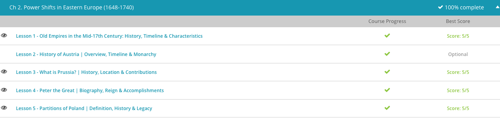

### Andrew Garber
### Februray 7 2024
### CLEP Western Civilization II
### Chapter 2: Power Shifts in Eastern Europe

#### 2.1. The Old Empires in the 17th Century
 - The fluidity of the 17th century proved an opportune launching pad for some empires and a death knell for others. In that transitional century, older powers, like Poland and the Ottoman Empire, began to lose power and influence, while other newer states, like Austria and Brandenburg-Prussia, emerged as international players.
 - The Holy Roman Empire in the 17th century is a hard state to define. Technically speaking, the Emperor controlled vast territory in Central Europe, which contained most of modern-day Germany, Austria, the Czech Republic, and even as far south as Northern Italy. In practice, however, the Emperor of the Holy Roman Empire - who throughout the entire 17th century came from the Hapsburg family who ruled Austria - had only nominal control over many of these territories.
 - In the 1620s, Emperor Ferdinand II attempted to rectify this reality by exerting greater control over religious institutions and eliminating the partial political sovereignty of many of the states that made up the Holy Roman Empire during the Thirty Years' War. Unfortunately, this effort failed, and when the war ended in 1648 with the Peace of Westphalia, imperial power was left even weaker than prior to the war.
 - The Holy Roman Empire perhaps outpaces the Byzantine Empire, its competitor for the title of "Roman Empire successor" in terms of sheer bureaucratic complexity. The Holy Roman Empire was a patchwork of hundreds of states, each with its own ruler, laws, and customs. There were internal customs barriers between all of them, and the Emperor had to be elected by a council of princes, who were often more interested in their own power than in the well-being of the Empire as a whole. This was not a state in which mass industry and modern governance could thrive, and it was being rapidly subsumed by its interior states and by the Hapsburgs' other territories. 
 - As the power of the imperial throne waned, the most powerful of these states became important international players. One of these was the Hapsburg family, traditionally based in modern-day Austria. Throughout the 17th century, The Hapsburgs held the added power of holding the throne of the Holy Roman Emperor, symbolically adding to their regional clout, even if the position's tangible power was declining. Although the Hapsburgs had failed in their attempts to exert their influence over the entirety of the German lands, at home, in Austria, they had consolidated most state power in the monarchy and expanded their territory into Silesia, Bohemia, Moravia, and even into portions of Hungary (termed Royal Hungary).
 - Silesia is important here, as it was a region that was not only rich in natural resources, but also a key strategic location. It was a major producer of iron and coal, and would soon become a battleground between the Hapsburgs and their seemingly weaker rivals/neighbors/sometimes allies, the Brandenburg-Prussians, otherwise known as the Hohenzollerns. The Hohenzollerns were not a particularly powerful family until the late 16th century, when they were granted the title of "Elector" by the Holy Roman Emperor. This title allowed them to vote for the Emperor, and it also gave them a degree of autonomy from the Emperor's control. This autonomy allowed the Hohenzollerns to consolidate their power in the region of Brandenburg, and to expand their territory into Ducal Prussia, a region that was not part of the Holy Roman Empire. This allowed a meteoric rise in power and influence, and pretty soon were a major player in the region due to a highly centralized government and a strong military(not great for the people, but the Prussian state wasn't concerned with that - all were cogs in the machine. As Voltaire said, "Where some states have an army, the Prussian army has a state").
 - One of the states the expanding Prussian Empire would butt up against in the following century was the expansive Polish-Lithuanian commonwealth. Its borders stretched as far north as modern-day Estonia and south into modern-day Ukraine, nearly to the Black Sea; the largest country by land area in Europe at 1600. This expansive commonwealth was unique in the period; when many monarchs in Europe were centralizing power at the expense of regional magnates, Poland exhibited a robust legislative body composed of the members of the nobility, the Sejm, whose legal proceedings had a huge impact on the realm. Furthermore, the Sejm was largely independent of the monarch, and anything the Polish King wanted to accomplish in the way of taxation, foreign policy - even the king's own marriage - required the Sejm's consent. This system made it incredibly conservative by nature and unwilling(or unable) to adapt to the changing times.
 - The final empire in decline here was the Ottoman Empire, which in the 17th century was an enormous and loosely-controlled state, stretching outward from its traditional base in Constantinople (modern Istanbul) as far south as Egypt and west into Persia, and northward into Europe through the Balkans until it butted up against Austrian, Polish, and Russian possessions in Eastern Europe. The state was loosely ruled from Istanbul, with local leaders in the Balkans being allowed to rule their possessions unencumbered from central authority, so long as they pledged fealty to the Ottoman Empire and promised military aid in any wars.
 - This poor central leadership was made starkly apparent in the early 17th century when the Ottoman Empire had a series of rulers who were either sickly, young, mad, or otherwise incompetent. Ottoman expansion into Europe was checked at this point, losing an important war against the Poles in the 1620s, and the Ottoman navy was thoroughly routed by the Venetians in 1656.

#### 2.3. Prussia(Preußen)
 - [Wrote About This Already](writing/fredrickwilliam.md)

#### 2.4. Peter the Great
 - Born the 14th child of the Czar Aleksey I in 1672, Peter's path to greatness wasn't obvious right away. After his father's death in 1682, Peter had to share power because he had been named joint-czar with his older half-brother, Ivan. Ivan was clearly favored by the Moscow elite and as a result, Ivan's even older full sister was named regent of the throne. As such, Peter, although still just a boy, was ostracized at court. As a result, Peter was forced to live outside Moscow with his mother in partial political exile.
 - Czar was the derivative of the Roman "Caesar", which would later be modified to "Kaiser" in German and "Tsar" in Russian. The title was a symbol of the Russian ruler's claim to be the successor of the Roman Empire, even though that was more religious than anything else.
 - Peter's exile would actually become a blessing in disguise. He was allowed to learn and mature outside the stifling political atmosphere of Russian court life. He gained passions for sailing, military games, and math. Later, Ivan's sister was displaced from the regency, causing Peter to gain considerable power at the Russian court. When Ivan died in 1696, Peter ascended to the throne as Czar Peter I. 
 - With his place on the throne secured, the young Czar Peter set off on a grand European tour. Although one of his main justifications for his tour was garnering allies for Russia in its fight against the Ottoman Turks on its Southwestern border, Peter did far more than play diplomatic games. He even traveled in disguise sometimes, visiting schools, factories, museums, and shipyards, learning about European practices.
 - Many of these European practices Peter planned to implement upon his return to Russia. Perhaps most important of these was Peter's fascination - likely stemming from his boyhood love for sailing - with the grand European war fleets of Great Britain, France, and others. Many historians contend that it was on this tour that Peter resolved to build a Russian fleet - nonexistent at the time - and wage war against the Swedes who had shut the Russians off from the Baltic Sea in the previous century. He was serious about this ambition; later in his reign Peter sent 50 boys of noble birth to Italy, Great Britain, and Holland to study shipbuilding and master European naval techniques. While the Russian navy never became a match for the British or French, it was a force to be reckoned with in the Baltic Sea and spurred counterbalancing naval buildups by neighboring powers.
 - Peter returned to Russia and, with the importance of a port with easy access to Europe in mind, began building a navy. To gain his port, Peter waged a 21-year war against the Swedish Empire, and gained his Baltic port by 1721. In celebration, he declared Russia an empire, and himself the first Russian Emperor. This win wasn't easy though, and to win it Peter had to make major changes to the traditional structure of the Russian military. Most notably, making the army a meritocracy(in name, at least) and not something won through noble birth(in practice, it was still largely the nobility who made up the officer corps).
 - The port Peter won on the Baltic was not simply meant to provide a naval base. Peter also hoped to improve Russian trade relations with the mercantilist powerhouses of Western Europe. Mercantilism was an Early Modern European economic policy where trade deficits were abhorred and gold bullion was horded, something Peter admired. In keeping with the principles of mercantilism, Peter encouraged industrial production throughout Russia. He even invited foreign experts to Russia to direct industrial development, in order to create goods for the European market.
 - 

#### 2.5. Poland gets partitioned
 - Internal politics in Poland in the 18th ecentury were MESSY. The Sejm, the Polish legislative body, was a mess of corruption and inefficiency. The Polish nobility, who made up the Sejm, were more interested in their own power than in the well-being of the state. The whole system was so corrupt that the Polish King could be elected by foreign powers, as evidenced by the fact that France paid Frederich the great Elector of Prussia to vote for a French candidate for the Polish throne. This was a major reason why Poland was so weak in the 18th century.
 - The former lover of Catherine the Great, Stanislaw August Poniatowski, was "elected" King of the Poland-Lithuanian Commonwealth in 1764. Catherine hoped Poniatowski would remain loyal to her and to Russia, essentially creating a puppet buffer state in Poland between Russia and the growing state of Brandenburg-Prussia. Surprising everyone, however, Poniatowski did not immediately kowtow to Catherine's interests and set about strengthening Poland's government, even securing a brief suspension of the individual member veto for three years in the 1760s. The prospect of a stronger Poland served no one's interests in the region, least of all Russia. In the late 1760s, Catherine fomented religious rebellion in Poland's Eastern territory.
 - Additionally, Russia had scored major victories against the Ottoman Turks(shoutout to Potemkin),  in the Northern Balkans. With Ottoman power in the area waning, Austria feared sharing a border with an increasingly strong Russia. Furthermore, maintaining that balance of power was important to Prussia's expansionary interests in Central Europe.
 - With three powers all wanting to see a weakened Poland, Frederick the Great saw his opportunity: he would propose a partition of Poland between Austria, Russia, and Prussia. This placated Russian expansion with adjacent territory not directly threatening either Austria or Prussia. In addition, Austria and Prussia would gain important buffer territory as well, and Prussia would finally achieve its long-held goal of uniting its traditional province of Prussia with its larger territory in Brandenburg and Pomerania. Almost a third of Poland's territory was just taken by its neighbors, and the Polish state was left a shell of its former self.
 - The huge loss spiraled Poland into demanding significant reforms, a good move that eventually lead to a new liberal constitution in 1791, but it never really got the chance to implement it. The Polish nobles who stood to lose the most from the new constitution aligned with Catherine, forming the Confederation of Targowica and inviting Russian(and Prussian) intervention. Another partition was done in 1793, and the final partition was done in 1795, effectively ending the Polish state for over a century.
 
 