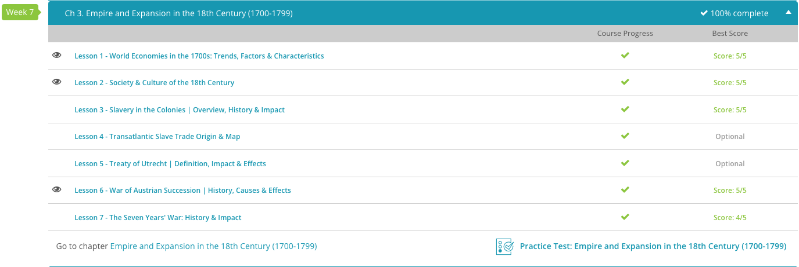

### Andrew Garber
### February 21 2024
### Chapter 3: Empire and Expansion in the 18th Century

#### 3.1. World Economies in the 1700s
 - The 18th century was a time of great economic change. The beginnings of the industrial revolution in England, the rise of the global British Empire, and ever increasing agricultural productivity all contributed to a period of great economic growth.
 - The Watt steam engine was a key invention that helped to drive the start of the industrial revolution, invented in 1769 by James Watt(though he is not the sole credit here), it drove an increase in power to human labor ratio that allowed for far larger, more advanced machine tools to be built.
 - Another big addition to the growth of the European economy was the introduction of the potato to Europe. This sounds ridiculous, but the potato was a hardy, easy to grow crop with fairly high calorie to acreage ratios, combined with better fertilizer usage and better drainage technology, a smaller percentage of the population could work in agriculture, freeing up labor for other industries. Specialization at is finest.
 - These had significant political implications, as the trade center of Europe moved from the Mediterranean in Genoa/Venice to the Atlantic in Amsterdam and London. This shift in trade centers also shifted the balance of power in Europe, as the Atlantic powers were able to exert more influence over the rest of Europe.

#### 3.2. Society & Culture in the 18th Century
 - The makeup of society was changing in the 18th century, but there was still opposition from the rigidly hierarchical established powers of the day. Indeed, despite some changes, at 1800, the nobility and traditional landed aristocracy still held the political power in most of Western Europe. In addition to largely being the sole holders of political power, the nobility of the 18th century held the vast majority of the region's wealth. Most of this wealth (and indeed, most of its attendant prestige) derived from the ownership of land.
 - European nobility, and aristocracy in general, did not have to do any work for their wealth. They either owned slaves/serfs, or they owned land that was rented out to tenant farmers. Either way, they could spend lives of leisure while the lower classes wasted their human potential working away in the fields. This was a system that was not only unjust, but also massively inefficient. The reason that the British economy was able to grow so much faster than the rest of Europe was that it was the first to break away from an agricultural economy. This wasn't something done by the nobility, but instead by the middle class, who were able to use their wealth to invest in new technologies and industries. In doing so, they uplifted the lower classes, who were able to work in these new industries and earn a better living than they ever could have as tenant farmers. Despite factory work being dangerous and low paying, it was *dramatically* better than subsistence farming.
 - Wealth transfer reached unprecedented levels in the 18th century as true social mobility was finally possible. The largest societal hold-out from the pre-industrial era was the status of women, who were still largely confined to the home and child-rearing. This was not a universal truth, especially in America once factories started popping up there, but on the whole women still had very limited opportunities for advancement. While opportunities were growing dramatically across the board, the 18th century was still a time of great inequality of opportunity(*NOT OUTCOME*, because equality of outcome is not a thing that can exist in a free society).
 -  Considering this makeup of 18th-century society, it should come as little surprise that only the aristocracy and some of the wealthier merchants had the time and resources to participate in popular culture. Indeed, a key indicator of prestige and wealth in aristocratic circles was the patronage of intellectuals, musicians, and artists. In England, for example, it was absolutely necessary for a noble family to have an Oxford academic on staff to tutor their children and bring prestige to the family through his writing and research.
 - Additionally, the nobility were expected to ornament themselves and their personal property with lavish displays of wealth, often by building large country homes and filling them with expensive artwork, china, and other goods from abroad. This practice - something historians often term conspicuous consumption - took advantage of the century's freer markets and colonialism to acquire increasingly exotic items from the far reaches of the globe.

#### 3.6. War of Austrian Succession
 - The whole reason the Austrian throne was contested in the first place was the interests of Austria's neighbors. The previous Hapsburg King of Austria and Holy Roman Emperor, Charles VI, had sought to secure the line of succession for his daughter, Maria Theresa, in case he had no surviving male heirs. Many of the major European states agreed to recognize Maria Theresa as Queen of Austria and sovereign of all Hapsburg territories, but reneged on their deal as soon as Maria Theresa succeeded to the throne in 1740. France, Spain, and several German states denied the ability of accession through the female line, and instead claimed Charles Albert, Elector of Bavaria, to have the strongest claims to the Austrian throne.
 - There was 0 chance of Albert actually getting the throne, but he just wanted to muck things up for the Austrians.
 - The war began in December of 1740, when Frederick II of Prussia (known to history as Frederick the Great) invaded the neighboring Hapsburg-controlled province of Silesia. Maria Theresa was ill-prepared to fight a war because her father had left the Austrian throne in debt and without a strong, well-equipped military. As a result, Frederick was able to quickly overrun the country. By 1742, Maria Theresa was forced to formally recognize Prussian possession of Silesia in June at Breslau. Silesia was a rich, *heavily* industrialized province, so it was a big loss. It was critical in the first and second world wars for Germany, and the loss of it to the Soviets in late '44 early '45 was the death knell for German war industry, Albert Speer even said so himself(not that I take Albert Speer's word for much of anything).
 - While Maria Theresa spent time recouping for a renewed fight for Silesia, fighting between Great Britain, Holland, Spain, France, and their allied German states continued on the continent. In June of 1743, for example, an outnumbered British force led by King George II himself scored a huge victory over the French at Dettingen in Bavaria.
 - By 1744, Maria Theresa was ready to renew the fight for Silesia, and Austria's invasion of Silesia caused France to formally declare war on Austria. The Austrian and Prussian forces maneuvered around each other. Fighting between the two sides would be fierce, often with Frederick II himself leading his own forces into battle. By the end of 1744, Frederick had stopped Austrian incursions into Silesia. In 1745, he smashed the Austrian forces at Hennersdorf, forcing the Austrians to retreat to Bohemia, securing Prussian possession of Silesia for the remainder of the war.
 - The English, Dutch, and Austrians continued to fight France, Spain, and Bavaria for three more years, with both sides trading victories in southern Germany and northern Italy. Frederick II largely kept Prussia out of this later fighting, since his sole goal of annexing Silesia was achieved in 1745.
 - The continental side of the conflict concluded in 1748 with the Treaty of Aix-la-Chappelle. First and foremost, the treaty recognized the right of Maria Theresa to the Austrian throne. Secondly, it codified many of the territorial gains that existed by the end of the war; Prussia was given Silesia, and Austria was forced to further cede several Italian principalities to Spain. 
 - While the main actions happened in central and eastern Europe, the inclusion of Great Britain, Spain, and France meant the war naturally spilled over into North America. The North American dimension of the conflict actually predated Prussia's invasion of Silesia; Spain and Great Britain had been fighting the War of Jenkins' Ear since 1739. The war got its name after a British captain appeared before Parliament with an amputated ear which he claimed was cut off by Spanish colonial sailors when they attacked his ship. This conflict was largely a naval battle off the coasts of Central America and various Caribbean Islands, and little actual territory changed hands as a result.
 - England and France also fought in North America during the War of the Austrian Succession, though it was by far the least formal affair of the war. In what is today eastern Canada, border disputes between local French and British officials and settlers often led to bloody raids and attacks on settlements and villages. A detachment of colonists from the British colonies in New England did manage to conquer the French-controlled Cape Breton Island during the conflict, though this was returned to France as part of the Treaty of Aix-la-Chappelle.
 
 